# 第十章 - 输入输出设备

## 10.1 输入输出接口的基本功能

### 模型机结构

模型机由 **CPU** 、 **存储器** 和 **输入输出设备** 组成。

CPU：在系统启动后，通过地址总线向存储器发出地址，同时通过控制总线发出控制信号，然后通过数据总线读取指令编码。通过指令译码部件生成相应的控制信号，完成相应操作，如运算、读写存储器单元或者执行输入输出操作。

#### 输入过程

1. **输入设备**：8 个手动开关，连接到一个 8 位寄存器。
2. **数据准备**：开关状态保存为一个二进制数，寄存器有对应的地址。
3. **执行输入指令**：CPU 执行读取该地址的指令。
    - **地址总线**：发送寄存器的地址。
    - **控制总线**：发送表示读操作的信号。
4. **读取数据**：输入设备将该地址的内容发送到数据总线上。
5. **数据采样**：CPU 采样 **数据总线** 上的数据，将其存入 **通用寄存器** 以供后续操作。

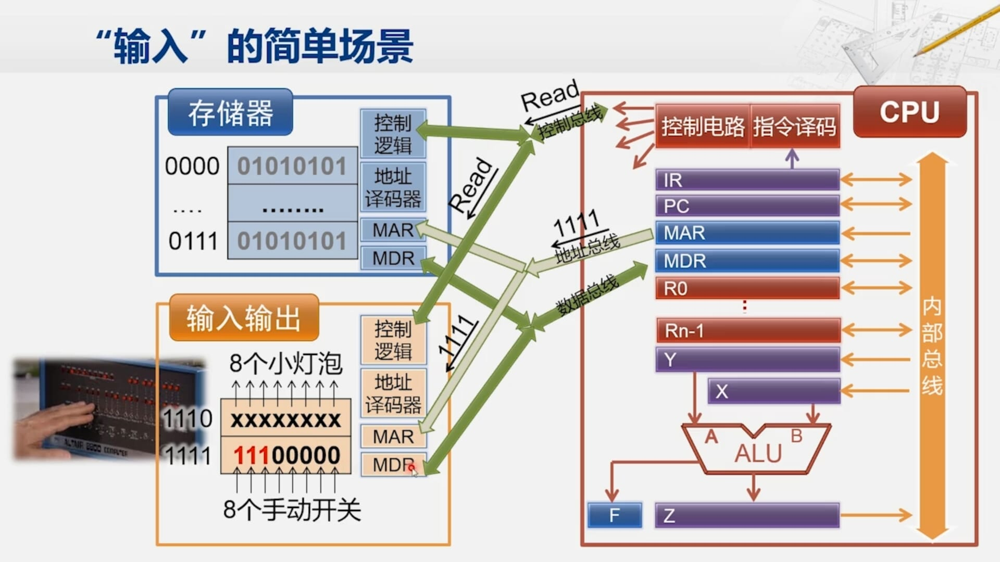

#### 输出过程

1. **输出设备**：8 个小灯泡，连接到一个 8 位寄存器。
2. **执行输出指令**：CPU 执行写入该地址的指令。
    - **地址总线**：发送寄存器的地址。
    - **控制总线**：发送表示写操作的信号。
    - **数据总线**：发送要写入的数据。
3. **写入数据**：输出设备根据控制信号，读取地址总线对应的地址，将数据总线上的数据写入寄存器。
4. **展示输出**：寄存器数据通过物理连线控制灯泡的亮灭，完成输出操作。

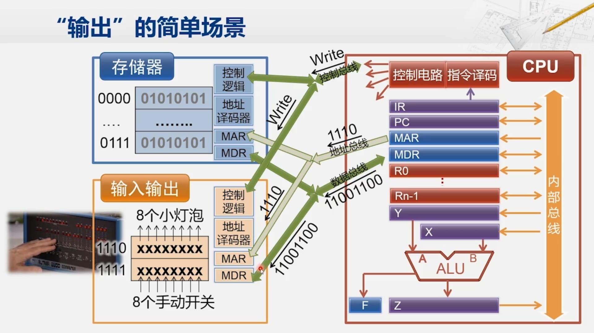

### I/O 接口的基本功能

**I/O 接口**，作为中转站，连接 CPU 和输入输出设备，提供如下功能：

1. 数据缓冲：解决 CPU 和外设之间的速度差距
2. 提供联络信息：协调与同步数据交换过程
3. 信号与信息格式的转换：模 / 数、数 / 模转换，串 / 并、并 / 串转换，电平转换
4. 设备选择
5. 中断管理
6. 可编程功能

### 现代计算机系统中的 I/O 接口和外设

-   **I/O 接口**：表现形式可以是主板上的插卡或芯片，通过系统总线 **与 CPU 通信**，并 **与外部设备相连**。
-   **外设**：如显示器等。

### 并行接口芯片的应用

并行接口电路是 I/O 接口的一种，一般有两种常见的物理实现形式：

1. 独立的芯片，如 Intel 8255A 芯片；
2. 包含在多功能的芯片中，如 SuperIO 芯片提供了并口、串口、键盘鼠标接口、风扇控制接口等

并行接口与外设的连接：

-   连接简单外设：通过 8 根引脚的并行接口芯片，CPU 可以控制数码管的显示和拨码开关的读取。

-   连接复杂外设（打印机）：需要握手（Handshaking）信号。

    握手（Handshaking）信号：总是成对出现，在数据传送中起着定时协调与联络作用。采用 “握手” 方式的数据传送，每一过程必须都有应答，彼此进行确认。

### 并行接口电路在现代计算机中的应用

-   并行接口电路是最简单的 I/O 接口，可以集成在 **南桥芯片** 中。
-   对 **性能要求较高** 的接口可能采用 **独立芯片或板卡** 的形式（如显卡）。
-   在紧凑型设备中（平板电脑和智能手机），I/O 接口甚至可以与 CPU 集成在一个芯片中。

### I/O 接口的功能

无论形式如何，I/O 接口的功能独立存在，需要各自的管脚和连线与外设相连，以实现 CPU 与外部设备的交互。

## 输入输出接口的编址方式

### 位置和访问方式

-   类似访问存储器单元，CPU 访问 I/O 接口寄存器需要编写指令。
-   I/O 接口寄存器的地址即端口地址或端口号。

### 基本概念

系统中有多个 I/O 接口，每个 **I/O 接口** 内部包含多个寄存器，称为 **I/O 端口**。I/O 端口为抽象概念，表示接口芯片内部寄存器。

CPU 访问 I/O 端口需要特定地址，称为端口地址或端口号。

### 常见的 I/O 端口编址方式

-   I/O 端口和存储器 **分开编址**

    -   I/O 映像的 I/O 方式，I/O Mapped I/O
    -   x86 体系结构采用该方式

-   I/O 端口和存储器 **统一编址**
    -   存储器映像的 I/O 方式，Memory Mapped I/O
    -   ARM、MIPS、PowerPC 等体系结构采用该方式

### 分开编址

I/O 端口地址与存储器地址无关，独立编址。

使用特殊指令访问 I/O 端口，如 x86 的 `IN` 和 `OUT` 指令。

#### 指令书写

##### `IN` 指令（输入）

-   格式：`IN AC, PORT`

-   操作：把外设端口的内容输入到 `AL` 或 `AX`

##### `OUT` 指令（输出）

-   格式：`OUT PORT, AC`
-   操作：把 `AL` 或 `AX` 的内容输出到外设端口

##### 直接寻址与间接寻址

-   直接寻址：端口地址 0 到 255 可采用直接寻址，用一个字节立即数指定端口地址。指令长度为 2（1 个操作码 + 1 个立即数）。如 `IN AL, 80H`。
-   间接寻址：端口地址大于 255，需存储到 `DX` 寄存器，再执行 `IN` 和 `OUT` 操作。指令长度为 1（1 个操作码）。如 `IN AL, DX`。

### 统一编址方式

不区分存储器和 I/O 端口地址，统一编址。

任一地址唯一对应一个单元，无需额外信号指定访问类型。

#### 优缺点

-   优点：使用存储器指令访问 I/O 端口，功能丰富；硬件逻辑简单。
-   缺点：I/O 端口占用地址空间，限制存储器空间（现代地址空间变得十分丰富，不再是问题了）；访问指令较长，执行时间可能增加。
-   分开编址的优缺点恰好与之相反。

### 总结

-   分开编址：I/O 端口不占存储器地址空间，指令编码短、执行速度快。
-   统一编址：无需额外信号指定访问类型，便于硬件实现，但地址空间受限。

## 输入输出的程序控制方式

I/O 控制方式：CPU 如何控制外设的数据传送

CPU 控制外设进行输入输出的方式主要有三种：

-   程序控制方式
-   中断控制方式
-   直接存储器访问方式

## 程序控制方式

程序控制方式的数据传送在 **程序控制** 下进行。具体形式有两种：

-   **无条件传送方式**：适用于简单外设操作，如拨码开关、数码管。

    -   假定外设已经准备好
    -   CPU 直接使用输入输出指令与外设传送数据
    -   不查询外设的工作状态
    -   控制程序简单

-   **程序查询传送方式**：适用于复杂外设操作，如打印机、扫描仪。
    -   CPU 通过执行一段程序，不断查询外设的工作状态
    -   在确定外设已经准备就绪时，才进行数据传送

### 无条件传送方式

对于简单外设如拨码开关、数码管等，可以直接通过编写输入输出指令进行数据传送。

-   只要使用一个 `OUT` 指令，把数据放在并行数据输出线上，就完成了输出的数据传送。
-   只要使用一个 `IN` 指令，把数据从并行数据输入线上去除，就完成了输入的数据传送。

### 程序查询传送方式

需要编写程序查询外设的工作状态，确定外设准备就绪后才进行数据传送。通常使用握手信号进行确认，保证数据传输的准确性和可靠性。

#### 数据输出过程（程序查询方式）

1. CPU 执行指令，将 **控制字** 写入接口的 “控制寄存器”，从而设置接口的工作模式

2. CPU 执行 `OUT` 指令，将数据写到接口的 “输出缓冲寄存器”

3. 接口将数据发到 “并行数据输出” 信号线上，并将 “输出准备好” 信号置为有效（亦可由 CPU 写控制字将该信号置为有效）

4. 外设发现 “输出准备好” 信号有效后，从 “并行数据输出” 信号线上 **接收数据**，并将 **“输出回答”** 信号置为 **有效**

5. 接口发现 “输出回答” 信号有效后，将 “状态寄存器” 中的状态位 “输出缓冲空” 置为有效

6. 在这个过程中，CPU 反复执行指令从 “状态寄存器” 中读出状态字，直到发现 “输出缓冲空”，然后开始下一个输出过程，继续输出 **新数据**

    示例代码：

    ```assembly
      MOV DX, 控制寄存器地址  ; 设置控制寄存器地址
      MOV AL, 控制字         ; 设置控制字
      OUT DX, AL             ; 写入控制字
      MOV DX, 输出缓冲寄存器地址  ; 设置输出缓冲寄存器地址
      MOV AL, 数据               ; 设置要输出的数据
      OUT DX, AL                ; 写入数据
    
    CHECK_BUFFER:
      MOV DX, 状态寄存器地址  ; 设置状态寄存器地址
      IN AL, DX                ; 读取状态寄存器
      TEST AL, 输出缓冲空位掩码 ; 检查“输出缓冲空”状态位
      JZ CHECK_BUFFER          ; 如果缓冲区未空，继续检查
    
      ; 输出新数据
      MOV DX, 输出缓冲寄存器地址  ; 设置输出缓冲寄存器地址
      MOV AL, 新数据             ; 设置新数据
      OUT DX, AL                ; 写入新数据
      JMP CHECK_BUFFER          ; 继续检查缓冲区状态
    
      ; ...
    ```

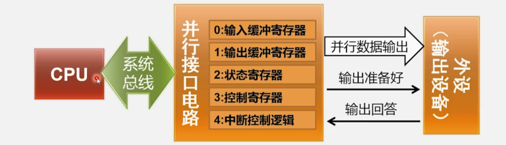

#### 数据输入过程（程序查询方式）

1. 系统初始化时，CPU 执行指令，将控制字写入接口的 “控制寄存器”，设置接口的工作模式
2. 外设将数据发到 “并行数据输入” 信号线上，并将 “输入准备好” 信号置为有效
3. 接口发现 “输入准备好” 信号有效后，从 “并行数据输入” 信号线上 **接收数据**，放入 “输入缓冲寄存器”，并将 **“输入回答”** 信号置为 **有效**，阻止外设输入新数据
4. 接口将 “状态寄存器” 中的状态位 “输入缓冲满” 置为有效
5. 在上述过程中， CPU 反复执行指令从 “状态寄存器” 中读出状态字，直到发现 “输入缓冲满”，然后执行指令从 “输入缓冲寄存器” 中 **读出数据**
6. 一旦 CPU 将这个数据读走了，并行接口将 “输入回答” 信号置为无效，同时也会将状态寄存器当中 “输入缓冲满” 这个状态位 **置为无效**，然后等待外设输入 **新数据**
7. 一旦外设发现 “输入回答” 信号置为无效，外设就将内部缓冲区的新数据放到 “并行数据输入” 信号线上，开启下一次数据输入过程

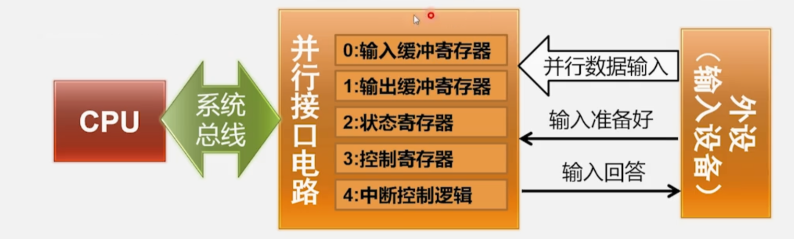

### 程序控制方式的优缺点

-   **优点**：
    -   对外设要求低，不需要复杂功能。
    -   操作流程清晰。
-   **缺点**：
    -   查询外设状态耗时。
    -   占用大量 CPU 运算资源，可能影响系统性能。

程序控制方式适用于简单场景，但对于复杂情况不太实用，需要考虑其他解决方案。

## 中断控制方式

在现代计算机系统中，如果完全依靠 CPU 进行输入输出是不现实的。为了有效处理输入输出，我们需要使用中断控制方式。

不同于程序控制方式的轮询，我们采用中断来减少循环浪费的时间，解放 CPU 以提高并行性。

### 数据输入过程（中断控制方式）

1. 系统初始化时， CPU 执行指令，将控制字写入接口的 “控制寄存器”，设置接口的工作模式，然后就可以去执行其他任务
2. 外设将数据发到 **“并行数据输入”** 信号，并将 **“输入准备好”** 信号置为有效
3. 接口发现 “输入准备好” 信号有效后，从 “并行数据输入” 信号接收数据， 放入 “输入缓冲寄存器”，并将 **“输入回答”** 信号置为 **有效**，阻止外设输入新数据
4. 接口通过 **“中断控制逻辑”** 向 CPU 发出中断请求信号，并将 “状态寄存器” 中的状态位 “输入缓冲满” 置为 **有效**
5. CPU 收到中断请求后，进入中断服务程序，（为了确定是什么导致的中断）执行指令从 “状态寄存器” 中读出状态字，发现 “输入缓冲满”（这意味着是有输入），因此执行指令，从 “输入缓冲寄存器” 中读出数据
6. 接口将 “输入回答” 信号置为无效，等待外设输入新数据

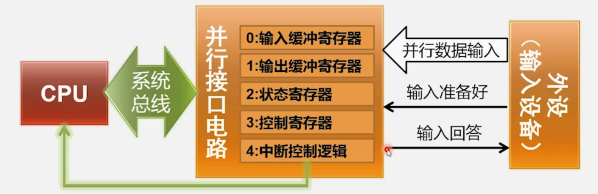

### 数据输出过程（中断控制方式）

1. CPU 执行指令，将控制字写入接口的” 控制寄存器”，从而设置接口的工作模式
2. CPU 执行指令，将 **数据** 写到接口的 **“输出缓冲寄存器”**
3. 接口将数据发到 “并行数据输出” 信号，并将 “输出准备好” 信号置为有效（亦可由 CPU 写控制字将该信号置为有效）
4. 外设发现 “输出准备好” 信号有效后，从 “并行数据输出” 信号接收数据并将 “输出回答” 信号置为 **有效**
5. 接口发现 “输出回答” 信号有效后，通过 “中断控制逻辑” 向 CPU 发出中断请求信号，并将 “状态寄存器” 中的状态位 “输出缓冲空” 置为有效
6. CPU 收到中断请求后，进入中断服务程序，执行指令从 “状态寄存器” 中读出状态字，发现 “输出缓冲空”，因此开始下一个输出过程，继续输出新数据

> 数据输出和数据输入过程发生的中断使用的是 **同一个中断向量**，进入的也是 **同一个中断服务程序**。

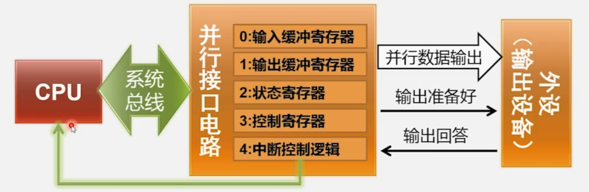

### 中断控制方式的特点

#### 优点

-   **并行工作**：CPU 与外设可以在一定程度上并行工作，提高工作效率。
-   **主动请求**：外设可以主动向 CPU 申请服务，满足输入输出的实时性要求。

#### 缺点

-   **占用 CPU 资源**：输入输出数据传送仍需 CPU 处理，影响 CPU 性能。
    -   使用数据传送指令，占用了宝贵的 CPU 运算资源
    -   数据要经过 CPU 中的通用寄存器中转，过程冗长
    -   注：程序查询方式同样有这些缺点
-   **中断开销**：进入和退出中断服务程序需要执行额外指令，增加了系统开销。

#### 各自适用场景

-   **中断控制方式**：适合提高系统运行效率 / 实时性的场景。
-   **程序查询方式**：适合需要更高响应速度的特别重要的任务。

## 外部中断的处理

### 概述

外部中断（硬件中断）由 CPU 外部的中断请求信号启动。以 x86 CPU 为例，主要有两个信号：

-   **NMI** （非屏蔽中断）
-   **INTR** （可屏蔽中断）

### 中断信号

-   **NMI（非屏蔽中断，Non-Maskable Interrupt）**：

    -   连接 **重要的中断请求信号**，例如电池即将没电。
    -   不受中断允许标志（IF）的影响，CPU 即使关闭外部中断响应（IF=0），仍会响应 NMI 中断请求，调用对应的中断服务程序

-   **INTR（可屏蔽中断，Interruptible）**：
    -   连接 **一般外设** 的中断请求信号。
    -   通过中断控制器（如 PIC 或 APIC）管理多个外设的中断请求。

### 中断控制器

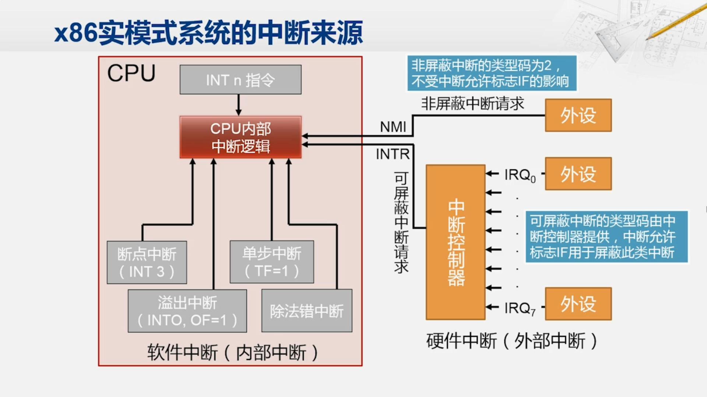

#### 可编程中断控制器 PIC（Programmable Interrupt Controller）

受限于只有一根请求输入的 CPU 的可屏蔽中断信号的，外设们通过一些转换电路连接到中断控制器上处理。

中断控制器会将外设输出的中断请求信号作为它的输入连接进来，然后输出一根信号连接到 CPU 的可屏蔽中断请求信号上。

这个中断控制器可以看作是一个 I/O 接口，它内部也有一些被称为 I/O 端口的寄存器，CPU 可以访问这些端口，对中断控制器进行配置，例如可以配置这些外设的中断请求的优先级、屏蔽项。

#### 8259A

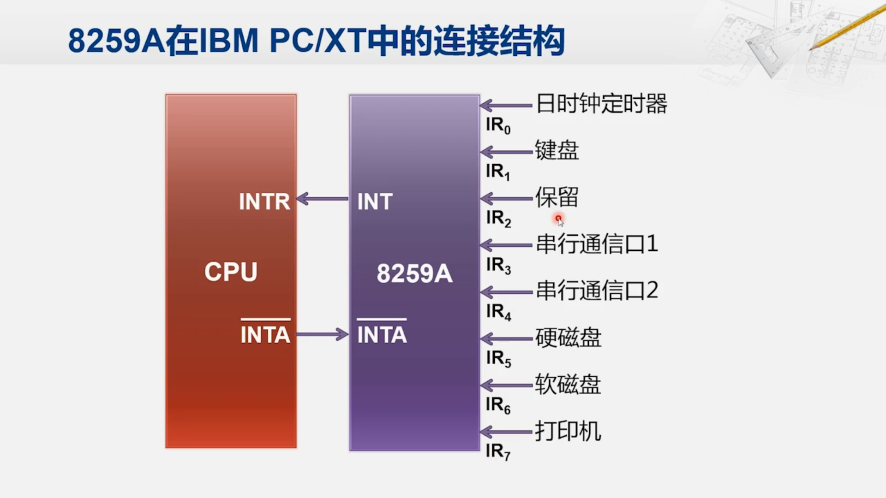

-   提供 8 个中断请求输入（IR0 到 IR7，IR1 是键盘，IR2 保留且可以用于嵌套多个中断控制器以扩展外设连接数）。
-   通过地址和数据信号与系统总线连接，CPU 通过这些信号线访问 I/O 端口。
-   接收到中断请求后，向 CPU 发出中断信号（INT），CPU 响应后发出中断响应信号（INTA）。

8259 的基础上，发展出高级可编程中断控制器（APIC，Advanced Programmable Interrupt Controller）。

### 系统中的连接

-   IBM PC/XT：

    -   使用一片 8259，连接定时器、键盘、串行接口、硬盘、软盘、打印机等外设。
    -   保留 2 号中断请求信号未连接外设，用于其他用途。

-   现代计算机：

    -   键盘中断信号仍连接到中断控制器的 1 号接口。
    -   使用多个中断控制器（如 APIC），连接南桥内部和外部的 I/O 接口。
    -   每个 CPU 当中，也都带一个中断控制器，可以用于发出中断完成 CPU 间的协同工作。

    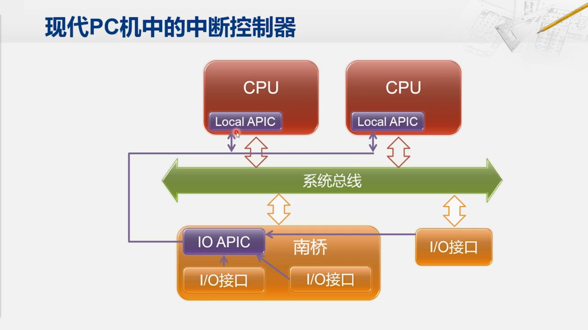

### 可屏蔽中断的处理

1. 外设发出中断请求，中断控制器向 CPU 发出中断信号，CPU 响应并中断当前程序。
2. CPU 完成现行指令发出中断响应信号，向中断控制器发出中断响应信号
3. CPU 读取中断控制器中的中断类型码
4. CPU 压栈相关寄存器，清除 IF 和 TF 标志位，取得中断向量，跳转到中断服务程序。
5. 在中断服务程序中，可在适当时机开放中断（设置 IF 标志位）。
6. 中断服务程序执行完后，执行中断返回指令，恢复寄存器并返回被中断的位置继续执行。

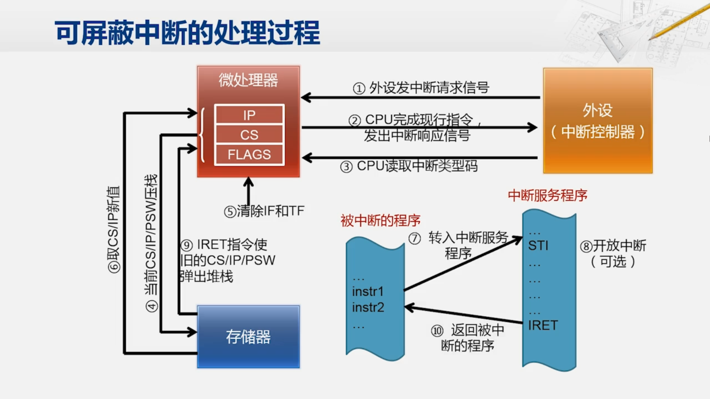

### 中断嵌套

-   **条件**：必须有优先级更高的中断请求。

-   **过程**：
    -   CPU 响应优先级更高的中断请求，而将正在处理的中断暂时挂起
    -   CPU 完成优先级更高的中断服务后，返回此前优先级较低的中断服务程序继续执行

## 直接存储器访问方式 DMA

**DMA** （Direct Memory Access，直接存储器访问）是一种在 I/O 数据传输过程中不需要 CPU 干预的方法。DMA 的工作由一个专门的硬件电路控制，这个电路被称为 **DMA 控制器** （DMAC）。

### DMA 的优点

-   **减少 CPU 负担**：DMA 传输过程中不需要 CPU 干预，CPU 可以执行其他任务，提高系统效率。
-   **高速传输**：适用于数据量大、传输速率要求高的场景。
-   **专用性**：由专门硬件控制电路控制，进行外设与存储器间直接数据传送

### DMA 控制器的工作步骤

一个简化的系统包括 CPU、存储器、I/O 接口和 DMA 控制器，它们通过系统总线连接在一起。

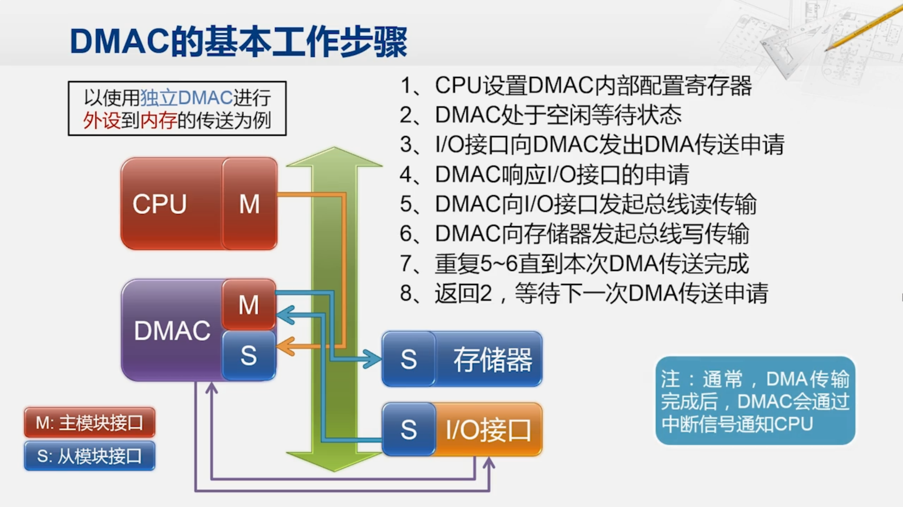

#### 关键部件

-   **Master** （主模块接口）：可以在系统总线上主动发起传输，如 CPU 和 DMA 控制器。
-   **Slave** （从模块接口）：只能被动地接受传输，如存储器和一般的 I/O 接口。

#### 传输过程

1. **CPU 配置 DMA 控制器**：使用 `OUT` 指令配置 DMA 控制器的工作模式，设置源地址、目的地址、数据长度等。

2. **DMAC 处于空闲等待状态**

3. **I/O 接口申请 DMA 传输**：外设送来数据时，I/O 接口通过 **额外的连线** 向 DMA 控制器发出传输申请。

4. **DMAC 响应 I/O 接口的申请**

5. **DMAC 向 I/O 接口发起总线读传输**：DMAC 通过 master 接口发起总线读传输，将数据从 I/O 接口读到 DMA 控制器。

6. **DMAC 向存储器发起总线写传输**：DMAC 将数据写到存储器的指定区域。

7. **重复传输**：DMA 控制器不断从 I/O 接口读数据并写入存储器，直到完成整个传输。

8. **DMA 完成中断通知**：DMA 传输完成后，返回 2，等待 I/O 发起下一次 DMA 传送的申请。

    通常情况下，DMA 传送完成后，DMA 控制器会发出中断请求信号通知 CPU。

### CPU 配置寄存器

源地址的初始值及传送时的地址增减方式目的地址的初始值及传送时的地址增减方式待传送数据的长度

在 DMA 传输开始前，CPU 需要配置 DMA 控制器内部的寄存器：

-   **源地址**：源地址的初始位置（可以是一个 I/O 端口），以及传送时的地址增减方式
-   **目的地址**：目的地址的初始值及传送时的地址增减方式
-   **数据长度**：需要传送的数据长度。根据需要设置，亦可不设置。

### 独立的 DMA 控制器

随着计算机的发展，有些 I/O 接口速率提升了，同时在内部集成了 DMA 控制器，只为该接口提供服务，如显卡、网卡、硬盘控制器。这些 I/O 接口有独立的 master 总线接口，可以根据自身特点进行定制，提高传输效率。

大部分对数据传输率有较高要求的设备都会自带 DMA 控制器，其他设备则共享系统中的独立 DMA 控制器。独立 DMA 控制器还提供内存到内存的传送服务，提高内存操作效率。

### DMA 的局限性

-   **小数据量传输**：对于小数据量的传输，DMA 方式可能不如 CPU 直接传输高效。
-   **成本增加**：增加 DMA 控制器会增加制造成本。

### DMA 最佳使用场景

DMA 方式适用于 **传输大量数据和需要高传输速率** 的场景，不适合小数据量或实时性要求低的场景。

### 总结

DMA 是通过硬件控制数据传输，减轻 CPU 负担，提高系统性能的重要技术。在数据传输量大、传输速率要求高的情况下，DMA 是非常有效的解决方案。
