# 第十一章 - 总线与总线标准

## 总线

### 组成

-   传输信息的电路
-   管理信息传输的协议

### 分类

-   片上总线：内部总线
-   内总线：系统总线
-   外总线：通信总线

### 总线模块

#### 总线主模块 (Bus Master)

-   具有**总线控制**能力，在获得总线控制权之后**能启动总线传输**（读数据或写数据）
-   示例：CPU、DMA 控制器

##### 总线从模块 (Bus Slave)

-   能够对总线传输**作出响应**（接收写数据、返回读数据、返回“错误”响应等），但本身不具备总线控制能力
-   示例：存储器

### 辅助元件

**总线译码器(Bus Decoder)**：功能：根据当前控制总线的主模块提供的地址，选择作为本次总线传输目标的从模块

**总线仲裁器(Bus Arbiter)**

-   功能：在总线上有**多个主模块同时请求**使用总线时，决定由哪个主模块获得总线控制权
-   目的：让总线得到合理、高效地使用

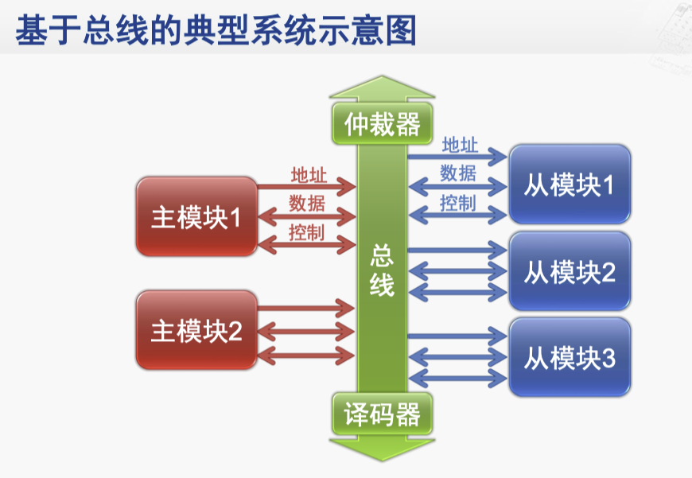

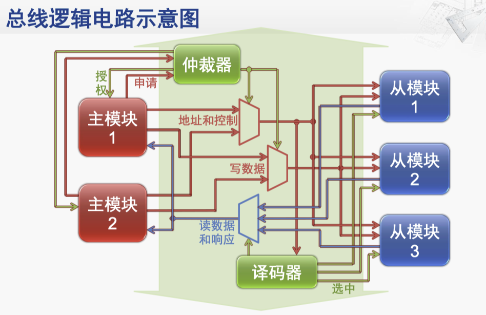

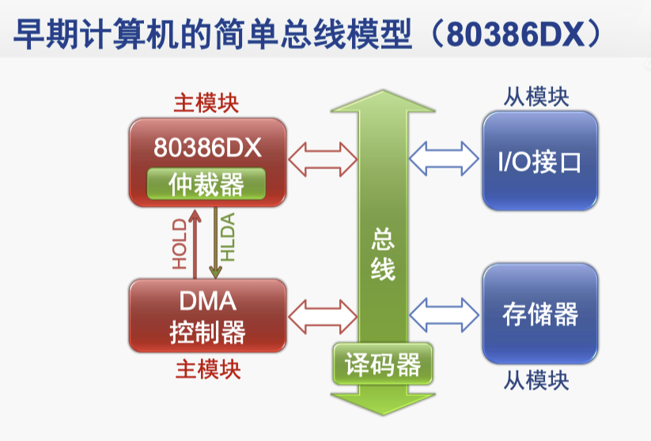

有比较慢的设备，使用总线桥接器来连接。

## 常见总线协议

**事实标准**：计算机系统厂家所采用的一种总线，由于其性能优越，逐渐形成一种被业界广泛支持和承认的事实总线标准

**国际标准**：在国际标准组织或机构主持下开发和制定的总线标准，公布后由厂家和用户使用

### 总线标准的内容

1. 机械特性：规定模块插件的机械尺寸，总线插头、插座的规格及位置等

2. 电气特性：规定总线信号的逻辑电平、噪声容限及负载能力等

3. 功能特性：给出各总线信号的名称及功能定义

4. 规程特性：对各总线信号的动作过程及时序关系进行说明

### 总线标准举例

ISA、PCI、PCI Express、EISA、AGP、USB

现在最常用的是 **PCIe**

#### PCI Express

全新的基础架构

-   **串行方式**传输数据，依靠高频率获得高性能
-   **全双工运作模式**，同时进行数据发送和接收
-   点对点连接结构，而非传统的共享结构

PCIe 总线物理层采用**差分信号**传输

优点

-   抗干扰能力强
-   能有效抑制电磁干扰
-   时序定位准确

缺点：在电路板上，差分信号一定要走两根等长、等宽、紧密靠近且在同一层面的线，布线难度高

## 总线协议实例

### 场景 1

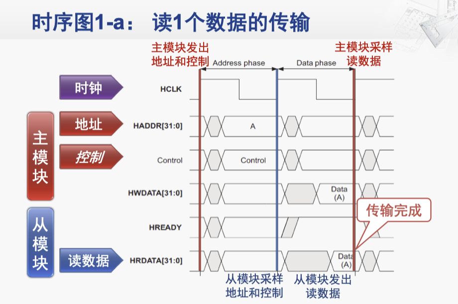

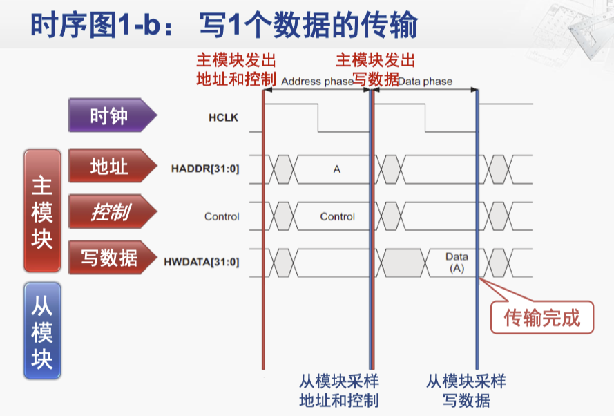  

> 这张图中的灰色六边形代表此时信号不稳定。
>
> A 代表此时信号已经稳定，32bit 组成的信息是 A。
>
> 信号解释如下：
>
> 1. **HCLK（时钟信号）**
>
>     这是整个传输过程的时钟信号，用于同步其他信号的传输。
>
> 2. **HADDR[31:0]（地址信号）**
>
>     这是主模块发送的地址信号，用于指定从模块中的某个地址。
>
> 3. **Control（控制信号）**
>
>     主模块发送的控制信号，用于指示传输操作的类型（如读或写）。
>
> 4. **HWDATA[31:0]（数据信号）**
>
>     主模块发送的数据信号，在读数据操作中，这个信号没有数据，仅在写数据操作中使用。
>
> 5. **HREADY（准备好信号）**
>
>     从模块发送的信号，指示从模块是否已经准备好接收或发送数据。
>
> 6. **HRDATA[31:0]（数据信号）**
>
>     从模块发送的数据信号，在读数据操作中使用。
>
> 读/写的时候分别看 HRDATA / HWDATA
>
> 下面 Data(A) 代表 A 地址处读出的数据。

1. 主模块发出地址和控制：A / Control
2. 从模块采样地址和控制。注意它其实每个周期都在采样，所以主模块发出地址和控制后的下一个时钟上升沿会立刻知道
3. 从模块根据控制信息，获取到数据，然后发出读数据
4. 主模块采样读数据，传输完成。

#### 要点说明

1. **在第一个时钟上升沿之后，主模块驱动 HADDR 和 Control 信号**

2. **在第二个时钟上升沿，从模块采样 HADDR 和 Control 信号**

3. **在第二个时钟上升沿之后**

    - 写传输：主模块驱动 HWDATA 信号
    - 读传输：从模块驱动 HRDATA 信号

4. **在第三个时钟上升沿**
    - 写传输：从模块采样 HWDATA 信号，完成传输
    - 读传输：主模块采样 HRDATA 信号，完成传输

### 场景 2

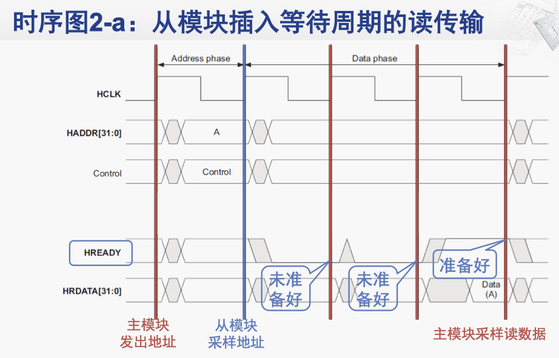

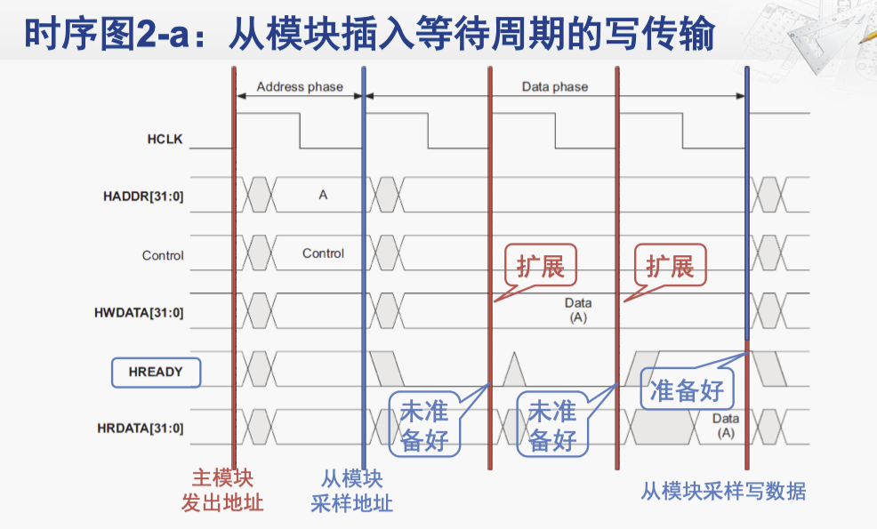

#### 要点说明

-   从模块可以在传输过程中插入等待周期，以便获得额外的时间

    如暂存写数据的缓冲已满、读数据未准备好等

-   在等待周期中，**主模块必须保持地址、控制和写数据等信号的稳定**

### 场景3

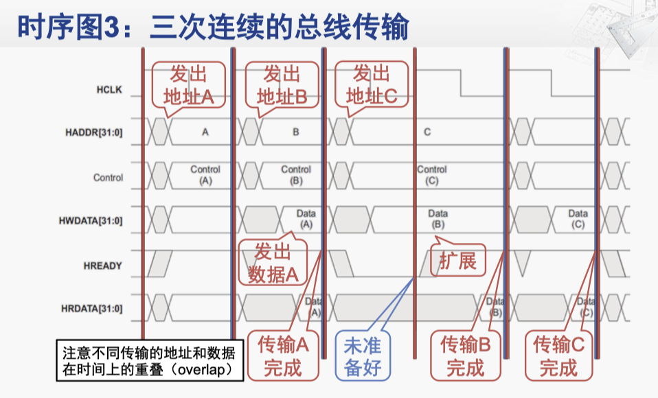  

#### 要点说明

##### 时间重叠（overlap）
- 不同传输的地址和数据在时间上存在重叠

- 充分利用地址总线和数据总线

  就是第二个时钟周期内，其实 HADDR Control 上面的信息没有必要保持为 A 传输的信息，因为从模块已经采样完了，所以直接改为 B 的。

  **重点是要观察 HREADY 是否被拉高了，如果拉高了那就可以传新的，否则就得保持。**

##### 等待周期
- 地址A和C的传输中没有等待周期
- 地址B的传输中有一个等待周期，该传输的数据阶段扩展了一个周期

##### 等待周期的副作用
- 因为地址B的传输中的等待周期，所以地址C的传输的地址阶段受其影响而扩展了一个周期

### 场景 4

**大量连续数据的传输**：一次传输的数据量超过了数据总线的宽度

例如，CPU需要从内存中读出连续的16字节 (128位)的数据，但数据总线宽度为32位

#### 新的信号

`HTRANS[1:0]`：定义传输中各周期的类型

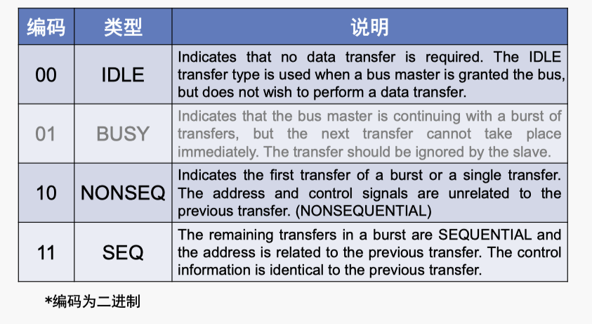  

`HBURST[2:0]`：定义了传输长度和地址变化方式

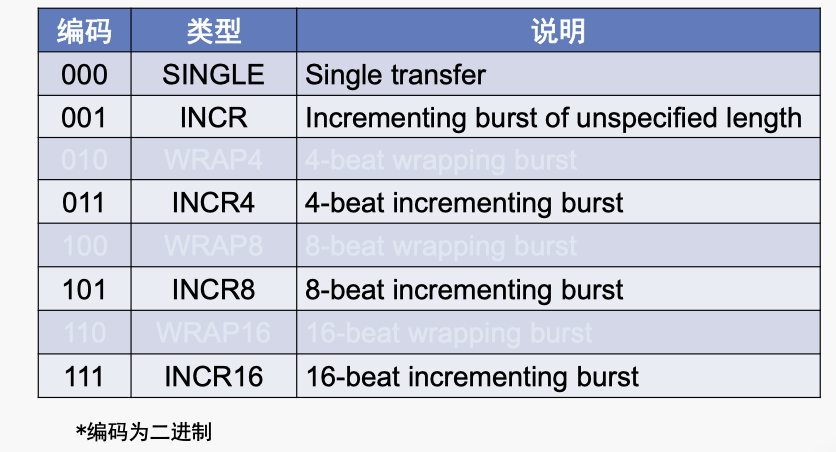  

不推荐使用 INCR，因为阻塞太久了，一般发固定长度的传输。

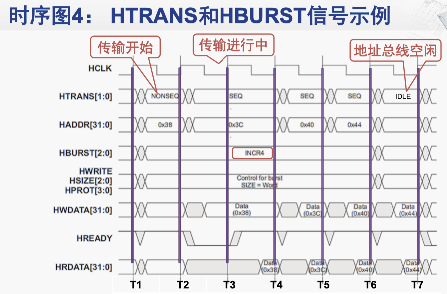  

#### T1-T7 时序说明

- **T1**: 传输开始，主模块发出第一个地址，驱动 HTRANS=NONSEQ，HBURST=INCR4

  - 驱动信号 HTRANS 设置为 NONSEQ，**表示这是一个新的传输序列的开始**。
  - HBURST 设置为 INCR4，表示这是一个包含 4 个数据传输的连续突发传输
  - 地址增加的步长在 HSIZE 处看，这里没有指明，但是是 4

- **T2**: 传输继续，主模块发出第二个地址，驱动 HTRANS=SEQ，保持 HBURST=INCR4

  - 驱动信号 HTRANS 设置为 SEQ，表示这是一个连续的传输序列。
  - HBURST 继续保持为 INCR4，表示仍在进行 4 个数据传输的连续突发传输。

- ...

- **T6**: 主模块发出的第四个地址已被从模块采样，无需再发出新的地址和控制信号，因此驱动 HTRANS=IDLE

  - 驱动信号 HTRANS 设置为 IDLE，表示传输进入空闲状态。

- **T7**: 传输完成

  - 驱动信号 HTRANS 设置为 IDLE，表明地址总线空闲

  - 所有信号恢复到初始状态，等待下一次传输的开始。

注意这张图中同时标明了写和读的情况。

注意 T3 时刻，HRDATA 和 HWDATA 的不同表现。

### 场景 5

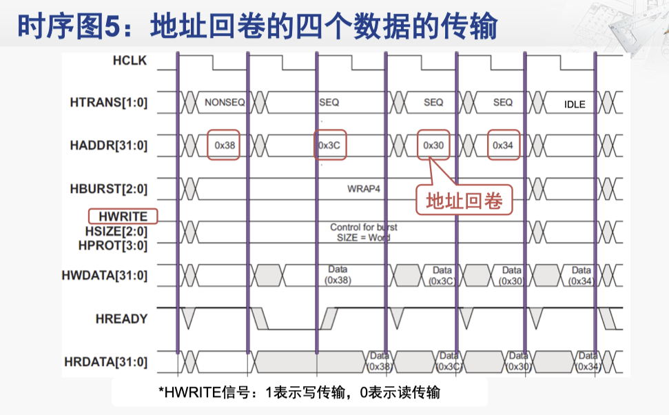  

注意，这里的回卷传输会把地址转回来。

想想 ics，就是先发关键字，然后把缓存块搞出来

#### 要点说明

##### 地址回卷的边界（假设数据宽度为4字节）
- **WRAP4**: 在16的整数倍的地址处回卷（4个数据宽度）
- **WRAP8**: 在32的整数倍的地址处回卷（8个数据宽度）
- **WRAP16**: 在64的整数倍的地址处回卷（16个数据宽度）

##### 传输地址变化示例
- **INCR4**: 0x38  0x3C  0x40  0x44
- **WRAP4**: 0x38  0x3C  0x30  0x34
- **INCR4**: 0x30  0x34  0x38  0x3C

### 场景 6

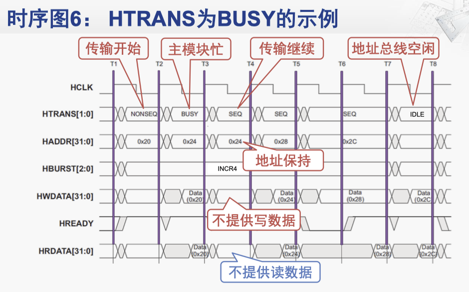  

### 场景 7

`HSIZE[2:0]`：定义了传输数据的宽度

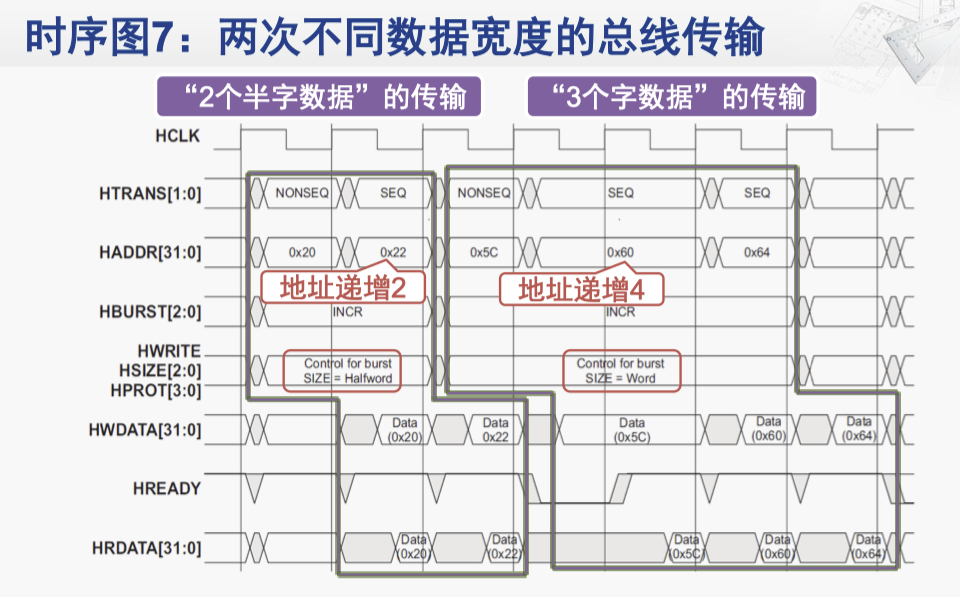  

