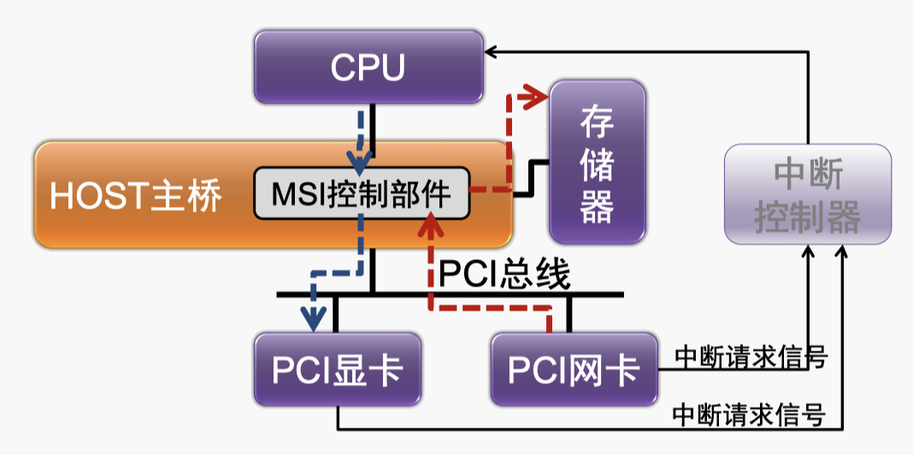

# 第十二章 - 计算机系统先进技术

## 片上互连结构的发展

系统芯片(Sytem-on-a-Chip， SoC) 将计算机或其他电子系统集成单一芯片的集成电路

## 新的中断机制

### MSI 中断机制

Message Signaled Interrupt (消息信号中断)

当设备向一个特殊地址写入**数据**时，这个操作会触发一个中断，称为 MSI 中断。

**MSI**和**MSI-X**都是通过写特殊地址触发中断，而不是通过物理引脚。

#### 支持情况

**PCI 总线**：

-   必须支持传统的 INTx 引脚中断。
-   MSI 机制是可选的。

**PCIe 总线**：

-   必须支持 MSI/MSI-X 机制。
-   可以不支持传统的 INTx 引脚中断。

#### MSI 机制的特点

##### 优点

1. **解决多个设备共享中断信号的问题**

    - **传统 INTx 引脚**：多个设备共享同一个中断信号，操作系统需要调用多个中断处理函数，效率低。
    - **MSI 机制**：每个设备都有独立的中断信号，减少了中断处理的复杂性，提高了效率。

2. **解决每个功能设备只支持一个中断的问题**

    - **传统方法**：中断服务程序需要查询设备来确定发生的事件，效率低。
    - **MSI 机制**：一个设备可以支持多个中断，为不同的用途分配不同的中断，提高了处理效率。

3. **数据完整性**
    - **传统中断**：可能存在数据写入未完成就触发中断的情况，导致数据不一致。
    - **MSI 机制**：保证中断信号的写操作不会越过数据写操作，中断服务程序可以确信所有数据已经到达内存，确保数据完整性。

##### 缺点

-   **占用总线带宽**：
    -   使用 MSI 时，产生中断的写操作会占用总线带宽，可能影响总线的性能。

### 总结

MSI 机制通过独立的中断信号和多中断支持，提高了中断处理的效率和数据完整性，但也存在占用总线带宽的问题。

希望这些解释对你理解 MSI 机制的特点有所帮助。如果有进一步的问题，请随时提问！
