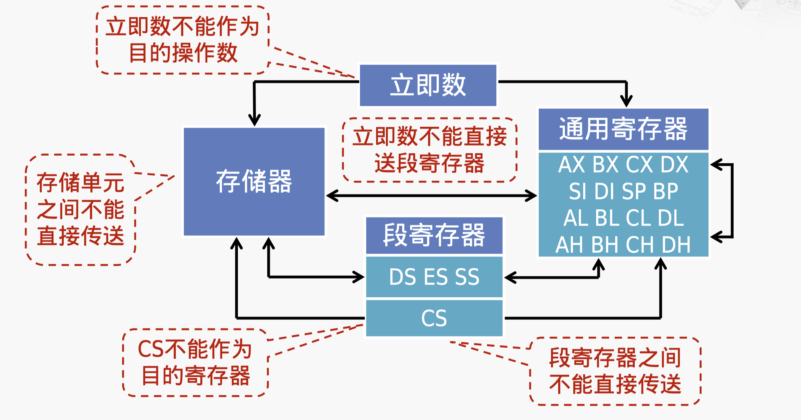
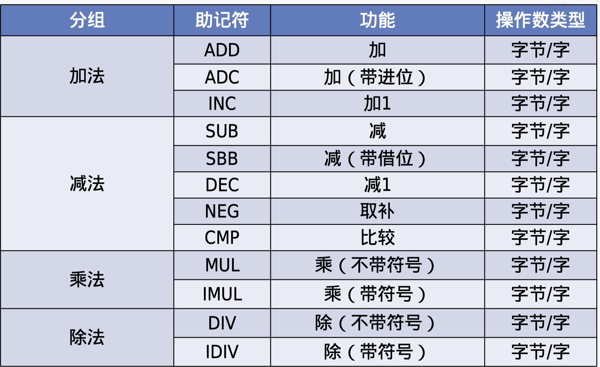
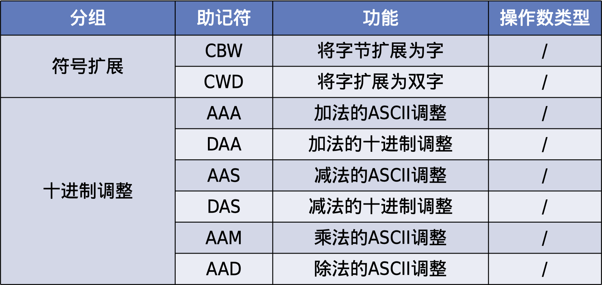
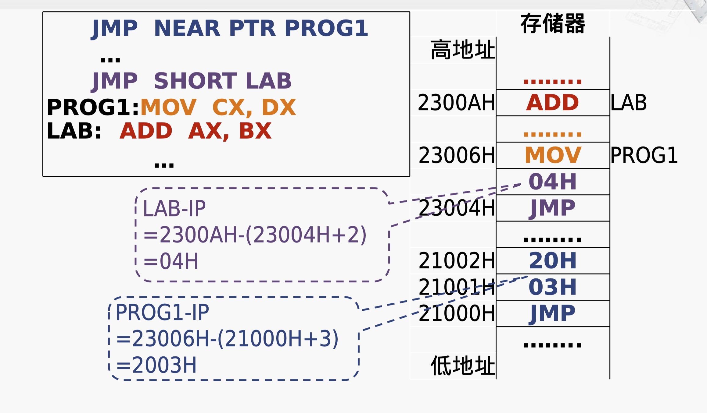
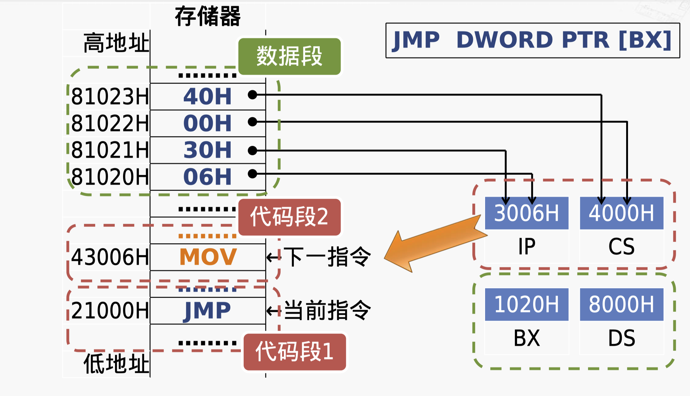

# 第三章 - 指令系统体系结构

## 3.1 设计自己的计算机

### 一个简单的计算机指令系统

> 指令系统体系结构（Instruction Set Architecture, ISA）是计算机硬件（CPU）和软件（程序）之间的接口。它定义了 CPU 可以理解和执行的指令集，包括指令的种类、指令的格式、寄存器的使用、内存管理方式等。简单来说，它就像是人与计算机之间的共同语言，程序员通过这种语言写出的程序能被计算机硬件所理解和执行。

运算类指令

`ADD R, M`：将 R 的内容与 M 中的内容相加后存入 R

传送类指令

`LOAD R, M`：将 M 中的内容装入 R
`STORE M, R`：将 R 的内容存入 M 中

转移类指令

`JMP L`：无条件转向 L 处

但是依然是汇编语句，不是二进制代码，此时需要规定指令的格式

### 指令的格式


每条指令等长，均为 2 个字节

第一个字节的高 4 位是操作码，目前只提供 4 条指令，最多可扩展到 16 条

-   LOAD : 0000
-   ADD : 0001
-   STORE : 0010
-   JMP : 0011

第一个字节的低 4 位是寄存器号，目前只提供 4 个寄存器，最多可扩展到 16 个

第二个字节是存储单元地址，最大可以使用 256 个字节的存储器

-   R0~R3 : 0000~0011

### 运算任务示例

1. 将 M1 的内容与 M2 的内容相加后存入 M3
2. 完成运算后，程序转向 L 处的指令继续执行

M1、M2、M3 和 L 均为存储单元的地址

拆解为程序描述：

1. 将 M1 的内容送入某个寄存器，记为 Rx
2. 将 Rx 的内容与 M2 的内容相加，运算结果存入 Rx
3. 将 Rx 的内容送入 M3 中

### 运算任务对应的程序

转化为机器代码：

> 设 : M1=5 , M2=6 , M3=7 , L=18


### 在存储器中的机器语言程序


### 模型机准备开始运行


关于 PC 寄存器初始化：

-   PC 寄存器中的地址是指令系统体系结构设计时必须约定的内容。
-   CPU 启动或复位后，第一条指令的起始取址需软硬件预先约定。
-   此地址没有固定规则，但常设为存储单元的最小地址 0，或接近最高地址处。

## 3.2 x86 体系结构

### x86 体系结构


这张表列出来 X86 体系结构当中，具有代表性的一些微处理器的型号。先来看最早推出来的 8086。

### Intel 8086（1978 年）


8086 的主要特点：

-   内部的通用寄存器为 16 位，既能处理 16 位数据，也能处理 8 位数据
-   对外有 16 根数据线和 20 根地址线，可寻址的内存空间为 1MB（$2^{20}$）
-   物理地址的形成采用 “段加偏移” 的方式

### 微型计算机的早期代表：IBM PC

Intel 8088 CPU， 1979 年推出。8088 是 8086 的简化版本，主要区别是数据总线只有 8 位宽。

1981 年，IBM PC 5150 诞生

-   售价约 1600 美元
-   Intel 8088 CPU，主频 4.77 MHz，内存 16KB
-   因开放性架构逐渐成为个人计算机的制造标准

### Intel 80286（1982 年）


80286 的主要特点：

-   地址总线扩展到 24 位，可寻址 16 MB 的内存空间
-   引入了 “保护模式”，但是机制有缺陷
    -   保护模式：更好地控制程序如何访问内存，提高了系统的稳定性和安全性。
    -   例如，每个内存段（Segment）仍为 64KB，严重限制软件规模
-   为保持兼容，保留了 8086 的工作模式，被称为 “实模式”

### 实模式（Real Mode）

实模式，又称 “实地址模式”

-   80286 及以上的微处理器采用 8086 的工作模式，即为 **实模式**
-   运行在实模式下的 80x86 微处理器像是一个更快的 8086
-   为兼容 8086，所有 x86 处理器在加电或复位后首先进入实模式
-   系统初始化程序在实模式下运行，为进入保护模式做好准备
-   **内存寻址限制**：在实模式下，处理器只能访问 1MB 的内存空间。这是因为在实模式下，**地址线是 20 位的**，能表示的最大地址空间为 $2^{20}$ = 1MB
-   **没有内存保护**：实模式不提供任何形式的内存保护机制，任何程序都可以访问任意的内存地址，这使得系统非常容易受到恶意软件的影响。

### Intel 80386（1985 年）

80386 的主要特点

-   80x86 系列中的 **第一款 32 位微处理器**
-   支持 32 位的算术和逻辑运算，提供 32 位的通用寄存器
-   **地址总线扩展到 32 位**，可寻址 4GB 的内存空间
-   改进了 “保护模式”（例如，段范围可达 4GB）
-   增加了 “虚拟 8086 模式 "，可以同时模拟多个 8086 微处理器

### 保护模式（Protected Mode）

保护模式，可简写为 “pmode”

-   80386 及以上的微处理器的主要工作模式
-   支持多任务
-   支持设置特权级
-   支持特权指令的执行
-   支持访问权限检查
-   **可以访问 4GB 的物理存储空间**
-   引入了虛拟存储器的概念

保护模式让 **操作系统加强了对应用软件的控制**，使得系统运行更安全高效

### 虚拟 8086 模式（Virtual 8086 Mode，V86）

-   V86 模式是 **保护模式** 下的一种特殊工作状态
-   微处理器在 V86 模式下工作类似于 **8086 处理器**，但并不完全相同
-   V86 模式与实模式的比较

    相同点：

    -   可寻址的内存空间为 **1MB**
    -   使用 “段加偏移” 的 **寻址方式**

    不同点：

    -   对 **中断 / 异常** 的响应处理方式不同

### 三种工作模式之间的转换


-   实模式：从加电启动或复位到操作系统运行之前
-   保护模式：操作系统和应用程序的运行
-   虚拟 8086 模式：运行兼容 8086 程序

PE（Protection Enable） 即 “保护模式允许”，是 80x86 控制寄存器 CR0 中的控制位，当这个位被设置为 1 时，CPU 就会进入保护模式工作；当这个位为 0 时，CPU 则工作在实模式下。

> 听上去类似于后来的内核态、用户态的概念

Intel 提出的 IA-64 是独立于 x86 的一种新的体系结构，不兼容 IA-32（这也是被放弃的原因）

> IA：Intel Architecture

不管那种模式，经过复位后，都会进入 **实模式**

### AMD Opteron（2003 年）

Opteron 规格

-   主频 1.4~3.5GHz
-   工艺 130~32nm

Opteron 的主要特点

-   **×86 扩展到 64 位的第一款微处理器**
-   可以访问高于 4GB 的存储器
-   兼容 32 位 x86 程序， **且不降低性能**

### Intel Italium

不是 x86-64，是 IA-64 体系结构

是 64 位，不兼容 32 位程序，使用可以运行 32 位程序的模式会导致 32 位程序性能大大下降

### x86-64 的运行模式


### 从 16 位到 64 位：x86 体系结构的演变

#### 寄存器模型

##### IA16，x86-16，8086


**通用寄存器（多功能寄存器）**

1. 数据寄存器，共有 4 个

    - 均为 16 位寄存器
    - 每个 16 位寄存器都可分为两个 8 位寄存器使用
      如 AX → AH 和 AL，即 High 和 Low
    - 适用大多数算术运算和逻辑运算指令

    除存放通用数据外，各有一些专门的用途：

    - AX Accumulator 存放乘除等指令的操作数
    - BX Base 存放存储单元的偏移地址
    - CX Count 存放计数值
    - DX Data 除法运算的部分被除数，乘法运算产生的部分积

2. 指针和变址寄存器，共有 4 个，分为两组

    - 均为 16 位寄存器
    - SP 和 BP 用于堆栈操作
    - SI 和 DI 用于 **串操作**
    - 都可以作为数据寄存器使用

    SP stack pointer 堆栈指针寄存器

    BP (stack) base pointer（堆栈）基址指针寄存器

    SI source index 源变址寄存器

    DI destination index 目的变址寄存器

3. 标志寄存器

    标志位

    - FLAGS 寄存器中包含若干标志位
    - 标志位分为两大类：**状态标志和控制标志**

    状态标志：反映 CPU 的工作状态

    - 执行加法运算时是否产生进位
    - 运算结果是否为零

    控制标志：对 CPU 的运行起特定控制作用

    - 以单步方式还是连续方式运行
    - 是否允许响应外部中断请求

    

4. 段寄存器

    - CS 代码段寄存器（Code Segment）
    - DS 数据段寄存器（Data Segment）
    - ES 附加段寄存器（Extra Segment）
    - SS 堆栈段寄存器（Stack Segment）

##### IA-32 / 8086 的寄存器模型


-   通用寄存器、指令指针寄存器、 **标志寄存器** 位数都扩展到 32 位，前加 `E`，表示 extended
-   段寄存器位数仍为 16 位，但是多加了两个新的段寄存器 FS 和 GS

##### x86-64


-   通用寄存器、指令指针寄存器、标志寄存器位数都扩展到 64 位，前加 `R`，表示 register
-   段寄存器依然是 16 位，没有扩展
-   新增了 8 个 64 位的通用寄存器 R8~R15

#### 存储器寻址

##### IA16，x86-16

指令指针寄存器 IP（Instruction Pointer）

-   保存一个内存地址，指向当前需要取出的指令
-   当 CPU 从内存中取出一个指令后，IP 会自动增加，指向下一指令的地址（注：实际情况会复杂的多）
-   程序员不能直接对 IP 进行存取操作
-   转移指令、过程调用 / 返回指令等会改变 IP 的内容

冲突：

-   IP 寄存器的寻址能力：$2^{16}$=65536（64K）字节单元
-   8086 对外有 20 位地址线，寻址范围：$2^{20}$​=1MB 字节单元

8086 使用段寄存器解决 IP 寄存器寻址能力不足的问题

> 回顾：段寄存器
>
> -   CS 代码段寄存器（Code Segment）
> -   DS 数据段寄存器（Data Segment）
> -   ES 附加段寄存器（Extra Segment）
> -   SS 堆栈段寄存器（Stack Segment）

**段寄存器与其它寄存器联合生成存储器地址**

##### 8086 的物理地址生成


物理地址 = 段基址 × 16 + 偏移地址

> 等价于段基址后面补了 4 个 0，从而将 16 位的 IP 寄存器对齐到了 20 位的地址总线

##### 逻辑段在物理存储器中的位置


1M 字节的存储空间分成许多逻辑段，每段最长 64K（$2^{16}$） 字节，可以用 16 位地址进行寻址

将物理地址看作逻辑地址，分成两个部分，好处是：不需要知道代码或数据在存储器中的具体物理位置，从而简化存储资源的管理， **比如将代码所需的数据在内存中存储的位置改变，只需要改变段寄存器即可**

各个逻辑段在实际存储空间中可以完全分开，也可以部分重叠（因为计算是加 4 个 0，而不是 16 个 0），甚至完全重叠

##### “段加偏移” 的编程实例

汇编指令 `MOV AX，[3000H]`

操作数默认存放在 DS 指向的数据段中，即 `[3000H]=DS:[3000H]`

设：`DS=2000H`，则：物理地址 = `2000H` × 16 + `3000H` = `23000H`


##### 具体到各个寄存器的实例

1. 代码段：一个存储区域，用以保存微处理器使用的代码

    使用 CS 寄存器指向代码段的起始地址，即 `CS:IP` 指向当前指令，注意，**这种表示代表组合寻址，而不是代表拼接**

2. 数据段：一个存储区域，用以保存程序使用的数据

    使用 DS 指向数据段的起始地址，实模式（16 位）下数据段的长度限制为 64KB，保护模式（32 位）下数据段长度限制为 4GB

3. 附加段：一个存储区域，用以保存程序使用的数据 / 某些串指令

    使用 ES 指向附加段的起始地址，用 `ES:DI` 指示串操作的目的操作数的地址

4. 堆栈段：一个存储区域，用以保存程序执行过程中的数据

    使用 SS 指向堆栈段的起始地址，用 SP 指示堆栈的栈顶，用 BP 指示堆栈的基址，也即 `SS:SP` / `SS:BP` 组合

5. 其他附加段

    使用 FS 和 GS 存储其他数据段的起始地址，减轻 ES 寄存器的负担

##### 1964 年，大型计算机的经典：IBM S/360

IBM S/360

-   IBM 公司 1964 年研制。每秒执行 34000 条指令，注重通用性和兼容性
-   第一代大型机中最成功的产品。1966 年售出超过八干台。

在其中已经开始使用了 32 位通用寄存器，CPU 也开始使用了 32 位的地址线（对外发出 32 位地址）

##### IA-32 的存储器寻址


以指令（这代表 CS 段）的寻址为例

-   实模式 CS:IP
-   保护模式 CS:EIP
-   冒号代表组合，不代表移位什么的（虽然实模式下确实是 IP=CS<<4+IP）

EIP 寄存器的寻址能力：$2^{32}$=4G 字节单元

80386 对外有 32 位地址线，寻址范围：$2^{32}$=4G 字节单元

但是其实保护模式下，段基址不在 CS 中（在实模式下，是这样的），而是在内存中，这个段基址被称作 **描述符**

> 描述符是内存中的一种数据结构，它包含了段的基址、限长、访问权限等信息。在保护模式下，段寄存器（如 CS）中不再直接存储段基址，而是存储一个指向段描述符的索引（称为选择子或段选择子）。CPU 通过这个索引在全局描述符表（GDT）中找到相应的段描述符，从而获取到真正的段基址，再与偏移量相加得到最终的物理地址。


-   GDT：全局描述符表（Global Descriptor Table），理解为对于可用空间的一个索引，类似一个数组，每个元素是一个描述符，且每个描述符都是 8 字节，对应一个段
-   GDTR：全局描述符表的地址寄存器（Global Descriptor Table Register），理解为在内存中偏移到 GDT 的地址
-   GDT 可在系统中的任何存储单元，通过 GDTR 定位

GDTR + CS \* 8 即可获得实际的描述符 GDT，然后再从 GDT 中找到真正的基地址

##### x86-64 的描述符


注：**描述符中没有了段基址和段界限**，只有访问权限字节和若干控制位。所有的代码段都从地址 0 开始。

## 3.3 x86 指令简介

### 指令的格式

#### Intel 语法

-   第一个操作数是目的操作数（destination operand）
-   第二个操作数是源操作数（source operand）
-   寄存器和和立即数都没有前缀
-   十六进制、八进制和二进制立即数后缀分别为 h (hex) 、O/Q (Octal) 和 b (binary)
-   以字母开头的十六进制数必须加 0
-   字符串常数用单引号括起
-   基寄存器用 “[]” 标明
-   内存单元操作数带 **前缀**，以指出操作数的大小

#### AT&T 语法

-   第一个操作数是源操作数（source operand）
-   第二个操作数是目的操作数（destination operand）
-   寄存器使用前缀 “%”，立即数使用前缀 “$”
-   十六进制立即数使用前缀 “0x”
-   基寄存器用 “()” 标明

### 汇编语言程序的组成

#### 分段结构

-   按段进行组织，最多由 4 个段组成（代码、数据、附加、堆栈）。
-   每个段以 `段名 SEGMENT` 开始，以 `段名 ENDS` 结束。

##### 语句行

-   段由若干语句行组成。
-   语句行的三种类型：指令、伪指令、宏指令。

### 语句的执行

伪指令语句的执行

-   **汇编器计算伪指令** 语句中 **表达式** 的值。
-   伪指令不产生机器代码。
-   汇编器解释并 “执行” 伪指令语句的含义。

指令语句的执行

-   汇编器计算指令语句中表达式的值。
-   汇编器将指令语句翻译成机器指令代码。
-   程序运行时，CPU 根据机器指令代码完成运算与操作。

### 伪指令语句

伪指令语句是汇编语言中用来告诉编译器执行一些非执行指令的操作，如定义数据、组织代码等。

#### 1. 数据定义：变量

变量是可以在程序运行期间修改值的数据对象。

-   定义变量时，可使用伪指令 `DB`（定义字节）、`DW`（定义字）、`DD`（定义双字）。
-   变量一般定义在数据段 `DS` 或附加段 `ES`。

```assembly
A DB 50,60,70,80      ; 定定义了一个字节数组，包含了四个元素，它们的值分别是 50, 60, 70 和 80（十进制数），每个元素占用 1 个字节的空间
A DW 50,60,70,80
A DD 50,60,70,80
```

> 在 x86 汇编语言中，DB，DW 和 DD 是定义数据的伪指令，分别代表 Define Byte，Define Word 和 Define Doubleword。

#### 2. 符号定义：常数和常量

常数和常量的值在编程时确定，并在程序运行期间不改变。

-   常量使用伪指令 `EQU` 或 `=` 来定义。
-   常量不会生成目标代码，也不会占用存储单元。

```assembly
A EQU 7            ; 定义常量A，值为7
A EQU 8            ; 错误，“EQU”左边的符号名不可重复定义
B = 7              ; 同样定义常量B，值为7
B = 8              ; 更新B的值为8，因为使用了`=`，所以可以重新定义
```

#### 3. 段定义

段是程序中的一部分，可以包含代码、数据或堆栈信息。

-   使用 `SEGMENT` 和 `ENDS` 伪指令定义段的开始和结束。
-   `ASSUME` 伪指令用于指定段寄存器。

```assembly
CODE SEGMENT       ; 开始定义一个名为CODE的段
; ...代码...
CODE ENDS          ; 结束CODE段的定义

ASSUME CS:CODE, DS:DATA, SS:STACK  ; 假设代码段寄存器CS指向CODE段，数据段寄存器DS指向DATA段，堆栈段寄存器SS指向STACK段
```

#### 4. 指定段内的偏移地址

-   `ORG` 伪指令用于设定当前段的起始偏移地址。
-   `EVEN` 伪指令将当前偏移地址调整为最近的偶数值。

```assembly
DATA SEGMENT
ORG 1000H          ; 将DATA段的起始偏移地址设置为1000H
A DB 47H, 12H, 45H ; 定义字节变量A
EVEN               ; 调整当前偏移地址为偶数
B DB 47H           ; 定义字节变量B
DATA ENDS
```

说明：

1. ORG 指令将 A 的偏移地址部分指定为 1000H
2. 从 A 开始存放 3 个字节变量，占用地址 1000H、1001H 和 1002H
3. EVEN 指令会将 B 的偏移地址部分从 1003H 调整为偶数地址 1004H

#### 5. 过程定义

过程是一段可以被程序多次调用的代码块。

-   使用 `PROC` 和 `ENDP` 伪指令定义过程的开始和结束。
-   过程可以是 `NEAR`（近过程）或 `FAR`（远过程），默认为 `NEAR`。

```assembly
过程名 PROC 过程类型
; ...过程代码...
过程名 ENDP
```

### 指令的主要类别

1. 运算类指令，例如：加、減、乘、除，与、或、非等
2. 传送类指令，例如：从存储器到通用寄存器，从通用寄存器到 I/O 接口等
3. 转移类指令，例如：无条件转移、条件转移、过程调用等
4. 控制类指令，例如：暂停处理器、清除标志位等

### 指令的运行结果

1. 改变通用寄存器的内容，如 `ADD AX, DX`
2. 改变存储器单元的内容，如 `MOV [10H], CX`
3. 改变标志位，如产生进位
4. 改变指令指针，如 `JMP [BX]`
5. 改变外设端口的内容，如访问显示端口

### 指令分类举例

#### 传送指令

作用：把数据或地址传送到寄存器或存储器单元中


##### MOV 指令（传送）

格式：`MOV DST, SRC`

操作：`DST <- SRC`

说明：

-   `DST` 表示目的操作数，`SRC` 表示源操作数
-   `MOV` 指令把一个操作数从源传送至目的，源操作数保持不变

###### MOV 指令和寻址方式的示例

```assembly
MOV EBX, 40           ; 将数值40传送到寄存器EBX中
MOV AL, BL            ; 将寄存器BL的内容传送到AL中
MOV ECX, [1000H]      ; 将地址1000H处的内容传送到寄存器ECX中
MOV [DI], AX          ; 将寄存器AX的内容传送到由DI指定的内存地址中
MOV WORD PTR [BX+SI*2+200H], 01H  ; 将数值01H传送到由BX+SI*2+200H计算得出的内存地址中
```

注：

-   BYTE PTR：字节长度标记
-   WORD PTR：字长度标记
-   DWORD PTR：双字长度标记

###### 不同类型的 MOV 指令编码


##### MOV 指令的限制



指令长度不同，是 x86 指令系统的特点之一

> 这张表中的，w/r/reg 是指令的长度，w 表示 16 位，r 表示 32 位，reg 表示寄存器，前面的数字组成了指令的编码

CPU 怎么知道变长指令集每个指令多长？

根据第一个字节判断即可

###### MOV 指令编码示例


-   `mod`：这是一个 2 位的字段，用于指定寻址模式。它决定了指令是直接寻址、寄存器寻址还是基于寄存器的间接寻址。
-   `reg`：这部分指定了目标寄存器或源寄存器，具体取决于指令的具体语义。CX = 1，BX = 3
-   `r/m`：这是一个 3 位的字段，它可以指定一个寄存器或内存地址。
-   `DISP-LO` 和 `DISP-HI`：这些是位移量的低位和高位，用于指定内存地址的偏移量。在 16 位或 32 位的指令中，它们组合起来表示一个更大的位移量。

##### XCHG 指令（交换）

格式：`XCHG DST, SRC`

操作：`DST <-> SRC`

说明：

-   两个操作数的位宽要相同
-   两个操作数的类型包括

    -   寄存器 / 存储器
    -   存储器 / 寄存器
    -   寄存器 / 寄存器

-   不允许使用段寄存器

记忆：XCHG → Change

##### XLAT 指令（查表）

格式：`XLAT`

操作：`AL <- [BX+AL]` 或 `AL <- [BX+AX]`

说明：

-   首先，在数据段中定义了一个字节型数据表。
-   使用 `BX` 寄存器获取数据表起始地址的偏移量。
-   通过 `AL` 寄存器获取数据表项的索引值。
-   在数据表中查找对应的表项内容。
-   将查找到的表项内容存储回 `AL` 寄存器。

##### PUSH 指令（压栈）

格式：`PUSH SRC`

说明：

-   `SRC` 表示寄存器操作数或存储器操作数
-   `PUSH` 指令将源操作数压入栈中，栈顶指针 `SP` 自动减去操作数所占的字节数

示例：

```assembly
PUSH EAX    ; 将寄存器 EAX 的内容压入栈中
PUSH [1000H]  ; 将内存地址 1000H 处的内容压入栈中
```

##### POP 指令（弹栈）

格式：`POP DST`
说明：

-   `DST` 表示寄存器操作数或存储器操作数
-   `DST` 也可以是除 `CS` 寄存器以外的段寄存器
-   `POP` 指令将栈顶的数据弹出到目的操作数中，栈顶指针 `SP` 自动增加操作数所占的字节数

示例：

```assembly
POP EBX    ; 将栈顶的数据弹出到寄存器 EBX 中
POP [2000H]  ; 将栈顶的数据弹出到内存地址 2000H 处
POP DS     ; 将栈顶的数据弹出到 DS 段寄存器中
```

##### PUSH 和 POP 指令操作示意


注：堆栈结构是所谓 “向下生长”，即栈底在堆栈的高地址端。而堆栈段的段基址（由 SS 寄存器确定）并不是栈底。

#### 算术运算指令

作用

-   完成加、减、乘、除等算术运算。
-   提供运算结果调整、符号扩展等功能。

操作数的限制

-   目的操作数不能是立即数或 `CS` 寄存器。
-   两个操作数不能同时为存储器操作数。


##### 加法类指令

ADD 指令（加）

-   格式：`ADD DST, SRC`
-   操作：`DST <- DST + SRC`

ADC 指令（带进位的加，Add with Carry）

-   格式：`ADC DST, SRC`
-   操作：`DST <- DST + SRC + CF`

INC 指令（加 1）

-   格式：`INC OPR`
-   操作：`OPR <- OPR + 1`
-   当操作对象为寄存器时，指令长度为 1 字节，是 **最短的 x86 指令之一**
-   不改变进位（CF）标志位

##### 减法类指令

SUB 指令（减法）

-   格式：`SUB DST, SRC`
-   操作：`DST <- DST - SRC`

SBB 指令（带借位的减）

-   格式：`SBB DST, SRC`
-   操作：`DST <- DST - SRC - CF`

DEC 指令（减 1）

-   格式：`DEC OPR`
-   操作：`OPR <- OPR - 1`
-   不改变进位（CF）标志位

CMP 指令（比较）

-   格式：`CMP DST, SRC`
-   操作：`DST-SRC`
-   说明：減法操作，但不回写结果，仅影响标志位

##### 总图示





#### 逻辑运算和移位指令

-   实现对二进制位的操作和控制
-   又称 “位操作指令” 操作数的限制
-   对于单操作数指令，操作数不能是立即数
-   对于双操作数指令，限制与 MOV 指令相同

##### NOT 指令（逻辑非）

```assembly
MOV AL, 10101010B
NOT AL
; now: AL=01010101B
```

-   格式：`NOT OPR`
-   操作：`OPR` 按位求反，送回 `OPR`

##### AND 指令（逻辑与）

```assembly
MOV BL, 11111010B
AND BL, 0FH
; now: BL=00001010B
```

-   格式：`AND DST, SRC`
-   操作：将 `DST` 和 `SRC` 的内容按位进行 “与” 操作，结果送到 `DST` 中

##### SHL 指令（左移）


格式：`SHL DST, CNT`，最后一位移出的在 `CF` 寄存器中

操作：

-   将 `DST` 的内容左移
-   移动位数由 `CNT` 指定

说明：

-   `DST` 可以是寄存器或存储器操作数
-   `CNT` 可以是立即数 `1` 或 `CL` 寄存器
-   相当于无符号数乘以 $2^n$ 的运算

示例：设 `AL` 中有一个无符号数 $X$，用移位指令求 $10X$

```assembly
MOV AH, 0
SHL AX, 1 ; 得到 2X
MOV BX, AX
MOV CL, 2
SHL AX, CL ; 得到 8X
ADD AX, BX ; 得到 10X
```

##### SHR 指令（逻辑右移）


-   格式：`SHR DST, CNT`
-   说明：相当于无符号数除以 $2^n$ 的运算

##### SAR 指令（算术右移）


-   格式：`SAR DST, CNT`
-   说明：相当于带符号数除以 $2^n$ 的运算（对于补码来说，向下舍入）

#### 转移指令

作用：改变指令执行顺序

说明

-   根据是否有判断条件，分为无条件转移指令和条件转移指令两大类
-   根据转移目标地址的提供方式，可分为直接转移和间接转移两种方式

##### 无条件转移指令 - 直接转移（直接给出下一个 IP）

短转移

-   指令：`JMP SHORT LABEL`
-   操作：IP 更新为 `IP + 8 位的位移量`，范围是 `-128` 到 `127` 字节。

近转移

-   指令：`JMP NEAR PTR LABEL`
-   操作：IP 更新为 `IP + 16` 位的位移量，范围是 $\pm 32$ KB。
-   从 `80386` 处理器开始，近转移支持使用 `32` 位的位移量。

远转移

-   指令：`JMP FAR PTR LABEL`（通常用于不同代码段之间的转移，也称为段间转移）
-   操作：IP 更新为 `LABEL` 的偏移地址；CS 更新为 `LABEL` 的段基址。

注意事项

1. 位移量是一个带符号数，表示 `LABEL` 的偏移地址与当前 `EIP/IP` 值之差。
2. 从 80386 开始，近转移可以使用 32 位的位移量


段内直接转移的例子：



> 这里的 `+2`、`+3` 是由于 `JMP` 指令本身会占有字节。

远转移例子：


将下一条指令的地址分别存入 IP，CS 寄存器，然后接下来 CPU 就会从 CS:IP 的 [43006H] 开始执行

##### 无条件转移指令 - 间接转移

无条件转移指令通过给出下一个 `IP` 存放的位置，而不是直接给出下一个 `IP`。

-   转移目标地址在寄存器中：

    -   `JMP AX`：`AX → IP`
    -   `JMP EAX`：`EAX → EIP`

-   转移目标地址在存储器中：

    -   `JMP [SI]`：`[SI] → IP`
    -   `JMP FAR PTR [SI]`：`[SI] → IP`，`[SI+2] → CS`

段间间接转移的执行过程：



##### 条件转移指令

操作：根据当前的状态标志位决定是否发生转移。

说明：

-   一般在影响标志位的算术或逻辑运算指令之后使用。
-   在 8086 中，所有的条件转移都是短转移，即在同一代码段内，-128~127 字节范围内。
-   从 80386 起，条件转移指令可以使用 32 位的长位移量，即在同一代码段内，±2G 字节范围内。


-   C：进位标志位，carry
-   Z/E：零标志位，zero/equal
-   S：符号标志位，sign
-   O：溢出标志位，overflow

程序示例

这段代码用于计算存储器中从地址 `2000H` 和 `3000H` 开始的两个数之和，其中数的长度存放在地址 `2500H` 的字节单元中。

```assembly
    MOV CL, [2500H] ; 将数的长度加载到 CL 寄存器
    MOV SI, 2000H ; 将地址 2000H 加载到 SI 寄存器，作为第一个数的起始地址
    MOV DI, 3000H ; 将地址 3000H 加载到 DI 寄存器，作为第二个数的起始地址
    CLC ; 清除进位标志 CF
LOOP1: MOV AX, [SI] ; 将 SI 指向的值加载到 AX 寄存器
    ADC AX, [DI] ; 将 DI 指向的值加到 AX 寄存器，并考虑进位
    MOV [SI], AX ; 将结果存回 SI 指向的位置
    INC SI ; 将 SI 寄存器的值加 1
    INC SI ; 再次将 SI 寄存器的值加 1，等同于 `ADD SI, 2`，但不影响 CL 进位寄存器
    INC DI ; 将 DI 寄存器的值加 1
    INC DI ; 再次将 DI 寄存器的值加 1
    DEC CL ; 将 CL 寄存器的值减 1
    JNZ LOOP1 ; 如果 CL 不为 0，则跳回 LOOP1 继续执行

    MOV AX, 0H ; 将 AX 寄存器清零
    ADC AX, 0H ; 将 0 加到 AX 寄存器，并考虑进位
    MOV [SI], AX ; 将最终结果存回 SI 指向的位置
```

这段代码通过循环将两个数的对应字节相加，并将结果存回第一个数的起始位置。注意，`INC` 指令被用来增加地址指针而不影响 `CL` 寄存器，以保持正确的循环次数。

> 因为指令系统设计人员考虑该指令主要用于对指针（即地址）进行增加，不存在进位问题，所以没有设计让 INC 影响进位标志 CF。 INC/DEC 指令不影响 CF 标志位，这个是 Intel 规定的！

##### 循环控制指令

说明：

`LOOPNE`/`LOOPNZ` 指令用于在条件不为零或不相等时进行循环。其格式如下：

-   `LOOPNE LABEL`
-   `LOOPNZ LABEL`

操作过程：

1. 寄存器 `CX` 的值减 1，即 `CX <- CX - 1`。
2. 若 `CX` 不为 0 (`CX ≠ 0`) 且零标志 `ZF` 为 0 (`ZF = 0`)，则跳转到标签 `LABEL` 处继续执行。
3. 否则，结束循环，顺序执行下一条指令。

#### 处理器控制指令

作用

-   控制 CPU 的功能
-   对标志位进行操作


NOP 的作用：

**代码对齐：** 在某些处理器架构中，特定的指令序列如果能够在内存中对齐到特定的边界，比如 4 字节或 16 字节边界，可能会更高效地被执行。使用 `NOP` 指令可以填充空间，帮助实现这种对齐，进而优化程序的执行速度。

**延时：** 在一些对时序敏感的硬件操作中，可能需要在两个操作之间简单地延迟一段时间。通过插入一定数量的 `NOP` 指令，可以实现微小的延时。

**占位符：** 在开发阶段，`NOP` 可以作为暂时的占位符使用，例如在还未实现的功能位置上。这使得程序员可以先构建起程序的框架，之后再回来填充具体的实现代码。

**调试和测试：** 在调试过程中，可能需要暂时移除或替换某些指令，而不改变代码的总长度。`NOP` 指令可以用来替换那些需要被暂时忽略的指令，而不影响程序的其他部分。

**绕过某些限制：** 在某些特定的情况下，比如跳过硬件缺陷引起的问题，或者在不改变程序流的情况下绕过某些安全检查，`NOP` 指令可能被用来填充必要的空间。

## 3.4 复杂的 x86 指令举例

CISC：复杂指令集计算机（Complex Instruction Set Computer），代表是 x86

### 串操作指令

作用

-   对存储器中的数据串进行每次一个元素的操作
-   串的基本单位是字节或字（即 “一个元素”）
-   串长度可达 64KB

分类

-   共 5 条串操作指令
-   另有 3 种重复前缀，与串操作指令配合使用


#### MOVSB 指令（字节串传送）

格式：`MOVSB`

操作：在存储器中将指定位置的一个字节单元传送到另一个指定的位置

#### REP 前缀（无条件重复）

格式：REP 串操作指令

操作：当 `CX != 0` 时，重复执行串操作指令

#### 注意事项

**MOVSB 指令是没有操作数的，不是因为它很简单，是因为操作数太多了写不下**

隐含操作数

-   源串地址为 `DS:SI`，目的串地址为 `ES:DI`
-   串的长度在 `CX` 寄存器中

处理完一个串元素后的操作（硬件自动完成）

-   修改 SI 和 DI，指向下一个串元素
-   若使用重复前缀，则 `CX ← CX-1`

#### MOVSB 举例


前两行汇编代码不合并，因为段寄存器之间不能互相传送

#### 串传送方向（标志寄存器中的 DF 标志位）

DF：方向标志（Direction Flag）

设置 DF=0

-   从 “源串” 的低地址开始传送
-   传送过程中，SI 和 DI 自动 **增量** 修改

设置 DF=1

-   从 “源串” 的高地址开始传送
-   传送过程中，SI 和 DI 自动 **减量** 修改


标志操作指令

-   STD 把方向标志 DF 置 1，Set Direction Flag
-   CLD 把方向标志 DF 清 0，Clear Direction Flag

#### 方向标志的作用

应对 “源串” 和 “目的串” 的存储区域部分重叠的问题


核心目的：防止想要复制的值被提前修改。

### 循环控制指令


`LOOPNE/LOOPNZ` 指令（不为零 / 不相等时循环）

格式：`LOOPNE LABEL` / `LOOPNZ LABEL`

操作

-   `CX <- СХ-1`
-   若 `CX≠0` 且 `ZF=0`（上一条结果非 0），转移到 LABEL 处继续执行，否则，结束循环，顺序执行下一条指令

#### 循环控制指令示例

在 100 个字符的字符串中寻找第一个 `$` 字符


要么找到了，要么找到了 100 个都没找到，因为 `CX = 0` 而退出循环

### 查表指令（同前）

XLAT 指令（换码，查表）

格式：`XLAT`

操作：

-   （事先在数据段中定义了一个字节型数据表）
-   从 BX 中取得数据表起始地址的偏移量
-   从 AL 中取得数据表项索引值
-   在数据表中查得表项内容
-   将查得的表项内容存入 AL

需要提前定义数据表，会修改 AL 的内容

#### XLAT 指令示例


### 十进制调整指令

DAA 指令（加法十进制调整指令），Decimal Adjust for Addition

格式：`DAA`

操作：

-   跟在二进制加法指令之后
-   将 AL 中的 “和” 数调整为压缩 BCD 数格式
-   调整结果送回 AL

#### BCD (Binary-Coded Decimal)

BCD 数具有二进制编码的形式，又保持了十进制的特点，可以作为人与计算机联系时的中间表示


用处：计算十进制运算同时避免进制转换


用 4 位二进制数表示一个十进制数（至少需要 4 位才能代表 16）

### “最长的指令”：15 字节的指令


x86 指令的复杂程度由此可见一斑

### x86 指令系统的发展历程

-   **1978 年** Intel 8086、8088

    要点：16 位的 x86 指令

-   **1985 年** Intel 80386, AMD Am386

    要点：扩展为 32 位的 x86 指令

-   **1989 年** Intel 486, AMD Am486

    要点：增加 x87 指令（浮点指令）

-   **1996 年** Pentium MMX

    要点：增加了 MMX 指令，即 Multi Media eXtension（多媒体扩展指令），AMD 称为 Matrix Math eXtension。包含 57 条多媒体指令（SIMD），不能与浮点数操作同时进行

-   **1999 年** Pentium III

    要点：SSE（Streaming SIMD Extension，SIMD 扩展指令集），共 70 条指令。包括 50 条浮点 SIMD 运算指令、12 条定点 MMX 指令和 8 条优化内存数据块传输指令

-   **2001 年** Pentium 4 (Willamette 核心)、AMD Opteron (SledgeHammer 核心)

    要点：SSE2，共 144 条指令，扩展了 MMX（定点）和 SSE（浮点）技术

-   **2004 年** Pentium 4 (Prescott 核心)、AMD Opteron (Troy 核心)（皓龙）

    要点：SSE3，在 SSE2 的基础上增加了 13 条 SIMD 指令，目的是改进线程同步和特定应用程序领域，例如媒体和游戏

## 3.5 MIPS 体系结构

### MIPS 的设计者和 RISC 的先驱

约翰・亨尼西（John Hennessy），1953 年出生，美国计算机科学家，斯坦福大学教授，曾任斯坦福大学工程学院院长，现任斯坦福大学校长。

他是 RISC 架构的先驱之一，也是 MIPS 架构的设计者之一。

-   RISC：Reduced Instruction Set Computer，精简指令系统计算机
-   CISC：Complex Instruction Set Computer，复杂指令系统计算机

### MIPS 公司的商业兴衰

-   1984 年，MIPS 计算机系统公司成立
-   1988 年，SGI 公司在其计算机产品中采用 MIPS 处理器
-   1989 年，MIPS 第一次上市
-   1992 年，SGI 收购 MIPS，更名为 MIPS 技术公司
-   1998 年，MIPS 再次上市
-   2012 年，Imagination Technologies 收购 MIPS
-   MIPS 处理器广泛应用的领域：数字电视、机顶盒、蓝光播放器、游戏机、网络设备等

### MIPS 的设计指导思想

MIPS 的全称：Microprocessor without Interlocked Piped Stages，流水线无锁微处理器

主要关注点

-   減少指令的类型
-   降低指令复杂度

基本原则： **A simpler CPU is a faster CPU.**

### MIPS 指令的主要特点

-   固定的指令长度（32-bit ，即 MIPS 中的 1 word）：简化了从存储器取指令。

    > x86 指令长度不固定，1 word 是 16 位

-   简单的寻址模式：简化了从存储器取操作数（虽然给编程带来了不便）
-   指令数量少，指令功能简单（一条指令只完成一个操作）：简化指令的执行过程，提高并行性
-   只有 Load 和 Store 指令可以访问存储器

    > 例如，不支持 x86 指令的这种操作：`ADD AX，[3000H]`
    >
    > 需要优秀的编译器支持

-   需要优秀的编译器支持

### MIPS 指令示例（运算指令）

#### 加法指令

格式: `add a, b, c`

操作：将 b 和 c 求和，结果存入 a 中

```assembly
add a, b, c
sub a, b, c
mul a, b, c
div a, b, c

and a, b, c
or a, b, c

sll a, b, c
srl a, b, c
```

操作数 **不允许直接访存，只能通过寄存器**

### MIPS 指令示例（访存指令）

假设

-   A 是一个 100 个字（word）的数组，首地址在寄存器 `$19` 中
-   变量 h 对应寄存器 `$18`
-   临时数据存放在寄存器 `$8`

```assembly
; A[10]=h+A[3]
lw $8,12($19) ; t0=A[3]，将 A[3] 的值加载到 t0（8号寄存器）中
add $8,$18,$8 ; t0=h+A[3]
sw $8,40($19) ; A[10]=h+A[3]
```

> 注：MIPS 中，一个字是 32 bit，也就是 4 Byte，所以这里 12 代表 A [3]

### MIPS 的通用寄存器

MIPS 的通用寄存器（32 个，每个都是 32 位宽）


既可以用名称，也可以用编号，如 `$8` 和 `$t0` 是等价的

### 通用寄存器使用示例

以下指令与对应注释中的指令相同


## 3.6 MIPS 指令简介

### MIPS 指令

-   R：Register，寄存器
-   I：Immediate，立即数
-   J：Jump，无条件转移


### R 型指令的格式

R 型指令格式包含 6 个域

-   2 个 6-bit 域，可表示 0~63 的数，包括 opcode (operaion code) 和 funct (funct code)
-   4 个 5-bit 城，可表示 0~31 的数，包括 rs、rt、rd 和 shamt (shit amount)

各个域的说明：

-   `opcode` 用于指定指令的类型。 **对于所有 R 型指令，该域的值均为 0**
-   `funct`：与 opcode 域组合，精确地指定指令的类型

> 为什么不合并？
>
> **指令解码复杂度增加** ：合并后，CPU 的指令解码逻辑变得更加复杂。因为现在每条指令的标识都是独一无二的 12-bit 标识符，CPU 需要通过更复杂的逻辑来识别和执行指令，这可能会影响指令的解码速度。
>
> **指令集扩展性降低** ：在 `opcode` 和 `funct` 分开的设计中，通过改变 `funct` 值来增加新的操作是相对容易的，因为它不需要调整或重定义 `opcode` 值。如果将它们合并，每增加一条新指令可能都需要重新考虑整个指令集的布局，这限制了指令集的灵活性和未来的扩展性。
>
> **编码空间的浪费** ：虽然 12-bit 提供了更多的编码空间（4096 种可能的值），但实际上，并非所有的组合都会被用到。这可能会导致编码空间的浪费，因为某些特定的组合可能永远不会被实现为有效指令。
>
> **可读性和编程便利性降低** ：对于汇编语言程序员而言，分开的 `opcode` 和 `funct` 字段让指令的功能更加明显，易于理解和记忆。合并这两个字段可能会使得指令看起来更加抽象，增加编程的难度。

-   `rs`（Source Register）：用于指定第一个源操作数所在的寄存器编号。这是一个 5-bit 的域，能够表示的范围是 `0~31`，对应于 32 个通用寄存器。
-   `rt`（Target Register）：用于指定第二个源操作数所在的寄存器编号。
-   `rd`（Destination Register）：用于指定目的操作数（即保存运算结果）的寄存器编号。
-   `shamt`（Shift Amount）：用于指定移位指令进行移位操作的位数。这是一个 5-bit 的域，可以表示 `0~31` 的值。对于 32-bit 的数，超过这个范围的移位操作没有实际意义。对于非移位指令，该域设为 `0`。

通过这些寄存器和相应的位域，MIPS 指令集能够执行包括算术运算、逻辑运算和数据传输等多种类型的操作。

### R 型指令的编码示例

转换：

```assembly
add $8,$9,$10
```

查指令编码表得到：

opcode = 0，funct = 32， shamt = 0（非移位指令）

根据指令操作数得到：

rd = 8（目的操作数），rs = 9（第一个源操作数）rt = 10（第二个源操作数）

### I 型指令的格式

即要求指令中包含立即数的指令，常用的立即数超过 R 型指令的 5-bit 限制

I 型指令格式包含 3 个域，具体如下：

-   `opcode`：用于指定指令的操作类型。
-   `rs (Source Register)`：指定第一个源操作数所在的寄存器编号。
-   `rt (Target Register)`：用于指定目的操作数（保存运算结果）的寄存器编号；对于某些指令，也用于指定第二个源操作数所在的寄存器编号。
-   `immediate`：16-bit 的立即数，能表示 $2^{16}$ 个不同数值。对于访存指令（如 `lw rt,imm(rs)`），通常能满足访存地址偏移量的需求（范围为 -32768 到 +32767）。而对于运算指令（如 `addi rt, rs, imm`），虽然无法满足全部需求，但大多数情况下足够使用。

由于 x86 指令长度不固定，所以可以方便地扩展，但是 MIPS 指令长度固定为 32-bit，所以 I 型指令的立即数长度有限。

### I 型指令的编码示例

指令示例：`addi $21, $22, -50` 表示将寄存器 `$22` 的值加上 `-50`，然后将结果存储在寄存器 `$21` 中。

指令编码分析如下：

-   `opcode` = 8：这是 `addi` 指令的操作码。
-   `rs` = 22：源操作数寄存器编号，即操作数所在的寄存器。
-   `rt` = 21：目的操作数寄存器编号，即结果将要存储的寄存器。
-   `immediate` = -50：立即数，即要加上的值。

需要注意的是，`addi` 与 `add` 指令不同。`add` 属于 R 型指令，而 `addi` 是 I 型指令，主要用于处理带有立即数的加法操作。

### 分支指令的分类

分支指令可以根据是否基于条件来改变程序的控制流程，分为条件分支和非条件分支。

#### 条件分支

条件分支根据特定条件的结果来决定是否改变控制流。主要包括两条指令：

-   `beq` (branch if equal)：如果相等则分支
-   `bne` (branch if not equal)：如果不相等则分支

#### 非条件分支

非条件分支无条件地改变程序的控制流程。主要指令为：

-   `j` (jump)：跳转到指定位置

### 条件分支指令（I 型）

条件分支

-   `beq rs, rt, imm`：opcode=4
-   `bne rs, rt, imm`：opcode=5

格式：`beq regl, reg2, L1`

```c
if (value in reg1) == (value in reg2)
    goto Ll
```

其中，`L1` 是一个标号，表示目标地址，是一个立即数

MIPS 注意没有标志寄存器，条件分支指令是通过比较两个寄存器的值来实现的，这符合其设计理念，减少了由于标志位引起的互锁。

### 条件分支指令的示例


### 条件分支指令的目标地址范围

如何充分发挥 16-bit 的作用？

-   以当前 PC 为基准，16-bit 位移量可以表示 $\pm 2^{15}$ Bytes
-   MIPS 的指令长度固定为 32-bit（word）
-   16-bit 位移量可以表示 $\pm 2^{15}$ words = $\pm 2^{17}$ bytes（$\pm 128$ KB）：**单位从字节变为 MIPS 指令个数**

目标地址计算方法：

-   当分支条件不成立时，程序计数器的更新方式为 `PC = PC + 4`，即跳转到下一条指令。

-   当分支条件成立时，程序计数器的更新方式为 `PC = (PC + 4) + (immediate * 4)`，即根据立即数（immediate）的值计算跳转的目标地址。

    也即，以一个字作为步长来计算目标地址。

### 非条件分支指令（J 型）

在不需要条件判断的情况下，如何扩大目标地址范围

-   理想情况，直接使用 32-bit 地址
-   冲突：MIPS 的指令长度固定为 32-bit，opcode 占用了 6-bit，address 最多只有 26-bit

目标地址计算方法：

```
New PC = { (PC+4)[31..28], address, 00 }
```

即，相较于 32 位地址，我们在现有 26 位的基础上，末尾补上 00（也即以一个字作为步长来计算目标地址），从而实现了对 28 位地址的跳转范围。

所以整体计算方法也可以理解为：

```
New PC = (PC+4)[31..28] || address || 00
```

### 条件分支指令示例

已知寄存器分配和寄存器对应关系表

```
f -> $s0
g -> $s1
h -> $s2
i -> $s3
j -> $s4
```

转写代码：

```c
if (i == j)
  f = g + h;
else
  f = g - h;
```

得到：

```assembly
bne $s3, $s4, Else
add $s0, $s1, $s2
j Exit
Else: sub $s0, $s1, $s2
Exit:
```

### 非条件分支指令（R 型）

J 型指令的目标地址范围：当前指令地址附近的 $2^{28}$ Bytes（`256MB`）范围内的目标地址。

如何到达更远的目标地址？

-   通过 2 次调用 `j` 指令。
-   使用 `jr` 指令，语法为：`jr rs`。
