# 第四章 - 算术逻辑单元

## 4.1 算术运算和逻辑运算

### 加法指令的编码示例（1）

C 语言程序

```c
int f, g, h;
f = g + h;
```

汇编指令

```assembly
add $8 $9 $10
```

指令编码

-   opcode = 0
-   funct = 20hex（32 in decimal）
-   shamt = 0（非移位指令）

根据指令操作数得到

-   rd = 8（目的操作数）
-   rs = 9（第一个源操作数）
-   rt = 10（第二个源操作数）


#### 图示


### 加法指令的编码示例（2）

```assembly
addi $21,$22,-50 # $21=$22+(-50)
```

查指令编码表得到：

-   opcode = 8

分析指令得到：

-   rs = 22（源操作数寄存器编号）
-   rt = 21（目的操作数寄存器编号）
-   immediate = -50（立即数）


注意，**I 型指令没有 rd**

#### 图示


### 逻辑 “与” 指令的编码示例


### 算术运算指令（MIPS Core Instruction Set）：

#### R 型

```assembly
add rd, rs, rt      # R[rd]=R[rs]+R[rt] (1)
addu rd, rs, rt     # R[rd]=R[rs]+R[rt]
sub rd,rs, rt       # R[rd]=R[rs]-R[rt] (1)
subu rd, rs, rt     # R[rd]=R[rs]-R[rt]
```

> 1. 可能引起溢出异常

R 型指令主要用于两个操作数都在寄存器中的运算，对于有立即数的运算，需要使用 I 型指令

#### I 型

```assembly
addi rt, rs, imm    # R[rt]=R[rs]+SignExt Imm (1, 2)
addiu rt, rs, imm   # R[rt]=R[rs]+SignExt Imm (2)
```

> 1. 可能引起溢出异常
>
> 2. `SignExtImm={ 16{imm[15]}, imm }`：符号扩展立即数，将立即数的最高位复制到高 16 位，在补码下不会改变立即数的值

### 逻辑运算指令（MIPS Core Instruction Set）

#### R 型

```assembly
and rd, rs, rt      # R[rd]=R[rs]&R[rt]
or rd, rs, rt       # R[rd]=R[ES]|R[rt]
nor rd, rs, rt      # R[rd]=~(R[rs]|R[rt])
```

#### I 型

```assembly
andi rt, rs, imm    # R[rt]=R[rs] & ZeroExt Imm (3)
ori rt, rs, imm     # R[rt]=R[rs] | ZeroExt Imm (3)
```

> 3. `ZeroExtImm=( 16{1'b0}, imm }`：零扩展立即数，将立即数的高 16 位补 0

### 算术逻辑运算的需求

#### 算术运算

-   两个 32-bit 数的 **加 / 减** 法，结果为一个 32-bit 数
-   检查加減法的结果是否溢出

#### 逻辑运算

-   两个 32-bit 数的 **与 / 或 / 或非** 操作，结果为一个 32-bit 数

## 4.2 门电路的基本原理

### 晶体管（transistor）

现代集成电路中通常使用 MOS 晶体管（Metal-Oxide-Semiconductor：金属 - 氧化物 - 半导体）


-   N 型 MOS 管：分为源极（Source）、漏极（Drain）、栅极（Gate），Gate 连接 **高电平** 的时候 N 型 MOS 导通
-   P 型 MOS 管：分为源极（Source）、漏极（Drain）、栅极（Gate），Gate 连接 **低电平** 的时候 P 型 MOS 导通

> 记忆：有个圈（○）的就是 P，P 也有个圈（○）。N 型是 Negative 的，需要有高电才能导通；P 型是 Positive 的，低电就能自己导通。或者记忆 P 不是有个圈，所以只有当这里为 0 的时候才导通。

### 非门 (NOT gate)

#### 逻辑符号


#### 真值表

$$
\begin{array}{c|c}
A & Y=\lnot A \\
\hline
0 & 1 \\
1 & 0 \\
\end{array}
$$

逻辑函数表示 $Y=\bar{A} (Y=\sim A, Y=!A)$

#### 非门原理图


$V_{DD}$​：电源电压

设计电路时，要避免电源和地直接连通，由于电阻很小，这会造成击穿（这就是为什么还有下面的 N MOS）。

### 或门（OR gate）

#### 逻辑符号


#### 真值表

$$
\begin{array}{cc|c}
A & B & Y=A \land B \\
\hline
0 & 0 & 0 \\
0 & 1 & 0 \\
1 & 0 & 0 \\
1 & 1 & 1 \\
\end{array}
$$

逻辑函数表示 $Y=A+B$​

> 记忆：左边是凹进去的，代表更宽松的条件。对比与门是直的，要求更严格。

### 或非门（NOR gate）

#### 或非门原理图

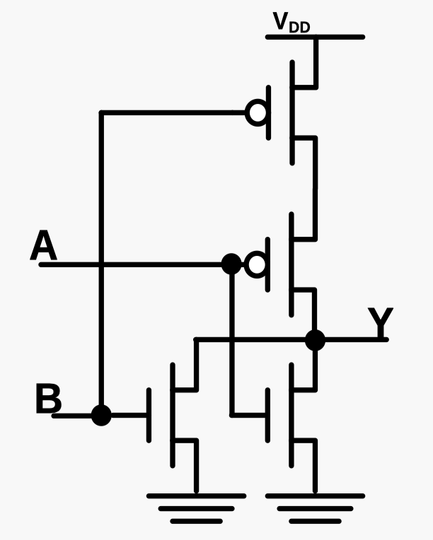

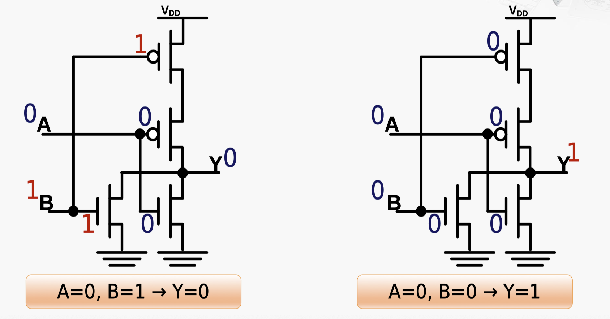

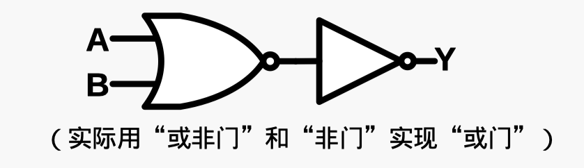

> 记忆：与非门上面是两个 P-Pos 串联。当且仅当两个输入都是 0 的时候 Y 才会输出 1。

### 与门（AND gate）

#### 逻辑符号


#### 真值表

$$
\begin{array}{cc|c}
A & B & Y=A \land B \\
\hline
0 & 0 & 0 \\
0 & 1 & 0 \\
1 & 0 & 0 \\
1 & 1 & 1 \\
\end{array}
$$

逻辑函数表示 $Y=A\cdot B$

### 与非门（NAND gate）

#### 真值表

$$
\begin{array}{cc|c}
A & B & Y=\lnot (A \land B) \\
\hline
0 & 0 & 1 \\
0 & 1 & 1 \\
1 & 0 & 1 \\
1 & 1 & 0 \\
\end{array}
$$

#### 与非门原理图


实际用 “与非门” 和 “非门” 实现 “与门”（注意下图中左边的有个 “o”，是与非门）


在这个电路中，A 和 B 是等价的，当且仅当两个输入都是 1 的时候 Y 才会输出 0。

> 记忆：与非门上面是是两个 P-Pos 的并联，这意味这当且仅当两个输入都是 1 的时候 Y 才会输出 0。

### 异或门（Exclusive-OR gate, XOR gate）

异或运算：

$$
\mathrm{A\oplus B=(\overline{A}\cdot B)+(A\cdot\overline{B})}
$$

两个值不相同，则异或结果为真。反之，为假。

#### 逻辑符号


逻辑函数表示 $Y=A \^{} B$ / $Y=A\oplus B$

#### 真值表

$$
\begin{array}{cc|c}
A & B & Y=A \oplus B \\
\hline
0 & 0 & 0 \\
0 & 1 & 1 \\
1 & 0 & 1 \\
1 & 1 & 0 \\
\end{array}
$$

异或门电路比较复杂，老师没讲。

半加器和全加器在下一章。

### 晶体管、逻辑门


## 4.3 寄存器的基本原理

### 寄存器的内部结构


### D 触发器（D flip-flop, DFF）

D 触发器

-   具有存储信息能力的基本单元
-   由若干逻辑门构成，有多种实现方式
-   主要有一个 **数据输入、一个数据输出和一个时钟输入**
-   在时钟 clock 的上升沿（0→1），采样输入 D 的值，传送到输出 Q，其余时间输出 Q 的值不变


clock 两个上升沿之间的时间就是 **时钟周期**

#### D 触发器的工作原理

照相机与显示器一起看做一个 D 触发器，实现了每当快门按下的瞬间，1 秒后在显示器上展示所拍摄的照片。具体的操作逻辑如下：

-   **触发器时钟频率** ：由于每 10 秒按一次快门，因此时钟频率为 `0.1Hz`。
-   **CLK-to-Q 时间** ：按下快门后，需要 1 秒钟时间将照片显示在显示器上，即 `CLK-to-Q` 时间为 1 秒。
-   **Setup/Hold 时间** ：为确保拍摄的画面稳定，按快门前后的画面不能有变化，这涉及到触发器的 Setup 和 Hold 时间要求。

通过这种方式，我们能够在每次按下快门后的 1 秒钟，准确无误地在显示器上看到所拍摄的画面。


DFF 要求在时钟上升的时候输入不能变化，否则采样可能出现错误，也就是 setup-hold 时间之内，输入不能变。

多个相机（DFF）的快门被同时按动（也即时钟信号是同时的）。

不保证顺序的传递，而是每个 DFF 都以其前一个 DFF 的当前输出（还没经过 CLK-to-Q 更新）作为输入。

#### D - 触发器应用示例：通用寄存器

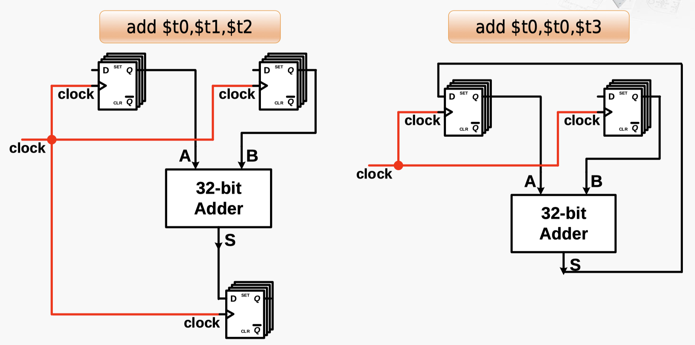

> 可以看到，左边这张图上面两个 D 触发器的 D 端都没接东西，这说明传导到 A 和 B 并用以运算的是旧值 Q。注意，这里涉及两个时钟周期，第一个周期内，结果的 D 触发器更新的是上一次加法的结果，下一个周期时，他才会更新本次加法的结果。这对应第二个图里，下一个周期才会更新第一个 D 触发器。

#### D - 触发器应用示例：移位寄存器

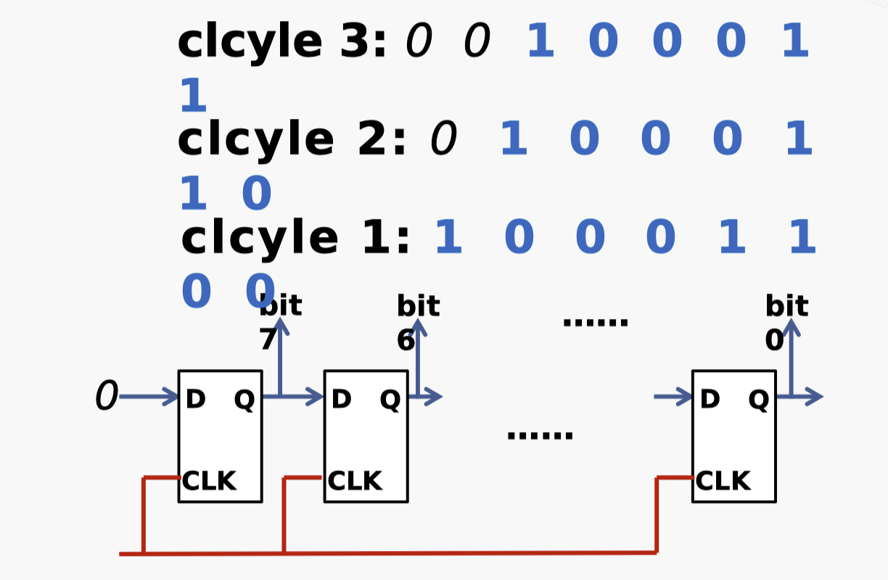

1. 在第 1 个触发器中，D 输入在 CLK 时钟信号的作用下，这个数字被存储到 Q 输出中。

2. 在第 2 个触发器中，D 输入来自前一级触发器的 Q 输出。在 CLK 时钟信号的作用下，这个数字被存储到 Q 输出中。

3. 以此类推

通过级联的 D 触发器，输入的数字位被逐步移位存储，实现了移位寄存器的功能。

这里有优化空间，现在太慢了，移多少位就要等多少个时钟周期。

#### 具有存储功能的电路：R-S 锁存器

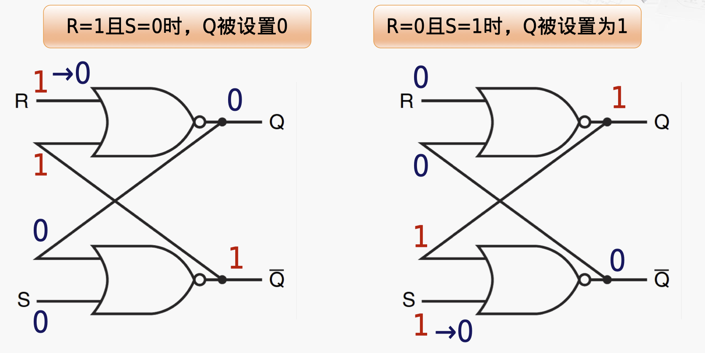

1. 异步控制：R-S 锁存器通过 R（Reset）和 S（Set）两个输入端口来控制状态，当 R=1 时输出为 0，当 S=1 时输出为 1，属于异步控制。

2. 存在未定义状态：当 R=S=1 时，锁存器的输出状态是未定义的。这种情况应当避免。

3. 电平触发：只要满足 R=0 且 S=1，输出就会变为 1 并保持；同理，R=1 且 S=0 时，输出变为 0 并保持。输出取决于 R、S 输入电平而非边沿变化。

4. 两个稳定状态：R=S=0 时，输出保持在原来的状态不变，称为锁存状态。

> 注意：这里是两个或非门！

#### D - 锁存器（D latch）的电路实现

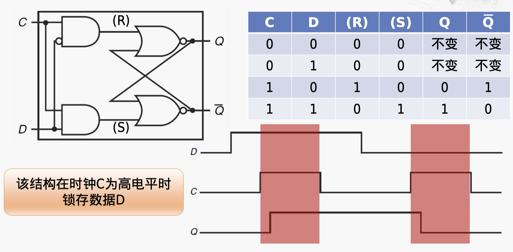

1. 该电路在时钟 C 为高电平时，将输入 D 锁存并输出到 Q。当 C 为低电平时，输出 Q 保持不变。

2. 该电路具有存储功能，可以在时钟 C 为高电平时记录输入 D 的状态，并在时钟 C 为低电平时保持输出 Q 不变。

### D - 触发器的电路实现

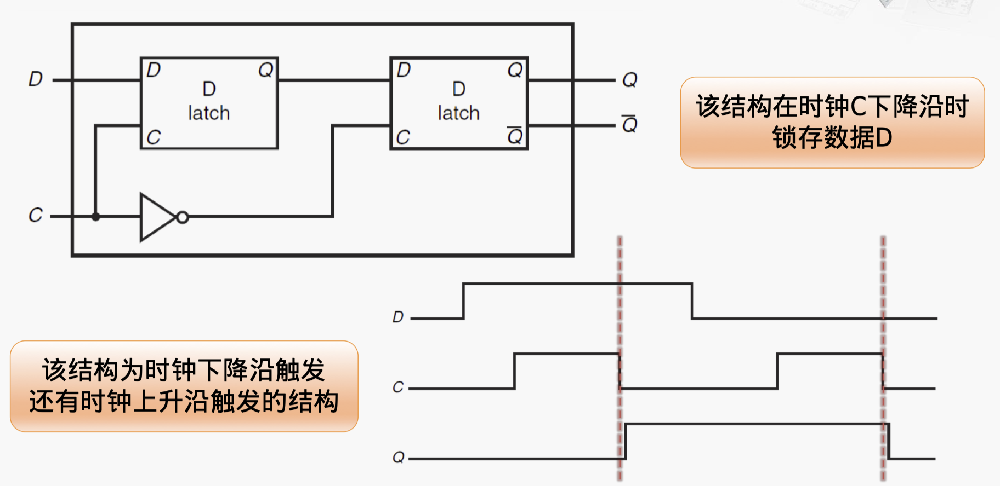

通过 C 控制 D 的传入时机。

当 C 为高电平时，D 的输出可以通过第一个 D-latch 传入到第二个 D-latch 的输入 D，但是无法传到第二个 D-latch 的输出 Q。

当 C 为低电平时，第一个 D-latch 的输出 Q 保持不变，第二个 D-latch 的输入 D 也保持不变，但是第二个 D-latch 的输出 Q 会变化。

所以说，该结构在时钟 C 下降沿时锁存数据 D。

### 寄存器的构成


注：这只是一个简单的原理性说明，现实中寄存器的实现要复杂的多

### SRAM

#### 基本存储单元

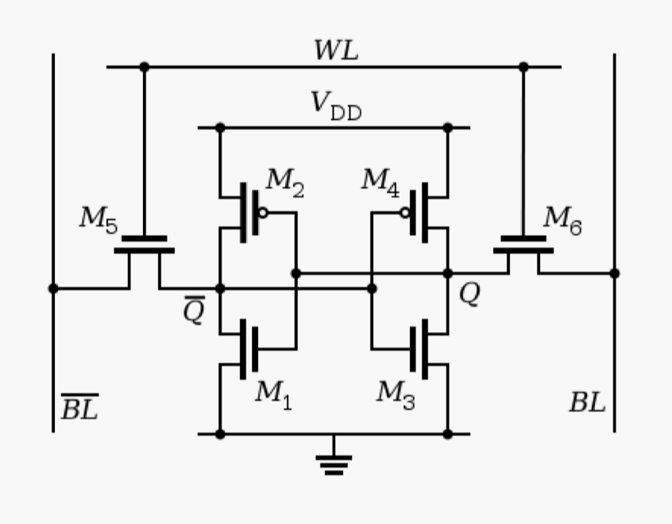

#### 写入过程示例

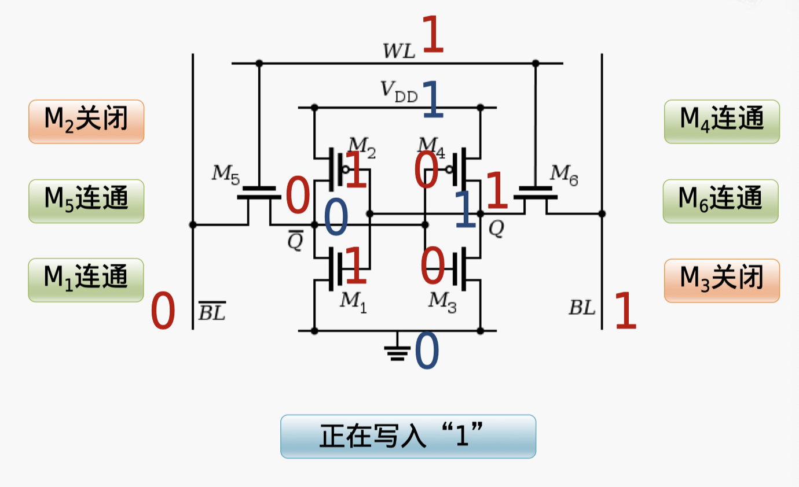

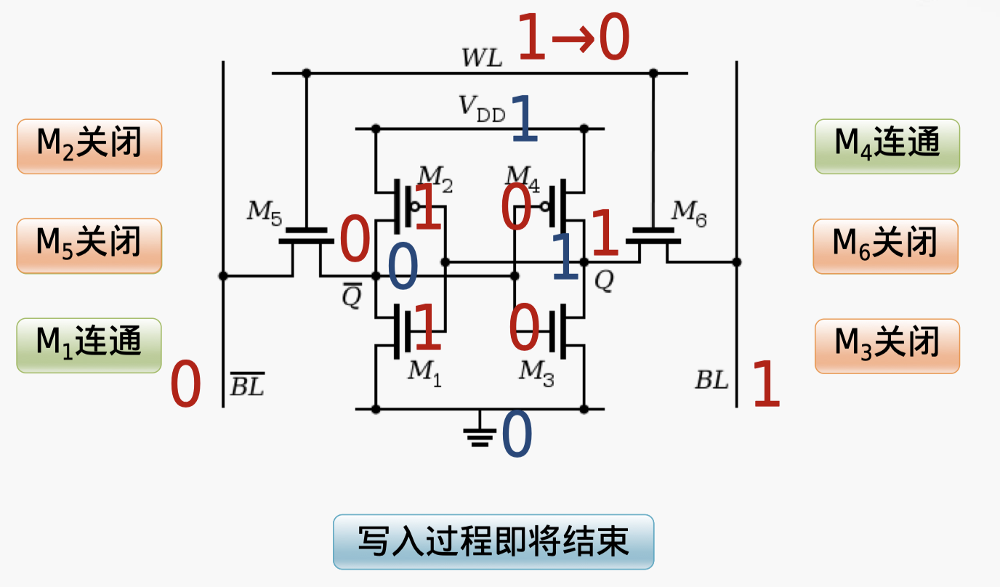

#### 读出过程示例

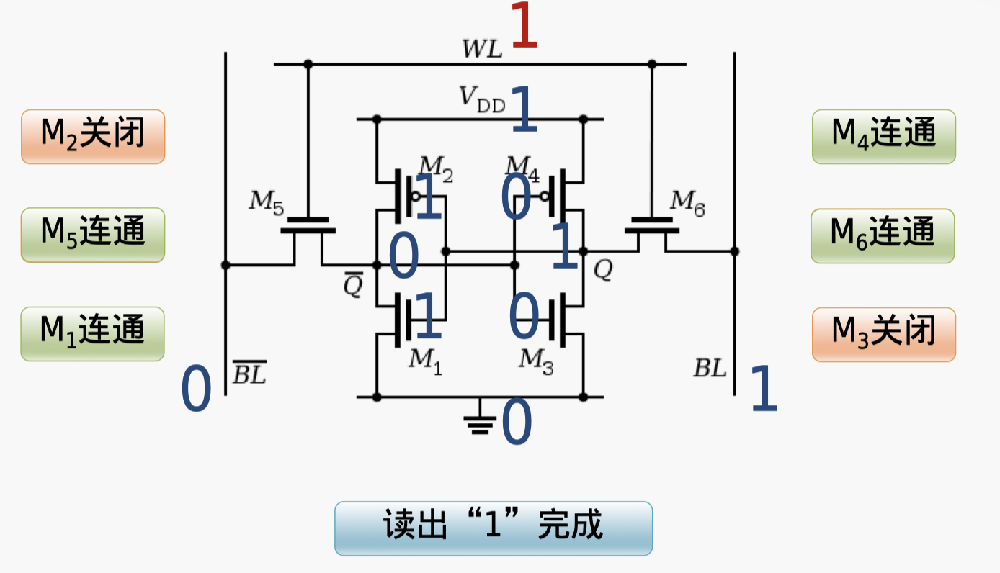

#### 基本结构

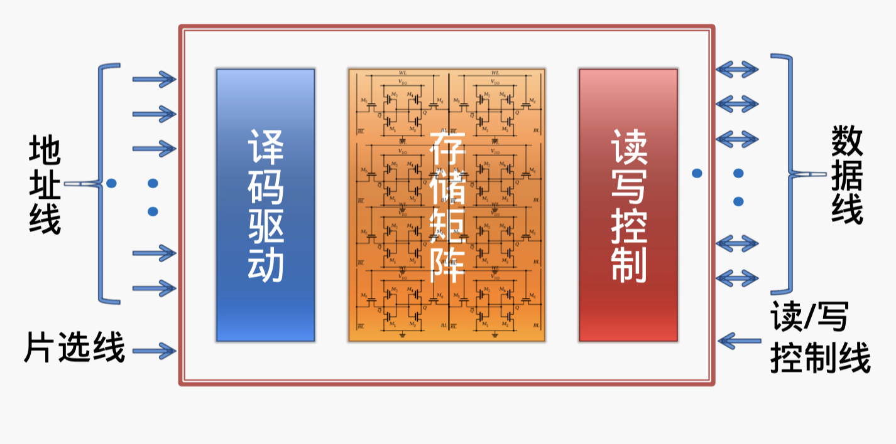

## 4.4 逻辑运算的实现

### 与门和与运算指令


### 与运算的实现

`and rd, rs, rt`：每个位并联进行与运算


### 或运算的实现

`or ra, rs, rt`：每个位并联进行或运算


### 包含多种功能的运算单元


每个功能模块都产生输出，通过多选器（MUX）选择输出。

### 逻辑运算示例


一个周期后，`$8` 会得到更新。

## 4.5 加法和减法的实现

### 二进制的加法


### 半加器（Half Adder）

半加器的功能是将两个一位二进制数相加，其实现需要一个异或门和一个与门。

-   输入端口 A、B
-   输出端口 S（和）、C（进位）


### 全加器（Full Adder）

全加器由两个半加器构成

-   输入端口 A、B、Cin（进位输入）
-   输出端口 S（和）、Cout（进位输出）

注意，$C_{out}$ 前面接的是一个或门，其在下列情况，输出 1：

-   当前位中间计算得到 1，且进位传入是 1
-   当前位中间计算得到 0，已经直接进位


### 4-bit 加法器


四个全加器 **串联** 起来，前一个全加器的进位输出接到下一个全加器的进位输入，就可以实现 4 位的加法。其输出包括两个部分：

-   S，和
-   C，最高位的进位输出

### 加法运算的实现示例


### 检查加法运算结果是否溢出

**溢出（overflow）** ：运算结果超出了正常的表示范围

**溢出仅针对有符号数运算**

-   两个正数相加，结果为负数
-   两个负数相加，结果为正数


（溢出改变了符号位）

### “进位” 和 “溢出” 示例

注意区分 “进位” 和 “溢出”

-   有 “溢出” 时，不一定有 “进位”，对应 **有符号数** 的相同符号大整数因为表示范围上限限制加超了 / 下限限制减超了，在阿贝尔环下 “轮回” 了，相差一个 $2^N$
-   有 “进位” 时，不一定有 “溢出”，对应 **无符号数** 的大整数因为表示范围上限限制加超了，相差一个 $2^N$


溢出：有符号数超出值域，输出错误的数，符号发生了改变

进位：无符号数超出值域，输出错误的数

### “溢出” 的检查方法

**最高位的进位输入不等于最高位的进位输出**

其实就是要求符号位不能是错误的


使用异或门连接 C31 和 Cout，如果不相等，就说明发生了溢出


> 理解这张图：
>
> 回想溢出的定义：两个正数相加得到负数，两个负数相加得到正数。
>
> -   A = B = 1，且 S = 0 当且仅当 C_in = 0 且 C_out = 1
> -   A = B = 0，且 S = 1 当且仅当 C_in = 1 且 C_out = 0
>
> 由此就可以推得，异或门的输出就是溢出的判断。

有符号数和无符号数在硬件上是没有区别的，只是在解释上有区别。

### 对 “溢出” 的处理方式：MIPS

提供两类不同的指令分别处理。

1. 将操作数看做有符号数，发生 “溢出” 时产生异常，进入异常处理程序

```assembly
add rd, rs, rt      # R[rd]=R[rs]+R[rt]
addi rt, rs, imm     # R[rt]=R[rs]+SignExt(Imm)
```

2. 将操作数看做无符号数，不处理 “溢出”

```assembly
addu rd, rs, rt     # R[rd]=R[rs]+R[rt]
addiu rt, rs, imm    # R[rt]=R[rs]+SignExt(Imm)
```

注意，无符号数没有溢出，只有 “舍弃的进位”

### 对 “溢出” 的处理方式：x86

不同于 MIPS，x86 使用溢出标志 OF （Overtlow Flag）来确定是否发生了溢出：

-   如果把操作数看做有符号数，运算结果是否发生溢出
-   若发生溢出，则自动设置 `OF=1`；否则，`OF=0`


如果要对溢出进行处理，需要在后续程序中基于 OF 进行判断。

### 减法运算

減减法运算均可转换为加法运算：`A - B = A + (-B)`

补码表示的二进制数的相反数，转换规则： **按位取反，末位加一** ，也即 `-B = ~B + 1`

在加法器的基础上实现減法器：`A + (-B) = A + (~B + 1)`


使用 `sub-mode` 选择信号，来控制是否使用非门将 B 取反，并将最低位的进位输入（C0）设置为 1，这样就可以实现减法运算。

### 多路选择器（MUX）

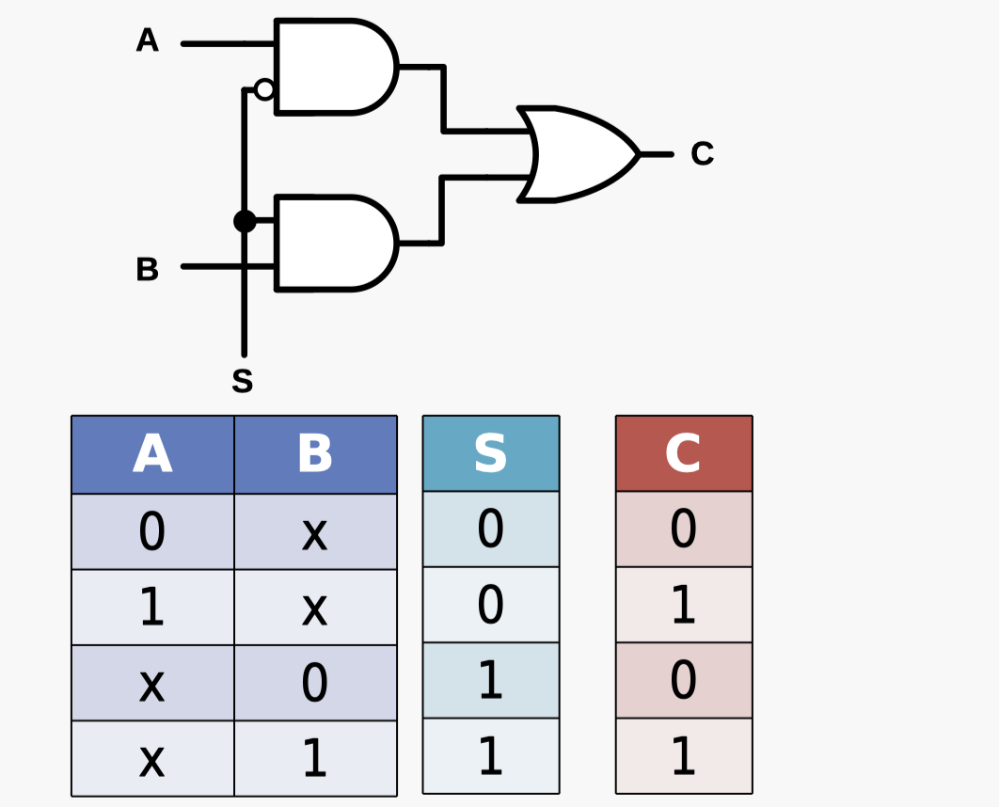

通过 S = 0 或 1 来选择 A 或者 B 信号。

## 4.6 加法器的优化

### 行波进位加法器（Ripple-Carry Adder, RCA）

结构特点：低位全加器的 Cout 连接到高一位全加器 Cin

优点：电路布局简单，设计方便

缺点：高位的运算必须等待低位的运算完成，**延迟时间长**。

（简要理解：是一个串联的结构，每一位的计算都要等待前一位的计算完成）


### 4-bit RCA 的门电路实现

完整门电路实现：


#### 4-bit RCA 的关键路径（延迟最长的路径）


线延迟小于门延迟，主要考虑门延迟。

总的延迟时间：假设有 $N$ 个全加器，每个门延迟的时间为 $T$，则总的延迟为 $(2T)\times N + T$​。

> 除了第一个全加器，其他都是当 C_in 传入的，只需要 2 个门延迟。

#### 32-bit RCA 的性能分析


输入输出寄存器想要在一个时钟周期内完成一次 32bits 加法运算，即使不考虑寄存器、加载延迟，一次 32bits 加法运算至少需要 65 个门延迟，最短就是 65T = 1.3ns，也就是手机主频率受到加法运算限制只有 769MHz。

### 加法器的优化思路

主要问题：高位的运算必须等待低位的 “进位输出信号”

优化思路：能否提前计算出 “进位输出信号”？


和这个电路上的实现不同，逻辑上的运算只要求这三者任意两个是 1，就输出 1：

$$
\begin{array}{rl}C_{i+1}&=(A_i\cdot B_i)+(A_i\cdot C_i)+(B_i\cdot C_i)\\&=(A_i\cdot B_i)+(A_i+B_i)\cdot C_i\end{array}
$$

其中，$\cdot$ 代表逻辑与，$+$ 代表逻辑或

设：

-   生成（Generate）信号 $G_i= A_i\cdot B_i$
-   传播（Propagate）信号 $P_i=A_i+B_i$

则：$C_{i+1}=G_{i}+P_{i}\cdot C_{i}$


这样做的好处是可以看出 G，P 都是输入的时候就可以确定的信号

迭代使用这个公式就可以发现每一个 C 都是可以在输入的时候就确定下来的


#### 提前计算 C4 的电路实现

优点：计算 $C_{i+1}$ 的延迟时间固定为 **三级门延迟** （多个数的或 / 与只需要一个门延迟，所以计算出所有的 G/P 是第一层，在此基础上计算各项的与要一层，最后计算各项加和的或也要一层，共计三层），与加法器的位数无关

缺点：如果进一步拓宽加法器的位数，则电路变得非常复杂

本质：通过将每一位进位都展开，得到一个只有由诸多与门执行后，再进行一次或门的电路，这样就可以提前计算出进位，从而提高了速度。


### 超前进位加法器（Carry-Lookahead Adder, CLA）


上一节中说了，计算任意的 C，只需要 3 级门延迟，只需要再加上一层全加器就可完成计算。所以 CLA 无论多少位，都只需要 4 级门延迟。

### 32-bit 加法器的实现

-   **行波进位加法器** ：其特点是简单但速度较慢。总延迟时间为 `65` 级门延迟。

-   **超前进位加法器** ：理想情况下，可以将总延迟时间大幅减少至 `4` 级门延迟，但实际上由于电路过于复杂，难以实现。

为了平衡速度和实现复杂度，通常采用的实现方法是：

-   使用多个小规模的超前进位加法器拼接而成。例如，可以将 `4` 个 `8-bit` 的超前进位加法器连接起来，形成一个 `32-bit` 的加法器。

这种方法既保证了加法器的速度，又相对减少了实现的复杂度。


4 级 CLA 的耗时计算：四个 8-bits CLA 按照行波进位加法器的样子逐个进行，但是前三个 CLA 只需要 3 个周期就可以得到最终的进位值，所以总门延迟为: 3+3+3+4=13 级门延迟，就是 0.26ns

> 可能不好理解，加以解释如下：
>
> 对于 0~7 位，每个 C 都是 3 级，每一位计算 C 完了计算 S，再加一级，所以是 4 级延迟
>
> 对于 8~15 位，必须等待 C7 计算完成，才能开始这一部分的 C 与 S 计算，这要求 3 级等待，在此基础上，剩余步骤同上，所以是 7 级延迟
>
> 对于 16~23 位，是 10 级延迟
>
> 对于 24~31 位，是 13 级延迟

## 集成电路的制造过程

1. 硅 → 提纯 → 硅锭
2. 硅锭 → 切片 → 晶圆
3. 晶圆 → 涂胶、光刻
4. 溶解光刻胶（曝光在紫外线下的光刻胶被溶解掉） → 蚀刻 → 化学清除光刻胶
5. 光刻胶 → 离子注入 → 化学清除光刻胶
6. 绝缘体沉积 → 蚀刻出三个孔洞填充铜 → 电镀
7. 抛光、布局连接
8. 晶圆测试、切片、丢弃瑕疵内核
9. 封装、测试
