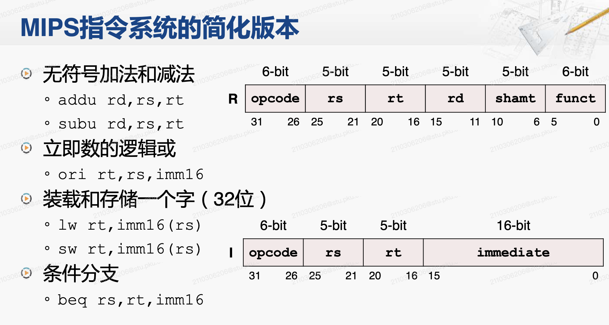
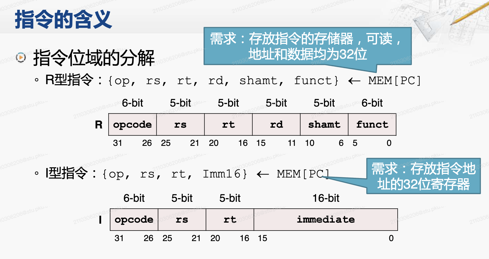
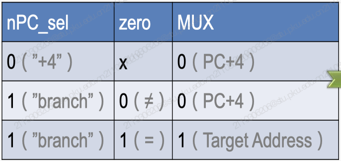
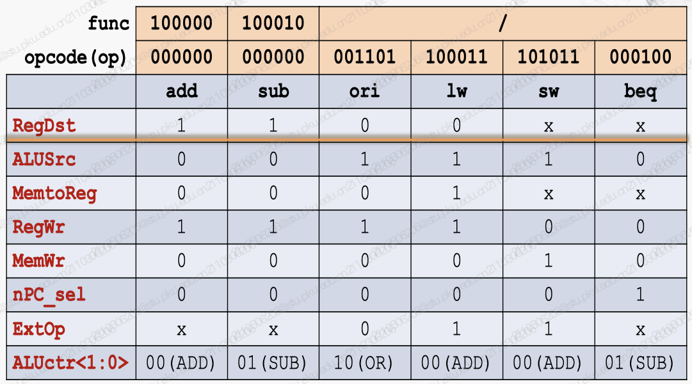

# 第六章 - 单周期处理器

## 6.1 处理器的设计步骤

### MIPS 指令系统的简化版本

指令格式：指令被编码为 32 位的二进制串。

-   R 型指令：用于寄存器之间的运算，分为 **六个位域** ，包含操作码（opcode）、源寄存器（rs）、目标寄存器（rt）、目的寄存器（rd）、移位量（shamt，保留）和功能码（funct）。
-   I 型指令：用于立即数运算和访问内存，分为 **四个位域** ，包含操作码（opcode）、源寄存器（rs）、目标寄存器（rt）和立即数（immediate）。

指令的含义：

-   `addu rd,rs,rt`: R 型，无符号加法，将寄存器 rs 和 rt 的值相加，结果存入 rd。

-   `subu rd,rs,rt`: R 型，无符号减法，从寄存器 rs 的值中减去 rt 的值，结果存入 rd。

-   `ori rt,rs,imm16`: I 型，寄存器 rs 的值和立即数 imm16 进行逻辑或（OR）操作，结果存入 rt。

-   `lw rt,imm16(rs)`: I 型，从内存地址（寄存器 rs 的值加上立即数 imm16）加载字到寄存器 rt。

-   `sw rt,imm16(rs)`: I 型，将寄存器 rt 的值存储到内存地址（寄存器 rs 的值加上立即数 imm16）。

-   `beq rs,rt,imm16`: I 型，分支等于（branch on equal），如果寄存器 rs 和 rt 的值相等，则跳转到当前地址加上立即数 imm16 指定的位置。

    注意 beq 的顺序是 rs，rt

### 指令位域的分解

-   R 指令需求：存放指令的 **存储器，可读** ，地址和数据均为 32 位
-   I 指令需求：存放指令地址的 **32 位寄存器（PC），可读可写**

### 指令的操作

`ADDU`：无符号加法，结果存储在目的寄存器 `rd` 中。

-   指令格式：`ADDU R[rd] ← R[rs] + R[rt]; PC ← PC+4`

`SUBU`：无符号减法，结果存储在目的寄存器 `rd` 中。

-   指令格式：`SUBU R[rd] ← R[rs] - R[rt]; PC ← PC+4`

由此得出，我们需要的运算器需要支持的操作数包括：

-   改写一个寄存器的需求（rd 或 rt）
-   一组存放数据的 32 位通用寄存器，32 是人为规定的
-   同时读取两个寄存器的内容（rd 或 rt）

---

`ORI`：寄存器 `rs` 的内容与立即数 `Imm16` 进行逻辑或操作，结果存储在寄存器 `rt` 中。

-   指令格式：`ORI R[rt] ← R[rs] | zero_ext(Imm16); PC ← PC+4`

由此得出，我们需要的运算器需要支持的操作数包括：

-   运算的操作数可以是寄存器或者扩展后的立即数
-   提供加、减、逻辑或三种功能的运算器
-   将 16 位立即数扩展到 32 位 **（零扩展）**

---

`LOAD`：从内存中加载数据到寄存器 `rt`。

-   指令格式：`LOAD R[rt] ← MEM[R[rs]+sign_ext(Imm16)]; PC ← PC+4`

`STORE`：将寄存器 `rt` 的数据存储到内存地址。

-   指令格式：`STORE MEM[R[rs]+sign_ext(Imm16)] ← R[rt]; PC ← PC+4`

由此得出，我们需要的运算器需要支持的操作数包括：

-   存放数据的存储器，可读写，**地址和数据均为 32 位**
-   将 16 位立即数扩展到 32 位 **（符号扩展）**

---

`BEQ`：如果寄存器 `rs` 和 `rt` 的值相等，则跳转到指定的地址。

-   指令格式：`BEQ if (R[rs]==R[rt]) then PC ← PC+4 + (sign_ext(Imm16)||00) else PC ← PC+4`

由此得出，我们需要的运算器需要支持的操作数包括：

-   比较两个数，判断是否相等
-   PC 寄存器支持两种自增方式，加 4 **或加一个立即数**

这里 `||00` 代表的是将扩展后的 `Imm16` 左移两位，然后拼接两个 0。而不是或的意思。这是因为在 MIPS 架构中，跳转地址是按字节寻址的，而每条指令的长度是 $4=2^2$ 个字节，所以需要将立即数左移两位（即附加两个零位）来得到正确的跳转地址。

### 需求总结

1. 算术逻辑单元（ALU）

    

    - 运算类型：加、减、或（`ORI`）、比较相等（`BEQ`）
    - 操作数：2 个 32 位的数，来自寄存器或扩展后的立即数

2. 立即数扩展部件

    

    - 将一个 16 立即数扩展为 32 位数
    - 扩展方式：零扩展（`ORI`）、符号扩展（`LOAD, STORE, BEQ`）

3. 程序计数器（PC）

    

    - 一个 32 位的寄存器
    - 支持两种加法：加 4 或加一个立即数（`BEQ`）

    可以用 ALU 实现，或者简单的加法器。

4. 寄存器堆

    

    - 每个寄存器为 32 位宽，共 32 个
    - 支持读操作：rs 和 rt
    - 支持写操作：rt 或 rd
    - 注：这称为 “两读一写” 的寄存器堆，这里要求 **同时操作** 。

5. 存储器

    

    - 一个只读的 **指令存储器**，地址和数据均为 32 位
    - 一个可读写的 **数据存储器**，地址和数据均为 32 位
    - 注：这两个存储器实际对应了现代 CPU 中的指令和数据高速缓存（Cache），而不是内存。

### 存储组件：寄存器堆

内部构成：32 个 32 位的寄存器

数据接口信号：

-   busA，busB：两组 32 位的数据输出
-   busW ：一组 32 位的数据输入

读写控制：

-   Ra（5 位）：选中对应编号（0~31）的寄存器，将其内容放到 busA
-   Rb（5 位）：选中对应编号（0~31）的寄存器，将其内容放到 busB
-   Rw（5 位）：选中对应编号（0~31）的寄存器，在时钟信号（clk）的上升沿，如果写使能信号有效（`WriteEnable==1`），将 busW 的内容存入该寄存器
-   注：寄存器堆的读操作 **不受时钟控制** 。也即任何时候，Ra、Rb 发生变化，busA、busB 的内容也会随之变化。

### 存储组件：存储器

数据接口信号：

-   Data In：32 位的数据输入信号
-   Data Out：32 位的数据输出信号

读写控制：

-   Address：32 位的地址信号。该信号指定一个存储单元，将其内容送到数据输出信号
-   Write Enable：写使能信号。在时钟信号（clk）的上升沿，如果写使能信号有效（为 1），将数据输入信号的内容存入地址信号指定存储单元
-   注：存储器读操作不受时钟控制，任何时候，Address 发生变化，经过很短时间，Data Out 的内容也会随之变化。

## 6.2 数据通路的建立

### 建立数据通路的方法

基本原则：根据指令需求，连接组件，建立数据通路

指令的需求：

-   所有指令的共同需求
-   不同指令的不同需求

### 所有指令的共同需求

指令获取单元（Instruction Fetch Unit, IFU）：

取指令

-   程序计数器（PC）的内容是指令的地址
-   用 PC 的内容作为地址，访问指令存储器获得指令编码

更新程序计数器（PC）

-   顺序执行时：`PC <- PC + 4`
-   发生分支时：`PC <- 分支目标的地址`，这在后文实现
-   在图中也即根据多选器的选择信号，选择 PC+4 或者分支目标地址

### 不同指令的不同需求

#### 加法和减法指令的需求

寄存器堆：

注：

-   busA，busB 是从寄存器堆中读取的数据，分别为 rs 和 rt
-   ALUCtr 和 RegWr 是由指令译码生成的控制信号
-   ALU 的输出连接到寄存器堆的 busW 输入端，下一个时钟上升沿到来时，如果写使能信号为 1 ，将 ALU 的输出写入到 rd 中

#### 逻辑运算指令的需求

这是一条 I 型指令。现有的设计具有如下问题：

1. 目的寄存器是 rt 而非 rd，当前无法写入 rt
2. 立即数是 ALU 的输入
3. 立即数只有 16 位，需要零扩展

解决方案：增加两个多选器，增加一个零扩展部件运算指令的控制信号。

两个多选器分别为：

-   `ALUSrc`，选择 ALU 的第二个操作数：来自寄存器堆的 busB （`ALUSrc = 0` 时，对应之前的情况，输入是 rt）或者扩展后的立即数（`ALUSrc = 1` 时，对应当前情况）
-   `RegDst`，选择 Rw 的写入目标：rd（`RegDst = 1` 时，对应之前 R 型指令的情况） 或 rt（`RegDst = 0` 时，对应当前 I 型指令情况）

#### 访存指令的需求（Load）

现有的设计具有如下问题：

-   如何进行符号扩展？
-   从何处装载数据？

解决方案：将原有的零扩展部件增加符号扩展功能（配合多选器），加入数据存储器和多选器。

两个多选器分别为：

-   `ExtOp`，选择扩展的输出类型，是零扩展立即数（`ExtOp = 0`）还是符号扩展后的立即数（`ExtOp = 1`）
-   `MemtoReg`，选择写入寄存器堆的数据来源，是来 ALU 的输出（`MemtoReg = 0`），还是自数据存储器 （`MemtoReg = 1`）

#### 访存指令的需求（Store）

现有的设计具有一个问题：不知道什么时候储存，也无法储存寄存器的值

解决方案：加入一个控制是否写入的信号，增加一条从 busB 到数据存储器的数据通路。

这需要添加一个多选器：

-   `MemWr`，是否将 busB 的内容写入到数据存储器中，如果为 1，则写入。否则不写入。

至此，数据通路的建立基本完成。

## 6.3 运算指令的控制信号

### 加法指令的操作步骤

加法指令 `addu rd, rs, rt` 分为三个部分：

1. `Instruction = MEM[PC]` 从指令存储器中取回指令
1. `R[rd] = R[rs] + R[rt]` 指令指定的操作
1. `PC = PC + 4` 计算下一条指令的地址

#### 加法指令的操作步骤（1）：指令获取

`Instruction = MEM[PC]`，在 IFU（指令获取单元）中完成

-   从指令存储器中取回指令，在时钟上升沿，首先经过一小短时间，PC 将输入放到输出，再经过一小短时间，将 PC 的内容作为地址，访问指令存储器，将指令存储器的内容放到输出端。
-   所有指令均有此步骤

#### 加法指令的操作步骤（2）：ALU 的操作

首先从 IFU 的输出中解析出各个位域。

然后根据图中红色的控制信号，进行计算，计算出来值，传到 busW （表现为输出稳定）之后，在下一个时钟上升沿就会写入到 rd 中

#### 加法指令的操作步骤（3）：更新 PC 寄存器

除了分支指令（分支指令也有，但是略有差别，见后文），均有此步骤。而且每条指令都是在一个周期内完成的。

### ori 指令的操作步骤

或指令 `ori rt, rs, imm16` 分为三个部分：

1. `Instruction = MEM[PC]` 从指令存储器中取回指令
1. `R[rt] = R[rs] | ZeroExt[imm16]` 指令指定的操作
1. `PC = PC + 4` 计算下一条指令的地址

1，3 与 add 相同。

#### ori 指令的操作步骤（2）

同样是设置控制信号，进行计算，将结果写入到 rt 中。

与 add 不同的地点在于：

-   `ALUSrc = 1`，选择了立即数作为 ALU 的第二个操作数。
-   `ALUCtr = OR`，选择了或操作。
-   `RegDst = 0`，选择了写入 rt。这是由于它是 I 型指令。
-   `ExtOp = 0`，要求指定此信号以选择零扩展。

## 6.4 访存指令的控制信号

### lw 指令的操作步骤

指令 `lw rt, imm(rs)` 分为三个部分：

1. `Instruction = MEM[PC]` 从指令存储器中取回指令
2. `R[rt] = DataMemory{R[rs] + SignExt[imm]}` 指令指定的操作
3. `PC = PC + 4` 计算下一条指令的地址

控制信号：

-   `RegDst = 0`，选择 rt 作为目标寄存器。
-   `RegWr = 1`，允许写入目标寄存器。
-   `ALUSrc = 1`，选择立即数作为 ALU 第二操作数。
-   `ALUCtr = ADD`，选择加法操作。
-   `MemtoReg = 1`，选择内存数据写入寄存器。
-   `MemWr = 0`，不允许写内存。

#### lw 指令的操作步骤（2）：Data Memory 的操作

`R[rt] = DataMemory{R[rs] + SignExt[imm]}`

### sw 指令的操作步骤

指令 `sw rt, imm(rs)` 分为三个部分：

1. `Instruction = MEM[PC]`，从指令存储器中取回指令
2. `DataMemory{R[rs] + SignExt[imm16]} = R[rt]`，指令指定的操作
3. `PC = PC + 4`，计算下一条指令的地址

#### sw 指令的操作步骤（2）

`DataMemory{R[rs] + SignExt[imm16]} = R[rt]`

控制信号：

-   `RegDst` 不适用，因为此时不需要选择目标寄存器。表示为 x 代表可以是任意值。
-   `RegWr = 0`，不允许写入寄存器。
-   `ALUSrc = 1`，选择立即数作为 ALU 第二操作数。
-   `ALUCtr = ADD`，选择加法操作。
-   `MemtoReg` 不适用，因为此时不需要从内存读取数据到寄存器。
-   `MemWr = 1`，允许写内存。

## 6.5 分支指令的控制信号

### 条件分支指令的示例

`beq` 指令的分类：I 型指令 + 分支指令。

### beq 指令的操作步骤

指令 `beq rs, rt, imm16` 分为三个部分：

1. `Instruction = MEM[PC]`，从指令存储器中取回指令
2. `if(R[rs] == R[rt])`，判断转移条件是否成立
3. `then PC = PC + 4 + SignExt[Imm16] * 4; else PC = PC + 4;`，计算下一条指令的地址。

注意，Imm16 代表的是目标跳转指令和 **下一条指令** 之间的差值，而且会对其左移两位（即乘以 4），这是因为 MIPS 架构中，跳转地址是按字节寻址的，而每条指令的长度是 4 个字节（32 位），所以需要将立即数左移两位（即附加两个零位）来得到正确的跳转地址。

#### beq 指令的操作步骤（2）：计算输出，传递给 IFU

`if (R[rs]-R[rt]==0) then zero = 1; else zero = 0`

我们希望 ALU 计算的减法输出不像往常一样用于更新寄存器，而是输出一个是否为 0 的 `zero` 信号，将之接到 IFU，用于判断是否跳转（即修改 PC 的计算逻辑）。

控制信号：

-   `RegDst`，不适用，因为此时指令不涉及目标寄存器的选择。
-   `RegWr = 0`，不允许写入寄存器。
-   `ALUSrc = 0`，不适用，因为此时 ALU 第二个操作数直接来自寄存器。
-   `ALUCtr = SUB`，计算减法操作，因为我们需要计算是否相等。
-   `MemtoReg`，不适用，因为此时不从内存读取数据到寄存器。
-   `MemWr = 0`，不允许写内存。
-   `zero`，ALU 计算得出的信号，用于条件分支判断，如果两个寄存器值相等则为 1，否则为 0。用于后续判断如何修改 PC。

#### beq 指令的操作步骤（3）：IFU 更新 PC

其中，我们会根据如下条件，计算 MUX（多选器）的选择信号，这里只需要一个 **与门** 就可以实现（上图红色部分）：

也即，只有当指令为 `beq`（对应 `nPC_sel = 1`）、且满足分支条件（对应 `zero = 1`），才选择额外的计算结果作为跳转目的地址。

所以可以看到，我们在这个 IFU 内需要进行两次加法运算：

1. `PC_tmp = PC + 4`，计算下一条指令的地址

2. `PC = MUX ? (PC_tmp + SignExt[Imm16] * 4) : PC_tmp`，根据 MUX 的输出，选择是否额外加上计算跳转指令的地址

    其中，`MUX = nPC_sel & zero`

## 6.6 控制信号的集成

### 现有指令所需的控制信号

### 控制逻辑与数据通路

-   `RegWr`：寄存器写信号，控制是否将数据写入寄存器。

    -   `RegWr = 0` 时，不写入数据，对应 `beq`、`sw` 指令；
    -   `RegWr = 1` 时，写入数据，对应 `add`、`sub`、`ori`、`lw` 指令。

-   `RegDst`：寄存器目的地选择信号，决定了数据将被写入哪个寄存器。
    -   `RegDst = 0` 时，写入 `rt`，对应需要写入的 I 型指令，包括 `ori`、`lw`；
    -   `RegDst = 1` 时，写入 `rd`，对应需要写入的 R 型指令，包括 `add`、`sub`。
-   `ExtOp`：扩展操作信号，用于确定立即数是进行符号扩展还是无符号扩展。
    -   `ExtOp = 0` 时，进行无符号扩展，对应 `ori` 指令；
    -   `ExtOp = 1` 时，进行符号扩展，对应 `lw`、`sw` 指令。
-   `ALUSrc`：算术逻辑单元（ALU）源选择信号，决定 ALU 的第二个操作数是来自寄存器还是立即数。
    -   `ALUSrc = 0` 时，选择寄存器作为第二个操作数，对应 `add`、`sub`、`beq` 指令；
    -   `ALUSrc = 1` 时，选择立即数作为第二个操作数，对应 `ori`、`lw`、`sw` 指令。
-   `ALUCtr`：算术逻辑单元控制信号，指示 ALU 执行何种算术或逻辑操作。

    根据不同的操作码（opcode）和函数码（funct），`ALUCtr` 会有不同的设定。

    -   `ALUCtr = ADD` 时，执行加法操作，对应 `add` 指令；
    -   `ALUCtr = SUB` 时，执行减法操作，对应 `sub` 和 `beq` 指令；
    -   `ALUCtr = OR` 时，执行逻辑或操作，对应 `ori` 指令。

-   `MemWr`：内存写信号，控制是否将数据写入内存。
    -   `MemWr = 0` 时，不写入数据，对应大多数指令；
    -   `MemWr = 1` 时，写入数据，对应 `sw` 指令。
-   `MemtoReg`：内存到寄存器信号，决定了是将内存中的数据还是 ALU 的结果写入寄存器。
    -   `MemtoReg = 0` 时，选择 ALU 结果，对应 `add`、`sub`、`ori` 指令；
    -   `MemtoReg = 1` 时，选择内存数据，对应 `lw` 指令。

这里没有明确写出的组合，代表其对应的控制信号取值可为任意值。但是实际硬件产生信号（见后文）的时候，他们都是明确的，一般用不到就是 0。用或来实现选择条件。

### 控制信号的汇总（以 add 指令为例）

### 控制信号的逻辑表达式

如何产生各个信号？

-   `RegDst` = `add` + `sub`
-   `add` = `rtype` · `func5` · `~func4` · `~func3` · `~func2` · `~func1` · `~func0`
-   `sub` = `rtype` · `func5` · `~func4` · `~func3` · `~func2` · `func1` · `~func0`
-   `rtype` = `~op5` · `~op4` · `~op3` · `~op2` · `~op1` · `~op0`
-   其他 I 型指令类似计算 opcode 可得（见后）

其中：

-   `rtype` 代表的是 R 型指令
-   `op` 代表的是操作码。`opX` 代表的是操作码的第 X 位（从低位向高位增长计数）。`funcX` 同理
-   `·` 代表的是逻辑与操作，`~` 代表的是逻辑非操作。

推广到其他控制信号：

-   `RegDst` = `add` + `sub`，为 1 代表启用 `rd` 作为写入寄存器
-   `ALUSrc` = `ori` + `lw` + `sw`
-   `MemtoReg` = `lw`
-   `RegWr` = `add` + `sub` + `ori` + `lw`
-   `MemWr` = `sw`
-   `nPC_sel` = `beq`
-   `ExtOp` = `lw` + `sw`，为 1 代表为有符号扩展
-   `ALUctr[0]` = `sub` + `beq`
-   `ALUctr[1]` = `or`

注：`ALUctr` 是一组二进制信号，用来控制算术逻辑单元（ALU）的操作。 `ALUctr` 有两位，可能有如下情况：

-   `00`：执行加法操作
-   `01`：执行减法操作
-   `10`：执行逻辑或操作

根据不同的输入信号，ALU 会执行不同的算术或逻辑操作。这些信号由控制单元根据指令的类型产生。

更低级的信号：

-   `add` = `rtype` · `func5` · `~func4` · `~func3` · `~func2` · `~func1` · `~func0`
-   `sub` = `rtype` · `func5` · `~func4` · `~func3` · `~func2` · `func1` · `~func0`
-   `rtype` = `~op5` · `~op4` · `~op3` · `~op2` · `~op1` · `~op0`
-   `ori` = `~op5` · `~op4` · `op3` · `op2` · `~op1` · `op0`
-   `lw` = `op5` · `~op4` · `~op3` · `~op2` · `op1` · `op0`
-   `sw` = `op5` · `~op4` · `op3` · `~op2` · `op1` · `op0`
-   `beq` = `~op5` · `~op4` · `~op3` · `op2` · `~op1` · `~op0`

其中，`+` 代表的是逻辑或操作，`·` 代表的是逻辑与操作。

如此，就可以实现所有的控制信号了。

### 控制器的实现示意图

