# 第七章 - 流水线处理器

## 7.1 流水线的基本原理


采用流水线：

-   **流水线填满之后**，可以做到每 1 分钟上一道菜：性能提升到原先的 4 倍
-   单独一道菜仍然需要 4 分钟

### MIPS 的主要步骤

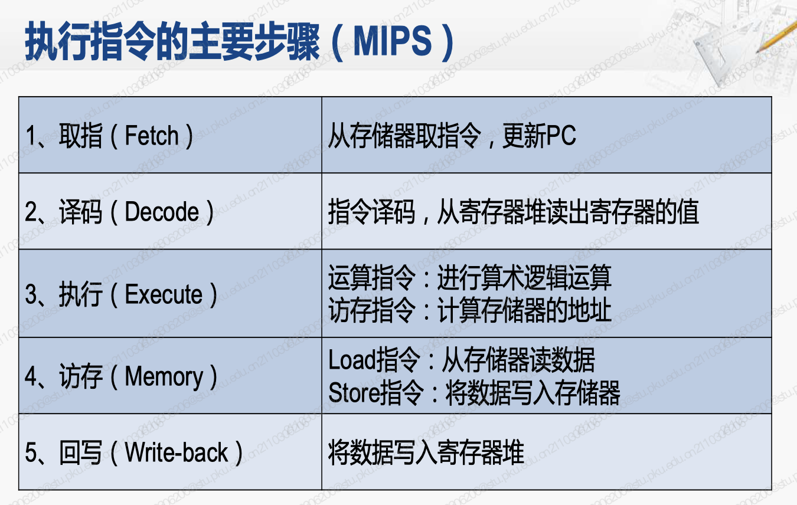

对 MIPS 处理器亦进行阶段划分：

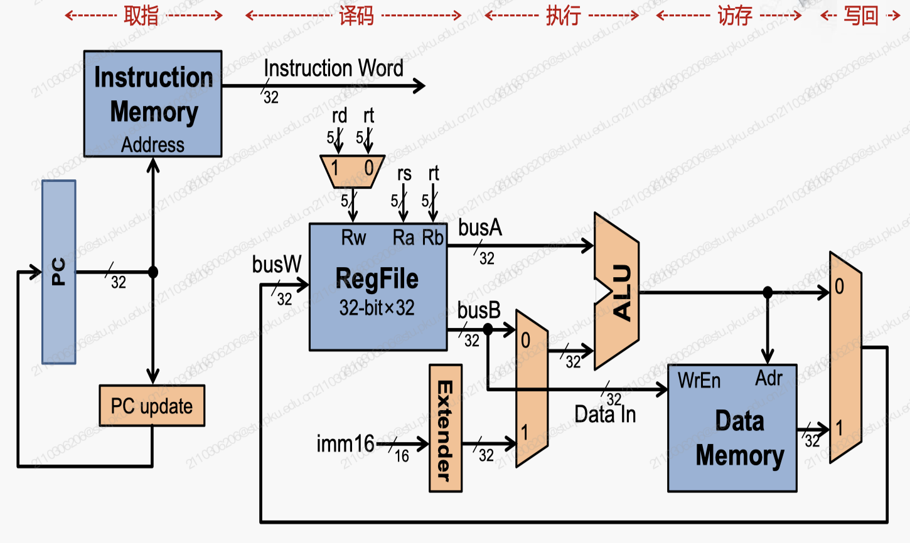

虽然分组了，但是所有的信号都需要在每个阶段中保持稳定。为了充分利用硬件，我们添加寄存器：

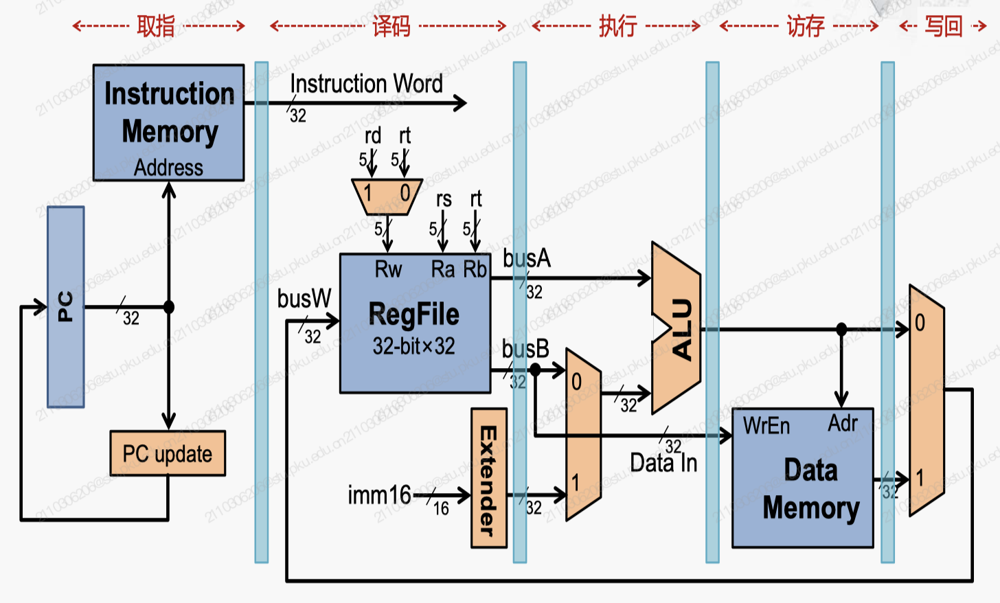

### 流水线处理器性能分析

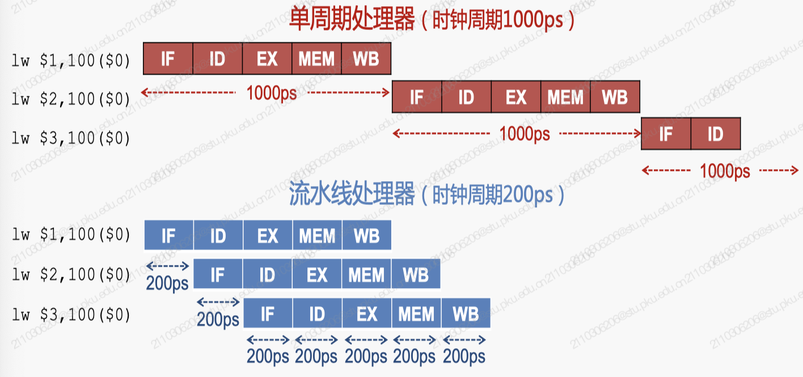

时钟周期：流水线处理器的时钟周期是流水线中 **最慢的阶段的时钟周期**

这是没带上流水线寄存器的，带上之后：

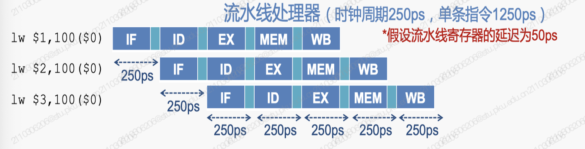

### 总结

流水线中的各个处理部件可 **并行工作**，从而可使 **整个程序** 的执行时间缩短

流水线并 **不会缩短单条指令的执行时间** （甚至由于流水线寄存器的存在，会增加时间） ，而是 **提高了指令的吞吐率**

## 7.2 流水线的优化

### 流水线的调整

不平衡的流水线：每个阶段花费时间不相等的流水线，对单一条指令执行时间和整个处理器的吞吐率都不好。

因此，需要尽可能的平衡各个阶段的时间。为此可能要更细地切分阶段，使之变为平衡的流水线。

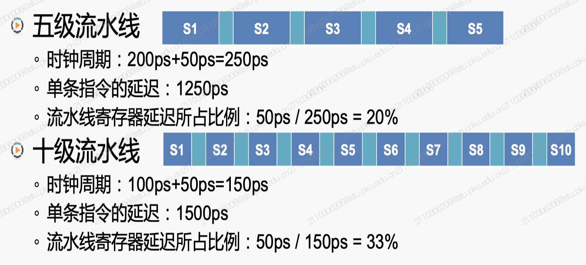

**超级流水线技术 (Super Pipelining)**：将流水线细分为更多的阶段，增加流水线的深度提升时钟频率，从而 **提高指令吞吐率**

但是流水线的级数不是越多越好，因为有流水线寄存器的存在，所以更深的级数会导致单条指令的延迟越来越大，流水线寄存器延迟所占比例也越来越大，填满一条流水线所需的指令也会增加。

x86 被 RISC 追赶，所以做出了改进：在流水线内部用硬件把复杂的 x86 指令划分为更细的 RISC 指令，从而既可以使用先进的 RISC 技术（流水线等），也可以保证对原先的 x86 程序的兼容。

2004，Pemtium 4 (Prescott) 达到了 31 级（最高）。

现在我们已经很难简单的通过增加流水线的深度来获得性能上的提升了。

## 7.3 超标量流水线

**超标量（Superscalar）**：具有两条或两条以上 **并行工作** 的流水线结构称为 **超标量结构**

-   亦称为 “超标量流水线” 或直接称为 “超标量”。
-   与之相对，之前的流水线则称为 “标量流水线”

使用超标量结构的处理器称为 **超标量处理器**

几条流水线就称为几发射。

### Pentium 的超标量流水线（第一款超标量 x86 CPU）

双发射，5 级流水线

-   两条流水线：“U 流水” 和 “V 流水”
-   共用取值、译码阶段
-   每条流水线都拥有自己的地址生成逻辑、ALU 及数据 Cache 接口
-   在一个时钟周期内，可以 **同时发送两条指令**

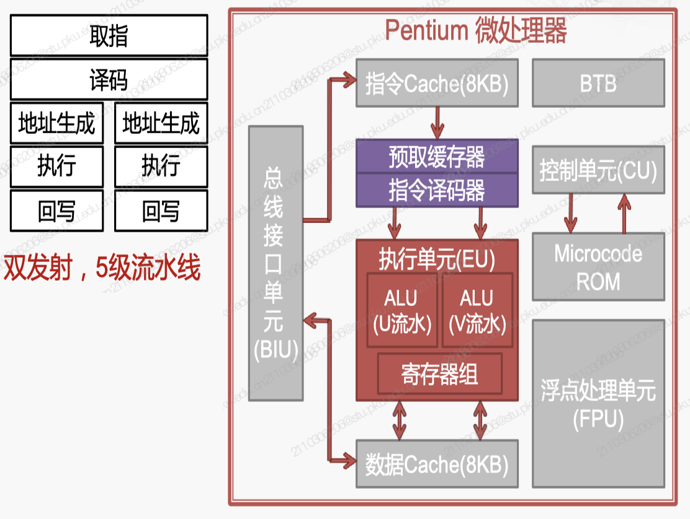

CDC6000：通常认为是最早采用超标量技术的计算机，有 10 个并行功能部件，不过没有流水线。by 西摩・克雷

### Core i7 的超标量流水线

由于长度变长，需要先进行指令的识别。

**超标量（Superscalar）**

-   具有两条或两条以上并行工作的流水线结构称为超标量结构亦称为 “超标量流水线” 或直接称为 “超标量”

    -   与之相对，之前的流水线则称为 “标量流水线”
    -   使用超标量结构的处理器称为超标量处理器

-   标量流水线和超标量流水线

    -   单周期 → 标量流水线：**时间并行性** 的优化，主要是对现有硬件的切分。
    -   标量流水线 → 超标量流水线：**空间并行性** 的优化，需成倍增加硬件资源

### 超标量流水线与多核 CPU

现代的多核 CPU 通常是在一个 CPU 芯片中集成了多个超标量处理器核

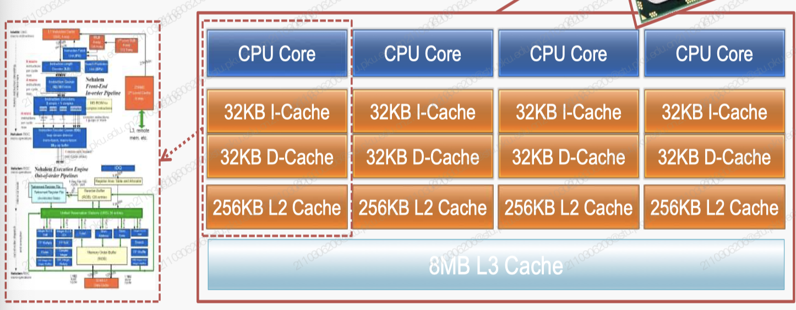

这是 4 核的处理器。

## 7.4 流水线冒险

冒险：阻止下一条指令在下一个时钟周期开始执行的情况

-   **结构冒险**：所需的硬件部件正在为之前的指令工作。
-   **数据冒险**：需要等待之前的指令完成数据的读写。
-   **控制冒险**：需要根据之前指令的结果决定下一步的行为。

### 结构冒险

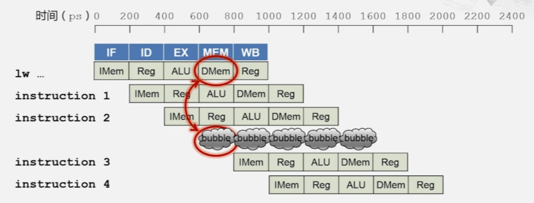

问题来源：如果指令和数据放在同一个存储器中，则不能同时读存储器

解决方案 1：流水线停顿（stall），产生空泡（bubble），这是安全且简便的方法，但是会严重影响效率。

解决方案 2：指令和数据放在不同的存储器中（更本质的解决问题）

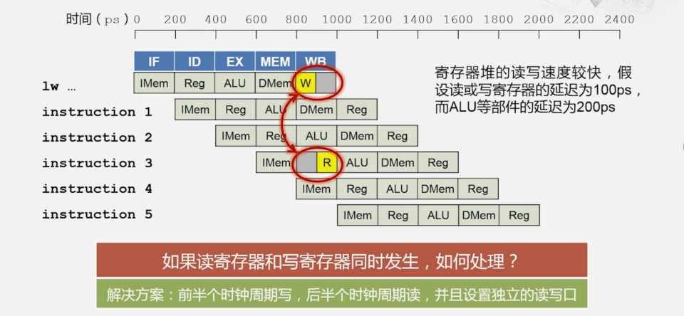

问题来源：读寄存器和写寄存器同时发生

解决方案：前半个时钟周期写，后半个时钟周期读，并且设置独立的读写口（错开）

### 数据冒险

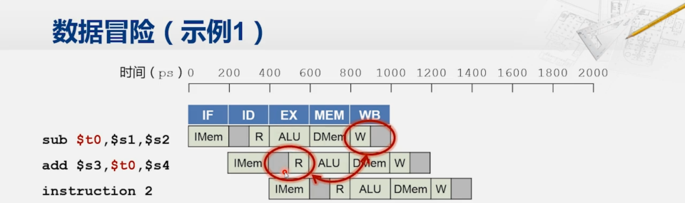

这段指令的代码第一条减法指令， 它的运算结果会放到 t0 寄存器当中，而下一条指令需要将 t0 寄存器作为加法运算的一个原操作数， 从这段代码的功能看来加法指令所用的 t0 寄存器的内容，显然应该是减法指令的运算结果。

但是在流水线处理器上， 加法指令开始执行时，这条减法指令的运算结果可能还没有写到 t0 寄存器当中去， 我们结合图示来进行说明。 减法指令需要到第五个周期也就写回这个周期才会将运算结果写到 t0 寄存器当中去， 而加法指令在第三个周期也就它自己的译码这个阶段就需要读出 t0 寄存器， 那从这里就可以看出，这条加法指令需要用前一条指定的运算结果， 但是在这个时刻这个运算结果还没有写回到寄存器当中去， 这就产生了数据冒险，如果不做任何处理任由加法指令去读取寄存器堆，那此时得到的 t0 寄存器的值肯定不是由前面这条减法指令运算得出的，这样就会导致这个程序运行结果的错误。

问题来源：一条指令（add）需要使用之前指令（sub）的运算结果，但是结果还没有写回

临时解决方案：流水线停顿（stall），产生 2 个空泡（bubble）


既然结果还没有产生，那我就等到你结果产生， 根据这个流水线的结构我们需要让流水线停顿两个周期，这样在加法指令读寄存器堆的时候，减法指令已经将运算的结果写回到了 t0 寄存器当中去， 所以加法指令读到的是正确的数值。

### 控制冒险

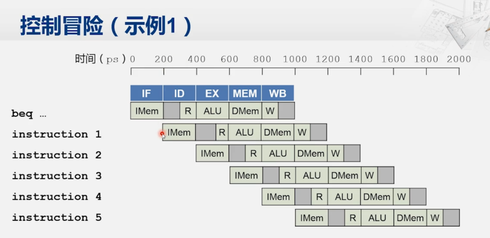

这段代码第一条指令是条件分支指令，后续跟了若干的指令.

要注意的是在第二个时钟周期，处理器就应该去取下一条指令了，但这个时候实际上并不知道是否真的会发生分支， 这条分支指令一直要到执行阶段结束，才能知道分支的条件是否成立，也就在 600ps 这个时候，而处理器希望在 200ps 的时候就去取下一条指令，这里就产生了控制冒险，因为这个区指定的动作如何进行应该由上一条地指令的运行结果来决定， 而上一条指令的运行结果至少要到两个时钟周期之后才能产生，那在还没有确定是否发生分支的情况下如何进行下一次的取值呢？

问题来源：尚未确定是否发生分支，如何进行下一次取指？

临时解决方案：流水线停顿(stall)，产生 2 个**空泡(bubble)**


需要插入两个空泡，那么在执行阶段结束之后，我们就知道要从哪个地方开始取新的指令了。

## 7.5 数据冒险的处理

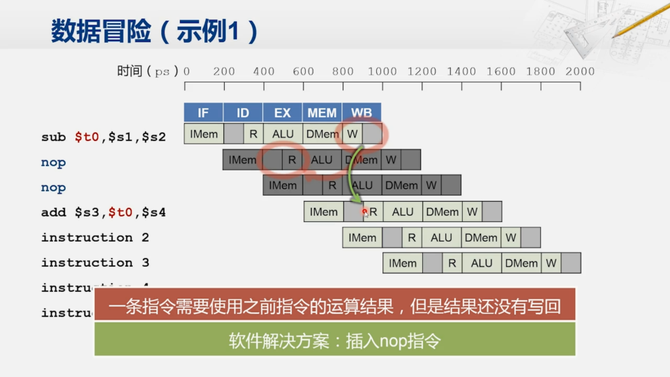

软件解决方案：插入一条 `nop` 指令，也即什么都不做，等待数据准备好。

但是这样并不能很好适配流水线架构更新的情况。当流水线级数增加，等待的周期数也需要同时增加。

硬件解决方案 1：执行流水线停顿（stall），产生空泡（bubble）。

检测数据冒险的方法：对比在 **译码阶段获得的需要读的寄存器的编号** 与后面各个阶段正在执行的指令是否要写某个寄存器，以及 **要写哪个寄存器**。

时间角度重新看这条指令，在 `sub` 指令执行完 ALU 计算后，其实已经可以开始执行 `add` 指令了，只是由于数据还没有写回，所以不能执行。

因此，我们得到：

硬件解决方案 2：**数据前递（Forwarding） / 旁路（Bypass）**

思想：把执行阶段的结果直接提前传递给需要的阶段，而不是等待写回阶段。


在 600ps 的时候，ALU 的输出结果已经是 t0 的值了， 那在 600ps 的这个时钟上沿过去之后，t0 的这个值会被保存到执行和访存之间的这个流水线寄存器当中去。 我们如果把它传递给 ALU 的输入，就可以正确的完成后面这条加法运算了。

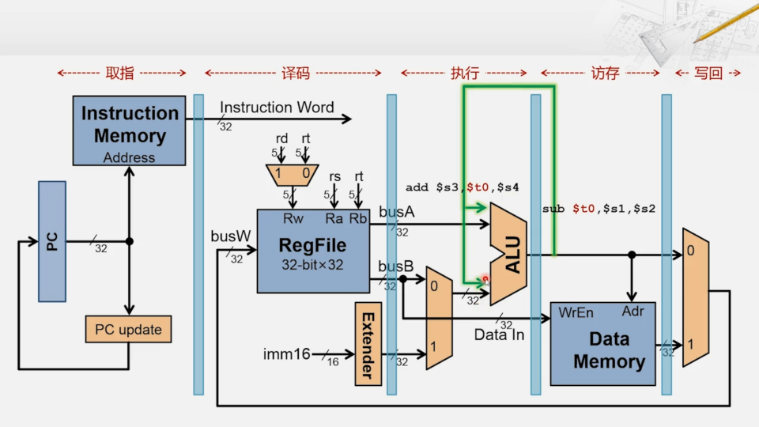

看一看硬件上怎么来修改。 这条减法指令在执行完运算以后，运算结果已经保存到了这个寄存器当中。 那现在，这条减法指令进入到访存阶段， t0 的值将会通过这个阶段传到下一级流水线寄存器。 而与此同时，加法指令正在执行阶段，它需要将 t0 寄存器的值送到 ALU 的一个输入端。 那显然，它的上一个阶段从寄存器堆当中读到的值，肯定不是最新的。

现在这个最新的值在访存阶段的连线上。 所以我们从硬件连线上可以把这个信号引回来，从新引到 ALU 的输入端。

**相当于绕过了寄存器堆，直接从执行阶段传递给需要的阶段。**


那我们进一步来看，其实不仅仅在这个点可以建立旁路，我们在下一个流水级也可以建立旁路。 那这条旁路在什么情况下会用上呢？我们还是结合一个例子来看。

这个例子前两条指令和刚才的那个例子是一样的， 在此基础上我们又写出了第三条指令， 这是一个与操作，那么它其中的一个原操作数也是 t0，那我们结合实践来看， 对于这条与操作指令，它真的要开始运算的时候，是在 800 ps 之后。那在这个时候，前面这条减法指令已经完成了访存阶段，所以 t0 寄存器的最新值，现在是放在访存阶段和写回阶段之间的流水线寄存器当中的， 那我们就需要用到刚才的结构图当中紫色的旁路的线， 用来将 t0 的内容传递到 ALU 到输入端，从而让这条与运算指令及时的运行。

### Load-Use 数据冒险


对于这一条 load 的指令，我们来看要保存到 t1 寄存器的值，究竟是什么时候才得到的，对于刚才的运算指令，需要写回寄存器的值，是在执行阶段，也就是通过 ALU 运算而得。 但是对于 load 的指令，用 ALU 是计算要访存的地址， 而要写回寄存器堆堆数，是在访存阶段的结束才会得到， 所以是在 1400ps 这个地方，我们才会得到 t1 寄存器的值。

而对于下面这一条或运算指令，我们最晚也得在 1200ps 这个地方， 得到 t1 这个寄存器的值，从而让 ALU 可以进行正确的运算。 因此，这就要求我们将 1400 ps 这个地方得到的数，传递到之前 1200 ps 这个时刻。

**那时光倒流的事情我们是做不到的。 所以我们只能让信号沿着时间轴向前传递，而绝不可能向后传递。**

因此，无论我们怎么修改电路，也无法构造出这样一条前递的通路。**我们只能让这条或运算指令多等一个周期**，这样它就可以在 1400ps 之后才需要这个 t1 寄存器的值。 而此时，load 的已经完成了从数据存储器当中取出数的操作， 这就可以通过刚才我们已经建立的第二组旁路通道，也就是用紫色的连线表达的这个旁路通道，将 t1 寄存器的内容传送到 ALU 的输入端口。 那当然，既然我们要让或运算指令延后一个周期，


定义：一条指令需要使用之前指令的访存结果（Load-Use Harzard） 。

此时，**数据前递 (Forwarding) 也无法解决**

这是因为 Load 必须在访存结束后才能得到结果，所以我们无法跨越时间提前传递数据。

因而，我们回退到之前的解决方法：流水线停顿（stall）+ 数据前递

这个解决方案没有让流水线获得最高的指令吞吐率，但是保证指令执行正确才是我们的首要目标。

## 7.6 控制冒险的处理

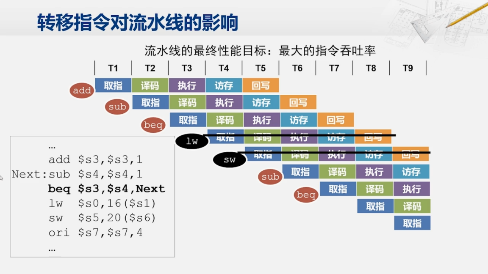

转移指令：改变指令流向，破坏流水模式

转移指令经常带来控制冒险，造成性能损失。因此，我们需要尽量减少转移指令的影响。

$$
\text{Pipeline stall cycles from branches} = \text{Branch Frequency} \times \text{Branch Penalty}
$$

当执行了转移指令，并确实发生转移时，产生如下的开销，称为 “转移开销”

1. 将按顺序预取的指令废除（即 “排空流水线”）
2. 从转移目标地址重新取指令

转移开销的构成：

1. “要不要转移？”：转移条件判定引起的开销
2. “转移到哪里？”：生成目标地址引起的开销

### 转移指令的分类

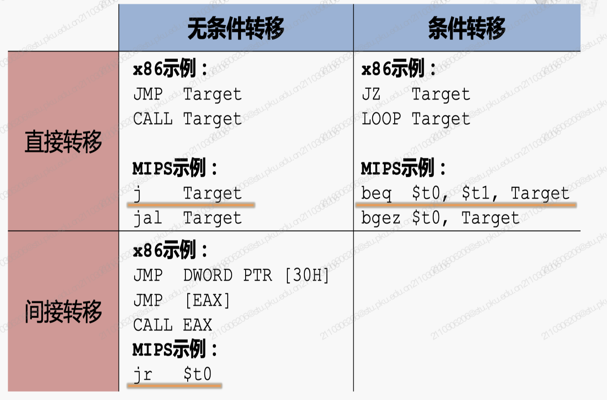

### 无条件转移

#### 直接转移

```asm
j target
```

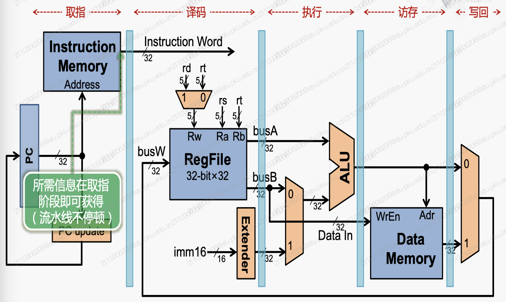

对这条 `j` 指令来说，它所需要的转移目标地址在取指阶段就可以获得， 流水线不用停顿。

#### 间接转移

```asm
jr $rs
```

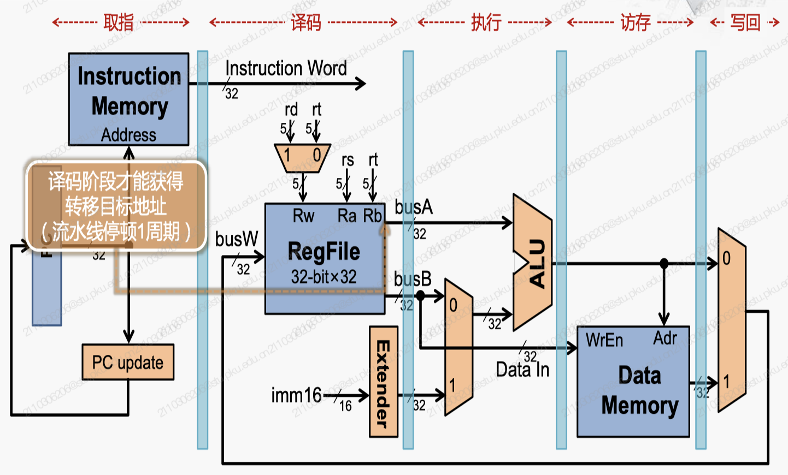

在取指阶段得到指令编码之后，并不能获得转移的目标地址， 因此取指部件至少要等待一个周期。

那当这条 JR 指令进入到译码阶段后，指令编码当中的 rs 域就会送到寄存器堆，然后得到对应的寄存器的内容， 那如果我们在这里把 busA 这个信号连接到 PC 的更新部件，那在 JR 这条指令的译码阶段结束的时候，转移的目标地址就可以送到 PC 寄存器的输入端了。

当下一个时钟上升沿来临的时候，这个地址就可以存到 PC 寄存器当中去， 然后在下一个时钟周期，送到指令存储器，**因此对于这条指令来说，因为我们在译码阶段才能获得转移目标地址，所以流水线需要停顿一个周期**。

### 条件转移

```asm
beq $rs, $rt, imm16
```

条件转移指令是一条 I 型指令，这条指令目标地址的计算方法是这样的，首先比较 rs 和 rt 所指向的寄存器的内容，如果它们相等，它们目标地址是在指令编码当中的 16 位立即数，进行符号扩展，然后乘以 4， 再加上当前 PC 的内容，再加 4， 而如果这两个寄存器的比较结果是不相等，那新的 PC 的值就只是当前 PC 值加 4， 那不管寄存器比较的结果是否相等，那这个新的 PC 的值都只跟当前的 PC 值和指令编码的内容相关，而这两项内容在取指阶段都是可以确定的。

所以这么看来，目标地址的生成不会造成流水线的停顿， 而问题在于，是否要转移，这个条件的判断， 我们还是结合结构图来看一看。

因为要判定转移是否成立，需要比较两个寄存器的内容， 而寄存器的内容，我们只能在译码阶段才能获得， 这样与刚才的间接转移类似，我们也得让流水线停顿一个周期，才可以获得这两个寄存器的内容。

但是与刚才间接指令不同的是，即使到译码阶段的结束，我们依然不能知道转移的条件是否成立， **因为我们还需要到执行阶段，将 ALU 来对这两个数进行比较，从而得到比较的结果**。 所以在这个结构下，我们需要让流水线 **停顿两个周期**，才能知道转移条件的判定结果.

其实要等到执行阶段结束，无非是要对两个 32 位数进行比较， **而比较两个数相等是一个非常简单的功能，不需要用到 ALU 这么复杂的部件**， 那我们就可以在译码阶段进行一些小的改造。 我们在寄存器堆的输出，busA 和 busB 这两个信号给它连接一个额外的比较电路， 这个电路是很简单的，速度也很快，不至于影响整个译码阶段的时间。

那我们把比较的结果再送到 PC 的更新部件，那这样在译码阶段结束的时候，我们就可以将下一条指令的地址送到 PC 寄存器了。 那经过这样的改动，条件转移指令也只需要让流水线 **停顿一个周期**， 就可以让指令正确地执行了。

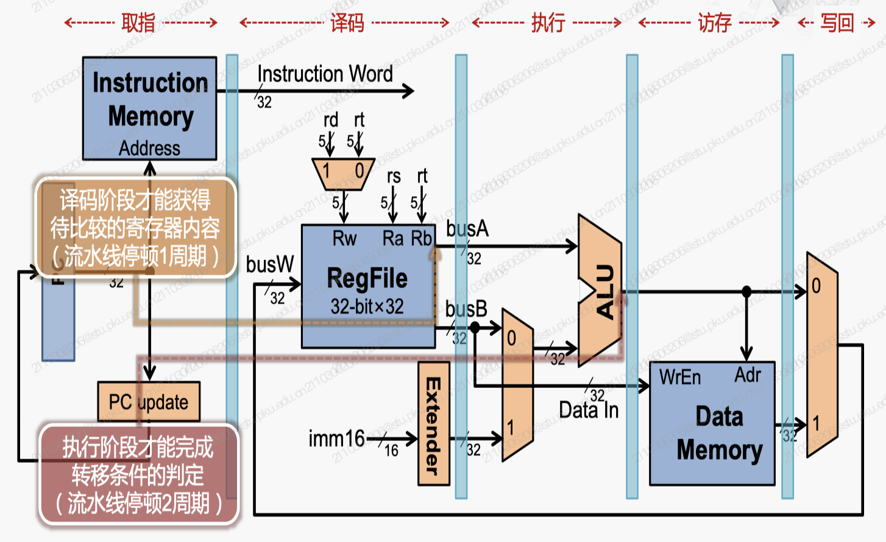

比较指令较为简单，不需要用到 ALU，直接在 busA busB **连接一个额外的比较电路**，这个电路是很简单的，速度也很快，不至于影响整个译码阶段的时间。

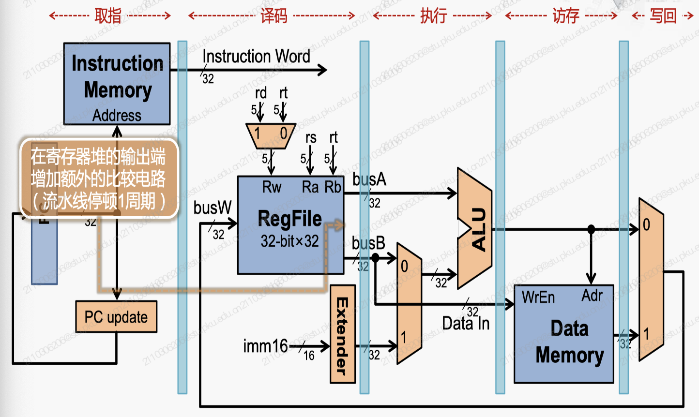

### 控制冒险的影响

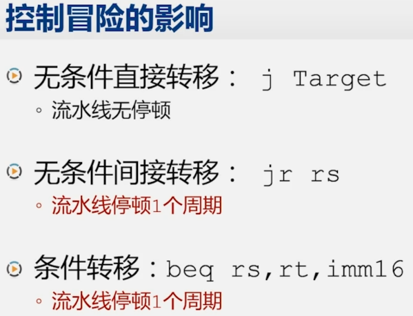

-   无条件直接转移：`j Target`，流水线无停顿
-   无条件间接转移：`jr rs`，流水线停顿 1 个周期
-   条件转移：`beq rs，rt，imm16`，流水线停顿 1 个周期

### 延迟转移技术

通过上面的分析，我们发现，不同的转移指令带来的控制冒险是不一样的， 经过我们的改进之后，无条件的直接转移可以让流水线不停顿的。 而无条件的间接转移以及条件转移都不得不让流水线停顿一个周期， 才能消除控制冒险的影响。

但是如果我们还想进一步地消除这个影响，不让流水线停顿，是否可以做到呢？

那我们就来介绍一个简单的方法，就是延迟转移技术.


我们结合这张代码来进行分析，这里有一条条件转移指令， 在它之前依次是减法、加法和异或指令， 那按照通常的规则，这些指令依次进入流水线执行，当执行到这条 beq 指令的时候， 如果 t1、t2 两个寄存器的内容相同，就会跳到 Next 所指向的地方， 在 beq 进入流水线之后，必须还需要再等一个周期，才能知道转移条件是否满足， 那流水线必须停顿一个周期，那我们现在就是想办法把这个浪费的周期重新利用起来。

既然我们从硬件上现在无法解决这个问题，那我们不妨就修改这指令行为的定义，**我们就规定，它之后的那条指令是一定会被执行的，如果是这样，流水线中就不会出现被浪费的那个周期了**。

但是我们还要注意，这样的修改不应该改变程序本来想要达到的结果， 所以我们就需要修改一下这段代码，我们要在这个 beq 指令之后填上一条一定会被执行的指令， 那我们只能往上走，但是之前的这条减法指令和加法指令，它们的运算结果正好是 beq 指令所要比较的这两个寄存器， 所以这条加法指令和减法指令必须在 beq 指令之前执行。

而我们再往上看，这条异或指令与我们的判定条件没有关系， **现在我们就把这条异或指令挪到 beq 指令之后**，因为我们现在已经修改了转移指令的定义，那我们在流水线的硬件结构上，就可以确定地将 beq 之后的这条指令进入流水线， 而当这条异或指令完成取指进入译码阶段的时候， 这条 beq 指令的条件判断也已经完成。 如果条件成立，这时候就可以从 Next 所指向的这个地方开始取下一条指令了， 否则也可以顺序地取下一条指令， 但不论是哪一种情况，流水线都不会发生停顿。

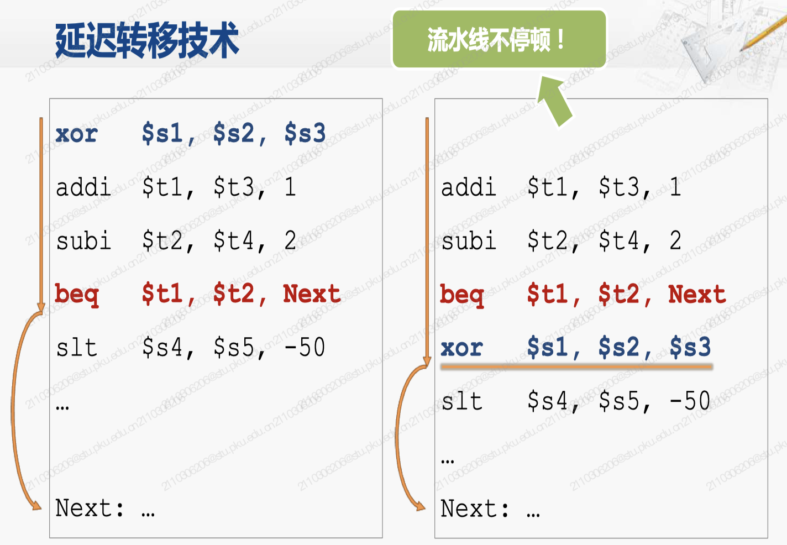
