# 存储层次结构

## 8.1 存储层次结构概况

传统的冯・诺依曼计算机结构中与存储功能相关的部件包括：

-   **存储器 M**：显而易见，它是主要的存储组件。
-   **外部记录介质 R**：也具备存储数据的功能。
-   **运算器 CA**：由于 CPU 中的通用寄存器包含在运算器内，它们用于存放临时数据，因此也可以视为一种存储器。

这些部件共同构成了存储层次结构。为了便于描述，我们将这些部件统称为 **存储器**。

### 计算机对存储器的需求

#### 非易失性 vs 易失性

-   **非易失性存储器**：保存程序和数据，在通电启动和断电后不丢失，如 BIOS 芯片和硬盘。

-   **易失性存储器**：信息在断电后丢失，如 CPU 中的通用寄存器。

#### 其他存储器特性

-   **可读写性**：存储器需支持读写操作，如硬盘和主存。BIOS 芯片理论上可写，但是很麻烦。

-   **随机访问**：存储器访问时间与数据位置无关，可以提高性能，如主存和 BIOS 芯片。硬盘因为物理实现是盘片，所以需要先 “旋转”，也就是顺序访问而非随机访问。

-   **速度**：存储器访问速度需快于硬盘，以避免阻碍 CPU 操作。

-   **其他**：考虑存储器性能、价格、容量、功耗等因素。

### CPU 和存储器的特性对比

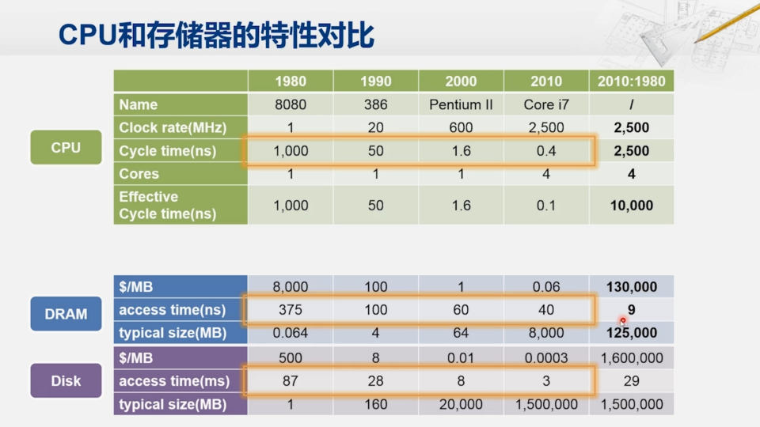

#### CPU 代表性发展

-   **80 年代代表：8080**

    -   时钟频率：约 1 MHz
    -   时钟周期：约 1000 纳秒

-   **90 年代代表：386**

    -   时钟周期：50 纳秒

-   **2000 年代代表：奔腾二**

    -   时钟周期：约 1.6 纳秒

-   **2010 年代代表：Core i7**
    -   时钟周期：约 0.4 纳秒
    -   核心数：四核

#### 外部存储器特性

##### 硬盘

**80 年代特性**：

-   访问时间：约 87 毫秒，注意是这里毫秒，CPU 是纳秒，之间差了 $10^6$ 倍
-   价格：每兆字节约 500 美元

**30 年来变化**：

-   访问速度提升：约 29 倍
-   价格变化：下降幅度超过 160 万倍

**容量变化**：上升幅度：约 150 万倍

其他：

-   **硬盘无法与 CPU 直接交互**
-   优势：容量大、价格低廉

##### 内存（DRAM）

**80 年代特性**：

-   访问时间：约 375 纳秒

**90 年代特性**：

-   访问时间：开始慢于 CPU

**2010 年代特性**：

-   单核 CPU 需求下访问时间：与 CPU 时钟周期相差约 100 倍
-   访问速度提升：约 9 倍
-   容量提升：约 12 万倍
-   价格：几乎同比例压缩

#### 总结

-   **CPU**：时钟频率不断提升，性能迅速增强
-   **外部存储器**：
    -   硬盘：容量与价格显著提升，但访问速度仍远远落后于 CPU
    -   内存（DRAM）：访问速度提升较慢，但容量大幅增加，价格下降显著

### 存储器性能的影响

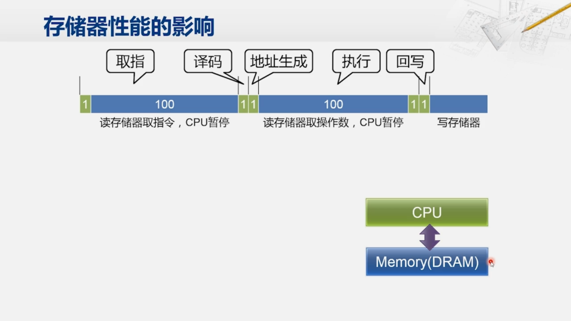

这里就可以看到实际上执行一条指令大约要花掉二百多个时钟周期， 而且 **绝大多数的时间都在等待存储器**。

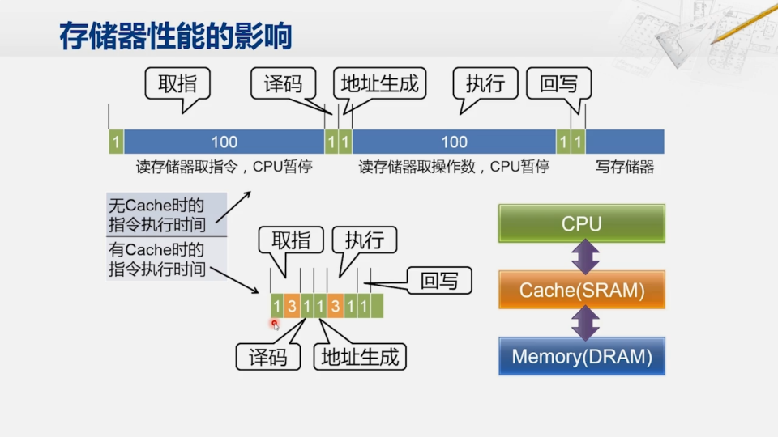

可以看到，通过添加 **高速缓存**，也即 Cache (SRAM)，可以大幅提升性能。

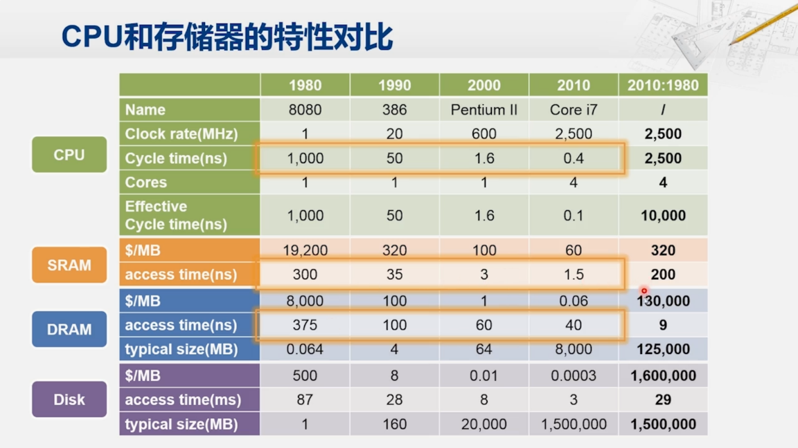

**为什么不用 SRAM 作为主存？**

SRAM 的相关参数：

-   **1980 年**：SRAM 的访问时间约为 **300 纳秒**，与 DRAM 的访问时间相近。
-   **性能提升**：过去 30 年间，SRAM 的访问速度提升了 **200 倍**，而 DRAM 只提升了 **9 倍**。
-   **与 CPU 时钟周期对比**：
    -   在很长一段时间里，SRAM 的访问时间与 CPU 时钟周期相当。
    -   在 **2010 年**，SRAM 的访问时间约为 CPU 时钟周期的 **3 到 4 倍**，可以通过流水线设计来解决差距。

从速度上看，SRAM 适合作为与 CPU 直接连接的存储器。

然而，我们还是不能用 SRAM 来完全取代 DRAM，因为在早期，SRAM 相较 DRAM，**价格太高**。

可是，当 DRAM 的访问速度严重拖慢了 CPU 的速度（上表 1980 → 1990），对使用 SRAM 作为 Cache 的需求就变得迫切了。

到了 486 的时候，就已经把 Cache 集成到了 CPU 芯片的内部， 从而缓解 CPU 和 DRAM 主存之间的日益显著的性能差距。

### 存储层次

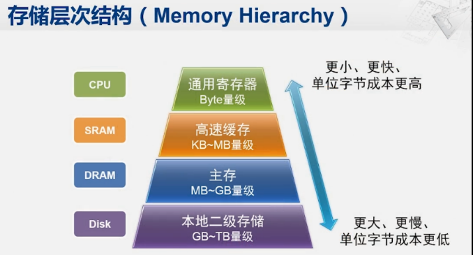

现代的计算机当中都采用了这样层次化的存储结构。 在这个层次结构中：

-   越往上的部件， 容量越小，但速度更快，而单位字节的成本更高
-   越靠下的部件，容量更大，但速度更慢，而单位字节的成本更低

## 8.2 DRAM 和 SRAM

### DRAM

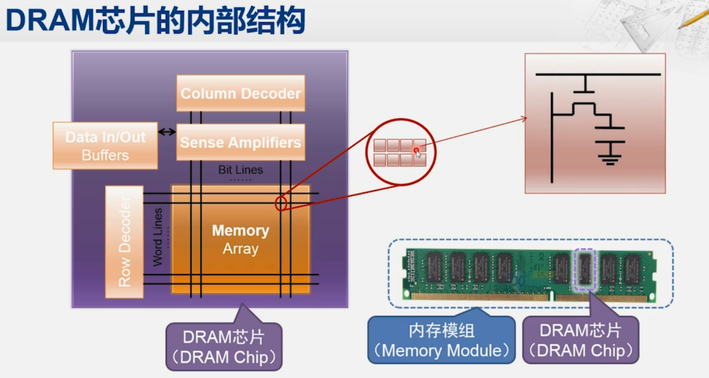

内存条应该叫内存模组，内存模组实际上由 **一块小电路板再加上若干的 DRAM 芯片** 构成，

#### DRAM 芯片

DRAM 芯片的核心是其存储阵列，该阵列由多行多列组成。通过提供行地址和列地址，可以选择特定的存储单元。每个存储单元通常包含多个比特，如 4 比特或 8 比特。

##### DRAM 基本存储单元

-   每个基本存储单元利用 **电容** 来存储一个比特信息。
-   DRAM 芯片中还包括地址译码逻辑，通过行地址和列地址生成选择信号，从而连接电容到外部的输入输出线。

##### 读写操作

-   **写入操作**：外部数据线驱动电容进行充电或放电，从而写入数据（1 或 0）。
-   **读取操作**：电容驱动外部数据信号线，完成数据读出（0 或 1）。

##### 刷新机制

-   由于电容的 **漏电效应**，存储在电容中的信息可能会随时间流失。
-   为保持数据正确性，需要定期 **刷新** 所有单元，补充或维持电容电荷状态。也即使得原先表示逻辑 “1” 电容上的电荷得到补充，而原来表示逻辑 “0” 的电容仍保持无电荷状态。

#### DRAM 类型及其发展

-   DRAM 被广泛用作 PC 机的主存储器（内存）。
-   **SDRAM** （同步 DRAM，Sync DRAM）在基本结构上增加了时钟同步，提高读写效率。
-   常用的内存技术包括 DDR1, DDR2, DDR3, DDR4 等，这些都是在 SDRAM 基础上的改进和升级。

#### DRAM 的优势和限制

-   **优势**：高集成度，低功耗，低成本，大容量。
-   **限制**：基于电容充放电的存储方式导致读写速度较慢，且需定时刷新，影响性能。

### SRAM

SRAM 单元主要由六个晶体管（$M_1, M_2, \cdots, M_6$）组成，这六个晶体管合在一起才可以保存一个比特。与 DRAM 相比，SRAM 的结构更为复杂。

#### 基本接口信号

-   $BL$ 和 $\overline{BL}$：用于传输读写数据。
-   $WL$：控制外部访问存储单元。

#### 写入过程分析

以下描述写入 1 的过程。对于写入 0 的过程，取反 $BL$、$\overline{BL}$。

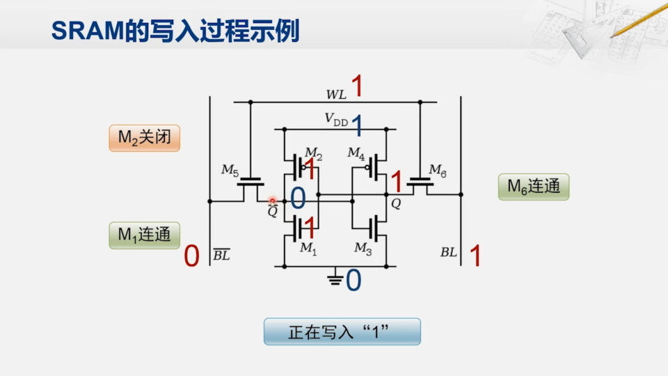

1. **设置信号值**：

    - 将 $BL$ 设为 1。
    - 将 $\overline{BL}$ 设为 0。

2. **激活写入**：

    - $WL$ 信号设为 1，激活 $M_5$ 和 $M_6$。
    - 通过 $M_6$（NMOS，连接时导通），$BL$ 信号的值传递到 $M_2$ 和 $M_1$​，均为 1
    - 通过 $M_5$（PMOS，连接时导通），$BL$ 信号的值传递到 $M_4$ 和 $M_3$，均为 0

3. **信号传递**：

    - $M_2$（PMOS，高电平时关闭），阻断电源信号，$M_1$ 开启，保持 $\overline{Q}$​ 信号为 0。
    - $M_4$（PMOS，低电平时开启），接通电源信号，$M_3$ 关闭，保持 $Q$​ 信号为 1。

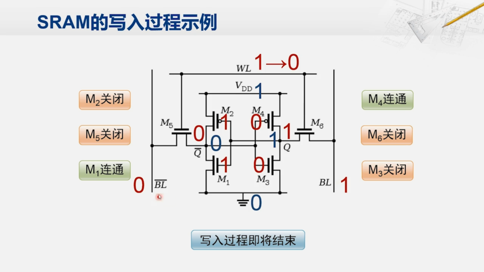

1. **稳定保存数据**：
    - 关闭 $M_5$ 和 $M_6$，撤销 $BL$ 和 $\overline{BL}$ 信号。
    - 通过 $M_1,\cdots,M_4$​ 的互锁，保存当前状态。
    - 一旦断电，则失去信息（$V_{DD}$ 没了）

#### 读出过程分析

在存储单元保持上述状态的情况下：

-   通过激活 $WL$ 信号和 $M_5$, $M_6$ 的连通状态，可以直接从单元读取数据。
-   $\overline{BL}$ 被驱动为 0，$BL$ 为 1，从而读出数据。

#### 存储矩阵与控制机制

将多个 SRAM 单元组合，形成存储矩阵。通过地址线和相应的驱动电路，可以灵活地控制每个存储单元。

设计比较灵活，一个地址所对应的存储单元的数量不固定。

#### SRAM 的优势和限制

-   **优点**：因为 **晶体管的开关速度远比电容充放电的速度要快**，SRAM 的开关速度快，适合 **高速操作**。
-   **缺点**：
    -   多晶体管结构导致芯片面积大，集成度低，**成本高**。
    -   功耗高，由于晶体管数量众多。

### DRAM vs SRAM

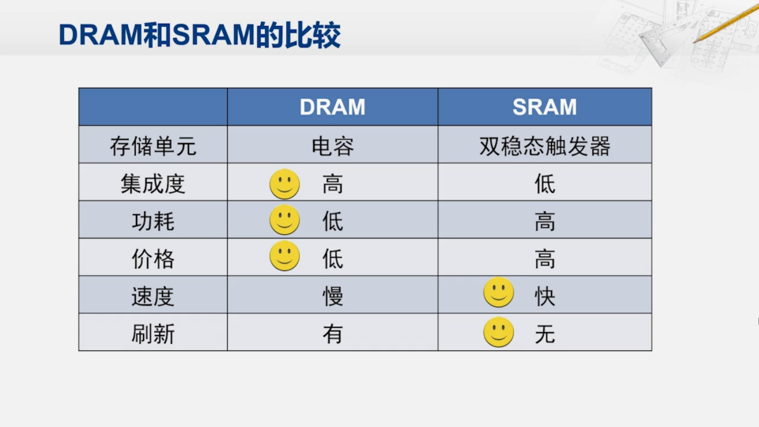

## 8.3 主存的工作原理

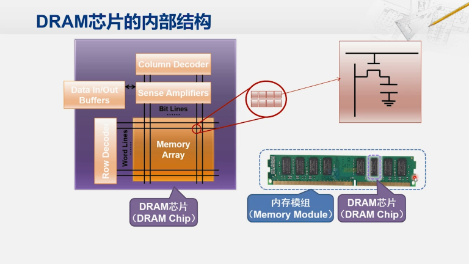

正如之前所述，一般都是由若干个 DRAM 芯片构成了计算机的主存储器，也被称为内存。

内存由多个 DRAM 芯片组成，而 DRAM 芯片以一个存储阵列为核心，存储阵列由多个存储单元组成。存储单元通过唯一的行列地址进行指定，每个存储单元包含多个比特。

### 内存的访问过程

CPU 发送行列地址至 DRAM 芯片们，从外部给入了行地址和列地址之后，这些地址会同时送到每一个 DRAM 芯片， 从而在每个 DRAM 芯片当中选中对应的一个存储单元。 如果每个 DRAM 芯片送出 8 个比特，一共 8 个 DRAM 芯片，那它就可以向外同时送出 64 个比特。

### SDRAM 内存的访问过程

物理构造：CPU - BUS - 内存控制器 - BUS - 内存芯片

1. **地址发出**：申请系统总线，获得总线控制权后会将地址发到内存控制器中，此时尚未分解地址
2. **地址分解**：内存控制器会将这个地址进行 **分解**，形成 **行地址和列地址等多个部分**。然后内存控制器就会向 DRAM 芯片发起访存操作。
3. **预充电**：**可选步骤**，根据需要执行，以准备行访问。
4. **行访问 / 激活**：通过存储总线，行译码器接收行地址，激活对应存储阵列行。这 **一行当中的所有的存储单元** 的信号都会被经过放大之后放入到一个 **缓冲区** 当中。
5. **列访问**：列译码器处理列地址，选择并 **读取缓冲区** 中的数据。

#### 可选的预充电步骤

预充电步骤存在两个策略：

1.  等到新的传输开始，如果发现要访问的数据不在已经被激活的这一行，那时再进行预充电
2.  在一次传输结束后就进行预充电。 这样在下一次的传输是同一行的概率不高的情况下，反而会获得更好的性能。

### 存储访问时序与性能参数

根据 PC133 标准：

-   **tRCD** （Row to Column Delay，行选到列选的延迟）：2~3 个时钟周期，一般为 15 到 23 ns。
-   **CL** （CAS Latency，从列选到数据输出的延迟）：与 tRCD 不同，指定 **时钟周期数** 的延迟，通常为 2 到 3 个周期，约 15 到 23 ns。
-   **tRP** （Row Precharge Time，行预充电（关闭行）的延迟时间）：从内存控制器发出预充电的命令到 DRAM 芯片可以接收下一次行地址，同样在 15 到 23 ns 范围内。

### 典型的 SDRAM 访问过程

以 PC133 标准的 SDRAM 为例，一个完整的读操作包括行地址发出后的等待（tRCD），列地址处理（CL 延迟），数据输出和预充电指令的发送，整个过程大约需要 90 纳秒。

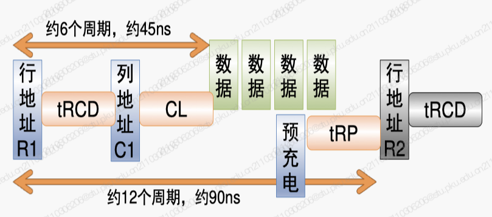

## 主存技术的发展

### SDRAM 和 DDR 内存的区别

-   **SDRAM**：全称为同步动态随机存取存储器。
-   **DDR SDRAM**：是 SDRAM 的一种，采用双倍数据率（Double Data Rate，DDR）接口。
    -   **SDR SDRAM**：单数据率，只在时钟的上升沿传输数据，如 PC66。
    -   **DDR SDRAM**：双倍数据率，时钟的上升沿和下降沿都传输数据。从 DDR1 到 DDR4 等，如 DDR3-1600。后面的 1600 指示了内存接口的等效时钟频率。

### 内存的性能指标

-   **传输带宽**：例如，DDR3-1600 的传输带宽为 12.8GB/s。
-   **访存带宽**：每个时钟周期可以读出的数据量，例如，DDR-200 的访存带宽为 1.6GB/s。
-   **访存延迟**：CPU 发出指令到读出第一个数据的时间，例如，DDR-200 为 40ns，比 PC133 慢 10ns。

对于 DDR SDRAM，有：
$$
接口频率 = \frac{峰值带宽}{数据宽度 \times 数据预取数 \times 2}
$$

### 内存性能的提升

-   **SDR 时代的限制**：难以减少电容的充放电时间，限制了时钟频率的提升。
-   **DDR 的性能提升**：
    -   利用双倍数据率，即在时钟的上升沿和下降沿都传输数据。
    -   但是，访存延迟的改善有限。

### DDR2 与 DDR3 的进步

-   **DDR2**：增加了预取数据的数量，例如 DDR2-400 预取四个数据，接口时钟频率提升到 200MHz。
-   **DDR3**：继续沿用 DDR2 的策略，进一步提升核心频率和数据预取量。

### 访存延迟与带宽的权衡

-   内存的发展 **以牺牲访存延迟为代价，提高访存带宽**。
-   访存带宽提升明显，但访存延迟的优化幅度有限。

### 总结

-   尽管内存的传输带宽显著提升，但从 CPU 的视角看，访存延迟的改善有限。
-   内存性能的提升并未能有效缩小与 CPU 性能的差距，反映出内存技术发展的瓶颈。

## 高速缓存的工作原理

### Cache 的空间局部性利用

Cache 通过 **预取主存中与所需数据位置相邻的数据块** 来利用空间局部性。这样当 CPU 再次请求相邻数据时，由于数据已在 Cache 中，可以快速返回，从而提升访存性能。

### Cache 的时间局部性利用

当数据块已在 Cache 中时，如果 CPU 需要重新访问之前的数据，Cache 可以 **快速提供**，这显示了对时间局部性的利用。

### Cache 的访问过程

1. **CPU 请求数据**：CPU 发出请求直接发给 Cache。
2. **检查数据是否在 Cache 中**：
    - **Cache 命中**：如果数据存在于 Cache 中，直接从 Cache 取出数据返回给 CPU。
    - **Cache 失效**：如果数据不在 Cache 中，则需要向主存发起读请求。
        - Cache 发出读请求至主存，等待主存返回数据。
        - 主存返回包含请求数据的整个数据块后，Cache 更新内部内容并将所需数据返回给 CPU。

**注意**：这些操作都是由硬件自动完成的，对于软件编程人员而言，他们只需关注主存地址的访问，而无需知道数据实际存放的位置（主存或 Cache）。

### Cache 组织结构示例

**Cache** 是由一块 **SRAM** 和配套的控制逻辑电路组成。下面是对 Cache 内部组织的描述。

SRAM 的组织形式：

-   分为多行，示例中有 **16 行**。
-   每行包含：
    -   **一个有效位**：表示该行是否存有数据。
    -   **若干个标签位**：用于标识数据。
    -   **数据块**：用来存放从内存取回来的数据，示例中每个数据块是 **16 个字节**。

### Cache 读操作的情况

对于一个十六进制地址 `4869H`：

-   最低一个十六进制位，`9`，指示在数据块中的偏移
-   次低十六进制位，`6`，指示表项
-   再往上几个十六进制位，`48` 指示标签 tag

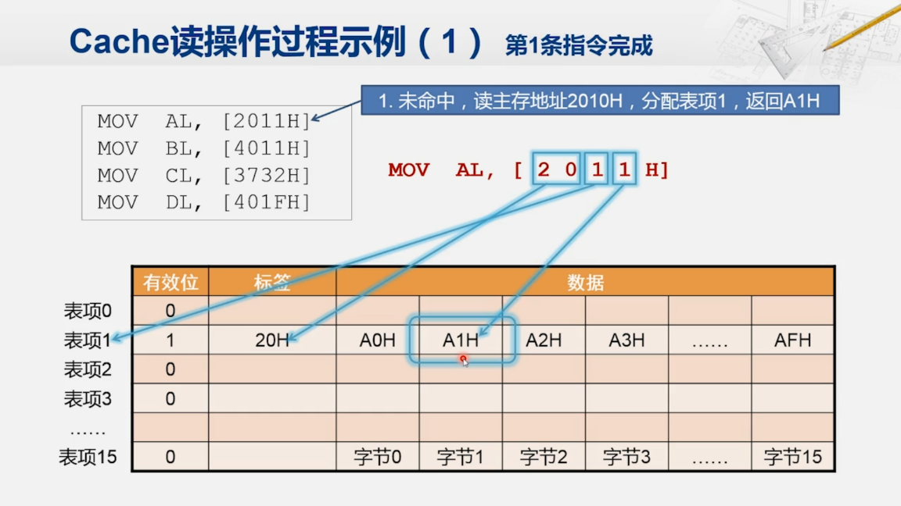

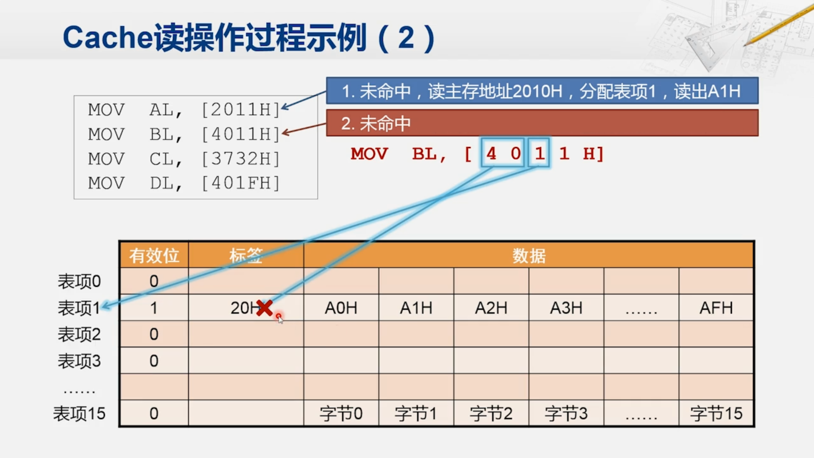

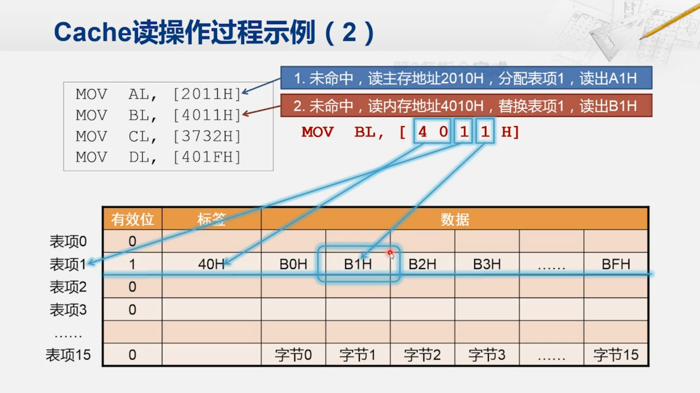

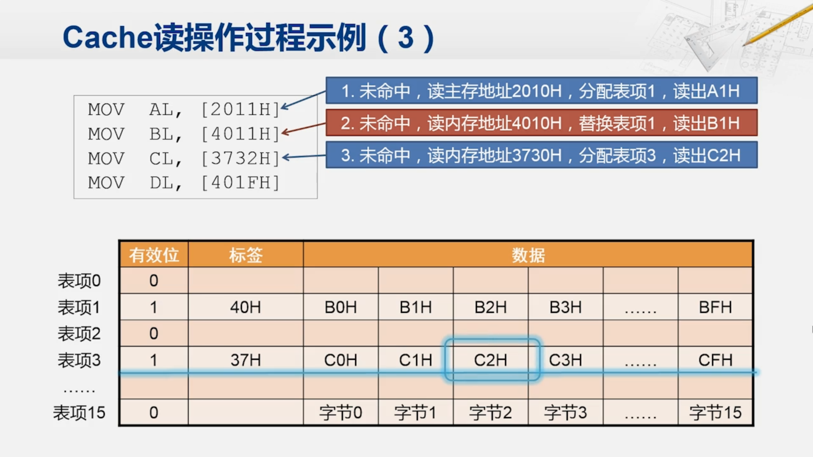

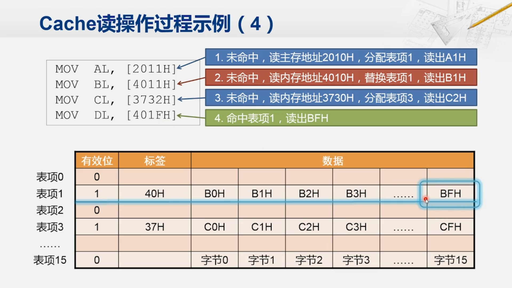

#### 读操作总结

在 Cache 读操作中，我们可以遇到几种典型的情况：

-   **没有命中且表项为空**：从主存中读取数据块，更新 Cache 表项。
-   **没有命中但表项已被占用**：根据替换策略，选择替换的表项，更新 Cache 表项。
-   **命中了的情况**：直接从 Cache 中读取数据块。不访问主存

### Cache 写操作的情况

当 CPU 要写数据时，也会先送到 Cache。根据是否命中，可以采取以下策略：

#### 如果 Cache 命中

-   **写穿透 / 直写（Write Through）**：数据同时写入 Cache 和主存，保持一致性，但效率较低。
-   **写返回 / 回写（Write Back）**：数据只写入 Cache，当被替换时才写回主存，提高效率但增加 Cache 复杂性。

#### 如果 Cache 失效

-   **写不分配（Write No Allocate）**：直接将数据写入主存，实现简单但性能较差。
-   **写分配（Write Allocate）**：先将数据块读入 Cache，再写入 Cache，初次操作较慢但可提升后续访存性能。

#### 现代 Cache 设计策略

-   **简单系统**：通常使用 **写穿透** 和 **写不分配** 策略，简化设计但性能一般。
-   **性能优先的系统**：倾向于使用 **写返回** 和 **写分配** 组合策略，以优化性能。

以上策略的选择和实施均基于对 Cache 表项的查找、分配和替换机制，这些机制与读操作中的处理相同。

## 高速缓存的组织结构

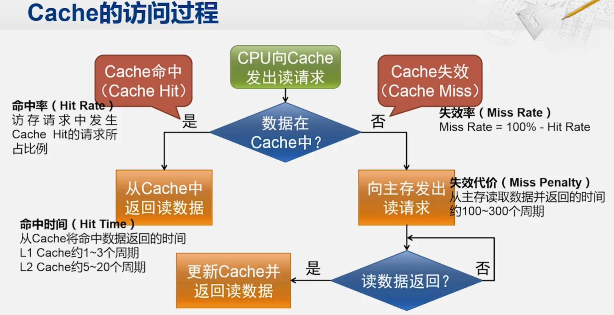

高速缓存（Cache）的设计对于计算机系统性能有着重要影响。缓存的组相联（Set-Associativity）是缓存设计中的一个关键概念，它决定了缓存中数据的组织和查找方式。

### 不命中

1. **冷不命中（Cold Miss）**：这种情况发生在缓存刚刚被初始化或者特定数据第一次被请求时。由于数据之前从未被加载到缓存中，所以当尝试访问这个数据时，缓存中找不到，这就是所谓的"冷不命中"。它是不可避免的，因为任何数据在第一次被访问时都不会在缓存中。
2. **容量不命中（Capacity Miss）**：当请求的数据总量超过了缓存的存储容量时，即使采用了最佳的替换策略，一些数据仍然无法保留在缓存中，这时发生的不命中被称为"容量不命中"。它是由缓存空间有限导致的，增加缓存大小是减少容量不命中的直接方法。
3. **冲突不命中（Conflict Miss）**：在使用有限大小的缓存时，可能会出现两个或多个不同的数据请求映射到缓存的同一位置的情况，这就是缓存冲突。当这种情况发生时，一个数据项可能会覆盖另一个已经存在于缓存位置的数据项，导致当尝试访问被覆盖的数据时发生"冲突不命中"。通过增加缓存的大小或使用更好的映射策略可以减少冲突不命中。

### 组相联

#### 单组相联（Direct-Mapped）

-   **原因**: 为了简化缓存的设计和降低成本。
-   **特点**: **每个缓存块只能映射到一个特定的缓存位置**。
-   **规律**: 缓存地址被分为标签（Tag）、索引（Index）和块偏移（Block Offset）三部分。
-   **电路复杂度**: 较低。因为每个缓存位置只需要与一个标签比较器配合。
-   **问题**：容易出现缓存冲突（Cache Conflict），降低缓存命中率。

#### 二路组相联（2-way Set-Associative）、四路组相联（4-way Set-Associative）

-   **原因**: 为了减少缓存冲突（Collision），提高缓存命中率。
-   **特点**: **每个索引位置有多个缓存块，任何数据可以映射到这多个位置中的任意一个**。
-   **规律**: 缓存地址的索引部分决定了一组可能的缓存位置，数据可以存储在这组位置的任意一个上。
-   **电路复杂度**: 中等。相对于单组相联，需要更多的标签比较器。

#### 全相联（Fully Associative）

-   **原因**: 最大程度减少缓存冲突，提供最高的缓存命中率。
-   **特点**: **每个缓存块可以存储在缓存中的任何位置**。
-   **规律**: 没有索引部分，每次缓存访问都需要与所有缓存块的标签进行比较。
-   **电路复杂度**: 最高。需要为缓存中的每个块提供一个标签比较器。

### 总结

从单组相联到全相联，随着组相联度的增加，缓存的灵活性和命中率提高，但同时也增加了电路复杂度和成本。设计者需要根据具体的应用场景和性能需求，在缓存命中率和硬件复杂度之间做出权衡。

## 存储容量的计算

在计算机领域，**内部存储器** 与 **外部存储器** 的容量计算方法存在差异：

### 内部存储器

-   采用 **二进制** 计数系统（1024 为底），主要由于 CPU 的运算器采用二进制计算方式。
-   例如：15 位地址可以表示 $2^{15}$​ 个字节。
-   实例：高速缓存、内存

### 外部存储器

-   采用 **十进制** 计数系统，遵循国际单位制（SI）标准。
-   例如：100 兆 bps 的以太网传输率指每秒传输 100 兆个比特（1000 的二次方）。
-   实例：U 盘、硬盘

### 历史标准与现实应用

-   美国国家标准协会和 IEEE 在 1968 年定义了 `K` 和 `M` 的使用：
    -   `K` 可以表示 1000 或 $2^{10}$（1024）。
    -   `M` 同样有两种定义。
-   实际应用中，内外存储继续使用不同的计量方法。

### 二进制单位前缀的标准化

-   由 ISO 和 IEC 制定新标准，明确二进制单位前缀：
    -   `Ki` 代表 1024
    -   `Mi` 代表 1024 的平方
    -   `Gi` 代表 1024 的三次方
-   标准化后，如 500GB 硬盘对应计算机内存为 466GiB，512MB 内存应标为 512MiB，以减少混淆。
