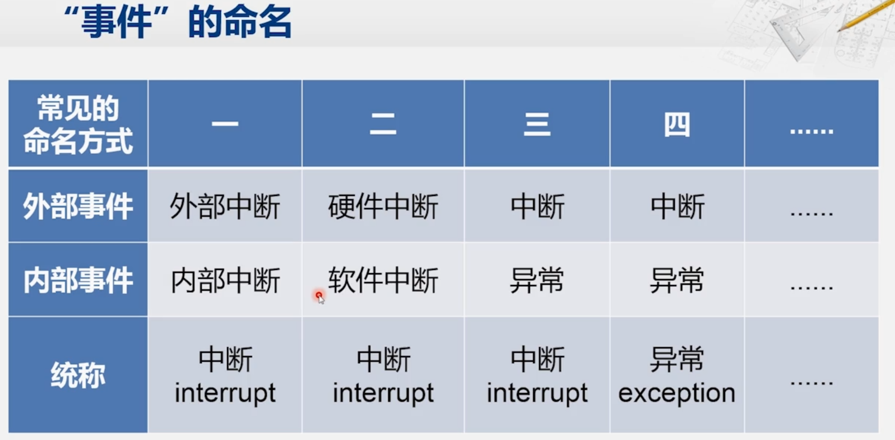
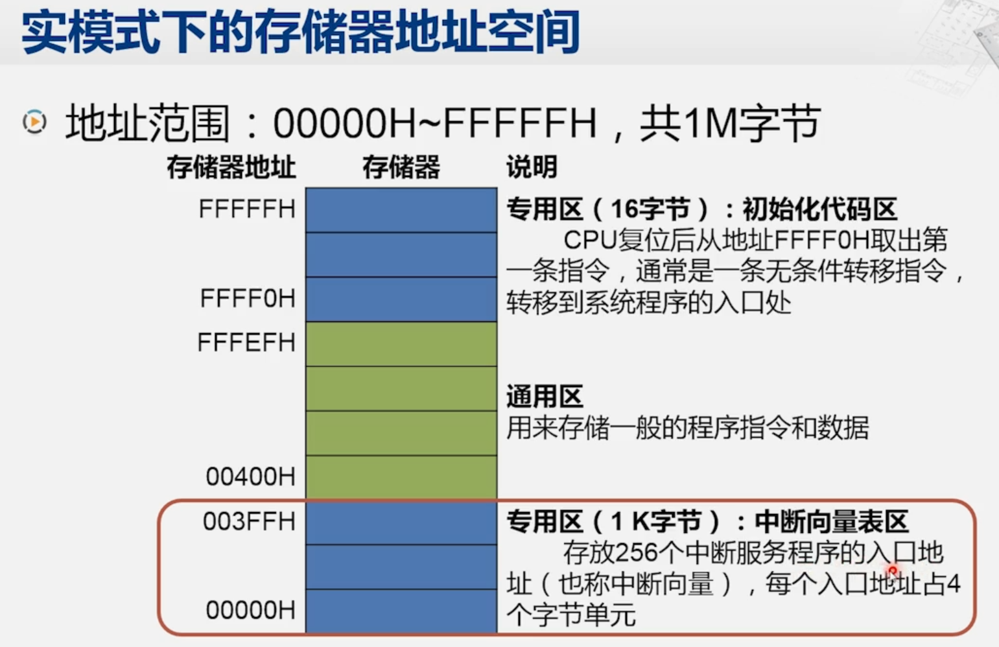
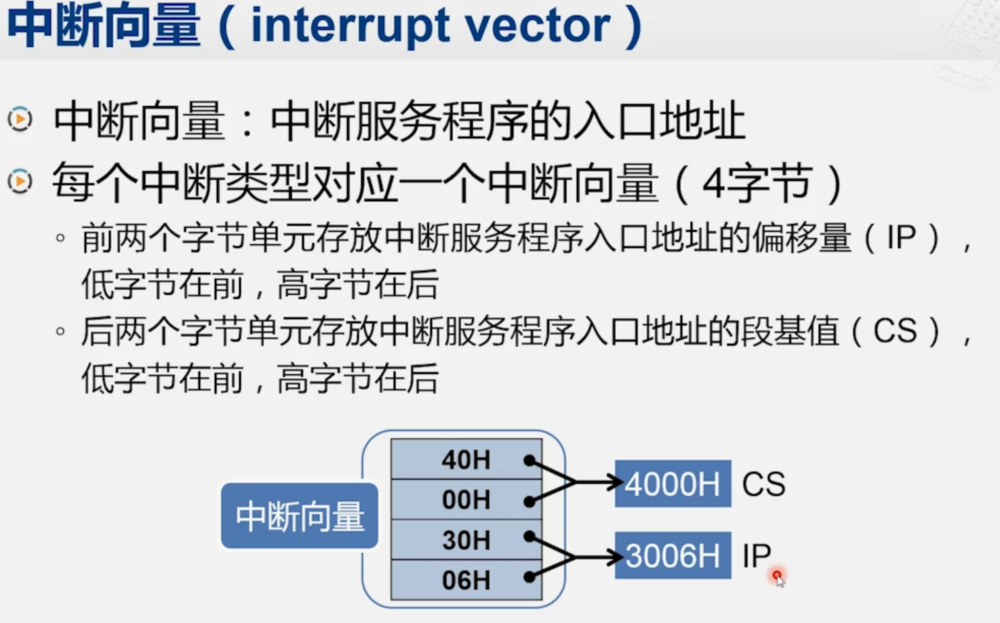
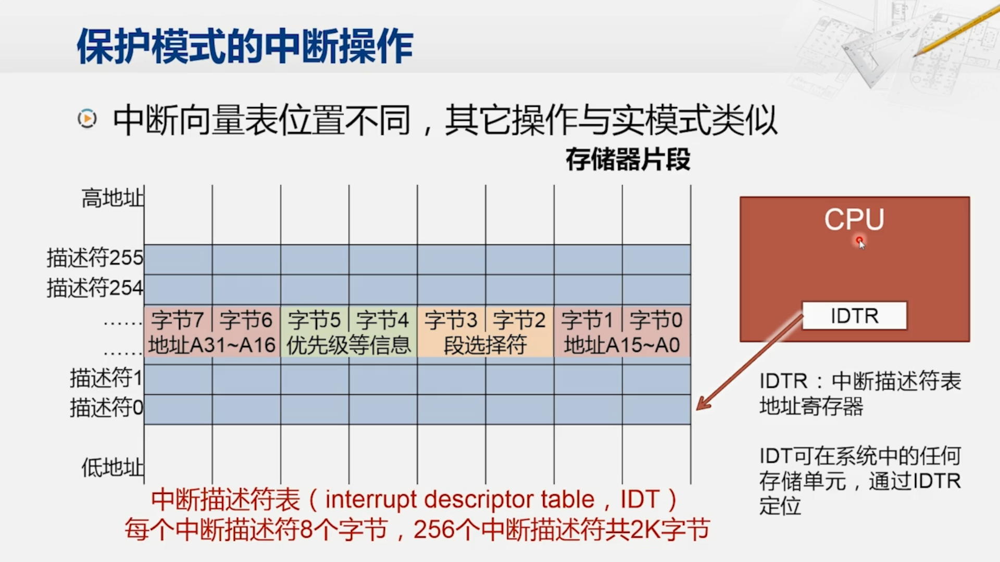
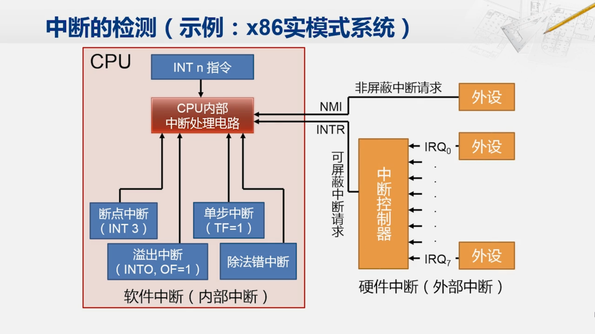
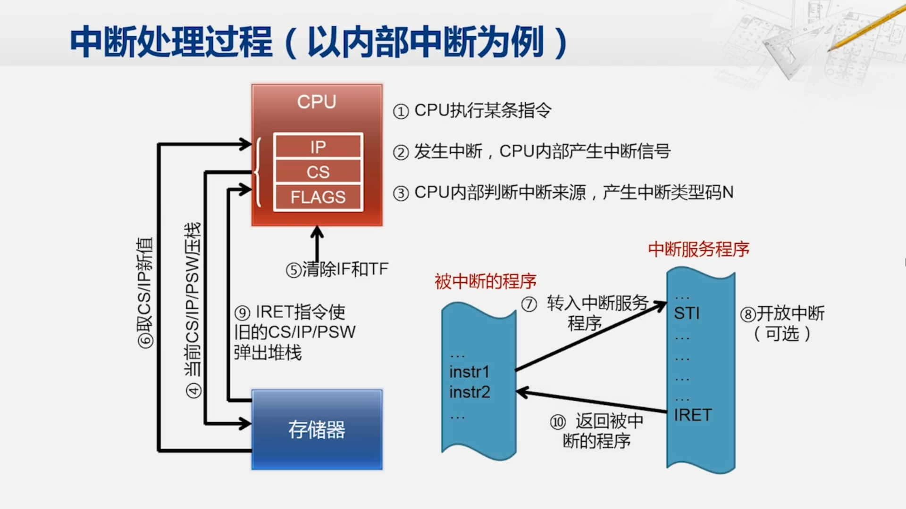
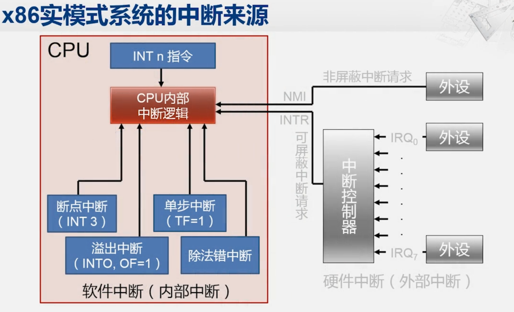

# 第九章 - 中断和异常

## 9.1 中断和异常的来源

第一个带有异常处理的系统：UNIVAC， 1951 年

算术运算溢出时：转向地址 0 执行两条修复指令，或者停机。可以通过修改地址 0 的内容来改变处理方式。后来 UNIVAC 也增加了对外部中断的处理。输入输出也需要中断现有程序的运行（外部中断）。

第一个带有外部中断的系统：DYSEAC，1954 年 

有两个程序计数器（PC），根据外部输入输出设备（I/O）的信号，可以在这两个程序计数器之间进行切换， 这样它就可以交叉执行两端不同的程序。

### CPU 遇到的事件

1. 在程序运行时，系统外部、内部或现行程序本身出现需要特殊处理的 “事件”
2. CPU 立即强行中止现行程序的运行，改变机器的工作状态并启动相应的程序来处理这些 “事件”
3. 处理完成后，CPU 恢复原来的程序运行

### 事件的命名

本课程中主要采用：外部中断 / 内部中断，统称为中断

### 中断向量表的结构

UNIVAC 对异常处理的方式：修改地址 0 的内容，这并不够用，因为随着异常的增多，需要处理的异常情况也会增多，而且需要根据异常情况的不同区执行不同的异常处理指令，这时候就需要中断向量表。

在 8086 中，存储器中保留两个专用区域：

-   中断向量表区：00000H~003FFH （地址最低的 1KB）
-   初始化程序区：FFFF0H~FFFFFH （地址最高的 16B）

可以看到，整个地址范围从 00000H 到 FFFFFH 共计 1MB，其中：

-   专用区（初始化程序区）：占用了 FFFF0H 到 FFFFFH，CPU 复位后从地址 FFFF0H 取出第一条指令，通常是一条无条件转移指令， 转移到系统程序的入口处
-   通用区：占用了 00400H 到 FFFEFH，用来存储一般的程序指令和数据。**中断处理的程序储存在这个区域中**
-   专用区（中断向量表区）：占用了 00000H 到 003FFH，存放了 256 个中断处理程序的入口地址（也称中断向量），每个入口地址占用 4B，即 1KB

## 9.2 中断向量（Interrupt Vector）

每个中断类型对应一个中断向量，其一共有 4 个字节：

-   前（低）两个字节：存放中断服务程序入口的偏移量（IP），低字节在前，高字节在后（小端法）
-   后（高）两个字节：存放中断服务程序入口的段地址（CS）

CPU 使用段加偏移来根据上述的逻辑地址产生物理地址（`CS<<4 + IP`），然后访问中断服务程序。`:` 不代表地址的分隔，只是为了区分段地址和偏移地址。

**中断服务程序** 在内存当中的存放顺序并没有要求，但是中断向量表中的 **中断向量** 的顺序是固定的。

对于 8086 的中断向量表 CPU 已经固定使用了前五个类型的中断。 那具体的功能我们后面会再介绍， 那之后的 27 个中断也是保留给后续的 CPU 使用的。 而除了前 32 个中断，之后的 224 个的中断则是交给使用 CPU 的用户自行定义。

## 9.3 中断向量表的发展

8086 只有前 5 个类型的中断，但是保留了 32 个中断向量，后面的 27 个中断是保留给后续的 CPU 使用的。

实模式下，可以认为个人计算机是一个非常快的 8086。因此当 CPU 复位之后，也会去 1MB 地址空间的最高的 16 个 Byte 的位置去取第一条指令。

这个地址会被南北桥芯片组引导到 BIOS 芯片。CPU 执行 BIOS 芯片当中的指令，对主板上的各个设备进行基本的配置。 **其中一项工作，就是在组成地址 0 的地方构建出中断向量表。同时准备好对应的中断服务程序**

IA-32 及以后，在保护模式中，段基址存储在描述符中，使用描述符表来索引。16 位的 CS 寄存器的寻址范围是 $2^{16} = 64 \text{KB}$，恰好能索引 8192 个 8B 的描述符，每个描述符对应一个段。

然而，描述符表的起始位置并不是 0，而是由 GDTR 寄存器指定的位置（在实模式中填写他的值）。因而，可以使用 `GDTR + CS` 来获取段描述符的地址，然后提取出段基址。

与实模式不同，中断向量表改称为了中断描述符表（IDT），它的起始地址也不再是 0，而是由 IDTR 寄存器指定的，IDT 中的每个描述符对应一个中断向量，总共有 256 个描述符。IDT 中的每个描述符是 8B，其中包含了中断服务程序的段选择符（会放入 CS 寄存器）和偏移量（会放入 EIP 寄存器）。

所以，陷入中断时，CPU 将中断类型号乘以 8 再加上 IDTR 计存器中的内容，得到中断描述符的地址，然后获取中断描述符中的段选择符和偏移量。这里的段选择符会进一步用于索引 GDT，获取段基址。最后，CPU 将段基址和偏移量组合成线性地址，跳转到中断服务程序。

## 9.4 中断的处理过程

### 中断的检测

同时检测内部中断和外部中断。

### 中断处理过程

1. **关中断**：CPU 关闭中断响应，即不再接受其它外部中断请求（注意内部中断请求不受影响）
2. **保存断点**：将发生中断处的指令地址压入堆栈，以使中断处理完后能正确地返回。具体保存发生中断的这条指令的地址，还是发生中断的这条指令之后的一条指令的地址，和这个中断具体的类型会有关系。
3. **识别中断源**：CPU 识别中断的来源，确定中断类型号，从而找到相应的中断服务程序的入口地址
4. **保护现场**：在处理中断时，要将发生中断处的有关寄存器（中断服务程序中要使用的寄存器）以及标志寄存器的内容压入堆栈，以便中断服务程序执行完毕后能恢复现场（也即弹栈）
5. **执行中断服务程序**：转到中断服务程序入口开始执行，可在适当时刻重新开放中断，以便允许响应较高优先级的外部中断
6. **恢复现场并返回**：把 “保护现场” 时压入堆栈的信息弹回原寄存器，然后执行中断返回指令，从而返回主程序继续运行

如何在中断服务程序当中，重新开放中断呢？

### 中断（使能）标志 (IF, Interrupt Flag)

IF 控制对可屏蔽中断的响应：

-   若 IF=1，则允许 CPU 响应可屏蔽中断请求
-   若 IF=0，则不允许 CPU 响应可屏蔽中断请求

> 可屏蔽中断请求：可以通过软件屏蔽的中断请求，即通过修改 IF 标志位来控制 CPU 是否响应可屏蔽中断请求

可以用指令设置 IF 标志位：

-   `STI`：把中断标志 IF 置 1
-   `CLI`：把中断标志 IF 清 0

**IF 指令对非屏蔽中断和内部中断都是不起作用的。**

### 从中断服务程序中返回：IRET 指令

-   该指令在中断服务程序结束时使用
-   通过从栈中弹出 3 个字，恢复之前保存的 IP、CS 和 FLAGS 寄存器值，使程序返回到中断前的运行状态

扩展：

-   `IRETD`：用于 32 位操作系统中，恢复 EIP、CS 和 EFLAGS 寄存器
-   `IRETQ`：用于 64 位操作系统中，恢复 RIP、CS 和 RFLAGS 寄存器

## 9.5 内部中断分类说明

### 类型 0：除法错误

-   产生条件：除数为 0 / 商溢出（除数为 0 可以看做是商溢出的特殊情况，其值为无穷大）

### 类型 4：溢出

-   执行 `INTO` 指令时，若溢出标志位 OF 为 1，则将引起类型为 4 的内部中断
-   执行 `INTO` 指令时，若溢出标志位 OF 为 0，则 `INTO` 指令执行空操作

`INTO` 指令通常安排在算术运算指令之后，以便在发生溢出时能及时处理指令

`INTO` 等同于指令 `INT 4`。

4 号中断和刚才介绍的 0 号中断，在引起中断的时机上是有区别的：虽然它们都在检查运算时出现的异常情况，但是 0 号中断是在错误的除法指令执行后，立刻发生的，而 4 号中断则是要在编程时，加入 `INTO` 指令进行 **主动的检查**。因为很多时候加法溢出并不需要处理。

### 类型 1：单步中断

**单步中断**：当标志寄存器的 `TF` 位置 1 之后，CPU 便处于单步工作方式。在单步工作方式下，CPU 每执行完一条指令，就会自动产生一个类型 1 中断，进入类型 1 中断服务程序。（类似于现在的 Debug 单步调试）

类型 1 中断服务程序：一般用于显示 CPU 内部各寄存器的内容和一些其它信息，以便进行调试和发现错误

`TF`：Trap Flag，陷阱标志位，用于控制单步工作方式。

### 类型 3：断点中断

**断点中断**：当执行 `INT 3` 指令时，CPU 会产生一个类型 3 中断，进入类型 3 中断服务程序。

不同于其他的 `INT` 加中断类型号的指令都是一个两字节的指令，断点中断是一个例外，**`INT 3` 指令是一条单字节长的指令**。

#### 断点中断的使用

断点中断是一种常见的调试技术，它允许程序员在程序中设置一个或多个停止点（即断点），程序运行到这些点时会暂停执行，这样开发者可以检查程序状态，如变量值、内存内容和寄存器状态等。断点中断的基本流程可以分为以下几个步骤：

##### 设置断点

-   **指令替换**：在需要设置断点的位置，用断点中断指令 `INT 3` 替换原有的用户程序指令。
-   **保存原指令**：在替换之前，需保存被替换的原指令以便之后恢复执行。

##### 发生断点

-   **执行中断**：当程序执行到断点位置时，会执行 `INT 3` 指令，触发断点中断服务程序。
-   **状态显示**：通常，断点中断服务程序会显示 CPU 各寄存器的值和其他重要的调试信息。

##### 恢复执行

-   **指令恢复**：在中断服务程序返回前，需要恢复原有的用户程序指令。
-   **程序计数器调整**：将程序计数器（IP）的值减 1，确保从断点位置继续执行。

### 内部中断的特点

#### 中断类型号

-   **内部中断的类型号** 由 CPU 内部产生，这意味着它是自动生成的。
-   不同于内部中断，**外部中断** 则需要从外设读取中断类型号。

#### 屏蔽方式

-   大部分内部中断（除单步中断外） **不能通过软件方法来禁止（屏蔽）**。
-   **单步中断** 可以通过软件操作 TF 标志（置 1 或清 0）来允许或禁止。

#### 优先级

-   除单步中断外，所有 **内部中断的优先级都比外部中断高**。

## 9.6 基于中断的功能调用

### INT 指令

格式： `INT n`

-   x86 系统提供的直接调用中断服务程序的手段。
-   `n` 为 0~255 中的某一个数，对应中断类型码。

操作：

1. 将 `FLAGS` 寄存器的内容压栈。
2. 清除中断标志 `IF` 和单步标志 `TF`。
3. 将 `CS` 和 `IP` 寄存器的内容压栈。
4. 根据中断类型码查找中断向量表，取得对应中断服务程序的入口地址，并将入口地址分别装入 `CS` 和 `IP` 寄存器。

### BIOS 中断

BIOS 中断是一种特殊的中断，它是由 BIOS 提供的一组中断服务程序，用于提供一些基本的硬件控制和系统服务。

BIOS 中断具有多个中断类型号。每个中断类型号对应一个特定的中断服务程序。

我们不妨来看一个例子，这个表是BIOS中断的一个片段， 那想使用BOIS中断，首先就得查找BIOS中断的手册，这个手册 一般会提供这样一个表格，列出了BIOS这些功能模块所在用的中断号， 比如说10H，就是用于在显示器上进行显示的一个中断服务程序， 而1AH，则是设置系统时钟的一个中断服务程序。

我们以1AH为例，那如果我们想要改变现在的系统时钟，当然我们可以去分析时钟管理芯片的功能，通过查找它的手册，来分析如何去改变系统时钟的设置，这可能要花很多个步骤。 那BIOS的设计者，就帮我们封装好了这个功能， 我们只要这样写代码就可以了。 

因为我们通过这个表可以看到，如果要设置时钟，我们需要提供一个功能号为1， 因为 1AH 这个中断里头，其实有多种功能， 我们可能想读出当前时钟的值，也可能要改变当前时钟的值， 这个中断服务程序怎么识别呢，它就要求你在AH寄存器当中放入一个数， 那么在中断服务程序的开始，会先检查AH寄存器，如果里面是0，那它就按照读 时钟的操作，运行后续的代码，如果AH里面的值是1，它就按照设置时钟的操作，执行后续的代码， 那现在我们要设置时钟，所以在AH里面先放上1， 然后我们查这张表，知道我们要设置的时间是放在这几个寄存器当中，CH 放在要设置的小时数，CL放要上要设的分钟数，DH是秒，DL是百分之一秒， 而CL和CH组成的寄存器是CX，DL和DH组成的寄存器是DX， 所以我们直接可以通过对CX和DX赋值，来设置这个时间.

那么现在为了简单，我们就设成0点0分0秒， 这些参数准备好以后，我们最后写INT 1AH， 接下来就像是之前介绍过，发生中断的时候一样， CPU会去中断向量表当中，找到1AH对应的中断向量，然后转移到对应的 中断服务程序开始执行，而这段中断服务程序就是位于BIOS所在的存储区域， 那在这个中断服务程序当中，就会去操作管理系统时钟的芯片或者部件，完成时钟的更改， 然后再返回到这个主程序当中，继续执行下面的代码。

### DOS 中断

DOS是早期的一种操作系统，它占用了一个中断类型号，21H， 和BIOS占据了多个中断类型号不同，DOS中断只有这一个类型号， 但它的功能非常的丰富，常用的文件管理、 存储管理等很复杂的功能，都可以种这个中断服务程序来解决

格式：`INT 21H`

功能：

-   包含最常用的功能程序，分别实现文件管理、存储管理、作业管理和设备管理等功能。
-   共用 21H 号中断入口，**通过传参数的方式设置功能号**，以选择执行不同功能模块的代码。

特点：

-   DOS 中断功能比 BIOS 中断更齐全、完整。
-   进一步屏蔽了设备的物理特性及其接口特性。

我们也来看一个例子，如果我们想在屏幕上输出一个$字符，那我们可以查找DOS中断所提供的表格， DOS中断都是21H，所以这个表里面只需要列出功能号， 那么发现，6号功能是在进行输入输出的操作，所以我们现在AH寄存器当中，存入6，然后我们进一步发现， 如果我们想输出一个字符，就在DL寄存器当中，放入我们想显示的这个字符，而如果我们想通过键盘输入这个字符，则只需要在DL寄存器当中，存入FF， 而最后输入的字符，会放在AL寄存器当中。

那我们现在还是来看输出， 所以我们在DL寄存器当中，存上这个字符， 然后调用INT 21H， 这样CPU就会转向21H号中断所对应的中断服务程序， 在这个服务程序当中，首先会检查AH里面的值，确定功能号， 然后就进入到这个功能对应的程序代码段， 再根据DL寄存器的内容，判断出这是一次输出，那这个服务程序接下来就会对显示器进行操作， 让对应的字符显示在屏幕的合适的位置， 那这些繁琐的工作，都不需要用户来关心了， 只要简单的调用这个DOS中断就可以了。

前提这些操作都已经由其它的程序员帮你写好，并且封装起来。你只需要调用这些中断，就可以实现相应的功能。

