# 第一章 - 课程概述

现在主要用的计算机应当归类于微型计算机。

## 大型计算机

### 特点

-   使用所在时代的先进技术构成的一类高性能、大容量通用计算机
-   强调高速输入输出、海量存储空间和并行事务处理等方面的特性

### 用途：以面向大容量数据的事务处理为主，兼顾科学计算

-   大型企业信息处理、人口普查统计
-   **银行储蓄账户管理、证券交易处理**
-   天气预报、航天测控

### 举例

IBM S/360

IBM zEC12

## 超级计算机

“超级计算机之父”：西摩・克雷

CDC6600：世界上第一台超级计算机，1964 年研制成功。

重要的中国超级计算机有：银河（首台）、神威・太湖之光、天河二号

首次达到亿次计算量的超级计算机：日本 - 京 2011。

现今世界最快的超级计算机：美国 - Frontier by HPE 2022。

### 处理器

75.8% 的系统采用 Intel x86 处理器，20.2% 采用 AMD x86 处理器

两年前的数据分别是 91.8% 和 4.2%

### 加速器

超过 30% 系统使用加速器，绝大多数是 NVIDIA 芯片

## 小型计算机

“小型机之父”：肯・奥尔森和 DEC 公司

### 特点

-   规模介于大型计算机和微型计算机之间
-   1990 年代起，作为一类计算机的名称，“Minicomputer” （小型机）逐渐被 “Server” （服务器）代替

### 用途

应用领域非常广泛，涉及事务处理和科学计算等诸多方面

-   数据采集和数据处理、工程设计和科学计算
-   信号处理和图像处理、工业过程控制
-   武器控制
-   企业管理、客户 - 服务器结构中的服务器

## 微型计算机

以 **微处理器** 为中央处理单元 (CPU) 而组成的计算机系统

在日常生活中，微型计算机经常以 **个人计算机** 的形式出现，采用键盘输入和显示器输出

另一大类微型计算机以 **微控制器** 的形式嵌入到其它设备之中用途

### 用途

-   个人处理数据、文字、图形、图像、声音等
-   家用电器、仪器仪表、工业设备的控制等

### 微处理器

1971 年，Intel 公司推出了世界上 **第一款微处理器 Intel 4004**

Altair 8800：Intel 8080 处理器

### 微型计算机早期代表

Apple I、Apple II、IBM PC

# 第二章 - 计算机基本结构

## 2.1 电子计算机的兴起

### ENIAC 1946

首台 **通用** 计算机，1946.2.14，宾夕法尼亚大学

> 记忆：I（Initial）

这台计算机被命名为 ENIAC，在一九四三年正式开始设计，由莫克利任首席顾问。

主要特征：

-   组成：18000 个电子管
-   性能：每秒 5000 次加法
-   功率：150 千瓦
-   占地：170 平方米
-   重量：30 吨
-   成本：50 万美元

当然，他实际是在二战之后才完成的，并没有为二战的火炮射击表做出什么贡献。

**如果不加通用这两个字，恐怕还会有不小的争议。**

作为研制小组的顾问，冯诺依曼参与了很多讨论，并提出了自己的意见和建议。

> 成员：约翰・莫克利、约翰・埃克特、约翰・冯・诺依曼。

但是插拔这些开关是一件非常费时费力的工作，往往经过几天的配置连线才能计算新工作，但是这件事情完全可以像受程序管理的数据一样存放于主存储器中。

### ABC 1939

ABC： **首台计算机** ，ENIAC 的参考

由美国艾尔瓦州立大学物理系的阿塔纳索夫副教授和他的学生贝里早在 1939 年设计完成

### EDVAC 1949

基于《关于 EDVAC 的报告草案》。

EDVAC 于 1949 年 8 月交付给弹道研究实验室，在发现和解决许多问题之后，直到 1951 年 EDVAC 才开始运行

EDVAC：冯诺依曼结构，但 **不是** 首台冯诺依曼结构计算机，EDSAC 才是。

-   实现 **存储程序** 概念，大幅提升了任务效率（即程序存储在存储器里）
-   指令和数据采用 **二进制** ，极大简化了逻辑线路
-   由五个基本部分组成：**运算器，控制器，存储器，输入设备，输出设备**

### EDSAC：第一台实用的存储程序式（冯诺依曼结构）计算机

> 记忆：S (Save)

EDSAC：第一台实用的存储程序式（冯诺依曼）计算机，参照 EDVAC，1949.5.6，英国剑桥

主设计师：莫里斯・威尔克斯

以 EDVAC 为蓝本设计和建造

五个组成部分

-   运算器和控制器：电子管
-   存储器：水银延迟线
-   输入设备：从穿孔纸带输入
-   输出设备：电传打印机

### UNIVAC : UNIVersal Automatic Computer

1951 年，第一台 UNIVAC 交付美国人口普查局

-   设计开始于埃克特 - 莫克利计算机公司（EMCC）
-   完成于雷明顿。兰德公司（Remington Rand）

1952 年，UNIVAC 一夜成名：UNIVAC 在统计了部分选票之后，最先准确的预测了艾森豪威尔将赢得选举。

### UNIVAC：开启了商用计算机的时代

1950 年代，众多公司进入电子计算机领域

1953 年，IBM 成功转型，推出大型计算机 IBM701

1955 年，IBM 占领了 70% 的市场

"IBM 和七个小矮人〞：Burroughs, Sperry Rand (UNIVAC), CDC, Honeywell, GE, RCA, NCR

而在这七个小矮人中，也有已经并购了 UNIVAC 研制部门的斯普利・兰德公司。

### Altair 8800

1975 年，第一台微型计算机 Altair 8800 诞生，由爱德华・罗伯茨设计，在 MITS（微型计算机系统公司）生产。

-   Intel 8080 处理器
-   256 字节内存
-   面板提供简单的输入输出，输入是开关，输出是灯

乔布斯和沃兹尼亚克学习了它，在 1976 年推出了 Apple I

## 2.2 冯・诺依曼结构的要点

### 冯・诺依曼和《关于 EDVAC 的报告草案》

长度：101 页，未完成稿

本文论述了两个重要的设计思想：

-   存储程序（而不是开关连线）
-   二进制（而不是十进制）

明确了计算机的五个部分：

-   运算器
-   控制器
-   存储器
-   输入设备
-   输出设备

### Intel 4004：世界上第一个商业微处理器

-   诞生于 1971 年
-   面积：4.2mm×3.2mm
-   制造工艺：10 微米
-   晶体管数量：2250
-   主频：最高 740KHz
-   字长：4 位

已经有 ROM、RAM、移位寄存器

### MCS-4 (Micro Computer Set)


4001 不属于冯诺依曼五大组成部分

### 冯 - 诺依曼结构的要点


计算机的五大组成部分包括：

-   运算器（CA: Central Arithmetical）
-   控制器（CC: Central Control）
-   存储器（M: Memory）
-   输入设备（I: Input）
-   输出设备（O: Output）

其他要点

-   计算机由运算器、控制器、存储器、输入设备和输出设备共 5 个部分组成。
-   数据和程序均以二进制代码形式存放在存储器中，**不加区别**，存放位置由存储器的地址指定。
-   计算机工作时能够 **自动** 从存储器中取出指令并执行。

### 冯・诺依曼结构的核心

| 冯 - 诺依曼结构               | 现代计算机                    |
| ----------------------------- | ----------------------------- |
| 运算器 CA 和控制器 CC，合称 C | CPU (Central Processing Unit) |
| 存储器 M                      | 主存储器（主存、内存）        |

## 2.3 冯・诺依曼结构的小故事


计算机执行一条指令的主要步骤

-   第一步：取指（Fetch），注意还会更新 PC（下一步指令的地址）
-   第二步：译码（Decode）
-   第三步：执行（Execute）
-   第四步：回写（Write-back），即保存结果

## 2.4 计算机结构的简化模型


两个部分：CPU、存储器，彼此通过总线（控制总线、地址总线、数据总线）相连

### 模型机的存储器


控制总线：读、写、完成等控制信号

地址总线：如果地址总线宽度为 n，则 CPU 能管理的存储单元最多为 $2^n$ 个

数据总线：数据总线宽度一般为存储单元位宽的整数倍

### 模型机的 CPU：控制器


控制器用于控制计算机各部件完成取指令、分析指令和执行指令等功能，主要组成部分如下：

-   指令寄存器 IR：Instruction Register
-   程序计数器 PC：Program Counter
-   存储器地址寄存器 MAR：Memory Address Register
-   存储器数据寄存器 MDR：Memory Data Register
-   指令译码部件：对 IR 中的指令进行译码，确定存放的是哪一条指令
-   控制电路：产生控制信号，在时序脉冲的同步下控制各个部件的动作

#### 控制器的基本组成


1.  **IR（指令寄存器）** ：存放当前正在执行或即将执行的指令。

2.  **PC（程序计数器）** ：存放下一条指令的存储单元地址，并具有自动增量的功能。

3.  **MAR（存储地址寄存器）** ：在访问存储时，用于存放存储单元的地址。

4.  **MDR（存储数据寄存器）** ：在访问存储时，用于存放对存储单元进行读 / 写的数据。

5.  **指令译码部件** ：对 IR 中的指令进行译码，以确定 IR 中存放的是哪一条指令。

6.  **控制电路** ：产生控制信号，在时序脉冲的同步下控制各个部件的动作。

### 模型机的 CPU：运算器

核心组件：ALU（算术逻辑单元）


运算器用于算术运算和逻辑运算

-   常见算术运算：加、减、乘、除等
-   常见逻辑运算：非、与、或等
-   产生状态标志并保存
-   通用寄存器 Reg：用以临时存放数据

#### 运算器的基本组成


### CPU 的内部总线

内部总线：用于在 CPU 内部各个部件之间传递数据

## 2.5 计算机执行指令的过程

### 第一步：取指


1. 控制器将指令的地址送往存储器

2. 存储器按给定的地址读出指令内容，送回控制器

3. PC 寄存器更新

    1. PC 寄存器中存放的是 **下一条指令的地址**，发往 MAR，走 **地址总线** 发往储存器的 MAR，同时 **控制总线** 发出读取指令的命令

    2. 存储器根据 MAR 中的地址，将指令送到 MDR 中，走 **数据总线** 发往控制器的 MDR

    3. 控制器将 MDR 中的指令走 **内部总线** 发往 IR 中，同时 PC 中的地址更新

### 第二步：译码


### 第三步：执行

控制器从通用寄存器或存储器取出操作数

控制器命令运算器对操作数进行指令规定的运算


### 第四步：回写

更新寄存器


## 2.6 计算机输入和输出

-   输入设备，I：input
-   输出设备，O：output
-   外部记录介质，R：outside recording medium

电传打印机输出的纸张也可以认为是外部记录介质 R。

连接：将三个总线连接到输入输出设备

“输入输出” 的简单场景：


现代计算机中，输入输出设备的板卡都集成在主板的 **南桥芯片** 中。高性能的显示，还是需要独立的显卡。

> 北桥，又称为内存控制器枢纽（MCH，Memory Controller Hub），负责处理高速数据通信，通常连接 CPU、内存和高速图形接口（如 AGP 或 PCI Express）。
>
> 南桥，又称为输入 / 输出控制器枢纽（ICH，I/O Controller Hub），负责处理较慢的外围设备接口，如 USB、LAN、硬盘、声卡接口等。

## 2.7 冯诺依曼结构和具体实现

### 冯 - 诺依曼结构原理与实现的对应


硬盘 - 南桥 - 北桥 - CPU

BIOS 芯片（在南桥上，ROM，不丢失，输入 R），对应 BIOS（Basic Input Output System）程序

北桥芯片提供了各个芯片之间的连接

### 南北桥架构的演变


现代计算机中，北桥的重要芯片移动到了 CPU 中，**北桥和南桥整合形成了 PCH** （Platform Controller Hub，平台控制器集线器），三片变成了两片。


系统芯片（Sytem-on-a-Chip, SoC）：进一步缩减，将计算机或其他电子系统集成单一芯片的集成电路。

> 举例：MacBook Air 的 M1 芯片

摩尔定律：**当价格不变时，集成电路上可容纳的晶体管数目，约每隔 18 个月便会增加一倍，性能也将提升一倍。描述了集成电路的发展 / 复杂速度。**

# 第三章 - 指令系统体系结构

## 3.1 设计自己的计算机

### 一个简单的计算机指令系统

> 指令系统体系结构（Instruction Set Architecture, ISA）是计算机硬件（CPU）和软件（程序）之间的接口。它定义了 CPU 可以理解和执行的指令集，包括指令的种类、指令的格式、寄存器的使用、内存管理方式等。简单来说，它就像是人与计算机之间的共同语言，程序员通过这种语言写出的程序能被计算机硬件所理解和执行。

运算类指令

`ADD R, M`：将 R 的内容与 M 中的内容相加后存入 R

传送类指令

`LOAD R, M`：将 M 中的内容装入 R
`STORE M, R`：将 R 的内容存入 M 中

转移类指令

`JMP L`：无条件转向 L 处

但是依然是汇编语句，不是二进制代码，此时需要规定指令的格式

### 指令的格式


每条指令等长，均为 2 个字节

第一个字节的高 4 位是操作码，目前只提供 4 条指令，最多可扩展到 16 条

-   LOAD : 0000
-   ADD : 0001
-   STORE : 0010
-   JMP : 0011

第一个字节的低 4 位是寄存器号，目前只提供 4 个寄存器，最多可扩展到 16 个

第二个字节是存储单元地址，最大可以使用 256 个字节的存储器

-   R0~R3 : 0000~0011

### 运算任务示例

1. 将 M1 的内容与 M2 的内容相加后存入 M3
2. 完成运算后，程序转向 L 处的指令继续执行

M1、M2、M3 和 L 均为存储单元的地址

拆解为程序描述：

1. 将 M1 的内容送入某个寄存器，记为 Rx
2. 将 Rx 的内容与 M2 的内容相加，运算结果存入 Rx
3. 将 Rx 的内容送入 M3 中

### 运算任务对应的程序

转化为机器代码：

> 设 : M1=5 , M2=6 , M3=7 , L=18


### 在存储器中的机器语言程序


### 模型机准备开始运行


关于 PC 寄存器初始化：

-   PC 寄存器中的地址是指令系统体系结构设计时必须约定的内容。
-   CPU 启动或复位后，第一条指令的起始取址需软硬件预先约定。
-   此地址没有固定规则，但常设为存储单元的最小地址 0，或接近最高地址处。

## 3.2 x86 体系结构

### x86 体系结构


这张表列出来 X86 体系结构当中，具有代表性的一些微处理器的型号。先来看最早推出来的 8086。

### Intel 8086（1978 年）


8086 的主要特点：

-   内部的通用寄存器为 16 位，既能处理 16 位数据，也能处理 8 位数据
-   对外有 16 根数据线和 20 根地址线，可寻址的内存空间为 1MB（$2^{20}$）
-   物理地址的形成采用 “段加偏移” 的方式

### 微型计算机的早期代表：IBM PC

Intel 8088 CPU，1979 年推出。8088 是 8086 的简化版本，主要区别是数据总线只有 8 位宽。

1981 年，IBM PC 5150 诞生

-   售价约 1600 美元
-   Intel 8088 CPU，主频 4.77 MHz，内存 16KB
-   因开放性架构逐渐成为个人计算机的制造标准

### Intel 80286（1982 年）


80286 的主要特点：

-   地址总线扩展到 24 位，可寻址 16 MB 的内存空间
-   引入了 “保护模式”，但是机制有缺陷
    -   保护模式：更好地控制程序如何访问内存，提高了系统的稳定性和安全性。
    -   例如，每个内存段（Segment）仍为 64KB，严重限制软件规模
-   为保持兼容，保留了 8086 的工作模式，被称为 “实模式”

### 实模式（Real Mode）

实模式，又称 “实地址模式”

-   80286 及以上的微处理器采用 8086 的工作模式，即为 **实模式**
-   运行在实模式下的 80x86 微处理器像是一个更快的 8086
-   为兼容 8086，所有 x86 处理器在加电或复位后首先进入实模式
-   系统初始化程序在实模式下运行，为进入保护模式做好准备
-   **内存寻址限制**：在实模式下，处理器只能访问 1MB 的内存空间。这是因为在实模式下，**地址线是 20 位的**，能表示的最大地址空间为 $2^{20}$ = 1MB
-   **没有内存保护**：实模式不提供任何形式的内存保护机制，任何程序都可以访问任意的内存地址，这使得系统非常容易受到恶意软件的影响。

### Intel 80386（1985 年）

80386 的主要特点

-   80x86 系列中的 **第一款 32 位微处理器**
-   支持 32 位的算术和逻辑运算，提供 32 位的通用寄存器
-   **地址总线扩展到 32 位**，可寻址 4GB 的内存空间
-   改进了 “保护模式”（例如，段范围可达 4GB）
-   增加了 “虚拟 8086 模式 "，可以同时模拟多个 8086 微处理器

### 保护模式（Protected Mode）

保护模式，可简写为 “pmode”

-   80386 及以上的微处理器的主要工作模式
-   支持多任务
-   支持设置特权级
-   支持特权指令的执行
-   支持访问权限检查
-   **可以访问 4GB 的物理存储空间**
-   引入了虛拟存储器的概念

保护模式让 **操作系统加强了对应用软件的控制**，使得系统运行更安全高效

### 虚拟 8086 模式（Virtual 8086 Mode，V86）

-   V86 模式是 **保护模式** 下的一种特殊工作状态
-   微处理器在 V86 模式下工作类似于 **8086 处理器**，但并不完全相同
-   V86 模式与实模式的比较

    相同点：

    -   可寻址的内存空间为 **1MB**
    -   使用 “段加偏移” 的 **寻址方式**

    不同点：

    -   对 **中断 / 异常** 的响应处理方式不同

### 三种工作模式之间的转换


-   实模式：从加电启动或复位到操作系统运行之前
-   保护模式：操作系统和应用程序的运行
-   虚拟 8086 模式：运行兼容 8086 程序

PE（Protection Enable） 即 “保护模式允许”，是 80x86 控制寄存器 CR0 中的控制位，当这个位被设置为 1 时，CPU 就会进入保护模式工作；当这个位为 0 时，CPU 则工作在实模式下。

> 听上去类似于后来的内核态、用户态的概念

Intel 提出的 IA-64 是独立于 x86 的一种新的体系结构，不兼容 IA-32（这也是被放弃的原因）

> IA：Intel Architecture

不管那种模式，经过复位后，都会进入 **实模式**

### AMD Opteron（2003 年）

Opteron 规格

-   主频 1.4~3.5GHz
-   工艺 130~32nm

Opteron 的主要特点

-   **×86 扩展到 64 位的第一款微处理器**
-   可以访问高于 4GB 的存储器
-   兼容 32 位 x86 程序，**且不降低性能**

### Intel Italium

不是 x86-64，是 IA-64 体系结构

是 64 位，不兼容 32 位程序，使用可以运行 32 位程序的模式会导致 32 位程序性能大大下降

### x86-64 的运行模式


### 从 16 位到 64 位：x86 体系结构的演变

#### 寄存器模型

##### IA16，x86-16，8086


**通用寄存器（多功能寄存器）**

1. 数据寄存器，共有 4 个

    - 均为 16 位寄存器
    - 每个 16 位寄存器都可分为两个 8 位寄存器使用
    - 如 AX → AH 和 AL，即 High 和 Low
    - 适用大多数算术运算和逻辑运算指令

    除存放通用数据外，各有一些专门的用途：

    - AX Accumulator 存放乘除等指令的操作数
    - BX Base 存放存储单元的偏移地址
    - CX Count 存放计数值
    - DX Data 除法运算的部分被除数，乘法运算产生的部分积

2. 指针和变址寄存器，共有 4 个，分为两组

    - 均为 16 位寄存器
    - SP 和 BP 用于堆栈操作
    - SI 和 DI 用于 **串操作**
    - 都可以作为数据寄存器使用

    SP stack pointer 堆栈指针寄存器

    BP (stack) base pointer（堆栈）基址指针寄存器

    SI source index 源变址寄存器

    DI destination index 目的变址寄存器

3. 标志寄存器

    标志位

    - FLAGS 寄存器中包含若干标志位
    - 标志位分为两大类：**状态标志和控制标志**

    状态标志：反映 CPU 的工作状态

    - 执行加法运算时是否产生进位
    - 运算结果是否为零

    控制标志：对 CPU 的运行起特定控制作用

    - 以单步方式还是连续方式运行
    - 是否允许响应外部中断请求

    

4. 段寄存器

    - CS 代码段寄存器（Code Segment）
    - DS 数据段寄存器（Data Segment）
    - ES 附加段寄存器（Extra Segment）
    - SS 堆栈段寄存器（Stack Segment）

##### IA-32 / 8086 的寄存器模型


-   通用寄存器、指令指针寄存器、 **标志寄存器** 位数都扩展到 32 位，前加 `E`，表示 extended
-   段寄存器位数仍为 16 位，但是多加了两个新的段寄存器 FS 和 GS

##### x86-64


-   通用寄存器、指令指针寄存器、标志寄存器位数都扩展到 64 位，前加 `R`，表示 register
-   段寄存器依然是 16 位，没有扩展
-   新增了 8 个 64 位的通用寄存器 R8~R15

#### 存储器寻址

##### IA16，x86-16

指令指针寄存器 IP（Instruction Pointer）

-   保存一个内存地址，指向当前需要取出的指令
-   当 CPU 从内存中取出一个指令后，IP 会自动增加，指向下一指令的地址（注：实际情况会复杂的多）
-   程序员不能直接对 IP 进行存取操作
-   转移指令、过程调用 / 返回指令等会改变 IP 的内容

冲突：

-   IP 寄存器的寻址能力：$2^{16}$=65536（64K）字节单元
-   8086 对外有 20 位地址线，寻址范围：$2^{20}$​=1MB 字节单元

8086 使用段寄存器解决 IP 寄存器寻址能力不足的问题

> 回顾：段寄存器
>
> -   CS 代码段寄存器（Code Segment）
> -   DS 数据段寄存器（Data Segment）
> -   ES 附加段寄存器（Extra Segment）
> -   SS 堆栈段寄存器（Stack Segment）

**段寄存器与其它寄存器联合生成存储器地址**

##### 8086 的物理地址生成


物理地址 = 段基址 × 16 + 偏移地址

> 等价于段基址后面补了 4 个 0，从而将 16 位的 IP 寄存器对齐到了 20 位的地址总线

##### 逻辑段在物理存储器中的位置


1M 字节的存储空间分成许多逻辑段，每段最长 64K（$2^{16}$） 字节，可以用 16 位地址进行寻址

将物理地址看作逻辑地址，分成两个部分，好处是：不需要知道代码或数据在存储器中的具体物理位置，从而简化存储资源的管理，**比如将代码所需的数据在内存中存储的位置改变，只需要改变段寄存器即可**

各个逻辑段在实际存储空间中可以完全分开，也可以部分重叠（因为计算是加 4 个 0，而不是 16 个 0），甚至完全重叠

##### “段加偏移” 的编程实例

汇编指令 `MOV AX，[3000H]`

操作数默认存放在 DS 指向的数据段中，即 `[3000H]=DS:[3000H]`

设：`DS=2000H`，则：物理地址 = `2000H` × 16 + `3000H` = `23000H`


##### 具体到各个寄存器的实例

1. 代码段：一个存储区域，用以保存微处理器使用的代码

    使用 CS 寄存器指向代码段的起始地址，即 `CS:IP` 指向当前指令，注意，**这种表示代表组合寻址，而不是代表拼接**

2. 数据段：一个存储区域，用以保存程序使用的数据

    使用 DS 指向数据段的起始地址，实模式（16 位）下数据段的长度限制为 64KB，保护模式（32 位）下数据段长度限制为 4GB

3. 附加段：一个存储区域，用以保存程序使用的数据 / 某些串指令

    使用 ES 指向附加段的起始地址，用 `ES:DI` 指示串操作的目的操作数的地址

4. 堆栈段：一个存储区域，用以保存程序执行过程中的数据

    使用 SS 指向堆栈段的起始地址，用 SP 指示堆栈的栈顶，用 BP 指示堆栈的基址，也即 `SS:SP` / `SS:BP` 组合

5. 其他附加段

    使用 FS 和 GS 存储其他数据段的起始地址，减轻 ES 寄存器的负担

##### 1964 年，大型计算机的经典：IBM S/360

IBM S/360

-   IBM 公司 1964 年研制。每秒执行 34000 条指令，注重通用性和兼容性
-   第一代大型机中最成功的产品。1966 年售出超过八干台。

在其中已经开始使用了 32 位通用寄存器，CPU 也开始使用了 32 位的地址线（对外发出 32 位地址）

##### IA-32 的存储器寻址


以指令（这代表 CS 段）的寻址为例

-   实模式 CS:IP
-   保护模式 CS:EIP
-   冒号代表组合，不代表移位什么的（虽然实模式下确实是 IP=CS<<4+IP）

EIP 寄存器的寻址能力：$2^{32}$=4G 字节单元

80386 对外有 32 位地址线，寻址范围：$2^{32}$=4G 字节单元

但是其实保护模式下，段基址不在 CS 中（在实模式下，是这样的），而是在内存中，这个段基址被称作 **描述符**

> 描述符是内存中的一种数据结构，它包含了段的基址、限长、访问权限等信息。在保护模式下，段寄存器（如 CS）中不再直接存储段基址，而是存储一个指向段描述符的指针，注意这里不是索引（称为选择子或段选择子）。CPU 通过这个索引在全局描述符表（GDT）中找到相应的段描述符，从而获取到真正的段基址，再与偏移量相加得到最终的物理地址。


-   GDT：全局描述符表（Global Descriptor Table），理解为对于可用空间的一个索引，类似一个数组，每个元素是一个描述符，且每个描述符都是 8 字节，对应一个段
-   GDTR：全局描述符表的地址寄存器（Global Descriptor Table Register），理解为在内存中偏移到 GDT 的地址
-   GDT 可在系统中的任何存储单元，通过 GDTR 定位

GDTR + CS 即可获得实际的描述符 GDT，然后再从 GDT 中找到真正的基地址

##### x86-64 的描述符


注：**描述符中没有了段基址和段界限**，只有访问权限字节和若干控制位。所有的代码段都从地址 0 开始。

## 3.3 x86 指令简介

### 指令的格式

#### Intel 语法

-   第一个操作数是目的操作数（destination operand）
-   第二个操作数是源操作数（source operand）
-   寄存器和和立即数都没有前缀
-   十六进制、八进制和二进制立即数后缀分别为 h (hex) 、O/Q (Octal) 和 b (binary)
-   以字母开头的十六进制数必须加 0
-   字符串常数用单引号括起
-   基寄存器用 `[]` 标明
-   内存单元操作数带 **前缀**，以指出操作数的大小

#### AT&T 语法

-   第一个操作数是源操作数（source operand）
-   第二个操作数是目的操作数（destination operand）
-   寄存器使用前缀 `%`，立即数使用前缀 `$`
-   十六进制立即数使用前缀 `0x`
-   基寄存器用 `()` 标明

### 汇编语言程序的组成

#### 分段结构

-   按段进行组织，最多由 4 个段组成（代码、数据、附加、堆栈）。
-   每个段以 `段名 SEGMENT` 开始，以 `段名 ENDS` 结束。

##### 语句行

-   段由若干语句行组成。
-   语句行的三种类型：指令、伪指令、宏指令。

### 语句的执行

伪指令语句的执行

-   **汇编器计算伪指令** 语句中 **表达式** 的值。
-   伪指令不产生机器代码。
-   汇编器解释并 “执行” 伪指令语句的含义。

指令语句的执行

-   汇编器计算指令语句中表达式的值。
-   汇编器将指令语句翻译成机器指令代码。
-   程序运行时，CPU 根据机器指令代码完成运算与操作。

### 伪指令语句

伪指令语句是汇编语言中用来告诉编译器执行一些非执行指令的操作，如定义数据、组织代码等。

#### 1. 数据定义：变量

变量是可以在程序运行期间修改值的数据对象。

-   定义变量时，可使用伪指令 `DB`（定义字节）、`DW`（定义字）、`DD`（定义双字）。
-   变量一般定义在数据段 `DS` 或附加段 `ES`。

```assembly
A DB 50,60,70,80      ; 定定义了一个字节数组，包含了四个元素，它们的值分别是 50, 60, 70 和 80（十进制数），每个元素占用 1 个字节的空间
A DW 50,60,70,80
A DD 50,60,70,80
```

> 在 x86 汇编语言中，DB，DW 和 DD 是定义数据的伪指令，分别代表 Define Byte，Define Word 和 Define Doubleword。

#### 2. 符号定义：常数和常量

常数和常量的值在编程时确定，并在程序运行期间不改变。

-   常量使用伪指令 `EQU` 或 `=` 来定义。
-   常量不会生成目标代码，也不会占用存储单元。

```assembly
A EQU 7            ; 定义常量A，值为7
A EQU 8            ; 错误，“EQU”左边的符号名不可重复定义
B = 7              ; 同样定义常量B，值为7
B = 8              ; 更新B的值为8，因为使用了`=`，所以可以重新定义
```

#### 3. 段定义

段是程序中的一部分，可以包含代码、数据或堆栈信息。

-   使用 `SEGMENT` 和 `ENDS` 伪指令定义段的开始和结束。
-   `ASSUME` 伪指令用于指定段寄存器。

```assembly
CODE SEGMENT       ; 开始定义一个名为CODE的段
; ...代码...
CODE ENDS          ; 结束CODE段的定义

ASSUME CS:CODE, DS:DATA, SS:STACK  ; 假设代码段寄存器CS指向CODE段，数据段寄存器DS指向DATA段，堆栈段寄存器SS指向STACK段
```

#### 4. 指定段内的偏移地址

-   `ORG` 伪指令用于设定当前段的起始偏移地址。
-   `EVEN` 伪指令将当前偏移地址调整为最近的偶数值。

```assembly
DATA SEGMENT
ORG 1000H          ; 将DATA段的起始偏移地址设置为1000H
A DB 47H, 12H, 45H ; 定义字节变量A
EVEN               ; 调整当前偏移地址为偶数
B DB 47H           ; 定义字节变量B
DATA ENDS
```

说明：

1. ORG 指令将 A 的偏移地址部分指定为 1000H
2. 从 A 开始存放 3 个字节变量，占用地址 1000H、1001H 和 1002H
3. EVEN 指令会将 B 的偏移地址部分从 1003H 调整为偶数地址 1004H

#### 5. 过程定义

过程是一段可以被程序多次调用的代码块。

-   使用 `PROC` 和 `ENDP` 伪指令定义过程的开始和结束。
-   过程可以是 `NEAR`（近过程）或 `FAR`（远过程），默认为 `NEAR`。

```assembly
过程名 PROC 过程类型
; ...过程代码...
过程名 ENDP
```

### 指令的主要类别

1. 运算类指令，例如：加、減、乘、除，与、或、非等
2. 传送类指令，例如：从存储器到通用寄存器，从通用寄存器到 I/O 接口等
3. 转移类指令，例如：无条件转移、条件转移、过程调用等
4. 控制类指令，例如：暂停处理器、清除标志位等

### 指令的运行结果

1. 改变通用寄存器的内容，如 `ADD AX, DX`
2. 改变存储器单元的内容，如 `MOV [10H], CX`
3. 改变标志位，如产生进位
4. 改变指令指针，如 `JMP [BX]`
5. 改变外设端口的内容，如访问显示端口

### 指令分类举例

#### 传送指令

作用：把数据或地址传送到寄存器或存储器单元中


##### MOV 指令（传送）

格式：`MOV DST, SRC`

操作：`DST <- SRC`

说明：

-   `DST` 表示目的操作数，`SRC` 表示源操作数
-   `MOV` 指令把一个操作数从源传送至目的，源操作数保持不变

###### MOV 指令和寻址方式的示例

```assembly
MOV EBX, 40           ; 将数值40传送到寄存器EBX中
MOV AL, BL            ; 将寄存器BL的内容传送到AL中
MOV ECX, [1000H]      ; 将地址1000H处的内容传送到寄存器ECX中
MOV [DI], AX          ; 将寄存器AX的内容传送到由DI指定的内存地址中
MOV WORD PTR [BX+SI*2+200H], 01H  ; 将数值01H传送到由BX+SI*2+200H计算得出的内存地址中
```

注：

-   BYTE PTR：字节长度标记
-   WORD PTR：字长度标记
-   DWORD PTR：双字长度标记

###### 不同类型的 MOV 指令编码


##### MOV 指令的限制


指令长度不同，是 x86 指令系统的特点之一

> 这张表中的，w/r/reg 是指令的长度，w 表示 16 位，r 表示 32 位，reg 表示寄存器，前面的数字组成了指令的编码

CPU 怎么知道变长指令集每个指令多长？

根据第一个字节判断即可

###### MOV 指令编码示例


-   `mod`：这是一个 2 位的字段，用于指定寻址模式。它决定了指令是直接寻址、寄存器寻址还是基于寄存器的间接寻址。
-   `reg`：这部分指定了目标寄存器或源寄存器，具体取决于指令的具体语义。CX = 1，BX = 3
-   `r/m`：这是一个 3 位的字段，它可以指定一个寄存器或内存地址。
-   `DISP-LO` 和 `DISP-HI`：这些是位移量的低位和高位，用于指定内存地址的偏移量。在 16 位或 32 位的指令中，它们组合起来表示一个更大的位移量。

##### XCHG 指令（交换）

格式：`XCHG DST, SRC`

操作：`DST <-> SRC`

说明：

-   两个操作数的位宽要相同
-   两个操作数的类型包括

    -   寄存器 / 存储器
    -   存储器 / 寄存器
    -   寄存器 / 寄存器

-   不允许使用段寄存器

记忆：XCHG → Change

##### XLAT 指令（查表）

格式：`XLAT`

操作：`AL <- [BX+AL]` 或 `AL <- [BX+AX]`

说明：

-   首先，在数据段中定义了一个字节型数据表。
-   使用 `BX` 寄存器获取数据表起始地址的偏移量。
-   通过 `AL` 寄存器获取数据表项的索引值。
-   在数据表中查找对应的表项内容。
-   将查找到的表项内容存储回 `AL` 寄存器。

##### PUSH 指令（压栈）

格式：`PUSH SRC`

说明：

-   `SRC` 表示寄存器操作数或存储器操作数
-   `PUSH` 指令将源操作数压入栈中，栈顶指针 `SP` 自动减去操作数所占的字节数

示例：

```assembly
PUSH EAX    ; 将寄存器 EAX 的内容压入栈中
PUSH [1000H]  ; 将内存地址 1000H 处的内容压入栈中
```

##### POP 指令（弹栈）

格式：`POP DST`
说明：

-   `DST` 表示寄存器操作数或存储器操作数
-   `DST` 也可以是除 `CS` 寄存器以外的段寄存器
-   `POP` 指令将栈顶的数据弹出到目的操作数中，栈顶指针 `SP` 自动增加操作数所占的字节数

示例：

```assembly
POP EBX    ; 将栈顶的数据弹出到寄存器 EBX 中
POP [2000H]  ; 将栈顶的数据弹出到内存地址 2000H 处
POP DS     ; 将栈顶的数据弹出到 DS 段寄存器中
```

##### PUSH 和 POP 指令操作示意


注：堆栈结构是所谓 “向下生长”，即栈底在堆栈的高地址端。而堆栈段的段基址（由 SS 寄存器确定）并不是栈底。

#### 算术运算指令

作用

-   完成加、减、乘、除等算术运算。
-   提供运算结果调整、符号扩展等功能。

操作数的限制

-   目的操作数不能是立即数或 `CS` 寄存器。
-   两个操作数不能同时为存储器操作数。


##### 加法类指令

ADD 指令（加）

-   格式：`ADD DST, SRC`
-   操作：`DST <- DST + SRC`

ADC 指令（带进位的加，Add with Carry）

-   格式：`ADC DST, SRC`
-   操作：`DST <- DST + SRC + CF`

INC 指令（加 1）

-   格式：`INC OPR`
-   操作：`OPR <- OPR + 1`
-   当操作对象为寄存器时，指令长度为 1 字节，是 **最短的 x86 指令之一**
-   不改变进位（CF）标志位

##### 减法类指令

SUB 指令（减法）

-   格式：`SUB DST, SRC`
-   操作：`DST <- DST - SRC`

SBB 指令（带借位的减）

-   格式：`SBB DST, SRC`
-   操作：`DST <- DST - SRC - CF`

DEC 指令（减 1）

-   格式：`DEC OPR`
-   操作：`OPR <- OPR - 1`
-   不改变进位（CF）标志位

CMP 指令（比较）

-   格式：`CMP DST, SRC`
-   操作：`DST - SRC`
-   说明：減法操作，但不回写结果，仅影响标志位

##### 总图示


#### 逻辑运算和移位指令

-   实现对二进制位的操作和控制
-   又称 “位操作指令” 操作数的限制
-   对于单操作数指令，操作数不能是立即数
-   对于双操作数指令，限制与 MOV 指令相同

##### NOT 指令（逻辑非）

```assembly
MOV AL, 10101010B
NOT AL
; now: AL=01010101B
```

-   格式：`NOT OPR`
-   操作：`OPR` 按位求反，送回 `OPR`

##### AND 指令（逻辑与）

```assembly
MOV BL, 11111010B
AND BL, 0FH
; now: BL=00001010B
```

-   格式：`AND DST, SRC`
-   操作：将 `DST` 和 `SRC` 的内容按位进行 “与” 操作，结果送到 `DST` 中

##### SHL 指令（左移）


格式：`SHL DST, CNT`，最后一位移出的在 `CF` 寄存器中

操作：

-   将 `DST` 的内容左移
-   移动位数由 `CNT` 指定

说明：

-   `DST` 可以是寄存器或存储器操作数
-   `CNT` 可以是立即数 `1` 或 `CL` 寄存器
-   相当于无符号数乘以 $2^n$ 的运算

示例：设 `AL` 中有一个无符号数 $X$，用移位指令求 $10X$

```assembly
MOV AH, 0
SHL AX, 1 ; 得到 2X
MOV BX, AX
MOV CL, 2
SHL AX, CL ; 得到 8X
ADD AX, BX ; 得到 10X
```

##### SHR 指令（逻辑右移）


-   格式：`SHR DST, CNT`
-   说明：相当于无符号数除以 $2^n$ 的运算

##### SAR 指令（算术右移）


-   格式：`SAR DST, CNT`
-   说明：相当于带符号数除以 $2^n$ 的运算（对于补码来说，向下舍入）

#### 转移指令

作用：改变指令执行顺序

说明

-   根据是否有判断条件，分为无条件转移指令和条件转移指令两大类
-   根据转移目标地址的提供方式，可分为直接转移和间接转移两种方式

##### 无条件转移指令 - 直接转移（直接给出下一个 IP）

短转移

-   指令：`JMP SHORT LABEL`
-   操作：IP 更新为 `IP + 8 位的位移量`，范围是 `-128` 到 `127` 字节。

近转移

-   指令：`JMP NEAR PTR LABEL`
-   操作：IP 更新为 `IP + 16` 位的位移量，范围是 $\pm 32$ KB。
-   从 `80386` 处理器开始，近转移支持使用 `32` 位的位移量。

远转移

-   指令：`JMP FAR PTR LABEL`（通常用于不同代码段之间的转移，也称为段间转移）
-   操作：IP 更新为 `LABEL` 的偏移地址；CS 更新为 `LABEL` 的段基址。

注意事项

1. 位移量是一个带符号数，表示 `LABEL` 的偏移地址与当前 `EIP/IP` 值之差。
2. 从 80386 开始，近转移可以使用 32 位的位移量


段内直接转移的例子：

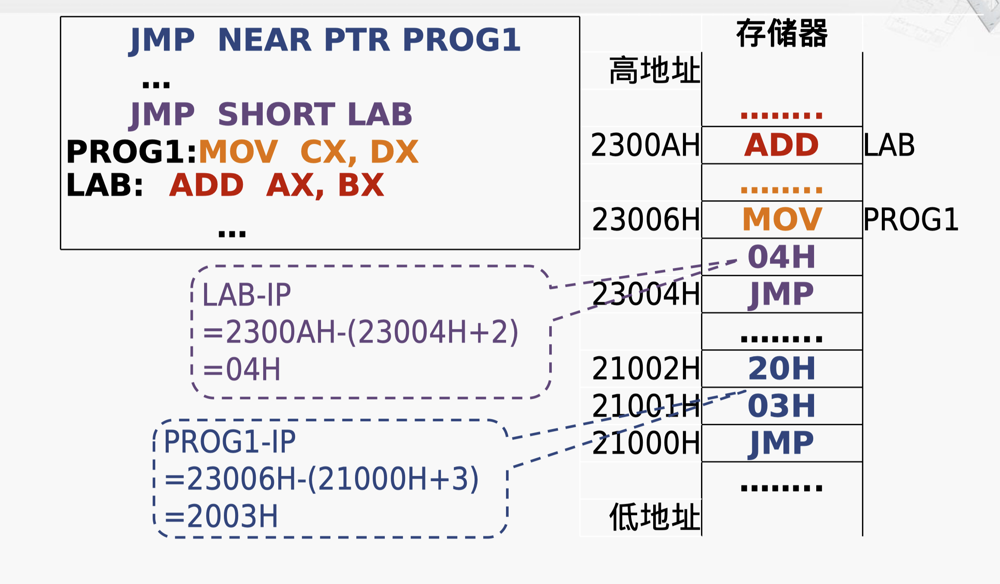

> 这里的 `+2`、`+3` 是由于 `JMP` 指令本身会占有字节。

远转移例子：


将下一条指令的地址分别存入 IP，CS 寄存器，然后接下来 CPU 就会从 CS:IP 的 [43006H] 开始执行

##### 无条件转移指令 - 间接转移

无条件转移指令通过给出下一个 `IP` 存放的位置，而不是直接给出下一个 `IP`。

-   转移目标地址在寄存器中：

    -   `JMP AX`：`AX → IP`
    -   `JMP EAX`：`EAX → EIP`

-   转移目标地址在存储器中：

    -   `JMP [SI]`：`[SI] → IP`
    -   `JMP FAR PTR [SI]`：`[SI] → IP`，`[SI+2] → CS`

段间间接转移的执行过程：


##### 条件转移指令

操作：根据当前的状态标志位决定是否发生转移。

说明：

-   一般在影响标志位的算术或逻辑运算指令之后使用。
-   在 8086 中，所有的条件转移都是短转移，即在同一代码段内，-128~127 字节范围内。
-   从 80386 起，条件转移指令可以使用 32 位的长位移量，即在同一代码段内，±2G 字节范围内。


-   C：进位标志位，carry
-   Z/E：零标志位，zero/equal
-   S：符号标志位，sign
-   O：溢出标志位，overflow

程序示例

这段代码用于计算存储器中从地址 `2000H` 和 `3000H` 开始的两个数之和，其中数的长度存放在地址 `2500H` 的字节单元中。

```assembly
    MOV CL, [2500H] ; 将数的长度加载到 CL 寄存器
    MOV SI, 2000H ; 将地址 2000H 加载到 SI 寄存器，作为第一个数的起始地址
    MOV DI, 3000H ; 将地址 3000H 加载到 DI 寄存器，作为第二个数的起始地址
    CLC ; 清除进位标志 CF
LOOP1: MOV AX, [SI] ; 将 SI 指向的值加载到 AX 寄存器
    ADC AX, [DI] ; 将 DI 指向的值加到 AX 寄存器，并考虑进位
    MOV [SI], AX ; 将结果存回 SI 指向的位置
    INC SI ; 将 SI 寄存器的值加 1
    INC SI ; 再次将 SI 寄存器的值加 1，等同于 `ADD SI, 2`，但不影响 CL 进位寄存器
    INC DI ; 将 DI 寄存器的值加 1
    INC DI ; 再次将 DI 寄存器的值加 1
    DEC CL ; 将 CL 寄存器的值减 1
    JNZ LOOP1 ; 如果 CL 不为 0，则跳回 LOOP1 继续执行

    MOV AX, 0H ; 将 AX 寄存器清零
    ADC AX, 0H ; 将 0 加到 AX 寄存器，并考虑进位
    MOV [SI], AX ; 将最终结果存回 SI 指向的位置
```

这段代码通过循环将两个数的对应字节相加，并将结果存回第一个数的起始位置。注意，`INC` 指令被用来增加地址指针而不影响 `CL` 寄存器，以保持正确的循环次数。

> 因为指令系统设计人员考虑该指令主要用于对指针（即地址）进行增加，不存在进位问题，所以没有设计让 INC 影响进位标志 CF。 INC/DEC 指令不影响 CF 标志位，这个是 Intel 规定的！

##### 循环控制指令

说明：

`LOOPNE`/`LOOPNZ` 指令用于在条件不为零或不相等时进行循环。其格式如下：

-   `LOOPNE LABEL`
-   `LOOPNZ LABEL`

操作过程：

1. 寄存器 `CX` 的值减 1，即 `CX <- CX - 1`。
2. 若 `CX` 不为 0 (`CX ≠ 0`) 且零标志 `ZF` 为 0 (`ZF = 0`)，则跳转到标签 `LABEL` 处继续执行。
3. 否则，结束循环，顺序执行下一条指令。

#### 处理器控制指令

作用

-   控制 CPU 的功能
-   对标志位进行操作


NOP 的作用：

**代码对齐：** 在某些处理器架构中，特定的指令序列如果能够在内存中对齐到特定的边界，比如 4 字节或 16 字节边界，可能会更高效地被执行。使用 `NOP` 指令可以填充空间，帮助实现这种对齐，进而优化程序的执行速度。

**延时：** 在一些对时序敏感的硬件操作中，可能需要在两个操作之间简单地延迟一段时间。通过插入一定数量的 `NOP` 指令，可以实现微小的延时。

**占位符：** 在开发阶段，`NOP` 可以作为暂时的占位符使用，例如在还未实现的功能位置上。这使得程序员可以先构建起程序的框架，之后再回来填充具体的实现代码。

**调试和测试：** 在调试过程中，可能需要暂时移除或替换某些指令，而不改变代码的总长度。`NOP` 指令可以用来替换那些需要被暂时忽略的指令，而不影响程序的其他部分。

**绕过某些限制：** 在某些特定的情况下，比如跳过硬件缺陷引起的问题，或者在不改变程序流的情况下绕过某些安全检查，`NOP` 指令可能被用来填充必要的空间。

## 3.4 复杂的 x86 指令举例

CISC：复杂指令集计算机（Complex Instruction Set Computer），代表是 x86

### 串操作指令

作用

-   对存储器中的数据串进行每次一个元素的操作
-   串的基本单位是字节或字（即 “一个元素”）
-   串长度可达 64KB

分类

-   共 5 条串操作指令
-   另有 3 种重复前缀，与串操作指令配合使用


#### MOVSB 指令（字节串传送）

格式：`MOVSB`

操作：在存储器中将指定位置的一个字节单元传送到另一个指定的位置

#### REP 前缀（无条件重复）

格式：REP 串操作指令

操作：当 `CX != 0` 时，重复执行串操作指令

#### 注意事项

**MOVSB 指令是没有操作数的，不是因为它很简单，是因为操作数太多了写不下**

隐含操作数

-   源串地址为 `DS:SI`，目的串地址为 `ES:DI`
-   串的长度在 `CX` 寄存器中

处理完一个串元素后的操作（硬件自动完成）

-   修改 SI 和 DI，指向下一个串元素
-   若使用重复前缀，则 `CX ← CX-1`

#### MOVSB 举例


前两行汇编代码不合并，因为段寄存器之间不能互相传送

#### 串传送方向（标志寄存器中的 DF 标志位）

DF：方向标志（Direction Flag）

设置 DF=0

-   从 “源串” 的低地址开始传送
-   传送过程中，SI 和 DI 自动 **增量** 修改

设置 DF=1

-   从 “源串” 的高地址开始传送
-   传送过程中，SI 和 DI 自动 **减量** 修改


标志操作指令

-   STD 把方向标志 DF 置 1，Set Direction Flag
-   CLD 把方向标志 DF 清 0，Clear Direction Flag

#### 方向标志的作用

应对 “源串” 和 “目的串” 的存储区域部分重叠的问题


核心目的：防止想要复制的值被提前修改。

#### SCASB / SCASW （字节 / 字串扫描）指令

格式

-   `SCASB`（Scan String Byte）
-   `SCASW`（Scan String Word）

操作

-   比较 `AL`/`AX` 寄存器的内容与目的串当前字节 / 字。
-   只修改 `DI` 寄存器的值，而不修改 `SI` 寄存器。
-   操作不回写结果，仅影响标志位。

说明

-   可以使用重复前缀 `REPE`/`REPZ`（Repeat while Equal/Zero）或 `REPNE`/`REPNZ`（Repeat while Not Equal/Zero）。
-   用于寻找目的串中第一个与 `AL`/`AX` 寄存器值相同或不相同的元素。

### 循环控制指令


`LOOPNE/LOOPNZ` 指令（不为零 / 不相等时循环）

格式：`LOOPNE LABEL` / `LOOPNZ LABEL`

操作

-   `CX <- СХ-1`
-   若 `CX≠0` 且 `ZF=0`（上一条结果非 0），转移到 LABEL 处继续执行，否则，结束循环，顺序执行下一条指令

#### 循环控制指令示例

在 100 个字符的字符串中寻找第一个 `$` 字符


要么找到了，要么找到了 100 个都没找到，因为 `CX = 0` 而退出循环

### 查表指令（同前）

XLAT 指令（换码，查表）

格式：`XLAT`

操作：

-   （事先在数据段中定义了一个字节型数据表）
-   从 BX 中取得数据表起始地址的偏移量
-   从 AL 中取得数据表项索引值
-   在数据表中查得表项内容
-   将查得的表项内容存入 AL

需要提前定义数据表，会修改 AL 的内容

#### XLAT 指令示例


### 十进制调整指令

DAA 指令（加法十进制调整指令），Decimal Adjust for Addition

格式：`DAA`

操作：

-   跟在二进制加法指令之后
-   将 AL 中的 “和” 数调整为压缩 BCD 数格式
-   调整结果送回 AL

#### BCD (Binary-Coded Decimal)

BCD 数具有二进制编码的形式，又保持了十进制的特点，可以作为人与计算机联系时的中间表示


用处：计算十进制运算同时避免进制转换


用 4 位二进制数表示一个十进制数（至少需要 4 位才能代表 16）

### “最长的指令”：15 字节的指令


x86 指令的复杂程度由此可见一斑

### x86 指令系统的发展历程

-   **1978 年** Intel 8086、8088

    要点：16 位的 x86 指令

-   **1985 年** Intel 80386, AMD Am386

    要点：扩展为 32 位的 x86 指令

-   **1989 年** Intel 486, AMD Am486

    要点：增加 x87 指令（浮点指令）

-   **1996 年** Pentium MMX

    要点：增加了 MMX 指令，即 Multi Media eXtension（多媒体扩展指令），AMD 称为 Matrix Math eXtension。包含 57 条多媒体指令（SIMD），不能与浮点数操作同时进行

-   **1999 年** Pentium III

    要点：SSE（Streaming SIMD Extension，SIMD 扩展指令集），共 70 条指令。包括 50 条浮点 SIMD 运算指令、12 条定点 MMX 指令和 8 条优化内存数据块传输指令

-   **2001 年** Pentium 4 (Willamette 核心)、AMD Opteron (SledgeHammer 核心)

    要点：SSE2，共 144 条指令，扩展了 MMX（定点）和 SSE（浮点）技术

-   **2004 年** Pentium 4 (Prescott 核心)、AMD Opteron (Troy 核心)（皓龙）

    要点：SSE3，在 SSE2 的基础上增加了 13 条 SIMD 指令，目的是改进线程同步和特定应用程序领域，例如媒体和游戏

## 3.5 MIPS 体系结构

### MIPS 的设计者和 RISC 的先驱

约翰・亨尼西（John Hennessy），1953 年出生，美国计算机科学家，斯坦福大学教授，曾任斯坦福大学工程学院院长，现任斯坦福大学校长。

他是 RISC 架构的先驱之一，也是 MIPS 架构的设计者之一。

-   RISC：Reduced Instruction Set Computer，精简指令系统计算机
-   CISC：Complex Instruction Set Computer，复杂指令系统计算机

### MIPS 公司的商业兴衰

-   1984 年，MIPS 计算机系统公司成立
-   1988 年，SGI 公司在其计算机产品中采用 MIPS 处理器
-   1989 年，MIPS 第一次上市
-   1992 年，SGI 收购 MIPS，更名为 MIPS 技术公司
-   1998 年，MIPS 再次上市
-   2012 年，Imagination Technologies 收购 MIPS
-   MIPS 处理器广泛应用的领域：数字电视、机顶盒、蓝光播放器、游戏机、网络设备等

### MIPS 的设计指导思想

MIPS 的全称：Microprocessor without Interlocked Piped Stages，流水线无锁微处理器

主要关注点

-   減少指令的类型
-   降低指令复杂度

基本原则： **A simpler CPU is a faster CPU.**

### MIPS 指令的主要特点

-   固定的指令长度（32-bit ，即 MIPS 中的 1 word）：简化了从存储器取指令。

    > x86 指令长度不固定，1 word 是 16 位

-   简单的寻址模式：简化了从存储器取操作数（虽然给编程带来了不便）
-   指令数量少，指令功能简单（一条指令只完成一个操作）：简化指令的执行过程，提高并行性
-   只有 Load 和 Store 指令可以访问存储器

    > 例如，不支持 x86 指令的这种操作：`ADD AX，[3000H]`
    >
    > 需要优秀的编译器支持

-   需要优秀的编译器支持

### MIPS 指令示例（运算指令）

#### 加法指令

格式: `add a, b, c`

操作：将 b 和 c 求和，结果存入 a 中

```assembly
add a, b, c
sub a, b, c
mul a, b, c
div a, b, c

and a, b, c
or a, b, c

sll a, b, c
srl a, b, c
```

操作数 **不允许直接访存，只能通过寄存器**

### MIPS 指令示例（访存指令）

假设

-   A 是一个 100 个字（word）的数组，首地址在寄存器 `$19` 中
-   变量 h 对应寄存器 `$18`
-   临时数据存放在寄存器 `$8`

```assembly
; A[10]=h+A[3]
lw $8,12($19) ; t0=A[3]，将 A[3] 的值加载到 t0（8号寄存器）中
add $8,$18,$8 ; t0=h+A[3]
sw $8,40($19) ; A[10]=h+A[3]
```

> 注：MIPS 中，一个字是 32 bit，也就是 4 Byte，所以这里 12 代表 A [3]

### MIPS 的通用寄存器

MIPS 的通用寄存器（32 个，每个都是 32 位宽）


既可以用名称，也可以用编号，如 `$8` 和 `$t0` 是等价的

### 通用寄存器使用示例

以下指令与对应注释中的指令相同


## 3.6 MIPS 指令简介

### MIPS 指令

-   R：Register，寄存器
-   I：Immediate，立即数
-   J：Jump，无条件转移


### R 型指令的格式

R 型指令格式包含 6 个域

-   2 个 6-bit 域，可表示 0~63 的数，包括 opcode (operaion code) 和 funct (funct code)
-   4 个 5-bit 城，可表示 0~31 的数，包括 rs、rt、rd 和 shamt (shit amount)

各个域的说明：

-   `opcode` 用于指定指令的类型。 **对于所有 R 型指令，该域的值均为 0**
-   `funct`：与 opcode 域组合，精确地指定指令的类型

> 为什么不合并？
>
> **指令解码复杂度增加** ：合并后，CPU 的指令解码逻辑变得更加复杂。因为现在每条指令的标识都是独一无二的 12-bit 标识符，CPU 需要通过更复杂的逻辑来识别和执行指令，这可能会影响指令的解码速度。
>
> **指令集扩展性降低** ：在 `opcode` 和 `funct` 分开的设计中，通过改变 `funct` 值来增加新的操作是相对容易的，因为它不需要调整或重定义 `opcode` 值。如果将它们合并，每增加一条新指令可能都需要重新考虑整个指令集的布局，这限制了指令集的灵活性和未来的扩展性。
>
> **编码空间的浪费** ：虽然 12-bit 提供了更多的编码空间（4096 种可能的值），但实际上，并非所有的组合都会被用到。这可能会导致编码空间的浪费，因为某些特定的组合可能永远不会被实现为有效指令。
>
> **可读性和编程便利性降低** ：对于汇编语言程序员而言，分开的 `opcode` 和 `funct` 字段让指令的功能更加明显，易于理解和记忆。合并这两个字段可能会使得指令看起来更加抽象，增加编程的难度。

-   `rs`（Source Register）：用于指定第一个源操作数所在的寄存器编号。这是一个 5-bit 的域，能够表示的范围是 `0~31`，对应于 32 个通用寄存器。
-   `rt`（Target Register）：用于指定第二个源操作数所在的寄存器编号。
-   `rd`（Destination Register）：用于指定目的操作数（即保存运算结果）的寄存器编号。
-   `shamt`（Shift Amount）：用于指定移位指令进行移位操作的位数。这是一个 5-bit 的域，可以表示 `0~31` 的值。对于 32-bit 的数，超过这个范围的移位操作没有实际意义。对于非移位指令，该域设为 `0`。

通过这些寄存器和相应的位域，MIPS 指令集能够执行包括算术运算、逻辑运算和数据传输等多种类型的操作。

### R 型指令的编码示例

转换：

```assembly
add $8,$9,$10
```

查指令编码表得到：

opcode = 0，funct = 32，shamt = 0（非移位指令）

根据指令操作数得到：

rd = 8（目的操作数），rs = 9（第一个源操作数）rt = 10（第二个源操作数）

### I 型指令的格式

即要求指令中包含立即数的指令，常用的立即数超过 R 型指令的 5-bit 限制

I 型指令格式包含 3 个域，具体如下：

-   `opcode`：用于指定指令的操作类型。
-   `rs (Source Register)`：指定第一个源操作数所在的寄存器编号。
-   `rt (Target Register)`：用于指定目的操作数（保存运算结果）的寄存器编号；对于某些指令，也用于指定第二个源操作数所在的寄存器编号。
-   `immediate`：16-bit 的立即数，能表示 $2^{16}$ 个不同数值。对于访存指令（如 `lw rt,imm(rs)`），通常能满足访存地址偏移量的需求（范围为 -32768 到 +32767）。而对于运算指令（如 `addi rt, rs, imm`），虽然无法满足全部需求，但大多数情况下足够使用。

由于 x86 指令长度不固定，所以可以方便地扩展，但是 MIPS 指令长度固定为 32-bit，所以 I 型指令的立即数长度有限。

### I 型指令的编码示例

指令示例：`addi $21, $22, -50` 表示将寄存器 `$22` 的值加上 `-50`，然后将结果存储在寄存器 `$21` 中。

指令编码分析如下：

-   `opcode` = 8：这是 `addi` 指令的操作码。
-   `rs` = 22：源操作数寄存器编号，即操作数所在的寄存器。
-   `rt` = 21：目的操作数寄存器编号，即结果将要存储的寄存器。
-   `immediate` = -50：立即数，即要加上的值。

需要注意的是，`addi` 与 `add` 指令不同。`add` 属于 R 型指令，而 `addi` 是 I 型指令，主要用于处理带有立即数的加法操作。

### 分支指令的分类

分支指令可以根据是否基于条件来改变程序的控制流程，分为条件分支和非条件分支。

#### 条件分支

条件分支根据特定条件的结果来决定是否改变控制流。主要包括两条指令：

-   `beq` (branch if equal)：如果相等则分支
-   `bne` (branch if not equal)：如果不相等则分支

#### 非条件分支

非条件分支无条件地改变程序的控制流程。主要指令为：

-   `j` (jump)：跳转到指定位置

### 条件分支指令（I 型）

条件分支

-   `beq rs, rt, imm`：opcode=4
-   `bne rs, rt, imm`：opcode=5

格式：`beq reg1, reg2, L1`

```c
if (value in reg1) == (value in reg2)
    goto L1
```

其中，`L1` 是一个标号，表示目标地址，是一个立即数

MIPS 注意没有标志寄存器，条件分支指令是通过比较两个寄存器的值来实现的，这符合其设计理念，减少了由于标志位引起的互锁。

**注意这里，先 rs 再 rt，这是特殊的，只有 branch 分支指令如此。**

### 条件分支指令的示例


### 条件分支指令的目标地址范围

如何充分发挥 16-bit 的作用？

-   以当前 PC 为基准，16-bit 位移量可以表示 $\pm 2^{15}$ Bytes
-   MIPS 的指令长度固定为 32-bit（word）
-   16-bit 位移量可以表示 $\pm 2^{15}$ words = $\pm 2^{17}$ bytes（$\pm 128$ KB）：**单位从字节变为 MIPS 指令个数**

目标地址计算方法：

-   当分支条件不成立时，程序计数器的更新方式为 `PC = PC + 4`，即跳转到下一条指令。

-   当分支条件成立时，程序计数器的更新方式为 `PC = (PC + 4) + (immediate * 4)`，即根据立即数（immediate）的值计算跳转的目标地址。

    也即，以一个字作为步长来计算目标地址。

### 非条件分支指令（J 型）

在不需要条件判断的情况下，如何扩大目标地址范围

-   理想情况，直接使用 32-bit 地址
-   冲突：MIPS 的指令长度固定为 32-bit，opcode 占用了 6-bit，address 最多只有 26-bit

目标地址计算方法：

```
New PC = { (PC+4)[31..28], address, 00 }
```

即，相较于 32 位地址，我们在现有 26 位的基础上，末尾补上 00（也即以一个字作为步长来计算目标地址），从而实现了对 28 位地址的跳转范围。

其中，`(PC+4)[31..28]` 中，`PC+4` 代表下一条指令，`[31..28]` 表示取 `PC+4` 的高 4 位，这可以理解为一种补齐操作。正是因此，这种方式实际上限定了跳转目标必须在当前 PC 所在的 256MB 内存区域内（只有后面的 26 位自由度 \* 一个字 = $2^{2}$ Byte 的步长 = $2^{28}$）。

所以整体计算方法也可以理解为：

```
New PC = (PC+4)[31..28] || address || 00
```

### 条件分支指令示例

已知寄存器分配和寄存器对应关系表

```
f -> $s0
g -> $s1
h -> $s2
i -> $s3
j -> $s4
```

转写代码：

```c
if (i == j)
  f = g + h;
else
  f = g - h;
```

得到：

```assembly
bne $s3, $s4, Else
add $s0, $s1, $s2
j Exit
Else: sub $s0, $s1, $s2
Exit:
```

### 非条件分支指令（R 型）

J 型指令的目标地址范围：当前指令地址附近的 $2^{28}$ Bytes（`256MB`）范围内的目标地址。

如何到达更远的目标地址？

-   通过 2 次调用 `j` 指令。
-   使用 `jr` 指令，语法为：`jr rs`。

### MIPS 汇编器提供的伪指令

寄存器传送

-   格式：`move dst, src`
-   实际执行：`addi dst, src, 0`

装载地址（Load Address, la）

-   格式：`la dst, label`
-   实现方式：将标签 `label` 对应的地址加载到目标寄存器 `dst`
-   实际执行：`la` 指令用于将一个标签的地址装载到寄存器中。在 MIPS 架构中，这通常是通过一系列指令来实现的，因为 MIPS 指令集不直接支持将一个大的立即数（如 32 位地址）直接加载到寄存器中。`la` 指令通常会被汇编器翻译为 `lui`（加载上半字）和 `ori`（或立即数）指令的组合：

    1. `lui` 将地址的高 16 位加载到寄存器的高 16 位。
    2. `ori` 将地址的低 16 位与寄存器中的内容进行逻辑或操作，结果存储在寄存器中。

    ```assembly
    lui dst, high(label)  # 加载标签地址的高16位
    ori dst, dst, low(label)  # 加载标签地址的低16位并与高16位组合
    ```

装载 32 位立即数（Load Immediate, li）

-   格式：`li dst, imm`
-   实现方式：将 32 位立即数 `imm` 加载到目标寄存器 `dst`
-   实际执行：`li` 指令用于将一个 32 位的立即数加载到寄存器中。同样，因为 MIPS 指令集通常不支持一次性将 32 位立即数直接加载到寄存器，所以 `li` 指令通常会被翻译为 `lui` 和 `ori` 指令的组合，与 `la` 类似：

    1. `lui` 将立即数的高 16 位加载到寄存器的高 16 位。
    2. `ori` 将立即数的低 16 位与寄存器中的内容进行逻辑或操作，结果存储在寄存器中。

    ```assembly
    lui dst, high(imm)  # 加载立即数的高16位
    ori dst, dst, low(imm)  # 加载立即数的低16位并与高16位组合
    ```

#### 实例

这段代码是用 C 语言和汇编语言混合编写的，用于复制字符串。首先我会解释 C 语言的部分，然后是汇编语言的部分。

```c
char *p, *q;
p = &x[0];  // p = 字符串x的第一个字符的地址
q = &y[0];  // q = 字符串y的第一个字符的地址

while((*q++ = *p++) != '\0') ;  // 复制字符串直到遇到空字符
```

-   `char *p, *q;` 定义了两个字符指针 `p` 和 `q`。
-   `p = &x[0];` 将指针 `p` 指向字符串 `x` 的第一个字符。
-   `q = &y[0];` 将指针 `q` 指向字符串 `y` 的第一个字符。
-   `while((*q++ = *p++) != '\0');` 使用 `while` 循环逐个字符复制字符串 `x` 到字符串 `y`，直到遇到字符串结束符 `\0`。

以上程序会被编译为：

```assembly
  lw $t1, Base Address
  lw $s1, 0($t1)    # $s1 = p
  lw $s2, 4($t1)    # $s2 = q

Loop:
  lb $t2, 0($s1)    # $t2 = *p
  sb $t2, 0($s2)    # *q = $t2
  addi $s1, $s1, 1  # p = p + 1
  addi $s2, $s2, 1  # q = q + 1
  beq $t2, $zero, Exit  # if *p == 0, goto Exit
  j Loop

Exit:  # 退出循环
```

-   `lw $t1, Base Address` 加载基地址到寄存器 `$t1`。
-   `lw $s1, 0($t1)` 从基地址处加载 `p` 的值到 `$s1`。
-   `lw $s2, 4($t1)` 从基地址加 4 的位置（假设地址连续）加载 `q` 的值到 `$s2`。
-   `lb $t2, 0($s1)` 从 `p` 指向的地址加载一个字节到 `$t2`。
-   `sb $t2, 0($s2)` 将 `$t2` 的内容存储到 `q` 指向的地址。
-   `addi $s1, $s1, 1` 将 `p` 向前移动一个字节。
-   `addi $s2, $s2, 1` 将 `q` 向前移动一个字节。
-   `beq $t2, $zero, Exit` 如果 `$t2`（即 \*p）等于 0，则跳出循环。
-   `j Loop` 反之，继续循环。
-   `Exit` 是循环结束后的标签。

所以，复制 N 个字符需要 N\*6 + 3 条指令（3 条初始化指令，加上每次循环需要 6 条指令）。MIPS 没有类似 x86 的 `REP` 指令来简写此过程。

# 第四章 - 算术逻辑单元

## 4.1 算术运算和逻辑运算

### 加法指令的编码示例（1）

C 语言程序

```c
int f, g, h;
f = g + h;
```

汇编指令

```assembly
add $8 $9 $10
```

指令编码

-   opcode = 0
-   funct = 20hex（32 in decimal）
-   shamt = 0（非移位指令）

根据指令操作数得到

-   rd = 8（目的操作数）
-   rs = 9（第一个源操作数）
-   rt = 10（第二个源操作数）


#### 图示


### 加法指令的编码示例（2）

```assembly
addi $21,$22,-50 # $21=$22+(-50)
```

查指令编码表得到：

-   opcode = 8

分析指令得到：

-   rs = 22（源操作数寄存器编号）
-   rt = 21（目的操作数寄存器编号）
-   immediate = -50（立即数）


注意，**I 型指令没有 rd**

#### 图示


### 逻辑 “与” 指令的编码示例


### 算术运算指令（MIPS Core Instruction Set）：

#### R 型

```assembly
add rd, rs, rt      # R[rd]=R[rs]+R[rt] (1)
addu rd, rs, rt     # R[rd]=R[rs]+R[rt]
sub rd,rs, rt       # R[rd]=R[rs]-R[rt] (1)
subu rd, rs, rt     # R[rd]=R[rs]-R[rt]
```

> 1. 可能引起溢出异常

R 型指令主要用于两个操作数都在寄存器中的运算，对于有立即数的运算，需要使用 I 型指令

#### I 型

```assembly
addi rt, rs, imm    # R[rt]=R[rs]+SignExt Imm (1, 2)
addiu rt, rs, imm   # R[rt]=R[rs]+SignExt Imm (2)
```

> 1. 可能引起溢出异常
>
> 2. `SignExtImm={ 16{imm[15]}, imm }`：符号扩展立即数，将立即数的最高位复制到高 16 位，在补码下不会改变立即数的值

### 逻辑运算指令（MIPS Core Instruction Set）

#### R 型

```assembly
and rd, rs, rt      # R[rd]=R[rs]&R[rt]
or rd, rs, rt       # R[rd]=R[ES]|R[rt]
nor rd, rs, rt      # R[rd]=~(R[rs]|R[rt])
```

#### I 型

```assembly
andi rt, rs, imm    # R[rt]=R[rs] & ZeroExt Imm (3)
ori rt, rs, imm     # R[rt]=R[rs] | ZeroExt Imm (3)
```

> 3. `ZeroExtImm=( 16{1'b0}, imm }`：零扩展立即数，将立即数的高 16 位补 0

### 算术逻辑运算的需求

#### 算术运算

-   两个 32-bit 数的 **加 / 减** 法，结果为一个 32-bit 数
-   检查加減法的结果是否溢出

#### 逻辑运算

-   两个 32-bit 数的 **与 / 或 / 或非** 操作，结果为一个 32-bit 数

## 4.2 门电路的基本原理

### 晶体管（transistor）

现代集成电路中通常使用 MOS 晶体管（Metal-Oxide-Semiconductor：金属 - 氧化物 - 半导体）


-   N 型 MOS 管：分为源极（Source）、漏极（Drain）、栅极（Gate），Gate 连接 **高电平** 的时候 N 型 MOS 导通
-   P 型 MOS 管：分为源极（Source）、漏极（Drain）、栅极（Gate），Gate 连接 **低电平** 的时候 P 型 MOS 导通

> 记忆：有个圈（○）的就是 P，P 也有个圈（○）。N 型是 Negative 的，需要有高电才能导通；P 型是 Positive 的，低电就能自己导通。或者记忆 P 不是有个圈，所以只有当这里为 0 的时候才导通。

### 非门 (NOT gate)

#### 逻辑符号


#### 真值表

$$
\begin{array}{c|c}
A & Y=\lnot A \\
\hline
0 & 1 \\
1 & 0 \\
\end{array}
$$

逻辑函数表示 $Y=\bar{A} (Y=\sim A, Y=!A)$

#### 非门原理图


$V_{DD}$​：电源电压

设计电路时，要避免电源和地直接连通，由于电阻很小，这会造成击穿（这就是为什么还有下面的 N MOS）。

### 或门（OR gate）

#### 逻辑符号


#### 真值表

$$
\begin{array}{cc|c}
A & B & Y=A \land B \\
\hline
0 & 0 & 0 \\
0 & 1 & 0 \\
1 & 0 & 0 \\
1 & 1 & 1 \\
\end{array}
$$

逻辑函数表示 $Y=A+B$​

> 记忆：左边是凹进去的，代表更宽松的条件。对比与门是直的，要求更严格。

### 或非门（NOR gate）

#### 或非门原理图


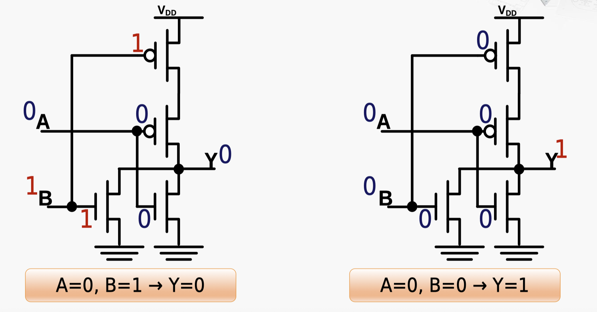


> 记忆：与非门上面是两个 P-Pos 串联。当且仅当两个输入都是 0 的时候 Y 才会输出 1。

### 与门（AND gate）

#### 逻辑符号


#### 真值表

$$
\begin{array}{cc|c}
A & B & Y=A \land B \\
\hline
0 & 0 & 0 \\
0 & 1 & 0 \\
1 & 0 & 0 \\
1 & 1 & 1 \\
\end{array}
$$

逻辑函数表示 $Y=A\cdot B$

### 与非门（NAND gate）

#### 真值表

$$
\begin{array}{cc|c}
A & B & Y=\lnot (A \land B) \\
\hline
0 & 0 & 1 \\
0 & 1 & 1 \\
1 & 0 & 1 \\
1 & 1 & 0 \\
\end{array}
$$

#### 与非门原理图


实际用 “与非门” 和 “非门” 实现 “与门”（注意下图中左边的有个 “o”，是与非门）


在这个电路中，A 和 B 是等价的，当且仅当两个输入都是 1 的时候 Y 才会输出 0。

> 记忆：与非门上面是是两个 P-Pos 的并联，这意味这当且仅当两个输入都是 1 的时候 Y 才会输出 0。

### 异或门（Exclusive-OR gate, XOR gate）

异或运算：

$$
\mathrm{A\oplus B=(\overline{A}\cdot B)+(A\cdot\overline{B})}
$$

两个值不相同，则异或结果为真。反之，为假。

#### 逻辑符号


逻辑函数表示 $Y=A \^{} B$ / $Y=A\oplus B$

#### 真值表

$$
\begin{array}{cc|c}
A & B & Y=A \oplus B \\
\hline
0 & 0 & 0 \\
0 & 1 & 1 \\
1 & 0 & 1 \\
1 & 1 & 0 \\
\end{array}
$$

异或门电路比较复杂，老师没讲。

半加器和全加器在下一章。

### 晶体管、逻辑门


## 4.3 寄存器的基本原理

### 寄存器的内部结构


### D 触发器（D flip-flop, DFF）

D 触发器

-   具有存储信息能力的基本单元
-   由若干逻辑门构成，有多种实现方式
-   主要有一个 **数据输入、一个数据输出和一个时钟输入**
-   在时钟 clock 的上升沿（0→1），采样输入 D 的值，传送到输出 Q，其余时间输出 Q 的值不变


clock 两个上升沿之间的时间就是 **时钟周期**

#### D 触发器的工作原理

照相机与显示器一起看做一个 D 触发器，实现了每当快门按下的瞬间，1 秒后在显示器上展示所拍摄的照片。具体的操作逻辑如下：

-   **触发器时钟频率** ：由于每 10 秒按一次快门，因此时钟频率为 `0.1Hz`。
-   **CLK-to-Q 时间** ：按下快门后，需要 1 秒钟时间将照片显示在显示器上，即 `CLK-to-Q` 时间为 1 秒。
-   **Setup/Hold 时间** ：为确保拍摄的画面稳定，按快门前后的画面不能有变化，这涉及到触发器的 Setup 和 Hold 时间要求。

通过这种方式，我们能够在每次按下快门后的 1 秒钟，准确无误地在显示器上看到所拍摄的画面。


DFF 要求在时钟上升的时候输入不能变化，否则采样可能出现错误，也就是 setup-hold 时间之内，输入不能变。

多个相机（DFF）的快门被同时按动（也即时钟信号是同时的）。

不保证顺序的传递，而是每个 DFF 都以其前一个 DFF 的当前输出（还没经过 CLK-to-Q 更新）作为输入。

#### D - 触发器应用示例：通用寄存器


> 可以看到，左边这张图上面两个 D 触发器的 D 端都没接东西，这说明传导到 A 和 B 并用以运算的是旧值 Q。注意，这里涉及两个时钟周期，第一个周期内，结果的 D 触发器更新的是上一次加法的结果，下一个周期时，他才会更新本次加法的结果。这对应第二个图里，下一个周期才会更新第一个 D 触发器。

#### D - 触发器应用示例：移位寄存器


1. 在第 1 个触发器中，D 输入在 CLK 时钟信号的作用下，这个数字被存储到 Q 输出中。

2. 在第 2 个触发器中，D 输入来自前一级触发器的 Q 输出。在 CLK 时钟信号的作用下，这个数字被存储到 Q 输出中。

3. 以此类推

通过级联的 D 触发器，输入的数字位被逐步移位存储，实现了移位寄存器的功能。

这里有优化空间，现在太慢了，移多少位就要等多少个时钟周期。

#### 具有存储功能的电路：R-S 锁存器

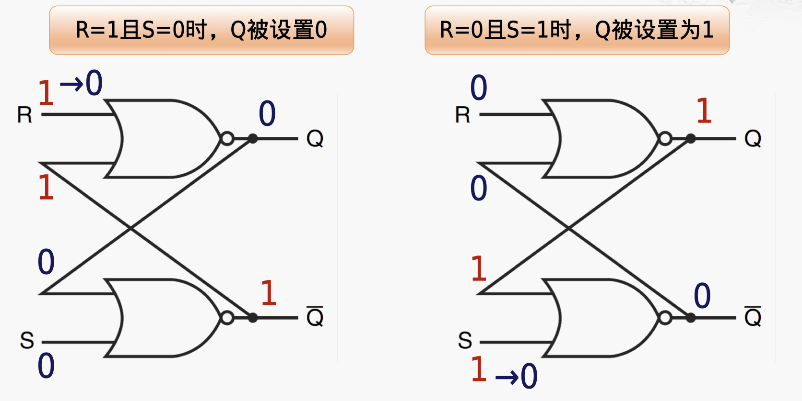

1. 异步控制：R-S 锁存器通过 R（Reset）和 S（Set）两个输入端口来控制状态，当 R=1 时输出为 0，当 S=1 时输出为 1，属于异步控制。

2. 存在未定义状态：当 R=S=1 时，锁存器的输出状态是未定义的。这种情况应当避免。

3. 电平触发：只要满足 R=0 且 S=1，输出就会变为 1 并保持；同理，R=1 且 S=0 时，输出变为 0 并保持。输出取决于 R、S 输入电平而非边沿变化。

4. 两个稳定状态：R=S=0 时，输出保持在原来的状态不变，称为锁存状态。

> 注意：这里是两个或非门！

#### D - 锁存器（D latch）的电路实现


1. 该电路在时钟 C 为高电平时，将输入 D 锁存并输出到 Q（对应 RS 锁存器中一个为 1 一个为 0 的清空）。当 C 为低电平时，输出 Q 保持不变（对应 RS 锁存器中 R=S=0 的情况）。

2. 该电路具有存储功能，可以在时钟 C 为高电平时记录输入 D 的状态，并在时钟 C 为低电平时保持输出 Q 不变。

### D - 触发器的电路实现


通过 C 控制 D 的传入时机。

当 C 为高电平时，D 的输出可以通过第一个 D-latch 传入到第二个 D-latch 的输入 D，但是无法传到第二个 D-latch 的输出 Q。

当 C 为低电平时，第一个 D-latch 的输出 Q 保持不变，第二个 D-latch 的输入 D 也保持不变，但是第二个 D-latch 的输出 Q 会变化。

所以说，该结构在时钟 C 下降沿时锁存数据 D。

### 寄存器的构成


注：这只是一个简单的原理性说明，现实中寄存器的实现要复杂的多

### SRAM

#### 基本存储单元

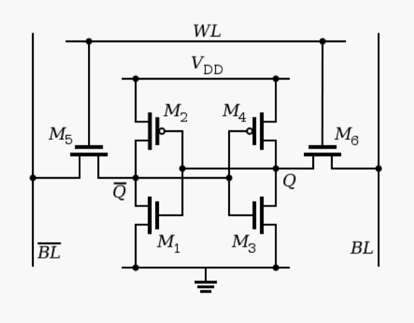

#### 写入过程示例


#### 读出过程示例

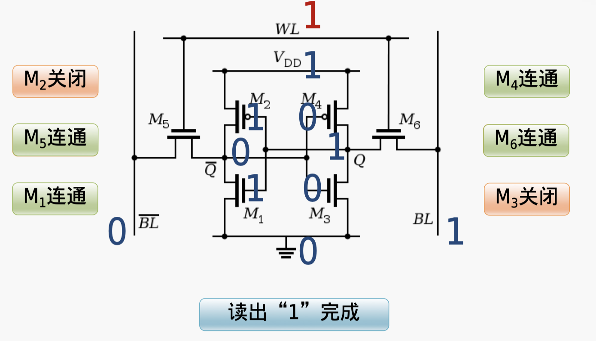

#### 基本结构

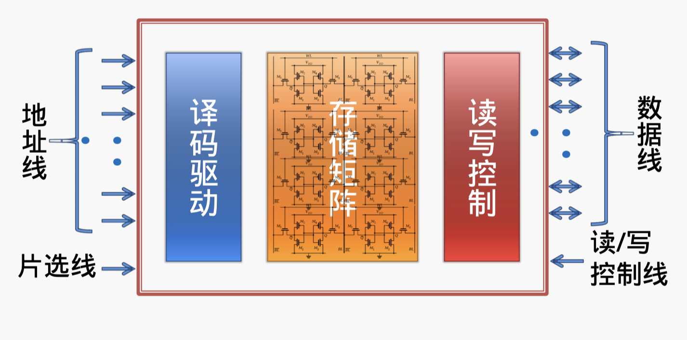

## 4.4 逻辑运算的实现

### 与门和与运算指令


### 与运算的实现

`and rd, rs, rt`：每个位并联进行与运算


### 或运算的实现

`or ra, rs, rt`：每个位并联进行或运算


### 包含多种功能的运算单元


每个功能模块都产生输出，通过多选器（MUX）选择输出。

### 逻辑运算示例


一个周期后，`$8` 会得到更新。

## 4.5 加法和减法的实现

### 二进制的加法


### 半加器（Half Adder）

半加器的功能是将两个一位二进制数相加，其实现需要一个异或门和一个与门。

-   输入端口 A、B
-   输出端口 S（和）、C（进位）


### 全加器（Full Adder）

全加器由两个半加器构成

-   输入端口 A、B、Cin（进位输入）
-   输出端口 S（和）、Cout（进位输出）

注意，$C_{out}$ 前面接的是一个或门，其在下列情况，输出 1：

-   当前位中间计算得到 1，且进位传入是 1
-   当前位中间计算得到 0，已经直接进位


### 4-bit 加法器


四个全加器 **串联** 起来，前一个全加器的进位输出接到下一个全加器的进位输入，就可以实现 4 位的加法。其输出包括两个部分：

-   S，和
-   C，最高位的进位输出

### 加法运算的实现示例


### 检查加法运算结果是否溢出

**溢出（overflow）** ：运算结果超出了正常的表示范围

**溢出仅针对有符号数运算**

-   两个正数相加，结果为负数
-   两个负数相加，结果为正数


（溢出改变了符号位）

### “进位” 和 “溢出” 示例

注意区分 “进位” 和 “溢出”

-   有 “溢出” 时，不一定有 “进位”，对应 **有符号数** 的相同符号大整数因为表示范围上限限制加超了 / 下限限制减超了，在阿贝尔群下 “轮回” 了，相差一个 $2^N$
-   有 “进位” 时，不一定有 “溢出”，对应 **无符号数** 的大整数因为表示范围上限限制加超了，相差一个 $2^N$


溢出：有符号数超出值域，输出错误的数，符号发生了改变

进位：无符号数超出值域，输出错误的数

### “溢出” 的检查方法

**最高位的进位输入不等于最高位的进位输出**

其实就是要求符号位不能是错误的


使用异或门连接 C31 和 Cout，如果不相等，就说明发生了溢出


> 理解这张图：
>
> 回想溢出的定义：两个正数相加得到负数，两个负数相加得到正数。
>
> -   A = B = 1，且 S = 0 当且仅当 C_in = 0 且 C_out = 1
> -   A = B = 0，且 S = 1 当且仅当 C_in = 1 且 C_out = 0
>
> 由此就可以推得，异或门的输出就是溢出的判断。

有符号数和无符号数在硬件上是没有区别的，只是在解释上有区别。

### 对 “溢出” 的处理方式：MIPS

提供两类不同的指令分别处理。

1. 将操作数看做有符号数，发生 “溢出” 时产生异常，进入异常处理程序

```assembly
add rd, rs, rt      # R[rd]=R[rs]+R[rt]
addi rt, rs, imm     # R[rt]=R[rs]+SignExt(Imm)
```

2. 将操作数看做无符号数，不处理 “溢出”

```assembly
addu rd, rs, rt     # R[rd]=R[rs]+R[rt]
addiu rt, rs, imm    # R[rt]=R[rs]+SignExt(Imm)
```

注意，无符号数没有溢出，只有 “舍弃的进位”

### 对 “溢出” 的处理方式：x86

不同于 MIPS，x86 使用溢出标志 OF （Overtlow Flag）来确定是否发生了溢出：

-   如果把操作数看做有符号数，运算结果是否发生溢出
-   若发生溢出，则自动设置 `OF=1`；否则，`OF=0`


如果要对溢出进行处理，需要在后续程序中基于 OF 进行判断。

### 减法运算

減减法运算均可转换为加法运算：`A - B = A + (-B)`

补码表示的二进制数的相反数，转换规则： **按位取反，末位加一** ，也即 `-B = ~B + 1`

在加法器的基础上实现減法器：`A + (-B) = A + (~B + 1)`


使用 `sub-mode` 选择信号，来控制是否使用非门将 B 取反，并将最低位的进位输入（C0）设置为 1，这样就可以实现减法运算。

### 多路选择器（MUX）

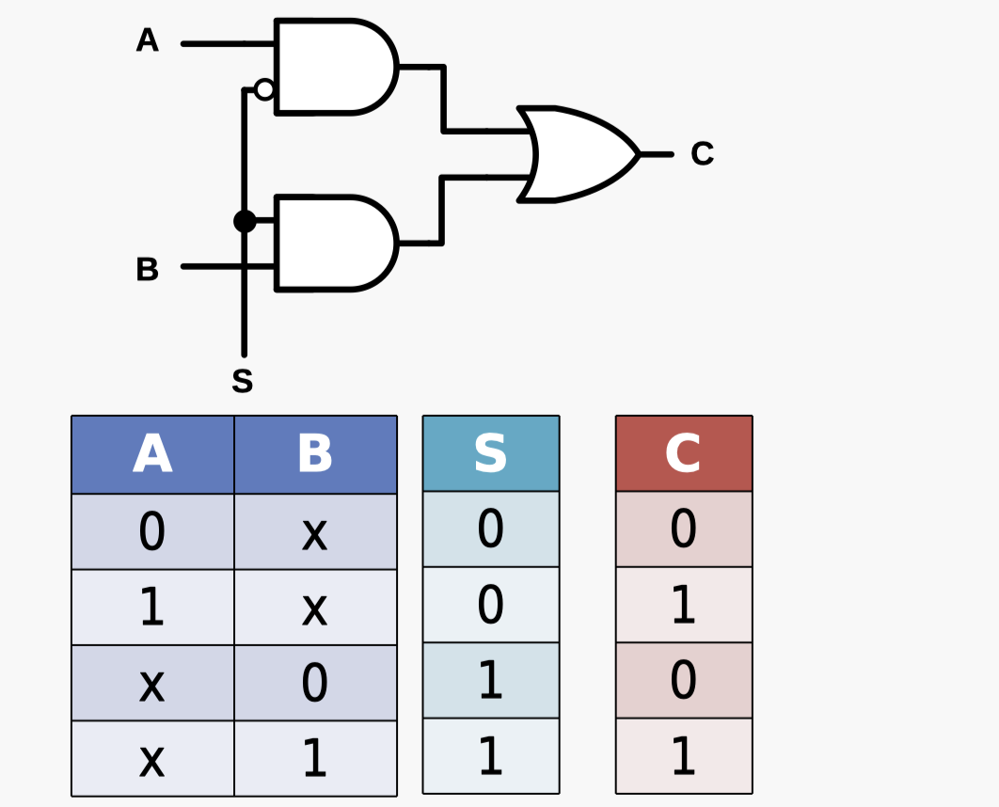

通过 S = 0 或 1 来选择 A 或者 B 信号。

## 4.6 加法器的优化

### 行波进位加法器（Ripple-Carry Adder, RCA）

结构特点：低位全加器的 Cout 连接到高一位全加器 Cin

优点：电路布局简单，设计方便

缺点：高位的运算必须等待低位的运算完成，**延迟时间长**。

（简要理解：是一个串联的结构，每一位的计算都要等待前一位的计算完成）


### 4-bit RCA 的门电路实现

完整门电路实现：


#### 4-bit RCA 的关键路径（延迟最长的路径）


线延迟小于门延迟，主要考虑门延迟。

总的延迟时间：假设有 $N$ 个全加器，每个门延迟的时间为 $T$，则总的延迟为 $(2T)\times N + T$​。

> 除了第一个全加器，其他都是当 C_in 传入的，只需要 2 个门延迟。

#### 32-bit RCA 的性能分析


输入输出寄存器想要在一个时钟周期内完成一次 32bits 加法运算，即使不考虑寄存器、加载延迟，一次 32bits 加法运算至少需要 65 个门延迟，最短就是 65T = 1.3ns，也就是手机主频率受到加法运算限制只有 769MHz。

### 加法器的优化思路

主要问题：高位的运算必须等待低位的 “进位输出信号”

优化思路：能否提前计算出 “进位输出信号”？


和这个电路上的实现不同，逻辑上的运算只要求这三者任意两个是 1，就输出 1：

$$
\begin{array}{rl}C_{i+1}&=(A_i\cdot B_i)+(A_i\cdot C_i)+(B_i\cdot C_i)\\&=(A_i\cdot B_i)+(A_i+B_i)\cdot C_i\end{array}
$$

其中，$\cdot$ 代表逻辑与，$+$ 代表逻辑或

设：

-   生成（Generate）信号 $G_i= A_i\cdot B_i$
-   传播（Propagate）信号 $P_i=A_i+B_i$

则：$C_{i+1}=G_{i}+P_{i}\cdot C_{i}$


这样做的好处是可以看出 G，P 都是输入的时候就可以确定的信号

迭代使用这个公式就可以发现每一个 C 都是可以在输入的时候就确定下来的


#### 提前计算 C4 的电路实现

优点：计算 $C_{i+1}$ 的延迟时间固定为 **三级门延迟** （多个数的或 / 与只需要一个门延迟，所以计算出所有的 $G/P$ 是第一层，在此基础上计算各项的与要一层，最后计算各项加和的或也要一层，共计三层），与加法器的位数无关

缺点：如果进一步拓宽加法器的位数，则电路变得非常复杂

本质：通过将每一位进位都展开，得到一个只有由诸多与门执行后，再进行一次或门的电路，这样就可以提前计算出进位，从而提高了速度。


### 超前进位加法器（Carry-Lookahead Adder, CLA）


上一节中说了，计算任意的 C，只需要 3 级门延迟，只需要再加上一层全加器就可完成计算。所以 CLA 无论多少位，都只需要 4 级门延迟。

### 32-bit 加法器的实现

-   **行波进位加法器** ：其特点是简单但速度较慢。总延迟时间为 `65` 级门延迟。

-   **超前进位加法器** ：理想情况下，可以将总延迟时间大幅减少至 `4` 级门延迟，但实际上由于电路过于复杂，难以实现。

为了平衡速度和实现复杂度，通常采用的实现方法是：

-   使用多个小规模的超前进位加法器拼接而成。例如，可以将 `4` 个 `8-bit` 的超前进位加法器连接起来，形成一个 `32-bit` 的加法器。

这种方法既保证了加法器的速度，又相对减少了实现的复杂度。


这里 PPT 写错了，实际上应该是 0.20ns 才对。4 级 CLA 的耗时计算：四个 8-bits CLA 按照行波进位加法器的样子逐个进行，但是：

第一个 CLA 需要 3 个门延迟才能计算出 C4：

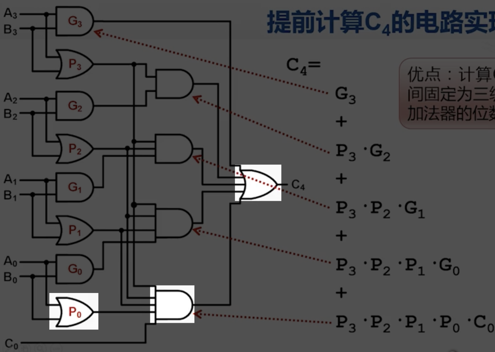

第二个 CLA 的关键路径上，只需要 2 个门延迟就可以计算出 C8：

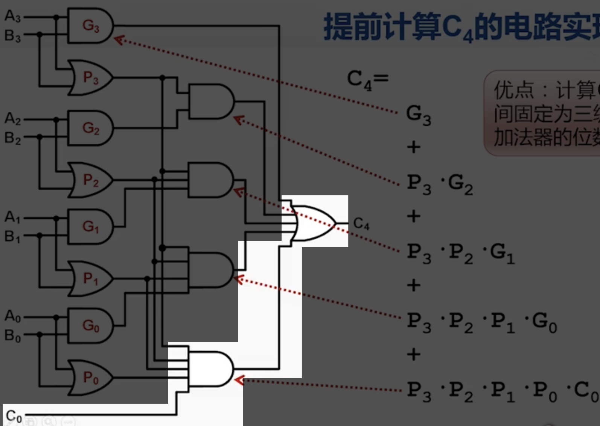

> 注意这里，对于第 $n$ 个及以后的 CLA，计算 $C_{8n-8}\sim C_{8n-1}$ 的关键路径上，只需要等待上一个 CLA 的输出 $C_{8n-9}$

以此类推，再加上第四个 CLA 计算完成后，还需要根据 $C_{31}$ 计算出 $S_{31}$，也即再加一层全加器，所以总门延迟为: (1+2)+2+2+(2+1)=10 级门延迟，就是 0.20ns

> 可能不好理解，加以解释如下：
>
> 对于 0~7 位，每个 C 都是 3 级，每一位计算 C 完了计算 S，再加一级，所以是 4 级延迟
>
> 对于 8~15 位，必须等待 C7 计算完成，才能开始关键路径上的 C 与 S 计算，这要求 3 级门延迟，在此基础上，剩余步骤同上，所以是 3+2+1=6 级延迟
>
> 对于 16~23 位，必须等待 C15 计算完成，才能开始关键路径上的 C 与 S 计算，这要求 3+2=5 级门延迟，在此基础上，剩余步骤同上，所以是 5+2+1=8 级延迟
>
> 对于 24~31 位，必须等待 C23 计算完成，才能开始关键路径上的 C 与 S 计算，这要求 5+2=7 级门延迟，在此基础上，剩余步骤同上，所以是 7+2+1=10 级延迟

## 集成电路的制造过程

1. 硅 → 提纯 → 硅锭
2. 硅锭 → 切片 → 晶圆
3. 晶圆 → 涂胶、光刻
4. 溶解光刻胶（曝光在紫外线下的光刻胶被溶解掉） → 蚀刻 → 化学清除光刻胶
5. 光刻胶 → 离子注入 → 化学清除光刻胶
6. 绝缘体沉积 → 蚀刻出三个孔洞填充铜 → 电镀
7. 抛光、布局连接
8. 晶圆测试、切片、丢弃瑕疵内核
9. 封装、测试

# 第五章 - 乘法器和除法器

## 5.1 乘法的运算过程

### 较为简单的数字选择：二进制

二进制下不需要查 “乘法表”，只需要根据乘数的每一位是 0 还是 1，来抄一遍被乘数即可。

### 十进制和二进制运算的选择

ENIAC 采用十进制，导致电路复杂；EDVAC 经过冯诺依曼 1945 年在其《关于 EDVAC 的报告草案》中提出的 **二进制** ，简化了电路。

电子管是一种 “全或无” 设备（all-or-none），适合表示只有两个数值的系统，即二进制。

二进制可以大幅度地简化乘法和除法的运算过程。尤其是对于乘法，不再需要十进制乘法表，也不再需要两轮的加法。

必须要记住，十进制才是适合人使用的。因此，**输入输出设备** 需要承担二进制和十进制之间的转换工作。

### 运算过程的进一步调整

-   每个中间结果产生后直接与当前的乘积累加
-   每产生一个中间结果，**被乘数向左移动一位**

## 5.2 乘法器的实现

### 乘法器的实现结构


使用 Control Test 信号来控制是否要左移 Multiplicand （被乘数）寄存器，Multiplicand （被乘数）寄存器与 Product （乘积）寄存器经 ALU 相加，结果存入 Product 寄存器。

Control Test 信号根据 Multiplier （乘数）寄存器的最低位来决定其逻辑，包括：

-   每乘一位，左移 Multiplicand 寄存器
-   如果最低位是 1，允许 ALU 进行加法运算，否则不允许
-   如果最低位是 1，允许乘积寄存器保存当前结果，否则不允许
-   每乘一位，右移 Multiplier 寄存器
-   是否终止运行 **（对应循环完成了 N 次）**

### 乘法器的工作过程

#### 乘法器的工作过程（初始化）


位置不足，则以 0 补齐（斜体）。

#### 乘法器的工作过程（1a）


乘数最低位为 1，则：

-   ALU 进行加法运算
-   乘积寄存器在 **下一个时钟上升沿** ，因写入信号有效，乘积寄存器采样，保存新结果

#### 乘法器的工作过程（1b）

乘数最低位为 0，则直接跳过 1a。

#### 乘法器的工作过程（2）

准备被乘数，控制逻辑会给出左移的信号，那么在 **下一个时钟上升沿** 来临的时候，被乘数寄存器就会完成一次左移。


#### 乘法器的工作过程（3）

准备乘数，控制逻辑会给出右移的信号，那么在 **下一个时钟上升沿** 来临的时候，乘数寄存器就会完成一次右移。

放心右移：一旦一个位使用过了，就再也不会使用了。


#### 乘法器的工作过程（4）

检查循环是否结束，如果循环了四次就说明乘法完成（因为乘数是 4 位的）。


#### 乘法器的工作过程（1、2、3、4） 第 2、3、4 轮

判断是否完成乘法：计数当前的循环次数，如果循环了 4 次就说明乘法完成。

### N 位乘法器的工作流程图


## 5.3 乘法器的优化 1：加法移位并行

### N 位乘法器的工作流程图

时钟周期很多，3 个时钟周期。


### 加法移位并行

一个重要事实：时钟上升沿到来时，寄存器才会根据输入改变其内容。

根据这个事实，我们可以同时执行 1、2、3、4 步骤，即在一个时钟周期内完成一次乘法，也即在时钟上升沿到来之前：

-   直接给出被乘数寄存器的左移信号

-   直接给出乘数寄存器的右移信号

-   根据当前乘数的最低位，立即给出 ALU 的加法信号与乘积寄存器的写入信号。

    由于下一个时钟上升沿尚未来临，此时被乘数寄存器、乘积寄存器的值均为发生改变，因而与之相连的 ALU 的两个输入信号也是 “旧值”，这恰好是正确的行为。

所以，在当前这个时钟周期中，我们可以同时执行：

-   乘数寄存器右移
-   被乘数寄存器左移
-   ALU 进行加法运算，并写入乘积寄存器。即使被乘数寄存器经过了 “Click-to-Q” 时间，更新了其输出信号，同时 ALU 也使用了 “新值” 计算了，也无需担心，因为此时乘积寄存器早已经过 “Setup Hold” 时间，采样到了旧的 ALU 输出信号完成了更新，所以不会进行二次更新。

如此，在下一个时钟周期到来时，这些寄存器都会得到正确的更新。


这样改进后，在计算一次乘法的时候，同时将被乘数寄存器和乘数寄存器移位，时钟周期变为 1/3。每次乘法只需要 1 个周期。

## 5.4 乘法器的优化 2：减少不必要的硬件资源

### 减少不必要的硬件资源

1. “被乘数寄存器” 是 8 位宽，但其中有效数字始终只有 4 位
2. “乘数寄存器” 是 4 位宽，最开始没有浪费；但其中有效数字每周期减少 1 位，之后有浪费
3. “乘积寄存器” 是 8 位宽，但初始时有效数字只有 4 位，有浪费；之后每周期增加 1 位，最后才没有浪费
4. “加法器” 是 8 位宽，但参与运算的有效数字实际只有 4 位

### 优化方案分析

1. “被乘数寄存器” 缩减为 4 位而且取消左移功能
2. “乘数寄存器” 4 位宽，且带右移。但其中有效数字每周期减少 1 位，取消它，把乘数放进 “乘积寄存器” 低 4 位，借助其右移功能
3. “乘积寄存器” 增加右移功能乘积初始值置于其中高 4 位，随着运算过程不断右移
4. “加法器” 改为 4 位宽，对应的修改其输入信号为被乘数寄存器（4 位宽）和乘积寄存器（高 4 位，4 位宽）

与此同时，控制逻辑也需要做出相应的调整。


### N 位乘法器的实现结构

本质就是将前文的优化乘法逻辑推广到 N 位乘法器。


## 5.5 除法的运算过程

### 除法的运算过程（示例 1）


Dividend = Quotient × Divisor + Remainder

被除数 = 商 × 除数 + 余数

### 除法的运算过程（示例 2）


## 5.6 除法器的实现

### 32-bit 除法器的工作流程图


注意这里，判断除法器结束工作的条件是： **判断当前是否是第 33 次循环**。

> 为什么是第 33 次？
>
> 请注意，这里的被除数、余数寄存器都是 64-bit 的，只有除数是 32-bit 的。考虑除数在移位过程中的起始和结束，最开始是顶在最高位的（也即从低位 0 开始计数的 63 位），最终停止的时候是在低 32 位的最高 1 位（也即从低位 0 开始计数的 31 位），注意，最后顶到右边对齐之后，也会进行一次减法，所以共计是 33 次循环。

### 4-bit 除法器的实现示例


### 除法器的工作过程

#### 除法器的工作过程（0）


#### 除法器的工作过程（1）


#### 除法器的工作过程（2）


#### 除法器的工作过程（2b）


#### 除法器的工作过程（3）


#### 除法器的工作过程（4）


#### 除法器的工作过程：第二轮（1）


#### 除法器的工作过程：第二轮～第四轮


#### 除法器的工作过程：第五轮（1）


#### 除法器的工作过程：第五轮（2）


#### 除法器的工作过程：第五轮（2a）


#### 除法器的工作过程：第五轮（3）


注意这里，实际上被除数是移出了 1 位的。

#### 除法器的工作过程：第五轮（4）


### 32-bit 除法器的实现


## 5.7 除法器的优化

### 除法器的实现（第一版）


### 除法器的面积优化

#### 从减小面积的角度进行分析：

1. 除数寄存器任何时候，实际只用了一半（32/64）
2. 商寄存器初始时是空的，从右到左逐位填满
3. 余数寄存器初始时是满的，随着计算进行，有实际意义的位从左到右逐渐減少

#### 优化方案：

1. 除数寄存器缩小为 32-bit，无需支持移位
2. 取消商寄存器
3. 64-bit ALU 缩小为 32-bit
4. 余数寄存器只有高 32-bit 参与加减法运算
5. 余数寄存器需 **同时支持左移和右移**
    - 左移：对应不断向低位看的过程，移出的位不再参与后续计算
    - 右移：对应最后计算完成后取 32-bit 余数的时候
6. 商从右端逐位移入余数寄存器
7. 运算结束时，商占据余数寄存器的低 32-bit


### 除法的性能优化分析

回顾：乘法的特点

1. 每个部分积都是独立的
2. 可以并行计算各个部分积
3. 条件分支可以通过先进行一步 **对于乘数最低位（1 或 0）的与** 来改为顺序执行

除法有判断，不是独立的（存在依赖关系）。因此，除法的性能优化是有限的。


# 第六章 - 单周期处理器

## 6.1 处理器的设计步骤

### MIPS 指令系统的简化版本


指令格式：指令被编码为 32 位的二进制串。

-   R 型指令：用于寄存器之间的运算，分为 **六个位域** ，包含操作码（opcode）、源寄存器（rs）、目标寄存器（rt）、目的寄存器（rd）、移位量（shamt，保留）和功能码（funct）。
-   I 型指令：用于立即数运算和访问内存，分为 **四个位域** ，包含操作码（opcode）、源寄存器（rs）、目标寄存器（rt）和立即数（immediate）。

指令的含义：

-   `addu rd,rs,rt`: R 型，无符号加法，将寄存器 rs 和 rt 的值相加，结果存入 rd。
-   `subu rd,rs,rt`: R 型，无符号减法，从寄存器 rs 的值中减去 rt 的值，结果存入 rd。
-   `ori rt,rs,imm16`: I 型，寄存器 rs 的值和立即数 imm16 进行逻辑或（OR）操作，结果存入 rt。
-   `lw rt,imm16(rs)`: I 型，从内存地址（寄存器 rs 的值加上立即数 imm16）加载字到寄存器 rt。
-   `sw rt,imm16(rs)`: I 型，将寄存器 rt 的值存储到内存地址（寄存器 rs 的值加上立即数 imm16）。
-   `beq rs,rt,imm16`: I 型，分支等于（branch on equal），如果寄存器 rs 和 rt 的值相等，则跳转到当前地址加上立即数 imm16 指定的位置。

### 指令位域的分解


-   R 指令需求：存放指令的 **存储器，可读** ，地址和数据均为 32 位
-   I 指令需求：存放指令地址的 **32 位寄存器（PC），可读可写**

### 指令的操作

`ADDU`：无符号加法，结果存储在目的寄存器 `rd` 中。

-   指令格式：`ADDU R[rd] ← R[rs] + R[rt]; PC ← PC+4`

`SUBU`：无符号减法，结果存储在目的寄存器 `rd` 中。

-   指令格式：`SUBU R[rd] ← R[rs] - R[rt]; PC ← PC+4`

由此得出，我们需要的运算器需要支持的操作数包括：

-   改写一个寄存器的需求（rd 或 rt）
-   一组存放数据的 32 位通用寄存器，32 是人为规定的
-   同时读取两个寄存器的内容（rd 或 rt）

---

`ORI`：寄存器 `rs` 的内容与立即数 `Imm16` 进行逻辑或操作，结果存储在寄存器 `rt` 中。

-   指令格式：`ORI R[rt] ← R[rs] | zero_ext(Imm16); PC ← PC+4`

由此得出，我们需要的运算器需要支持的操作数包括：

-   运算的操作数可以是寄存器或者扩展后的立即数
-   提供加、减、逻辑或三种功能的运算器
-   将 16 位立即数扩展到 32 位 **（零扩展）**

---

`LOAD`：从内存中加载数据到寄存器 `rt`。

-   指令格式：`LOAD R[rt] ← MEM[R[rs]+sign_ext(Imm16)]; PC ← PC+4`

`STORE`：将寄存器 `rt` 的数据存储到内存地址。

-   指令格式：`STORE MEM[R[rs]+sign_ext(Imm16)] ← R[rt]; PC ← PC+4`

由此得出，我们需要的运算器需要支持的操作数包括：

-   存放数据的存储器，可读写，**地址和数据均为 32 位**
-   将 16 位立即数扩展到 32 位 **（符号扩展）**

---

`BEQ`：如果寄存器 `rs` 和 `rt` 的值相等，则跳转到指定的地址。

-   指令格式：`BEQ if (R[rs]==R[rt]) then PC ← PC+4 + (sign_ext(Imm16)||00) else PC ← PC+4`

由此得出，我们需要的运算器需要支持的操作数包括：

-   比较两个数，判断是否相等
-   PC 寄存器支持两种自增方式，加 4 **或加一个立即数**

这里 `||00` 代表的是将扩展后的 `Imm16` 左移两位，然后拼接两个 0。而不是或的意思。这是因为在 MIPS 架构中，跳转地址是按字节寻址的，而每条指令的长度是 $4=2^2$ 个字节，所以需要将立即数左移两位（即附加两个零位）来得到正确的跳转地址。

### 需求总结

1. 算术逻辑单元（ALU）

    

    - 运算类型：加、减、或（`ORI`）、比较相等（`BEQ`）
    - 操作数：2 个 32 位的数，来自寄存器或扩展后的立即数

2. 立即数扩展部件

    

    - 将一个 16 立即数扩展为 32 位数
    - 扩展方式：零扩展（`ORI`）、符号扩展（`LOAD, STORE, BEQ`）

3. 程序计数器（PC）

    

    - 一个 32 位的寄存器
    - 支持两种加法：加 4 或加一个立即数（`BEQ`）

    可以用 ALU 实现，或者简单的加法器。

4. 寄存器堆

    

    - 每个寄存器为 32 位宽，共 32 个
    - 支持读操作：rs 和 rt
    - 支持写操作：rt 或 rd
    - 注：这称为 “两读一写” 的寄存器堆，这里要求 **同时操作** 。

5. 存储器

    

    - 一个只读的 **指令存储器**，地址和数据均为 32 位
    - 一个可读写的 **数据存储器**，地址和数据均为 32 位
    - 注：这两个存储器实际对应了现代 CPU 中的指令和数据高速缓存（Cache），而不是内存。

### 存储组件：寄存器堆


内部构成：32 个 32 位的寄存器

数据接口信号：

-   busA，busB：两组 32 位的数据输出
-   busW ：一组 32 位的数据输入

读写控制：

-   Ra（5 位）：选中对应编号（0~31）的寄存器，将其内容放到 busA
-   Rb（5 位）：选中对应编号（0~31）的寄存器，将其内容放到 busB
-   Rw（5 位）：选中对应编号（0~31）的寄存器，在时钟信号（clk）的上升沿，如果写使能信号有效（`WriteEnable==1`），将 busW 的内容存入该寄存器
-   注：寄存器堆的读操作 **不受时钟控制** 。也即任何时候，Ra、Rb 发生变化，busA、busB 的内容也会随之变化。

### 存储组件：存储器


数据接口信号：

-   Data In：32 位的数据输入信号
-   Data Out：32 位的数据输出信号

读写控制：

-   Address：32 位的地址信号。该信号指定一个存储单元，将其内容送到数据输出信号
-   Write Enable：写使能信号。在时钟信号（clk）的上升沿，如果写使能信号有效（为 1），将数据输入信号的内容存入地址信号指定存储单元
-   注：存储器读操作不受时钟控制，任何时候，Address 发生变化，经过很短时间，Data Out 的内容也会随之变化。

## 6.2 数据通路的建立

### 建立数据通路的方法

基本原则：根据指令需求，连接组件，建立数据通路

指令的需求：

-   所有指令的共同需求
-   不同指令的不同需求

### 所有指令的共同需求

指令获取单元（Instruction Fetch Unit, IFU）：


取指令

-   程序计数器（PC）的内容是指令的地址
-   用 PC 的内容作为地址，访问指令存储器获得指令编码

更新程序计数器（PC）

-   顺序执行时：`PC <- PC + 4`
-   发生分支时：`PC <- 分支目标的地址`，这在后文实现
-   在图中也即根据多选器的选择信号，选择 PC+4 或者分支目标地址

### 不同指令的不同需求

#### 加法和减法指令的需求


寄存器堆：


注：

-   busA，busB 是从寄存器堆中读取的数据，分别为 rs 和 rt
-   ALUCtr 和 RegWr 是由指令译码生成的控制信号
-   ALU 的输出连接到寄存器堆的 busW 输入端，下一个时钟上升沿到来时，如果写使能信号为 1 ，将 ALU 的输出写入到 rd 中

#### 逻辑运算指令的需求


这是一条 I 型指令。现有的设计具有如下问题：

1. 目的寄存器是 rt 而非 rd，当前无法写入 rt
2. 立即数是 ALU 的输入
3. 立即数只有 16 位，需要零扩展


解决方案：增加两个多选器，增加一个零扩展部件运算指令的控制信号。

两个多选器分别为：

-   `ALUSrc`，选择 ALU 的第二个操作数：来自寄存器堆的 busB （`ALUSrc = 0` 时，对应之前的情况，输入是 rt）或者扩展后的立即数（`ALUSrc = 1` 时，对应当前情况）
-   `RegDst`，选择 Rw 的写入目标：rd（`RegDst = 1` 时，对应之前 R 型指令的情况） 或 rt（`RegDst = 0` 时，对应当前 I 型指令情况）

#### 访存指令的需求（Load）


现有的设计具有如下问题：

-   如何进行符号扩展？
-   从何处装载数据？


解决方案：将原有的零扩展部件增加符号扩展功能（配合多选器），加入数据存储器和多选器。

两个多选器分别为：

-   `ExtOp`，选择扩展的输出类型，是零扩展立即数（`ExtOp = 0`）还是符号扩展后的立即数（`ExtOp = 1`）
-   `MemtoReg`，选择写入寄存器堆的数据来源，是来 ALU 的输出（`MemtoReg = 0`），还是自数据存储器 （`MemtoReg = 1`）

#### 访存指令的需求（Store）


现有的设计具有一个问题：不知道什么时候储存，也无法储存寄存器的值


解决方案：加入一个控制是否写入的信号，增加一条从 busB 到数据存储器的数据通路。

这需要添加一个多选器：

-   `MemWr`，是否将 busB 的内容写入到数据存储器中，如果为 1，则写入。否则不写入。

至此，数据通路的建立基本完成。

## 6.3 运算指令的控制信号

### 加法指令的操作步骤


加法指令 `addu rd, rs, rt` 分为三个部分：

1. `Instruction = MEM [PC]` 从指令存储器中取回指令
1. `R[rd] = R[rs] + R[rt]` 指令指定的操作
1. `PC = PC + 4` 计算下一条指令的地址


#### 加法指令的操作步骤（1）：指令获取

`Instruction = MEM[PC]`，在 IFU（指令获取单元）中完成

-   从指令存储器中取回指令，在时钟上升沿，首先经过一小短时间，PC 将输入放到输出，再经过一小短时间，将 PC 的内容作为地址，访问指令存储器，将指令存储器的内容放到输出端。
-   所有指令均有此步骤


#### 加法指令的操作步骤（2）：ALU 的操作


首先从 IFU 的输出中解析出各个位域。

然后根据图中红色的控制信号，进行计算，计算出来值，传到 busW （表现为输出稳定）之后，在下一个时钟上升沿就会写入到 rd 中

#### 加法指令的操作步骤（3）：更新 PC 寄存器


除了分支指令（分支指令也有，但是略有差别，见后文），均有此步骤。而且每条指令都是在一个周期内完成的。

### ori 指令的操作步骤


或指令 `ori rt, rs, imm16` 分为三个部分：

1. `Instruction = MEM [PC]` 从指令存储器中取回指令
1. `R[rt] = R[rs] | ZeroExt[imm16]` 指令指定的操作
1. `PC = PC + 4` 计算下一条指令的地址


1，3 与 add 相同。

#### ori 指令的操作步骤（2）


同样是设置控制信号，进行计算，将结果写入到 rt 中。

与 add 不同的地点在于：

-   `ALUSrc = 1`，选择了立即数作为 ALU 的第二个操作数。
-   `ALUCtr = OR`，选择了或操作。
-   `RegWr = 1`，选择了写入 rt。这是由于它是 I 型指令。
-   `ExtOp = 0`，要求指定此信号以选择零扩展。

## 6.4 访存指令的控制信号

### lw 指令的操作步骤

指令 `Iw rt, imm(rs)` 分为三个部分：

1. `Instruction = MEM[PC]` 从指令存储器中取回指令
2. `R[rt] = DataMemory{R[rs] + SignExt[imm]}` 指令指定的操作
3. `PC = PC + 4` 计算下一条指令的地址


控制信号：

-   `RegDst = 0`，选择 rt 作为目标寄存器。
-   `RegWr = 1`，允许写入目标寄存器。
-   `ALUSrc = 1`，选择立即数作为 ALU 第二操作数。
-   `ALUCtr = ADD`，选择加法操作。
-   `MemtoReg = 1`，选择内存数据写入寄存器。
-   `MemWr = 0`，不允许写内存。

#### lw 指令的操作步骤（2）：Data Memory 的操作

`R[rt] = DataMemory{R[rs] + SignExt[imm]}`


### sw 指令的操作步骤

指令 `sw rt, imm(rs)` 分为三个部分：

1. `Instruction = MEM[PC]`，从指令存储器中取回指令
2. `DataMemory{R[rs] + SignExt[imm16]} = R[rt]`，指令指定的操作
3. `PC = PC + 4`，计算下一条指令的地址


#### sw 指令的操作步骤（2）

`DataMemory{R[rs] + SignExt[imm16]} = R[rt]`


控制信号：

-   `RegDst` 不适用，因为此时不需要选择目标寄存器。表示为 x 代表可以是任意值。
-   `RegWr = 0`，不允许写入寄存器。
-   `ALUSrc = 1`，选择立即数作为 ALU 第二操作数。
-   `ALUCtr = ADD`，选择加法操作。
-   `MemtoReg` 不适用，因为此时不需要从内存读取数据到寄存器。
-   `MemWr = 1`，允许写内存。

## 6.5 分支指令的控制信号


### 条件分支指令的示例


`beq` 指令的分类：I 型指令 + 分支指令。

### beq 指令的操作步骤

指令 `beq rs, rt, imm16` 分为三个部分：

1. `Instruction = MEM[PC]`，从指令存储器中取回指令
2. `if(R[rs] == R[rt])`，判断转移条件是否成立
3. `then PC = PC + 4 + SignExt[Imm16] * 4; else PC = PC + 4;`，计算下一条指令的地址。

注意，Imm16 代表的是目标跳转指令和 **下一条指令** 之间的差值，而且会对其左移两位（即乘以 4），这是因为 MIPS 架构中，跳转地址是按字节寻址的，而每条指令的长度是 4 个字节（32 位），所以需要将立即数左移两位（即附加两个零位）来得到正确的跳转地址。


#### beq 指令的操作步骤（2）：计算输出，传递给 IFU

`if (R[rs]-R[rt]==0) then zero = 1; else zero = 0`


我们希望 ALU 计算的减法输出不像往常一样用于更新寄存器，而是输出一个是否为 0 的 `zero` 信号，将之接到 IFU，用于判断是否跳转（即修改 PC 的计算逻辑）。

控制信号：

-   `RegDst`，不适用，因为此时指令不涉及目标寄存器的选择。
-   `RegWr = 0`，不允许写入寄存器。
-   `ALUSrc = 0`，不适用，因为此时 ALU 操作数直接来自寄存器。
-   `ALUCtr = SUB`，计算减法操作。
-   `MemtoReg`，不适用，因为此时不从内存读取数据到寄存器。
-   `MemWr = 0`，不允许写内存。
-   `zero`，ALU 计算得出的信号，用于条件分支判断，如果两个寄存器值相等则为 1，否则为 0。用于后续判断如何修改 PC。

#### beq 指令的操作步骤（3）：IFU 更新 PC


其中，我们会根据如下条件，计算 MUX（多选器）的选择信号，这里只需要一个 **与门** 就可以实现（上图红色部分）：


也即，只有当指令为 `beq`（对应 `nPC_sel = 1`）、且满足分支条件（对应 `zero = 1`），才选择额外的计算结果作为跳转目的地址。

所以可以看到，我们在这个 IFU 内需要进行两次加法运算：

1. `PC_tmp = PC + 4`，计算下一条指令的地址

2. `PC = MUX ? (PC_tmp + 4 + SignExt[Imm16] * 4) : PC_tmp`，根据 MUX 的输出，选择是否额外加上计算跳转指令的地址

    其中，`MUX = nPC_sel & zero`

## 6.6 控制信号的集成

### 现有指令所需的控制信号


### 控制逻辑与数据通路


-   `RegWr`：寄存器写信号，控制是否将数据写入寄存器。
    -   `RegWr = 0` 时，不写入数据，对应 `beq`、`sw` 指令；
    -   `RegWr = 1` 时，写入数据，对应 `add`、`sub`、`ori`、`lw` 指令。
-   `RegDst`：寄存器目的地选择信号，决定了数据将被写入哪个寄存器。
    -   `RegDst = 0` 时，写入 `rt`，对应需要写入的 I 型指令，包括 `ori`、`lw`；
    -   `RegDst = 1` 时，写入 `rd`，对应需要写入的 R 型指令，包括 `add`、`sub`。
-   `ExtOp`：扩展操作信号，用于确定立即数是进行符号扩展还是无符号扩展。
    -   `ExtOp = 0` 时，进行无符号扩展，对应 `ori` 指令；
    -   `ExtOp = 1` 时，进行符号扩展，对应 `lw`、`sw` 指令。
-   `ALUSrc`：算术逻辑单元（ALU）源选择信号，决定 ALU 的第二个操作数是来自寄存器还是立即数。
    -   `ALUSrc = 0` 时，选择寄存器作为第二个操作数，对应 `add`、`sub`、`beq` 指令；
    -   `ALUSrc = 1` 时，选择立即数作为第二个操作数，对应 `ori`、`lw`、`sw` 指令。
-   `ALUCtr`：算术逻辑单元控制信号，指示 ALU 执行何种算术或逻辑操作。

    根据不同的操作码（opcode）和函数码（funct），`ALUCtr` 会有不同的设定。

    -   `ALUCtr = ADD` 时，执行加法操作，对应 `add` 指令；
    -   `ALUCtr = SUB` 时，执行减法操作，对应 `sub` 和 `beq` 指令；
    -   `ALUCtr = OR` 时，执行逻辑或操作，对应 `ori` 指令。

-   `MemWr`：内存写信号，控制是否将数据写入内存。
    -   `MemWr = 0` 时，不写入数据，对应大多数指令；
    -   `MemWr = 1` 时，写入数据，对应 `sw` 指令。
-   `MemtoReg`：内存到寄存器信号，决定了是将内存中的数据还是 ALU 的结果写入寄存器。
    -   `MemtoReg = 0` 时，选择 ALU 结果，对应 `add`、`sub`、`ori` 指令；
    -   `MemtoReg = 1` 时，选择内存数据，对应 `lw` 指令。

这里没有明确写出的组合，代表其对应的控制信号取值可为任意值。但是实际硬件产生信号（见后文）的时候，他们都是明确的，一般用不到就是 0。用或来实现选择条件。

### 控制信号的汇总（以 add 指令为例）


### 控制信号的逻辑表达式

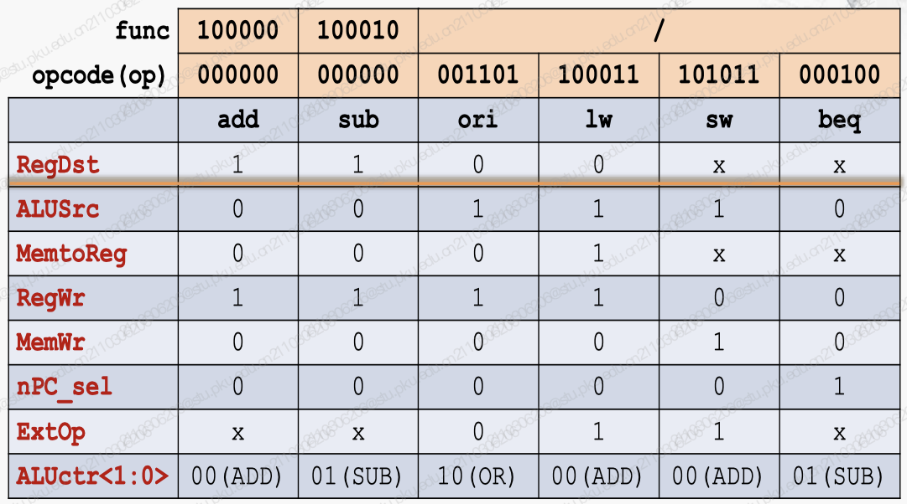

如何产生各个信号？

-   `RegDst` = `add` + `sub`
-   `add` = `rtype` · `func5` · `~func4` · `~func3` · `~func2` · `~func1` · `~func0`
-   `sub` = `rtype` · `func5` · `~func4` · `~func3` · `~func2` · `func1` · `~func0`
-   `rtype` = `~op5` · `~op4` · `~op3` · `~op2` · `~op1` · `~op0`

其中：

-   `rtype` 代表的是 R 型指令
-   `op` 代表的是操作码。`opX` 代表的是操作码的第 X 位（从低位向高位增长计数）。`funcX` 同理
-   `·` 代表的是逻辑与操作，`~` 代表的是逻辑非操作。

推广到其他控制信号：

-   `RegDst` = `add` + `sub`
-   `ALUSrc` = `ori` + `lw` + `sw`
-   `MemtoReg` = `lw`
-   `RegWr` = `add` + `sub` + `ori` + `lw`
-   `MemWr` = `sw`
-   `nPC_sel` = `beq`
-   `ExtOp` = `lw` + `sw`
-   `ALUctr[0]` = `sub` + `beq`
-   `ALUctr[1]` = `or`

注：`ALUctr` 是一组二进制信号，用来控制算术逻辑单元（ALU）的操作。 `ALUctr` 有两位，可能有如下情况：

-   `00`：执行加法操作
-   `01`：执行减法操作
-   `10`：执行逻辑或操作
-   `11`：执行逻辑与操作

根据不同的输入信号，ALU 会执行不同的算术或逻辑操作。这些信号通常由控制单元根据指令的类型产生。

更低级的信号：

-   `add` = `rtype` · `func5` · `~func4` · `~func3` · `~func2` · `~func1` · `~func0`
-   `sub` = `rtype` · `func5` · `~func4` · `~func3` · `~func2` · `func1` · `~func0`
-   `rtype` = `~op5` · `~op4` · `~op3` · `~op2` · `~op1` · `~op0`
-   `ori` = `~op5` · `~op4` · `op3` · `op2` · `~op1` · `op0`
-   `lw` = `op5` · `~op4` · `~op3` · `~op2` · `op1` · `op0`
-   `sw` = `op5` · `~op4` · `op3` · `~op2` · `op1` · `op0`
-   `beq` = `~op5` · `~op4` · `~op3` · `op2` · `~op1` · `~op0`

其中，`+` 代表的是逻辑或操作。

如此，就可以实现所有的控制信号了。


### 控制器的实现示意图


# 第七章 - 流水线处理器

## 7.1 流水线的基本原理


采用流水线：

-   流水线填满之后，可以做到每 1 分钟上一道菜：性能提升到原先的 4 倍
-   单独一道菜仍然需要 4 分钟

### MIPS 的主要步骤

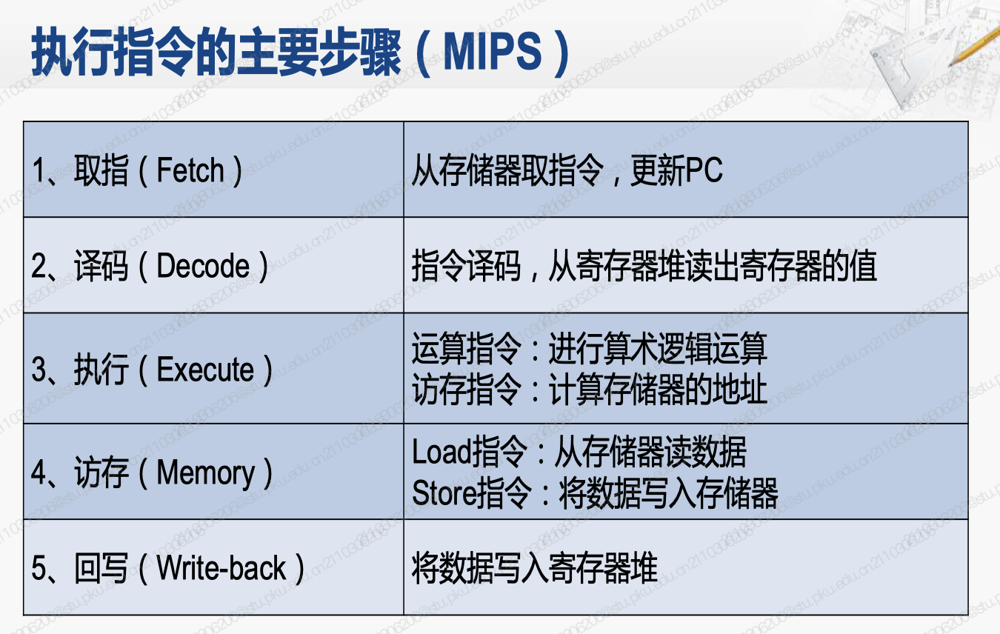

对 MIPS 处理器亦进行阶段划分：


虽然分组了，但是所有的信号都需要在每个阶段中保持稳定。为了充分利用硬件，我们添加寄存器：


### 流水线处理器性能分析


时钟周期：流水线处理器的时钟周期是流水线中 **最慢的阶段的时钟周期**

这是没带上流水线寄存器的，带上之后：


### 总结

流水线中的各个处理部件可 **并行工作**，从而可使 **整个程序** 的执行时间缩短

流水线并 **不会缩短单条指令的执行时间** （甚至由于流水线寄存器的存在，会增加时间） ，而是 **提高了指令的吞吐率**

## 7.2 流水线的优化

### 流水线的调整

不平衡的流水线：每个阶段花费时间不相等的流水线，对单一条指令执行时间和整个处理器的吞吐率都不好。

因此，需要尽可能的平衡各个阶段的时间。为此可能要更细地切分阶段，使之变为平衡的流水线。

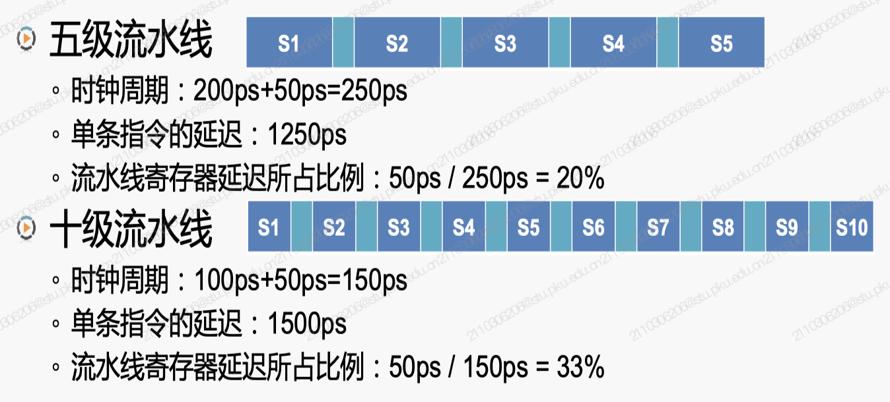

**“超级流水线” 技术 (Super Pipelining)**：将流水线细分为更多的阶段，增加流水线的深度提升时钟频率，从而 **提高指令吞吐率**

但是流水线的级数不是越多越好，因为有流水线寄存器的存在，所以更深的级数会导致单条指令的延迟越来越大，流水线寄存器延迟所占比例也越来越大，填满一条流水线所需的指令也会增加。

x86 被 RISC 追赶，所以做出了改进：在流水线内部用硬件把复杂的 x86 指令划分为更细的 RISC 指令，从而既可以使用先进的 RISC 技术（流水线等），也可以保证对原先的 x86 程序的兼容。

2004，Pemtium 4 (Prescott) 达到了 31 级（最高）。

现在我们已经很难简单的通过增加流水线的深度来获得性能上的提升了。

## 7.3 超标量流水线

超标量（Superscalar）：通常，具有两条或两条以上 **并行工作** 的流水线结构称为 **超标量结构**

-   亦称为 “超标量流水线” 或直接称为 “超标量”。
-   与之相对，之前的流水线则称为 “标量流水线”

使用超标量结构的处理器称为 **超标量处理器**

几条流水线就称为几发射。

### Pentium 的超标量流水线（第一款超标量 x86 CPU）

双发射，5 级流水线

-   两条流水线：“U 流水” 和 “V 流水”
-   共用取值、译码阶段
-   每条流水线都拥有自己的地址生成逻辑、ALU 及数据 Cache 接口
-   在一个时钟周期内，可以 **同时发送两条指令**


CDC6000：通常认为是最早采用超标量技术的计算机，有 10 个并行功能部件，不过没有流水线。by 西摩・克雷

### Core i7 的超标量流水线

由于长度变长，需要先进行指令的识别。

**超标量（Superscalar）**

-   通常，具有两条或两条以上并行工作的流水线结构称为超标量结构亦称为 “超标量流水线” 或直接称为 “超标量”

    -   与之相对，之前的流水线则称为 “标量流水线”
    -   使用超标量结构的处理器称为超标量处理器

-   标量流水线和超标量流水线

    -   单周期 → 标量流水线：**时间并行性** 的优化，主要是对现有硬件的切分。
    -   标量流水线 → 超标量流水线：**空间并行性** 的优化，需成倍增加硬件资源

### 超标量流水线与多核 CPU

现代的多核 CPU 通常是在一个 CPU 芯片中集成了多个超标量处理器核


这是 4 核的处理器。

## 7.4 流水线冒险

冒险：阻止下一条指令在下一个时钟周期开始执行的情况

-   **结构冒险**：所需的硬件部件正在为之前的指令工作。
-   **数据冒险**：需要等待之前的指令完成数据的读写。
-   **控制冒险**：需要根据之前指令的结果决定下一步的行为。

### 结构冒险


问题来源：如果指令和数据放在同一个存储器中，则不能同时读存储器

解决方案 1：流水线停顿（stall），产生空泡（bubble），这是安全且简便的方法，但是会严重影响效率。

解决方案 2：指令和数据放在不同的存储器中（更本质的解决问题）

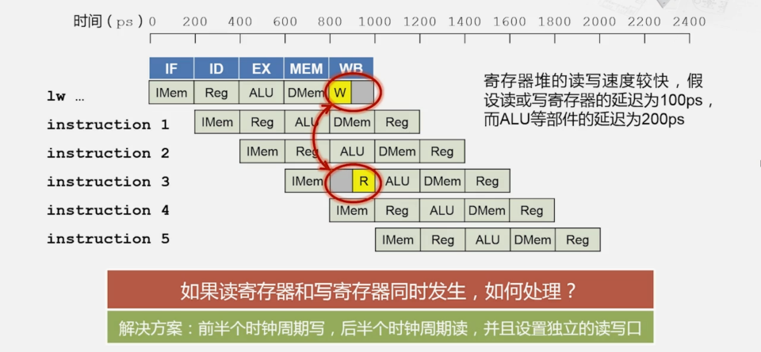

问题来源：读寄存器和写寄存器同时发生

解决方案：前半个时钟周期写，后半个时钟周期读，并且设置独立的读写口（错开）

## 数据冒险

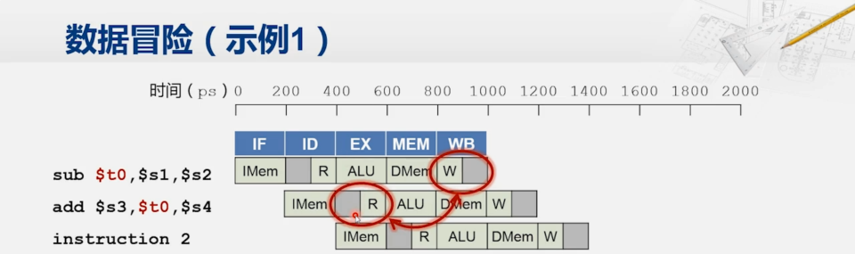

问题来源：一条指令（add）需要使用之前指令（sub）的运算结果，但是结果还没有写回

临时解决方案：流水线停顿（stall），产生空泡（bubble）

## 控制冒险


问题来源：尚未确定是否发生分支，如何进行下一次取指？

临时解决方案：流水线停顿 (stall)，产生空泡 (bubble)

## 7.5 数据冒险的处理


软件解决方案：插入一条 `nop` 指令，也即什么都不做，等待数据准备好。

但是这样并不能很好适配流水线架构更新的情况。当流水线级数增加，等待的周期数也需要同时增加。

硬件解决方案 1：执行流水线停顿（stall），产生空泡（bubble）。

检测数据冒险的方法：对比在 **译码阶段获得的需要读的寄存器的编号** 与后面各个阶段正在执行的指令是否要写某个寄存器，以及 **要写哪个寄存器**。

时间角度重新看这条指令，在 `sub` 指令执行完 ALU 计算后，其实已经可以开始执行 `add` 指令了，只是由于数据还没有写回，所以不能执行。

因此，我们得到：

硬件解决方案 2：数据前递（Forwarding） / 旁路（Bypass）

思想：把执行阶段的结果直接提前传递给需要的阶段，而不是等待写回阶段。


相当于绕过了寄存器堆，直接从执行阶段传递给需要的阶段。

### Load-Use 数据冒险

定义：一条指令需要使用之前指令的访存结果 (Load-Use Harzard) 。

此时，**数据前递 (Forwarding) 也无法解决**

这是因为 Load 必须在访存结束后才能得到结果，所以我们无法跨越时间提前传递数据。

因而，我们回退到之前的解决方法：流水线停顿（stall）+ 数据前递

这个解决方案没有让流水线获得最高的指令吞吐率，但是保证指令执行正确才是我们的首要目标。

## 7.6 控制冒险的处理

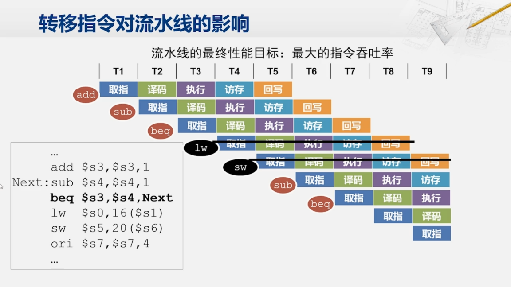

转移指令：改变指令流向，破坏流水模式

转移指令经常带来控制冒险，造成性能损失。因此，我们需要尽量减少转移指令的影响。

$$
\text{Pipeline stall cycles from branches} = \text{Branch Frequency} \times \text{Branch Penalty}
$$

当执行了转移指令，并确实发生转移时，产生如下的开销，称为 “转移开销”

1. 将按顺序预取的指令废除（即 “排空流水线”）
2. 从转移目标地址重新取指令

转移开销的构成：

1. “要不要转移？”：转移条件判定引起的开销
2. “转移到哪里？”：生成目标地址引起的开销

### 转移指令的分类

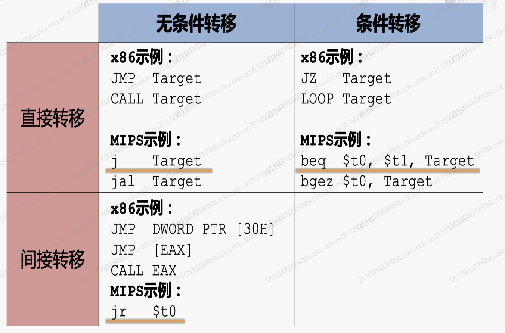

#### 无条件转移

**直接转移**

```asm
j target
```


所需信息在取指阶段即可获得 （流水线不停顿）

**间接转移**

```asm
jr $rs
```


译码阶段才能获得转移目标地址（流水线停顿 1 周期）

#### 条件转移

**直接转移**

```asm
beq $rs, $rt, imm16
```


比较指令较为简单，不需要用到 ALU，直接在 busA busB **连接一个额外的比较电路**，这个电路是很简单的，速度也很快，不至于影响整个译码阶段的时间。


### 控制冒险的影响


-   无条件直接转移：`j Target`，流水线无停顿
-   无条件间接转移：`jr rs`，流水线停顿 1 个周期
-   条件转移：`beq rs，rt，imm16`，流水线停顿 1 个周期

### 延迟转移技术

经过我们的改进之后，无条件的直接转移可以让流水线不停顿。

而无条件的间接转移以及条件转移都不得不让流水线停顿一个周期，才能消除控制冒险的影响。

通过改变指令的执行顺序，我们可以让流水线不停顿：

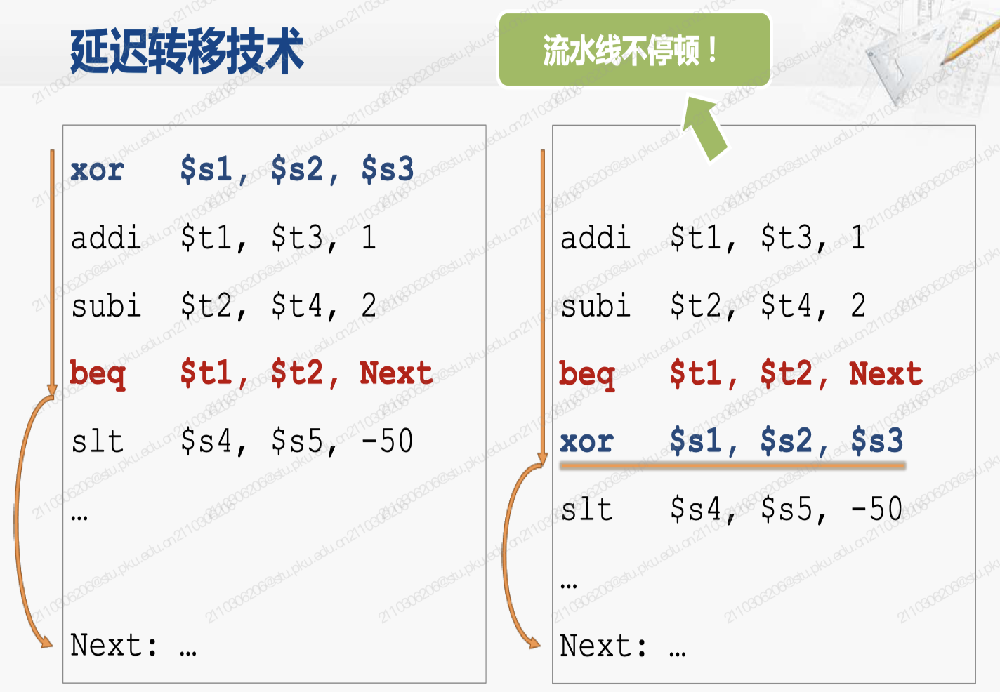

# 第八章 - 存储层次结构

## 8.1 存储层次结构概况

传统的冯・诺依曼计算机结构中与存储功能相关的部件包括：

-   **存储器 M**：显而易见，它是主要的存储组件。
-   **外部记录介质 R**：也具备存储数据的功能。
-   **运算器 CA**：由于 CPU 中的通用寄存器包含在运算器内，它们用于存放临时数据，因此也可以视为一种存储器。

这些部件共同构成了存储层次结构。为了便于描述，我们将这些部件统称为 **存储器**。

### 计算机对存储器的需求

#### 非易失性 vs 易失性

-   **非易失性存储器**：保存程序和数据，在通电启动和断电后不丢失，如 BIOS 芯片和硬盘。

-   **易失性存储器**：信息在断电后丢失，如 CPU 中的通用寄存器。

#### 其他存储器特性

-   **可读写性**：存储器需支持读写操作，如硬盘和主存。BIOS 芯片理论上可写，但是很麻烦。

-   **随机访问**：存储器访问时间与数据位置无关，可以提高性能，如主存和 BIOS 芯片。硬盘因为物理实现是盘片，所以需要先 “旋转”，也就是顺序访问而非随机访问。

-   **速度**：存储器访问速度需快于硬盘，以避免阻碍 CPU 操作。

-   **其他**：考虑存储器性能、价格、容量、功耗等因素。

### CPU 和存储器的特性对比


#### CPU 代表性发展

-   **80 年代代表：8080**

    -   时钟频率：约 1 MHz
    -   时钟周期：约 1000 纳秒

-   **90 年代代表：386**

    -   时钟周期：50 纳秒

-   **2000 年代代表：奔腾二**

    -   时钟周期：约 1.6 纳秒

-   **2010 年代代表：Core i7**
    -   时钟周期：约 0.4 纳秒
    -   核心数：四核

#### 外部存储器特性

##### 硬盘

**80 年代特性**：

-   访问时间：约 87 毫秒，注意是这里毫秒，CPU 是纳秒，之间差了 $10^6$ 倍
-   价格：每兆字节约 500 美元

**30 年来变化**：

-   访问速度提升：约 29 倍
-   价格变化：下降幅度超过 160 万倍

**容量变化**：上升幅度：约 150 万倍

其他：

-   **硬盘无法与 CPU 直接交互**
-   优势：容量大、价格低廉

##### 内存（DRAM）

**80 年代特性**：

-   访问时间：约 375 纳秒

**90 年代特性**：

-   访问时间：开始慢于 CPU

**2010 年代特性**：

-   单核 CPU 需求下访问时间：与 CPU 时钟周期相差约 100 倍
-   访问速度提升：约 9 倍
-   容量提升：约 12 万倍
-   价格：几乎同比例压缩

#### 总结

-   **CPU**：时钟频率不断提升，性能迅速增强
-   **外部存储器**：
    -   硬盘：容量与价格显著提升，但访问速度仍远远落后于 CPU
    -   内存（DRAM）：访问速度提升较慢，但容量大幅增加，价格下降显著

### 存储器性能的影响

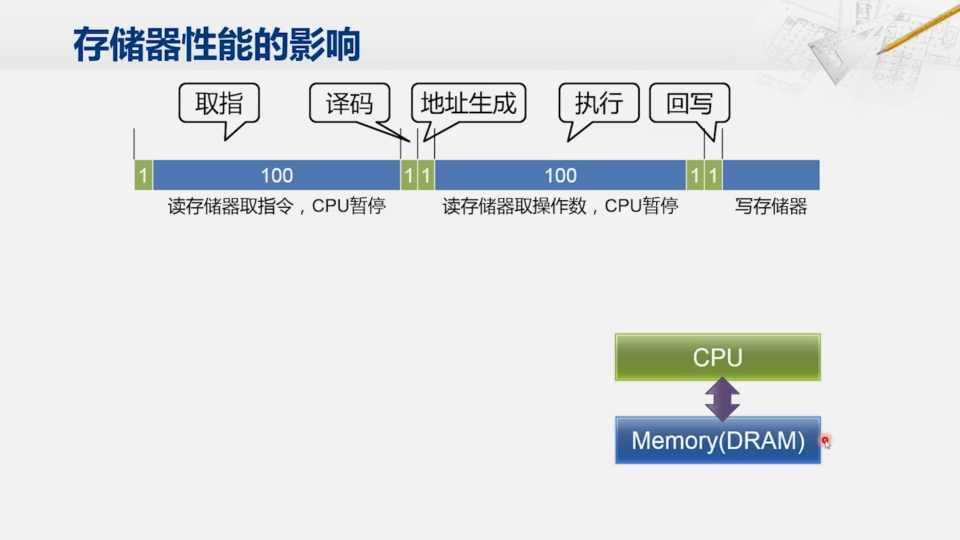

这里就可以看到实际上执行一条指令大约要花掉二百多个时钟周期， 而且 **绝大多数的时间都在等待存储器**。

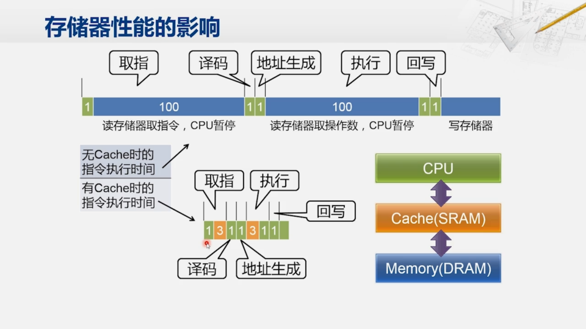

可以看到，通过添加 **高速缓存**，也即 Cache (SRAM)，可以大幅提升性能。


**为什么不用 SRAM 作为主存？**

SRAM 的相关参数：

-   **1980 年**：SRAM 的访问时间约为 **300 纳秒**，与 DRAM 的访问时间相近。
-   **性能提升**：过去 30 年间，SRAM 的访问速度提升了 **200 倍**，而 DRAM 只提升了 **9 倍**。
-   **与 CPU 时钟周期对比**：
    -   在很长一段时间里，SRAM 的访问时间与 CPU 时钟周期相当。
    -   在 **2010 年**，SRAM 的访问时间约为 CPU 时钟周期的 **3 到 4 倍**，可以通过流水线设计来解决差距。

从速度上看，SRAM 适合作为与 CPU 直接连接的存储器。

然而，我们还是不能用 SRAM 来完全取代 DRAM，因为在早期，SRAM 相较 DRAM，**价格太高**。

可是，当 DRAM 的访问速度严重拖慢了 CPU 的速度（上表 1980 → 1990），对使用 SRAM 作为 Cache 的需求就变得迫切了。

到了 486 的时候，就已经把 Cache 集成到了 CPU 芯片的内部， 从而缓解 CPU 和 DRAM 主存之间的日益显著的性能差距。

### 存储层次


现代的计算机当中都采用了这样层次化的存储结构。 在这个层次结构中：

-   越往上的部件， 容量越小，但速度更快，而单位字节的成本更高
-   越靠下的部件，容量更大，但速度更慢，而单位字节的成本更低

## 8.2 DRAM 和 SRAM

### DRAM

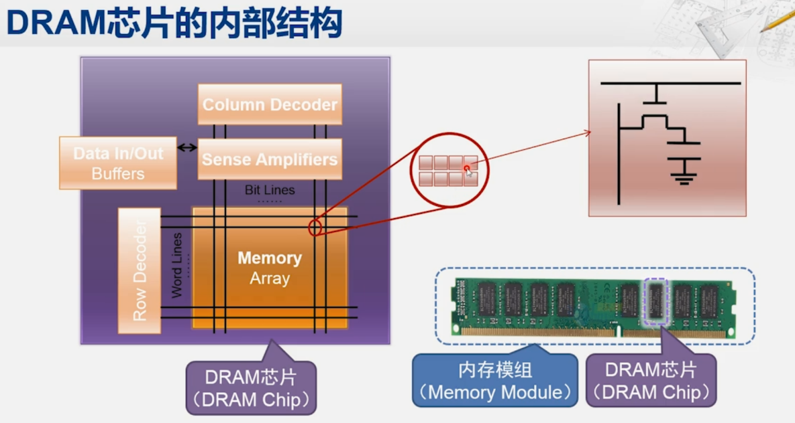

内存条应该叫内存模组，内存模组实际上由 **一块小电路板再加上若干的 DRAM 芯片** 构成，

#### DRAM 芯片

DRAM 芯片的核心是其存储阵列，该阵列由多行多列组成。通过提供行地址和列地址，可以选择特定的存储单元。每个存储单元通常包含多个比特，如 4 比特或 8 比特。

##### DRAM 基本存储单元


-   每个基本存储单元利用 **电容** 来存储一个比特信息。
-   DRAM 芯片中还包括地址译码逻辑，通过行地址和列地址生成选择信号，从而连接电容到外部的输入输出线。

##### 读写操作

-   **写入操作**：外部数据线驱动电容进行充电或放电，从而写入数据（1 或 0）。
-   **读取操作**：电容驱动外部数据信号线，完成数据读出（0 或 1）。

##### 刷新机制

-   由于电容的 **漏电效应**，存储在电容中的信息可能会随时间流失。
-   为保持数据正确性，需要定期 **刷新** 所有单元，补充或维持电容电荷状态。也即使得原先表示逻辑 “1” 电容上的电荷得到补充，而原来表示逻辑 “0” 的电容仍保持无电荷状态。

#### DRAM 类型及其发展

-   DRAM 被广泛用作 PC 机的主存储器（内存）。
-   **SDRAM** （同步 DRAM，Sync DRAM）在基本结构上增加了时钟同步，提高读写效率。
-   常用的内存技术包括 DDR1, DDR2, DDR3, DDR4 等，这些都是在 SDRAM 基础上的改进和升级。

#### DRAM 的优势和限制

-   **优势**：高集成度，低功耗，低成本，大容量。
-   **限制**：基于电容充放电的存储方式导致读写速度较慢，且需定时刷新，影响性能。

### SRAM

SRAM 单元主要由六个晶体管（$M_1, M_2, \cdots, M_6$）组成，这六个晶体管合在一起才可以保存一个比特。与 DRAM 相比，SRAM 的结构更为复杂。

#### 基本接口信号

-   $BL$ 和 $\overline{BL}$：用于传输读写数据。
-   $WL$：控制外部访问存储单元。

#### 写入过程分析

以下描述写入 1 的过程。对于写入 0 的过程，取反 $BL$、$\overline{BL}$。


1. **设置信号值**：

    - 将 $BL$ 设为 1。
    - 将 $\overline{BL}$ 设为 0。

2. **激活写入**：

    - $WL$ 信号设为 1，激活 $M_5$ 和 $M_6$。
    - 通过 $M_6$（NMOS，连接时导通），$BL$ 信号的值传递到 $M_2$ 和 $M_1$​，均为 1
    - 通过 $M_5$（PMOS，连接时导通），$BL$ 信号的值传递到 $M_4$ 和 $M_3$，均为 0

3. **信号传递**：

    - $M_2$（PMOS，高电平时关闭），阻断电源信号，$M_1$ 开启，保持 $\overline{Q}$​ 信号为 0。
    - $M_4$（PMOS，低电平时开启），接通电源信号，$M_3$ 关闭，保持 $Q$​ 信号为 1。

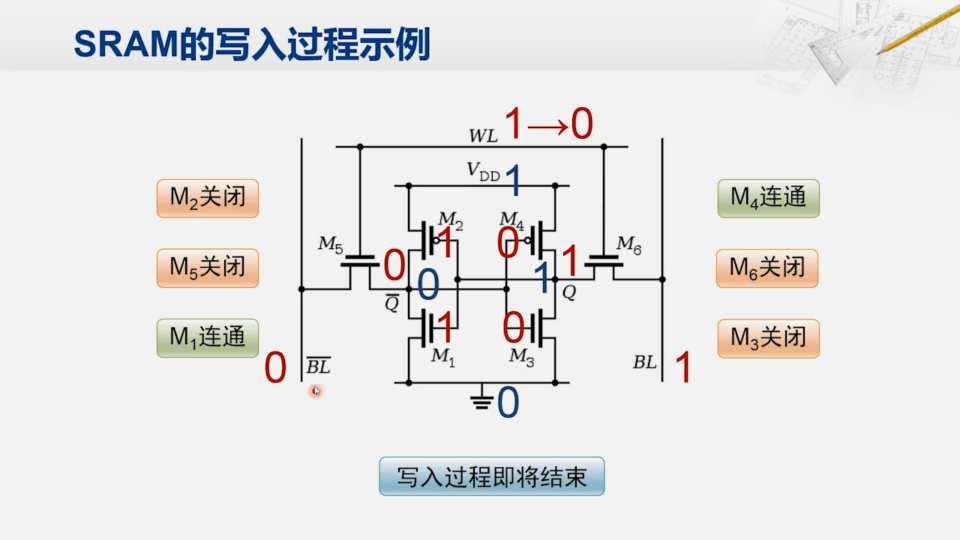

1. **稳定保存数据**：
    - 关闭 $M_5$ 和 $M_6$，撤销 $BL$ 和 $\overline{BL}$ 信号。
    - 通过 $M_1,\cdots,M_4$​ 的互锁，保存当前状态。
    - 一旦断电，则失去信息（$V_{DD}$ 没了）

#### 读出过程分析

在存储单元保持上述状态的情况下：

-   通过激活 $WL$ 信号和 $M_5$, $M_6$ 的连通状态，可以直接从单元读取数据。
-   $\overline{BL}$ 被驱动为 0，$BL$ 为 1，从而读出数据。

#### 存储矩阵与控制机制

将多个 SRAM 单元组合，形成存储矩阵。通过地址线和相应的驱动电路，可以灵活地控制每个存储单元。

设计比较灵活，一个地址所对应的存储单元的数量不固定。

#### SRAM 的优势和限制

-   **优点**：因为 **晶体管的开关速度远比电容充放电的速度要快**，SRAM 的开关速度快，适合 **高速操作**。
-   **缺点**：
    -   多晶体管结构导致芯片面积大，集成度低，**成本高**。
    -   功耗高，由于晶体管数量众多。

### DRAM vs SRAM

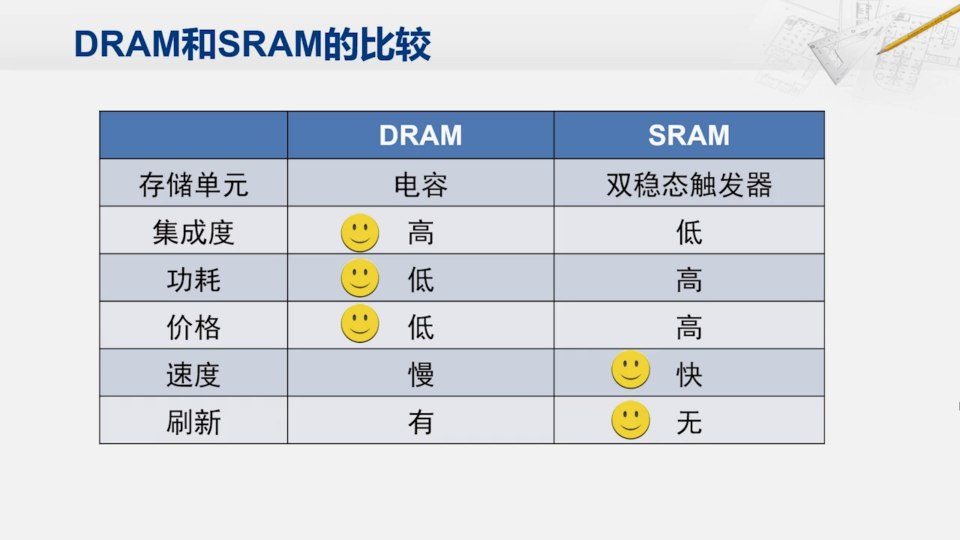

## 8.3 主存的工作原理


正如之前所述，一般都是由若干个 DRAM 芯片构成了计算机的主存储器，也被称为内存。

内存由多个 DRAM 芯片组成，而 DRAM 芯片以一个存储阵列为核心，存储阵列由多个存储单元组成。存储单元通过唯一的行列地址进行指定，每个存储单元包含多个比特。

### 内存的访问过程

CPU 发送行列地址至 DRAM 芯片们，从外部给入了行地址和列地址之后，这些地址会同时送到每一个 DRAM 芯片， 从而在每个 DRAM 芯片当中选中对应的一个存储单元。 如果每个 DRAM 芯片送出 8 个比特，一共 8 个 DRAM 芯片，那它就可以向外同时送出 64 个比特。

### SDRAM 内存的访问过程

物理构造：CPU - BUS - 内存控制器 - BUS - 内存芯片

1. **地址发出**：申请系统总线，获得总线控制权后会将地址发到内存控制器中，此时尚未分解地址
2. **地址分解**：内存控制器会将这个地址进行 **分解**，形成 **行地址和列地址等多个部分**。然后内存控制器就会向 DRAM 芯片发起访存操作。
3. **预充电**：**可选步骤**，根据需要执行，以准备行访问。
4. **行访问 / 激活**：通过存储总线，行译码器接收行地址，激活对应存储阵列行。这 **一行当中的所有的存储单元** 的信号都会被经过放大之后放入到一个 **缓冲区** 当中。
5. **列访问**：列译码器处理列地址，选择并 **读取缓冲区** 中的数据。

#### 可选的预充电步骤

预充电步骤存在两个策略：

1.  等到新的传输开始，如果发现要访问的数据不在已经被激活的这一行，那时再进行预充电
2.  在一次传输结束后就进行预充电。 这样在下一次的传输是同一行的概率不高的情况下，反而会获得更好的性能。

### 存储访问时序与性能参数

根据 PC133 标准：

-   **tRCD** （Row to Column Delay，行选到列选的延迟）：2~3 个时钟周期，一般为 15 到 23 ns。
-   **CL** （CAS Latency，从列选到数据输出的延迟）：与 tRCD 不同，指定 **时钟周期数** 的延迟，通常为 2 到 3 个周期，约 15 到 23 ns。
-   **tRP** （Row Precharge Time，行预充电（关闭行）的延迟时间）：从内存控制器发出预充电的命令到 DRAM 芯片可以接收下一次行地址，同样在 15 到 23 ns 范围内。

### 典型的 SDRAM 访问过程

以 PC133 标准的 SDRAM 为例，一个完整的读操作包括行地址发出后的等待（tRCD），列地址处理（CL 延迟），数据输出和预充电指令的发送，整个过程大约需要 90 纳秒。


## 主存技术的发展

### SDRAM 和 DDR 内存的区别

-   **SDRAM**：全称为同步动态随机存取存储器。
-   **DDR SDRAM**：是 SDRAM 的一种，采用双倍数据率（Double Data Rate，DDR）接口。
    -   **SDR SDRAM**：单数据率，只在时钟的上升沿传输数据，如 PC66。
    -   **DDR SDRAM**：双倍数据率，时钟的上升沿和下降沿都传输数据。从 DDR1 到 DDR4 等，如 DDR3-1600。后面的 1600 指示了内存接口的等效时钟频率。

### 内存的性能指标

-   **传输带宽**：例如，DDR3-1600 的传输带宽为 12.8GB/s。
-   **访存带宽**：每个时钟周期可以读出的数据量，例如，DDR-200 的访存带宽为 1.6GB/s。
-   **访存延迟**：CPU 发出指令到读出第一个数据的时间，例如，DDR-200 为 40ns，比 PC133 慢 10ns。

对于 DDR SDRAM，有：
$$
接口频率 = \frac{峰值带宽}{数据宽度 \times 数据预取数 \times 2}
$$

### 内存性能的提升

-   **SDR 时代的限制**：难以减少电容的充放电时间，限制了时钟频率的提升。
-   **DDR 的性能提升**：
    -   利用双倍数据率，即在时钟的上升沿和下降沿都传输数据。
    -   但是，访存延迟的改善有限。

### DDR2 与 DDR3 的进步

-   **DDR2**：增加了预取数据的数量，例如 DDR2-400 预取四个数据，接口时钟频率提升到 200MHz。
-   **DDR3**：继续沿用 DDR2 的策略，进一步提升核心频率和数据预取量。

### 访存延迟与带宽的权衡

-   内存的发展 **以牺牲访存延迟为代价，提高访存带宽**。
-   访存带宽提升明显，但访存延迟的优化幅度有限。

### 总结

-   尽管内存的传输带宽显著提升，但从 CPU 的视角看，访存延迟的改善有限。
-   内存性能的提升并未能有效缩小与 CPU 性能的差距，反映出内存技术发展的瓶颈。

## 高速缓存的工作原理

### Cache 的空间局部性利用

Cache 通过 **预取主存中与所需数据位置相邻的数据块** 来利用空间局部性。这样当 CPU 再次请求相邻数据时，由于数据已在 Cache 中，可以快速返回，从而提升访存性能。

### Cache 的时间局部性利用

当数据块已在 Cache 中时，如果 CPU 需要重新访问之前的数据，Cache 可以 **快速提供**，这显示了对时间局部性的利用。

### Cache 的访问过程

1. **CPU 请求数据**：CPU 发出请求直接发给 Cache。
2. **检查数据是否在 Cache 中**：
    - **Cache 命中**：如果数据存在于 Cache 中，直接从 Cache 取出数据返回给 CPU。
    - **Cache 失效**：如果数据不在 Cache 中，则需要向主存发起读请求。
        - Cache 发出读请求至主存，等待主存返回数据。
        - 主存返回包含请求数据的整个数据块后，Cache 更新内部内容并将所需数据返回给 CPU。

**注意**：这些操作都是由硬件自动完成的，对于软件编程人员而言，他们只需关注主存地址的访问，而无需知道数据实际存放的位置（主存或 Cache）。

### Cache 组织结构示例

**Cache** 是由一块 **SRAM** 和配套的控制逻辑电路组成。下面是对 Cache 内部组织的描述。

SRAM 的组织形式：

-   分为多行，示例中有 **16 行**。
-   每行包含：
    -   **一个有效位**：表示该行是否存有数据。
    -   **若干个标签位**：用于标识数据。
    -   **数据块**：用来存放从内存取回来的数据，示例中每个数据块是 **16 个字节**。

### Cache 读操作的情况

对于一个十六进制地址 `4869H`：

-   最低一个十六进制位，`9`，指示在数据块中的偏移
-   次低十六进制位，`6`，指示表项
-   再往上几个十六进制位，`48` 指示标签 tag


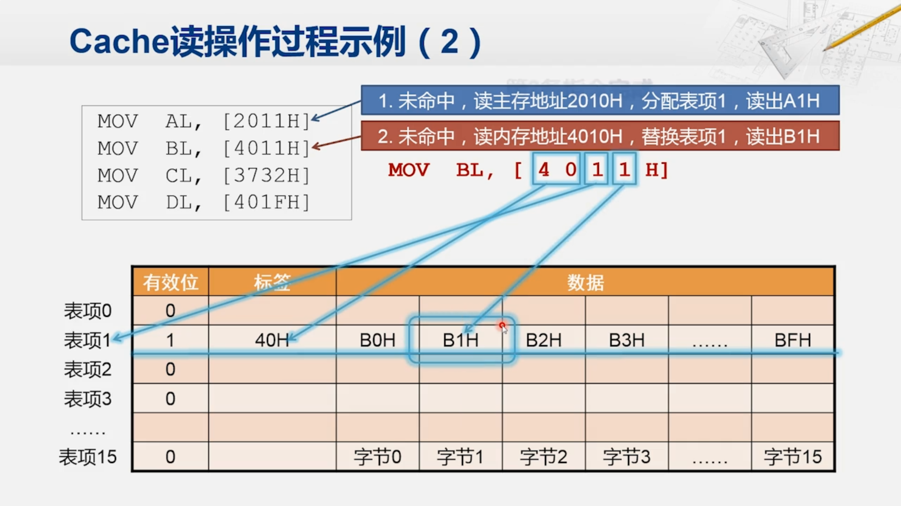

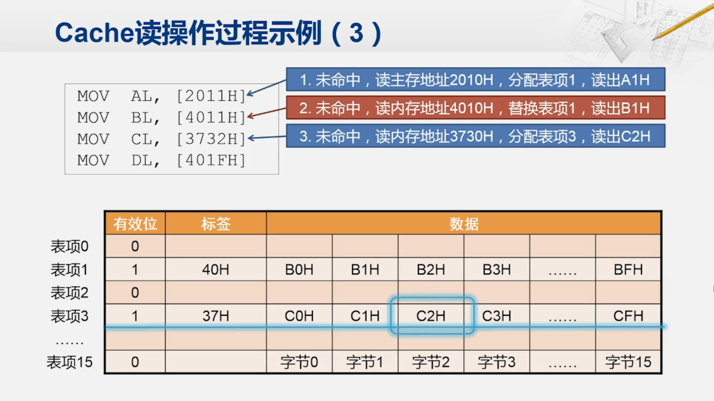

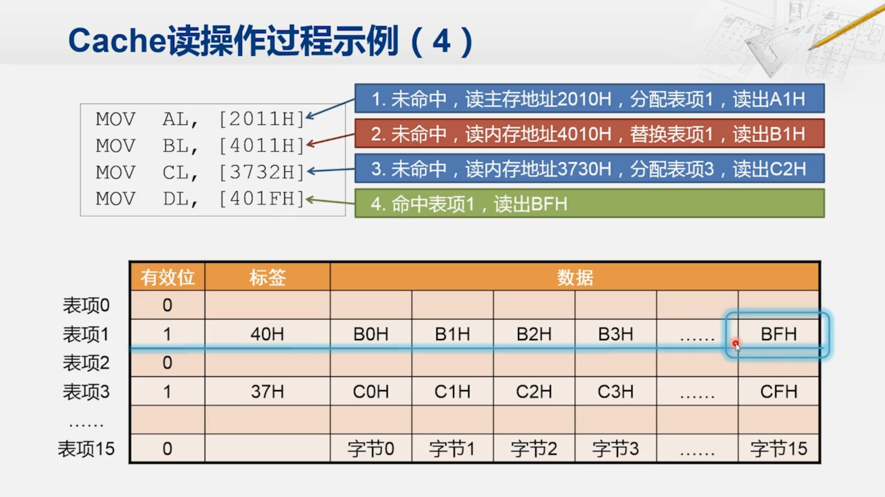

#### 读操作总结

在 Cache 读操作中，我们可以遇到几种典型的情况：

-   **没有命中且表项为空**：从主存中读取数据块，更新 Cache 表项。
-   **没有命中但表项已被占用**：根据替换策略，选择替换的表项，更新 Cache 表项。
-   **命中了的情况**：直接从 Cache 中读取数据块。不访问主存

### Cache 写操作的情况

当 CPU 要写数据时，也会先送到 Cache。根据是否命中，可以采取以下策略：

#### 如果 Cache 命中

-   **写穿透 / 直写（Write Through）**：数据同时写入 Cache 和主存，保持一致性，但效率较低。
-   **写返回 / 回写（Write Back）**：数据只写入 Cache，当被替换时才写回主存，提高效率但增加 Cache 复杂性。

#### 如果 Cache 失效

-   **写不分配（Write No Allocate）**：直接将数据写入主存，实现简单但性能较差。
-   **写分配（Write Allocate）**：先将数据块读入 Cache，再写入 Cache，初次操作较慢但可提升后续访存性能。

#### 现代 Cache 设计策略

-   **简单系统**：通常使用 **写穿透** 和 **写不分配** 策略，简化设计但性能一般。
-   **性能优先的系统**：倾向于使用 **写返回** 和 **写分配** 组合策略，以优化性能。

以上策略的选择和实施均基于对 Cache 表项的查找、分配和替换机制，这些机制与读操作中的处理相同。

## 高速缓存的组织结构


高速缓存（Cache）的设计对于计算机系统性能有着重要影响。缓存的组相联（Set-Associativity）是缓存设计中的一个关键概念，它决定了缓存中数据的组织和查找方式。


### 不命中

1. **冷不命中（Cold Miss）**：这种情况发生在缓存刚刚被初始化或者特定数据第一次被请求时。由于数据之前从未被加载到缓存中，所以当尝试访问这个数据时，缓存中找不到，这就是所谓的"冷不命中"。它是不可避免的，因为任何数据在第一次被访问时都不会在缓存中。
2. **容量不命中（Capacity Miss）**：当请求的数据总量超过了缓存的存储容量时，即使采用了最佳的替换策略，一些数据仍然无法保留在缓存中，这时发生的不命中被称为"容量不命中"。它是由缓存空间有限导致的，增加缓存大小是减少容量不命中的直接方法。
3. **冲突不命中（Conflict Miss）**：在使用有限大小的缓存时，可能会出现两个或多个不同的数据请求映射到缓存的同一位置的情况，这就是缓存冲突。当这种情况发生时，一个数据项可能会覆盖另一个已经存在于缓存位置的数据项，导致当尝试访问被覆盖的数据时发生"冲突不命中"。通过增加缓存的大小或使用更好的映射策略可以减少冲突不命中。

### 组相联

#### 单组相联（Direct-Mapped）

-   **原因**: 为了简化缓存的设计和降低成本。
-   **特点**: **每个缓存块只能映射到一个特定的缓存位置**。
-   **规律**: 缓存地址被分为标签（Tag）、索引（Index）和块偏移（Block Offset）三部分。
-   **电路复杂度**: 较低。因为每个缓存位置只需要与一个标签比较器配合。
-   **问题**：容易出现缓存冲突（Cache Conflict），降低缓存命中率。

#### 二路组相联（2-way Set-Associative）、四路组相联（4-way Set-Associative）

-   **原因**: 为了减少缓存冲突（Collision），提高缓存命中率。
-   **特点**: **每个索引位置有多个缓存块，任何数据可以映射到这多个位置中的任意一个**。
-   **规律**: 缓存地址的索引部分决定了一组可能的缓存位置，数据可以存储在这组位置的任意一个上。
-   **电路复杂度**: 中等。相对于单组相联，需要更多的标签比较器。

#### 全相联（Fully Associative）

-   **原因**: 最大程度减少缓存冲突，提供最高的缓存命中率。
-   **特点**: **每个缓存块可以存储在缓存中的任何位置**。
-   **规律**: 没有索引部分，每次缓存访问都需要与所有缓存块的标签进行比较。
-   **电路复杂度**: 最高。需要为缓存中的每个块提供一个标签比较器。

### 总结

从单组相联到全相联，随着组相联度的增加，缓存的灵活性和命中率提高，但同时也增加了电路复杂度和成本。设计者需要根据具体的应用场景和性能需求，在缓存命中率和硬件复杂度之间做出权衡。

## 存储容量的计算

在计算机领域，**内部存储器** 与 **外部存储器** 的容量计算方法存在差异：

### 内部存储器

-   采用 **二进制** 计数系统（1024 为底），主要由于 CPU 的运算器采用二进制计算方式。
-   例如：15 位地址可以表示 $2^{15}$​ 个字节。
-   实例：高速缓存、内存

### 外部存储器

-   采用 **十进制** 计数系统，遵循国际单位制（SI）标准。
-   例如：100 兆 bps 的以太网传输率指每秒传输 100 兆个比特（1000 的二次方）。
-   实例：U 盘、硬盘

### 历史标准与现实应用

-   美国国家标准协会和 IEEE 在 1968 年定义了 `K` 和 `M` 的使用：
    -   `K` 可以表示 1000 或 $2^{10}$（1024）。
    -   `M` 同样有两种定义。
-   实际应用中，内外存储继续使用不同的计量方法。

### 二进制单位前缀的标准化

-   由 ISO 和 IEC 制定新标准，明确二进制单位前缀：
    -   `Ki` 代表 1024
    -   `Mi` 代表 1024 的平方
    -   `Gi` 代表 1024 的三次方
-   标准化后，如 500GB 硬盘对应计算机内存为 466GiB，512MB 内存应标为 512MiB，以减少混淆。

# 第九章 - 中断和异常

## 9.1 中断和异常的来源

第一个带有异常处理的系统：UNIVAC， 1951 年算术运算溢出时：转向地址 0 执行两条修复指令，或者停机。可以通过修改地址 0 的内容来改变处理方式。后来 UNIVAC 也增加了对外部中断的处理。输入输出也需要中断现有程序的运行（外部中断）。

第一个带有外部中断的系统：DYSEAC，1954 年 。有两个程序计数器（PC），根据外部输入输出设备（I/O）的信号，可以在这两个程序计数器之间进行切换， 这样它就可以交叉执行两端不同的程序。

### CPU 遇到的事件

1. 在程序运行时，系统外部、内部或现行程序本身出现需要特殊处理的 “事件”
2. CPU 立即强行中止现行程序的运行，改变机器的工作状态并启动相应的程序来处理这些 “事件”
3. 处理完成后，CPU 恢复原来的程序运行

### 事件的命名


本课程中主要采用：外部中断 / 内部中断，统称为中断

## 中断向量表的结构

UNIVAC 对异常处理的方式：修改地址 0 的内容，这并不够用，因为随着异常的增多，需要处理的异常情况也会增多，而且需要根据异常情况的不同区执行不同的异常处理指令，这时候就需要中断向量表。

在 8086 中，存储器中保留两个专用区域：

-   中断向量表区：00000H~003FFH （地址最低的 1KB）
-   初始化程序区：FFFF0H~FFFFFH （地址最高的 16B）


可以看到，整个地址范围从 00000H 到 FFFFFH 共计 1MB，其中：

-   专用区（初始化程序区）：占用了 FFFF0H 到 FFFFFH，CPU 复位后从地址 FFFF0H 取出第一条指令，通常是一条无条件转移指令， 转移到系统程序的入口处
-   通用区：占用了 00400H 到 FFFEFH，用来存储一般的程序指令和数据。**中断处理的程序储存在这个区域中**
-   专用区（中断向量表区）：占用了 00000H 到 003FFH，存放了 256 个中断处理程序的入口地址（也称中断向量），每个入口地址占用 4B，即 1KB

## 9.2 中断向量（Interrupt Vector）

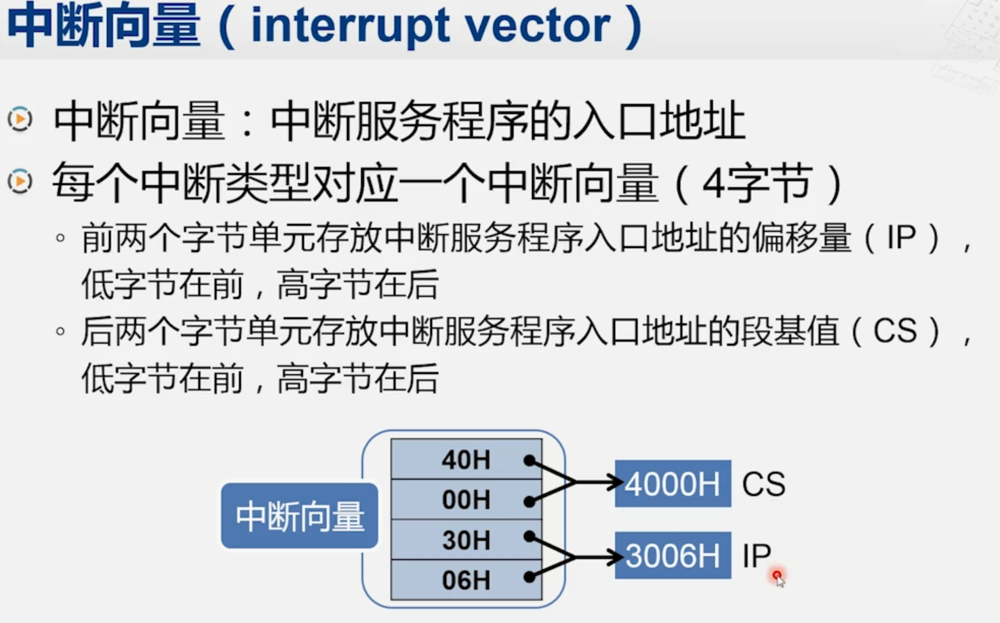

每个中断类型对应一个中断向量，其一共有 4 个字节：

-   前（低）两个字节：存放中断服务程序入口的偏移量（IP），低字节在前，高字节在后（小端法）
-   后（高）两个字节：存放中断服务程序入口的段地址（CS）

CPU 使用段加偏移来根据上述的逻辑地址产生物理地址（`CS<<4 + IP`），然后访问中断服务程序。`:` 不代表地址的分隔，只是为了区分段地址和偏移地址。

**中断服务程序** 在内存当中的存放顺序并没有要求，但是中断向量表中的 **中断向量** 的顺序是固定的。

对于 8086 的中断向量表 CPU 已经固定使用了前五个类型的中断。 那具体的功能我们后面会再介绍， 那之后的 27 个中断也是保留给后续的 CPU 使用的。 而除了前 32 个中断，之后的 224 个的中断则是交给使用 CPU 的用户自行定义。

## 9.3 中断向量表的发展


8086 只有前 5 个类型的中断，但是保留了 32 个中断向量，后面的 27 个中断是保留给后续的 CPU 使用的。

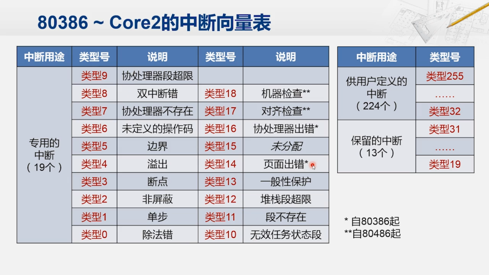

实模式下，可以认为个人计算机是一个非常快的 8086。因此当 CPU 复位之后，也会去 1MB 地址空间的最高的 16 个 Byte 的位置去取第一条指令。

这个地址会被南北桥芯片组引导到 BIOS 芯片。CPU 执行 BIOS 芯片当中的指令，对主板上的各个设备进行基本的配置。 **其中一项工作，就是在组成地址 0 的地方构建出中断向量表。同时准备好对应的中断服务程序**

IA-32 及以后，在保护模式中，段基址存储在描述符中，使用描述符表来索引。16 位的 CS 寄存器的寻址范围是 $2^{16} = 64 \text{KB}$，恰好能索引 8192 个 8B 的描述符，每个描述符对应一个段。

然而，描述符表的起始位置并不是 0，而是由 GDTR 寄存器指定的位置（在实模式中填写他的值）。因而，可以使用 `GDTR + CS` 来获取段描述符的地址，然后提取出段基址。

与实模式不同，中断向量表改称为了中断描述符表（IDT），它的起始地址也不再是 0，而是由 IDTR 寄存器指定的，IDT 中的每个描述符对应一个中断向量，总共有 256 个描述符。IDT 中的每个描述符是 8B，其中包含了中断服务程序的段选择符（会放入 CS 寄存器）和偏移量（会放入 EIP 寄存器）。

所以，陷入中断时，CPU 将中断类型号乘以 8 再加上 IDTR 计存器中的内容，得到中断描述符的地址，然后获取中断描述符中的段选择符和偏移量。这里的段选择符会进一步用于索引 GDT，获取段基址。最后，CPU 将段基址和偏移量组合成线性地址，跳转到中断服务程序。


## 9.4 中断的处理过程

### 中断的检测

同时检测内部中断和外部中断。

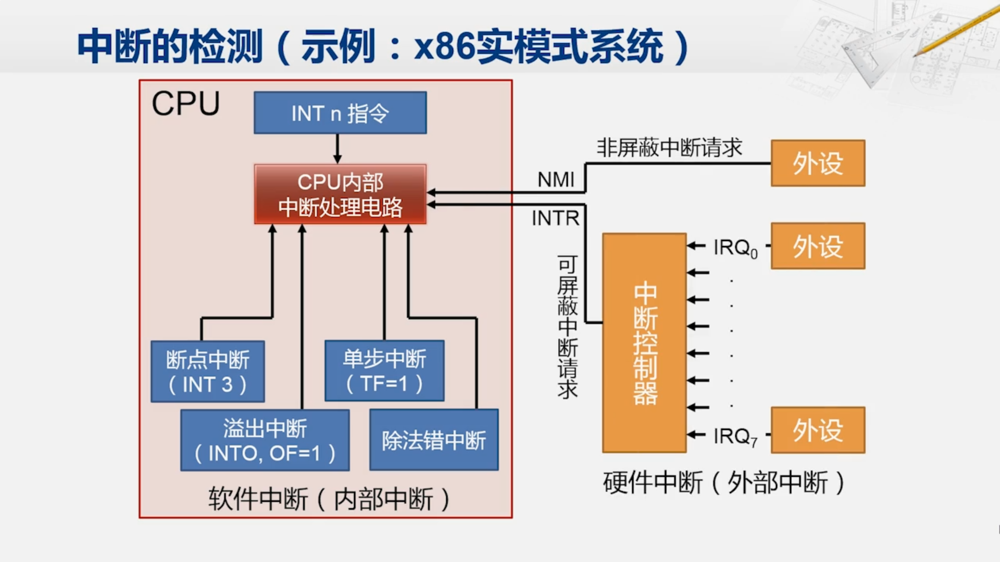

### 中断处理过程

1. **关中断**：CPU 关闭中断响应，即不再接受其它外部中断请求（注意内部中断请求不受影响）
2. **保存断点**：将发生中断处的指令地址压入堆栈，以使中断处理完后能正确地返回。具体保存发生中断的这条指令的地址，还是发生中断的这条指令之后的一条指令的地址，和这个中断具体的类型会有关系。
3. **识别中断源**：CPU 识别中断的来源，确定中断类型号，从而找到相应的中断服务程序的入口地址
4. **保护现场**：在处理中断时，要将发生中断处的有关寄存器（中断服务程序中要使用的寄存器）以及标志寄存器的内容压入堆栈，以便中断服务程序执行完毕后能恢复现场（也即弹栈）
5. **执行中断服务程序**：转到中断服务程序入口开始执行，可在适当时刻重新开放中断，以便允许响应较高优先级的外部中断
6. **恢复现场并返回**：把 “保护现场” 时压入堆栈的信息弹回原寄存器，然后执行中断返回指令，从而返回主程序继续运行

如何在中断服务程序当中，重新开放中断呢？

### 中断（使能）标志 (IF, Interrupt Flag)

IF 控制对可屏蔽中断的响应：

-   若 IF=1，则允许 CPU 响应可屏蔽中断请求
-   若 IF=0，则不允许 CPU 响应可屏蔽中断请求

> 可屏蔽中断请求：可以通过软件屏蔽的中断请求，即通过修改 IF 标志位来控制 CPU 是否响应可屏蔽中断请求

可以用指令设置 | F 标志位：

-   `STI`：把中断标志 IF 置 1
-   `CLI`：把中断标志 IF 清 0

**IF 指令对非屏蔽中断和内部中断都是不起作用的。**

### 从中断服务程序中返回：IRET 指令

-   该指令在中断服务程序结束时使用
-   通过从栈中弹出 3 个字，恢复之前保存的 IP、CS 和 FLAGS 寄存器值，使程序返回到中断前的运行状态

扩展：

-   `IRETD`：用于 32 位操作系统中，恢复 EIP、CS 和 EFLAGS 寄存器
-   `IRETQ`：用于 64 位操作系统中，恢复 RIP、CS 和 RFLAGS 寄存器

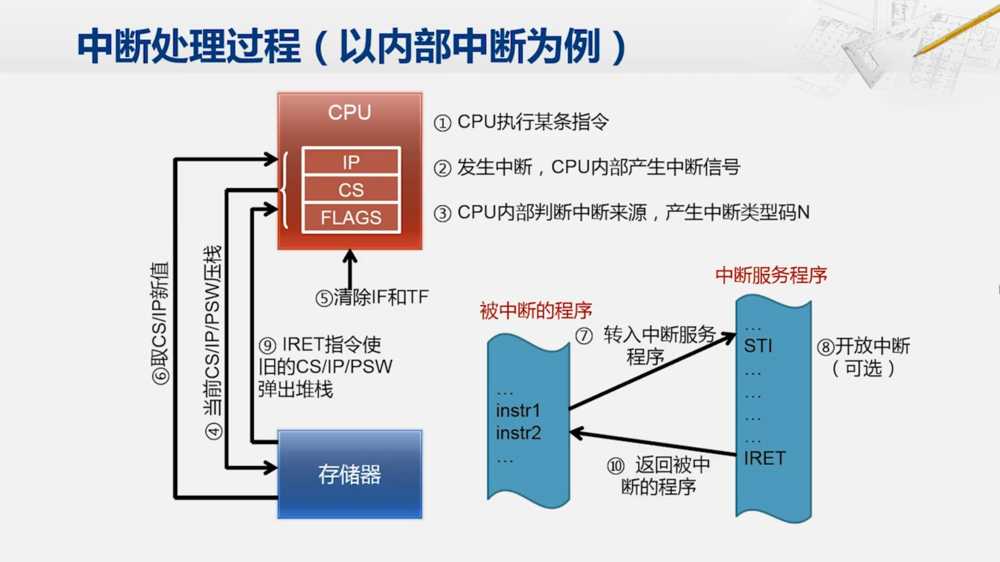

## 9.5 内部中断分类说明

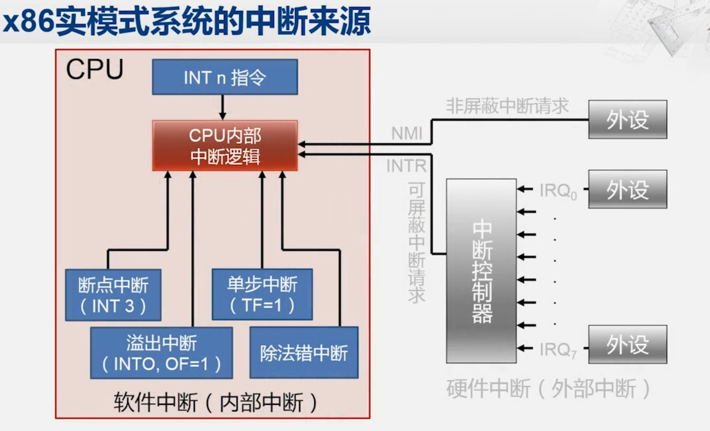


### 类型 0：除法错误

-   产生条件：除数为 0 / 商溢出（除数为 0 可以看做是商溢出的特殊情况，其值为无穷大）

### 类型 4：溢出

-   执行 `INTO` 指令时，若溢出标志位 OF 为 1，则将引起类型为 4 的内部中断
-   执行 `INTO` 指令时，若溢出标志位 OF 为 0，则 `INTO` 指令执行空操作

`INTO` 指令通常安排在算术运算指令之后，以便在发生溢出时能及时处理指令

`INTO` 等同于指令 `INT 4`。

4 号中断和刚才介绍的 0 号中断，在引起中断的时机上是有区别的：虽然它们都在检查运算时出现的异常情况，但是 0 号中断是在错误的除法指令执行后，立刻发生的，而 4 号中断则是要在编程时，加入 `INTO` 指令进行 **主动的检查**。因为很多时候加法溢出并不需要处理。

### 类型 1：单步中断

**单步中断**：当标志寄存器的 `TF` 位置 1 之后，CPU 便处于单步工作方式。在单步工作方式下，CPU 每执行完一条指令，就会自动产生一个类型 1 中断，进入类型 1 中断服务程序。（类似于现在的 Debug 单步调试）

类型 1 中断服务程序：一般用于显示 CPU 内部各寄存器的内容和一些其它信息，以便进行调试和发现错误

`TF`：Trap Flag，陷阱标志位，用于控制单步工作方式。

### 类型 3：断点中断

**断点中断**：当执行 `INT 3` 指令时，CPU 会产生一个类型 3 中断，进入类型 3 中断服务程序。

不同于其他的 `INT` 加中断类型号的指令都是一个两字节的指令，断点中断是一个例外，**`INT 3` 指令是一条单字节长的指令**。

#### 断点中断的使用

断点中断是一种常见的调试技术，它允许程序员在程序中设置一个或多个停止点（即断点），程序运行到这些点时会暂停执行，这样开发者可以检查程序状态，如变量值、内存内容和寄存器状态等。断点中断的基本流程可以分为以下几个步骤：

##### 设置断点

-   **指令替换**：在需要设置断点的位置，用断点中断指令 `INT 3` 替换原有的用户程序指令。
-   **保存原指令**：在替换之前，需保存被替换的原指令以便之后恢复执行。

##### 发生断点

-   **执行中断**：当程序执行到断点位置时，会执行 `INT 3` 指令，触发断点中断服务程序。
-   **状态显示**：通常，断点中断服务程序会显示 CPU 各寄存器的值和其他重要的调试信息。

##### 恢复执行

-   **指令恢复**：在中断服务程序返回前，需要恢复原有的用户程序指令。
-   **程序计数器调整**：将程序计数器（IP）的值减 1，确保从断点位置继续执行。

### 内部中断的特点

#### 中断类型号

-   **内部中断的类型号** 由 CPU 内部产生，这意味着它是自动生成的。
-   不同于内部中断，**外部中断** 则需要从外设读取中断类型号。

#### 屏蔽方式

-   大部分内部中断（除单步中断外） **不能通过软件方法来禁止（屏蔽）**。
-   **单步中断** 可以通过软件操作 TF 标志（置 1 或清 0）来允许或禁止。

#### 优先级

-   除单步中断外，所有 **内部中断的优先级都比外部中断高**。

## 9.6 基于中断的功能调用

#### INT 指令

格式： `INT n`

-   x86 系统提供的直接调用中断服务程序的手段。
-   `n` 为 0~255 中的某一个数，对应中断类型码。

操作：

1. 将 `FLAGS` 寄存器的内容压栈。
2. 清除中断标志 `IF` 和单步标志 `TF`。
3. 将 `CS` 和 `IP` 寄存器的内容压栈。
4. 根据中断类型码查找中断向量表，取得对应中断服务程序的入口地址，并将入口地址分别装入 `CS` 和 `IP` 寄存器。

### BIOS 中断

BIOS 中断是一种特殊的中断，它是由 BIOS 提供的一组中断服务程序，用于提供一些基本的硬件控制和系统服务。

BIOS 中断具有多个中断类型号。每个中断类型号对应一个特定的中断服务程序。

### DOS 中断

格式：`INT 21H`

功能：

-   包含最常用的功能程序，分别实现文件管理、存储管理、作业管理和设备管理等功能。
-   共用 21H 号中断入口，**通过传参数的方式设置功能号**，以选择执行不同功能模块的代码。

特点：

-   DOS 中断功能比 BIOS 中断更齐全、完整。
-   进一步屏蔽了设备的物理特性及其接口特性。

前提这些操作都已经由其它的程序员帮你写好，并且封装起来。你只需要调用这些中断，就可以实现相应的功能。

# 第十章 - 输入输出设备

## 10.1 输入输出接口的基本功能

### 模型机结构

模型机由 **CPU** 、 **存储器** 和 **输入输出设备** 组成。

CPU：在系统启动后，通过地址总线向存储器发出地址，同时通过控制总线发出控制信号，然后通过数据总线读取指令编码。通过指令译码部件生成相应的控制信号，完成相应操作，如运算、读写存储器单元或者执行输入输出操作。

#### 输入过程

1. **输入设备**：8 个手动开关，连接到一个 8 位寄存器。
2. **数据准备**：开关状态保存为一个二进制数，寄存器有对应的地址。
3. **执行输入指令**：CPU 执行读取该地址的指令。
    - **地址总线**：发送寄存器的地址。
    - **控制总线**：发送表示读操作的信号。
4. **读取数据**：输入设备将该地址的内容发送到数据总线上。
5. **数据采样**：CPU 采样 **数据总线** 上的数据，将其存入 **通用寄存器** 以供后续操作。

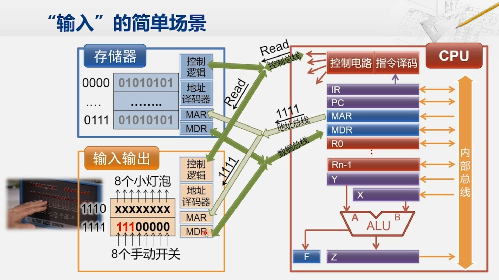

#### 输出过程

1. **输出设备**：8 个小灯泡，连接到一个 8 位寄存器。
2. **执行输出指令**：CPU 执行写入该地址的指令。
    - **地址总线**：发送寄存器的地址。
    - **控制总线**：发送表示写操作的信号。
    - **数据总线**：发送要写入的数据。
3. **写入数据**：输出设备根据控制信号，读取地址总线对应的地址，将数据总线上的数据写入寄存器。
4. **展示输出**：寄存器数据通过物理连线控制灯泡的亮灭，完成输出操作。

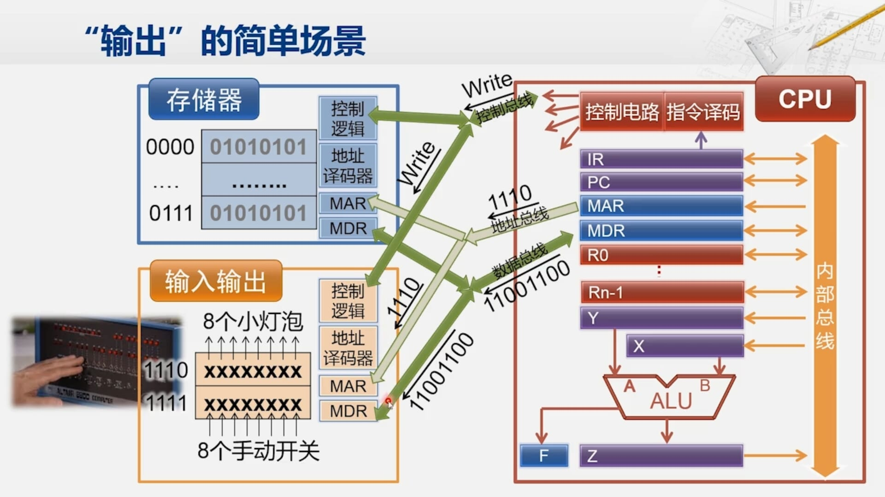

### I/O 接口的基本功能

**I/O 接口**，作为中转站，连接 CPU 和输入输出设备，提供如下功能：

1. 数据缓冲：解决 CPU 和外设之间的速度差距
2. 提供联络信息：协调与同步数据交换过程
3. 信号与信息格式的转换：模 / 数、数 / 模转换，串 / 并、并 / 串转换，电平转换
4. 设备选择
5. 中断管理
6. 可编程功能

### 现代计算机系统中的 I/O 接口和外设

-   **I/O 接口**：表现形式可以是主板上的插卡或芯片，通过系统总线 **与 CPU 通信**，并 **与外部设备相连**。
-   **外设**：如显示器等。

### 并行接口芯片的应用

并行接口电路是 I/O 接口的一种，一般有两种常见的物理实现形式：

1. 独立的芯片，如 Intel 8255A 芯片；
2. 包含在多功能的芯片中，如 SuperIO 芯片提供了并口、串口、键盘鼠标接口、风扇控制接口等

并行接口与外设的连接：

-   连接简单外设：通过 8 根引脚的并行接口芯片，CPU 可以控制数码管的显示和拨码开关的读取。

-   连接复杂外设（打印机）：需要握手（Handshaking）信号。

    握手（Handshaking）信号：总是成对出现，在数据传送中起着定时协调与联络作用。采用 “握手” 方式的数据传送，每一过程必须都有应答，彼此进行确认。

### 并行接口电路在现代计算机中的应用

-   并行接口电路是最简单的 I/O 接口，可以集成在 **南桥芯片** 中。
-   对 **性能要求较高** 的接口可能采用 **独立芯片或板卡** 的形式（如显卡）。
-   在紧凑型设备中（平板电脑和智能手机），I/O 接口甚至可以与 CPU 集成在一个芯片中。

### I/O 接口的功能

无论形式如何，I/O 接口的功能独立存在，需要各自的管脚和连线与外设相连，以实现 CPU 与外部设备的交互。

## 输入输出接口的编址方式

### 位置和访问方式

-   类似访问存储器单元，CPU 访问 I/O 接口寄存器需要编写指令。
-   I/O 接口寄存器的地址即端口地址或端口号。

### 基本概念

系统中有多个 I/O 接口，每个 **I/O 接口** 内部包含多个寄存器，称为 **I/O 端口**。I/O 端口为抽象概念，表示接口芯片内部寄存器。

CPU 访问 I/O 端口需要特定地址，称为端口地址或端口号。

### 常见的 I/O 端口编址方式

-   I/O 端口和存储器 **分开编址**

    -   I/O 映像的 I/O 方式，I/O Mapped I/O
    -   x86 体系结构采用该方式

-   I/O 端口和存储器 **统一编址**
    -   存储器映像的 I/O 方式，Memory Mapped I/O
    -   ARM、MIPS、PowerPC 等体系结构采用该方式

### 分开编址

I/O 端口地址与存储器地址无关，独立编址。

使用特殊指令访问 I/O 端口，如 x86 的 `IN` 和 `OUT` 指令。

#### 指令书写

##### `IN` 指令（输入）

-   格式：`IN AC, PORT`

-   操作：把外设端口的内容输入到 `AL` 或 `AX`

##### `OUT` 指令（输出）

-   格式：`OUT PORT, AC`
-   操作：把 `AL` 或 `AX` 的内容输出到外设端口

##### 直接寻址与间接寻址

-   直接寻址：端口地址 0 到 255 可采用直接寻址，用一个字节立即数指定端口地址。指令长度为 2（1 个操作码 + 1 个立即数）。如 `IN AL, 80H`。
-   间接寻址：端口地址大于 255，需存储到 `DX` 寄存器，再执行 `IN` 和 `OUT` 操作。指令长度为 1（1 个操作码）。如 `IN AL, DX`。

### 统一编址方式

不区分存储器和 I/O 端口地址，统一编址。

任一地址唯一对应一个单元，无需额外信号指定访问类型。

#### 优缺点

-   优点：使用存储器指令访问 I/O 端口，功能丰富；硬件逻辑简单。
-   缺点：I/O 端口占用地址空间，限制存储器空间（现代地址空间变得十分丰富，不再是问题了）；访问指令较长，执行时间可能增加。
-   分开编址的优缺点恰好与之相反。

### 总结

-   分开编址：I/O 端口不占存储器地址空间，指令编码短、执行速度快。
-   统一编址：无需额外信号指定访问类型，便于硬件实现，但地址空间受限。

## 输入输出的程序控制方式

I/O 控制方式：CPU 如何控制外设的数据传送

CPU 控制外设进行输入输出的方式主要有三种：

-   程序控制方式
-   中断控制方式
-   直接存储器访问方式

## 程序控制方式

程序控制方式的数据传送在 **程序控制** 下进行。具体形式有两种：

-   **无条件传送方式**：适用于简单外设操作，如拨码开关、数码管。

    -   假定外设已经准备好
    -   CPU 直接使用输入输出指令与外设传送数据
    -   不查询外设的工作状态
    -   控制程序简单

-   **程序查询传送方式**：适用于复杂外设操作，如打印机、扫描仪。
    -   CPU 通过执行一段程序，不断查询外设的工作状态
    -   在确定外设已经准备就绪时，才进行数据传送

### 无条件传送方式

对于简单外设如拨码开关、数码管等，可以直接通过编写输入输出指令进行数据传送。

-   只要使用一个 `OUT` 指令，把数据放在并行数据输出线上，就完成了输出的数据传送。
-   只要使用一个 `IN` 指令，把数据从并行数据输入线上去除，就完成了输入的数据传送。

### 程序查询传送方式

需要编写程序查询外设的工作状态，确定外设准备就绪后才进行数据传送。通常使用握手信号进行确认，保证数据传输的准确性和可靠性。

#### 数据输出过程（程序查询方式）

1. CPU 执行指令，将 **控制字** 写入接口的 “控制寄存器”，从而设置接口的工作模式

2. CPU 执行 `OUT` 指令，将数据写到接口的 “输出缓冲寄存器”

3. 接口将数据发到 “并行数据输出” 信号线上，并将 “输出准备好” 信号置为有效（亦可由 CPU 写控制字将该信号置为有效）

4. 外设发现 “输出准备好” 信号有效后，从 “并行数据输出” 信号线上 **接收数据**，并将 **“输出回答”** 信号置为 **有效**

5. 接口发现 “输出回答” 信号有效后，将 “状态寄存器” 中的状态位 “输出缓冲空” 置为有效

6. 在这个过程中，CPU 反复执行指令从 “状态寄存器” 中读出状态字，直到发现 “输出缓冲空”，然后开始下一个输出过程，继续输出 **新数据**

    示例代码：

    ```assembly
      MOV DX, 控制寄存器地址  ; 设置控制寄存器地址
      MOV AL, 控制字         ; 设置控制字
      OUT DX, AL             ; 写入控制字
      MOV DX, 输出缓冲寄存器地址  ; 设置输出缓冲寄存器地址
      MOV AL, 数据               ; 设置要输出的数据
      OUT DX, AL                ; 写入数据
    
    CHECK_BUFFER:
      MOV DX, 状态寄存器地址  ; 设置状态寄存器地址
      IN AL, DX                ; 读取状态寄存器
      TEST AL, 输出缓冲空位掩码 ; 检查“输出缓冲空”状态位
      JZ CHECK_BUFFER          ; 如果缓冲区未空，继续检查
    
      ; 输出新数据
      MOV DX, 输出缓冲寄存器地址  ; 设置输出缓冲寄存器地址
      MOV AL, 新数据             ; 设置新数据
      OUT DX, AL                ; 写入新数据
      JMP CHECK_BUFFER          ; 继续检查缓冲区状态
    
      ; ...
    ```


#### 数据输入过程（程序查询方式）

1. 系统初始化时，CPU 执行指令，将控制字写入接口的 “控制寄存器”，设置接口的工作模式
2. 外设将数据发到 “并行数据输入” 信号线上，并将 “输入准备好” 信号置为有效
3. 接口发现 “输入准备好” 信号有效后，从 “并行数据输入” 信号线上 **接收数据**，放入 “输入缓冲寄存器”，并将 **“输入回答”** 信号置为 **有效**，阻止外设输入新数据
4. 接口将 “状态寄存器” 中的状态位 “输入缓冲满” 置为有效
5. 在上述过程中， CPU 反复执行指令从 “状态寄存器” 中读出状态字，直到发现 “输入缓冲满”，然后执行指令从 “输入缓冲寄存器” 中 **读出数据**
6. 一旦 CPU 将这个数据读走了，并行接口将 “输入回答” 信号置为无效，同时也会将状态寄存器当中 “输入缓冲满” 这个状态位 **置为无效**，然后等待外设输入 **新数据**
7. 一旦外设发现 “输入回答” 信号置为无效，外设就将内部缓冲区的新数据放到 “并行数据输入” 信号线上，开启下一次数据输入过程

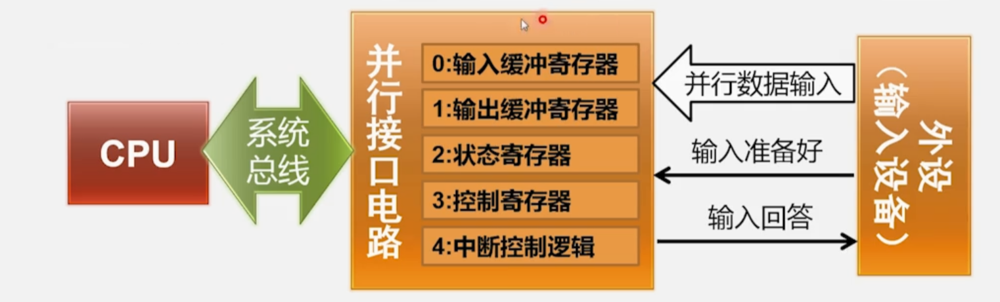

### 程序控制方式的优缺点

-   **优点**：
    -   对外设要求低，不需要复杂功能。
    -   操作流程清晰。
-   **缺点**：
    -   查询外设状态耗时。
    -   占用大量 CPU 运算资源，可能影响系统性能。

程序控制方式适用于简单场景，但对于复杂情况不太实用，需要考虑其他解决方案。

## 中断控制方式

在现代计算机系统中，如果完全依靠 CPU 进行输入输出是不现实的。为了有效处理输入输出，我们需要使用中断控制方式。

不同于程序控制方式的轮询，我们采用中断来减少循环浪费的时间，解放 CPU 以提高并行性。

### 数据输入过程（中断控制方式）

1. 系统初始化时， CPU 执行指令，将控制字写入接口的 “控制寄存器”，设置接口的工作模式，然后就可以去执行其他任务
2. 外设将数据发到 **“并行数据输入”** 信号，并将 **“输入准备好”** 信号置为有效
3. 接口发现 “输入准备好” 信号有效后，从 “并行数据输入” 信号接收数据， 放入 “输入缓冲寄存器”，并将 **“输入回答”** 信号置为 **有效**，阻止外设输入新数据
4. 接口通过 **“中断控制逻辑”** 向 CPU 发出中断请求信号，并将 “状态寄存器” 中的状态位 “输入缓冲满” 置为 **有效**
5. CPU 收到中断请求后，进入中断服务程序，（为了确定是什么导致的中断）执行指令从 “状态寄存器” 中读出状态字，发现 “输入缓冲满”（这意味着是有输入），因此执行指令，从 “输入缓冲寄存器” 中读出数据
6. 接口将 “输入回答” 信号置为无效，等待外设输入新数据


### 数据输出过程（中断控制方式）

1. CPU 执行指令，将控制字写入接口的” 控制寄存器”，从而设置接口的工作模式
2. CPU 执行指令，将 **数据** 写到接口的 **“输出缓冲寄存器”**
3. 接口将数据发到 “并行数据输出” 信号，并将 “输出准备好” 信号置为有效（亦可由 CPU 写控制字将该信号置为有效）
4. 外设发现 “输出准备好” 信号有效后，从 “并行数据输出” 信号接收数据并将 “输出回答” 信号置为 **有效**
5. 接口发现 “输出回答” 信号有效后，通过 “中断控制逻辑” 向 CPU 发出中断请求信号，并将 “状态寄存器” 中的状态位 “输出缓冲空” 置为有效
6. CPU 收到中断请求后，进入中断服务程序，执行指令从 “状态寄存器” 中读出状态字，发现 “输出缓冲空”，因此开始下一个输出过程，继续输出新数据

> 数据输出和数据输入过程发生的中断使用的是 **同一个中断向量**，进入的也是 **同一个中断服务程序**。

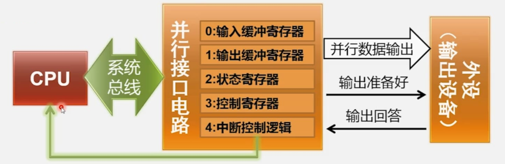

### 中断控制方式的特点

#### 优点

-   **并行工作**：CPU 与外设可以在一定程度上并行工作，提高工作效率。
-   **主动请求**：外设可以主动向 CPU 申请服务，满足输入输出的实时性要求。

#### 缺点

-   **占用 CPU 资源**：输入输出数据传送仍需 CPU 处理，影响 CPU 性能。
    -   使用数据传送指令，占用了宝贵的 CPU 运算资源
    -   数据要经过 CPU 中的通用寄存器中转，过程冗长
    -   注：程序查询方式同样有这些缺点
-   **中断开销**：进入和退出中断服务程序需要执行额外指令，增加了系统开销。

#### 各自适用场景

-   **中断控制方式**：适合提高系统运行效率 / 实时性的场景。
-   **程序查询方式**：适合需要更高响应速度的特别重要的任务。

## 外部中断的处理

### 概述

外部中断（硬件中断）由 CPU 外部的中断请求信号启动。以 x86 CPU 为例，主要有两个信号：

-   **NMI** （非屏蔽中断）
-   **INTR** （可屏蔽中断）

### 中断信号

-   **NMI（非屏蔽中断，Non-Maskable Interrupt）**：

    -   连接 **重要的中断请求信号**，例如电池即将没电。
    -   不受中断允许标志（IF）的影响，CPU 即使关闭外部中断响应（IF=0），仍会响应 NMI 中断请求，调用对应的中断服务程序

-   **INTR（可屏蔽中断，Interruptible）**：
    -   连接 **一般外设** 的中断请求信号。
    -   通过中断控制器（如 PIC 或 APIC）管理多个外设的中断请求。

### 中断控制器

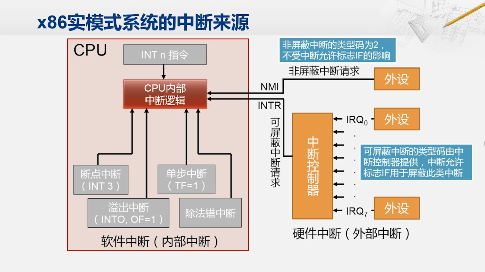

#### 可编程中断控制器 PIC（Programmable Interrupt Controller）

受限于只有一根请求输入的 CPU 的可屏蔽中断信号的，外设们通过一些转换电路连接到中断控制器上处理。

中断控制器会将外设输出的中断请求信号作为它的输入连接进来，然后输出一根信号连接到 CPU 的可屏蔽中断请求信号上。

这个中断控制器可以看作是一个 I/O 接口，它内部也有一些被称为 I/O 端口的寄存器，CPU 可以访问这些端口，对中断控制器进行配置，例如可以配置这些外设的中断请求的优先级、屏蔽项。

#### 8259A


-   提供 8 个中断请求输入（IR0 到 IR7，IR1 是键盘，IR2 保留且可以用于嵌套多个中断控制器以扩展外设连接数）。
-   通过地址和数据信号与系统总线连接，CPU 通过这些信号线访问 I/O 端口。
-   接收到中断请求后，向 CPU 发出中断信号（INT），CPU 响应后发出中断响应信号（INTA）。

8259 的基础上，发展出高级可编程中断控制器（APIC，Advanced Programmable Interrupt Controller）。

### 系统中的连接

-   IBM PC/XT：

    -   使用一片 8259，连接定时器、键盘、串行接口、硬盘、软盘、打印机等外设。
    -   保留 2 号中断请求信号未连接外设，用于其他用途。

-   现代计算机：

    -   键盘中断信号仍连接到中断控制器的 1 号接口。
    -   使用多个中断控制器（如 APIC），连接南桥内部和外部的 I/O 接口。
    -   每个 CPU 当中，也都带一个中断控制器，可以用于发出中断完成 CPU 间的协同工作。

    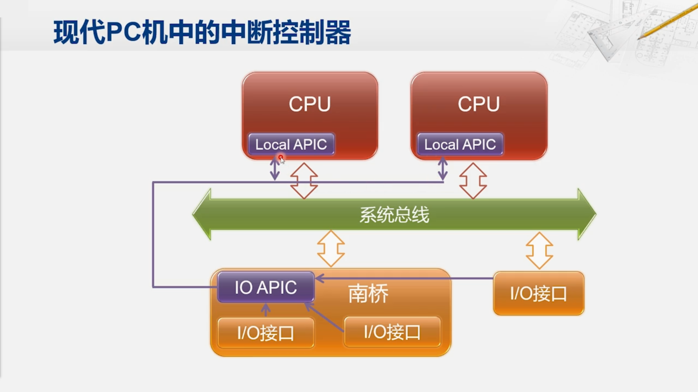

### 可屏蔽中断的处理

1. 外设发出中断请求，中断控制器向 CPU 发出中断信号，CPU 响应并中断当前程序。
2. CPU 完成现行指令发出中断响应信号，向中断控制器发出中断响应信号
3. CPU 读取中断控制器中的中断类型码
4. CPU 压栈相关寄存器，清除 IF 和 TF 标志位，取得中断向量，跳转到中断服务程序。
5. 在中断服务程序中，可在适当时机开放中断（设置 IF 标志位）。
6. 中断服务程序执行完后，执行中断返回指令，恢复寄存器并返回被中断的位置继续执行。


### 中断嵌套

-   **条件**：必须有优先级更高的中断请求。

-   **过程**：
    -   CPU 响应优先级更高的中断请求，而将正在处理的中断暂时挂起
    -   CPU 完成优先级更高的中断服务后，返回此前优先级较低的中断服务程序继续执行

## 直接存储器访问方式 DMA

**DMA** （Direct Memory Access，直接存储器访问）是一种在 I/O 数据传输过程中不需要 CPU 干预的方法。DMA 的工作由一个专门的硬件电路控制，这个电路被称为 **DMA 控制器** （DMAC）。

### DMA 的优点

-   **减少 CPU 负担**：DMA 传输过程中不需要 CPU 干预，CPU 可以执行其他任务，提高系统效率。
-   **高速传输**：适用于数据量大、传输速率要求高的场景。
-   **专用性**：由专门硬件控制电路控制，进行外设与存储器间直接数据传送

### DMA 控制器的工作步骤

一个简化的系统包括 CPU、存储器、I/O 接口和 DMA 控制器，它们通过系统总线连接在一起。


#### 关键部件

-   **Master** （主模块接口）：可以在系统总线上主动发起传输，如 CPU 和 DMA 控制器。
-   **Slave** （从模块接口）：只能被动地接受传输，如存储器和一般的 I/O 接口。

#### 传输过程

1. **CPU 配置 DMA 控制器**：使用 `OUT` 指令配置 DMA 控制器的工作模式，设置源地址、目的地址、数据长度等。

2. **DMAC 处于空闲等待状态**

3. **I/O 接口申请 DMA 传输**：外设送来数据时，I/O 接口通过 **额外的连线** 向 DMA 控制器发出传输申请。

4. **DMAC 响应 I/O 接口的申请**

5. **DMAC 向 I/O 接口发起总线读传输**：DMAC 通过 master 接口发起总线读传输，将数据从 I/O 接口读到 DMA 控制器。

6. **DMAC 向存储器发起总线写传输**：DMAC 将数据写到存储器的指定区域。

7. **重复传输**：DMA 控制器不断从 I/O 接口读数据并写入存储器，直到完成整个传输。

8. **DMA 完成中断通知**：DMA 传输完成后，返回 2，等待 I/O 发起下一次 DMA 传送的申请。

    通常情况下，DMA 传送完成后，DMA 控制器会发出中断请求信号通知 CPU。

### CPU 配置寄存器

源地址的初始值及传送时的地址增减方式目的地址的初始值及传送时的地址增减方式待传送数据的长度

在 DMA 传输开始前，CPU 需要配置 DMA 控制器内部的寄存器：

-   **源地址**：源地址的初始位置（可以是一个 I/O 端口），以及传送时的地址增减方式
-   **目的地址**：目的地址的初始值及传送时的地址增减方式
-   **数据长度**：需要传送的数据长度。根据需要设置，亦可不设置。

### 独立的 DMA 控制器

随着计算机的发展，有些 I/O 接口速率提升了，同时在内部集成了 DMA 控制器，只为该接口提供服务，如显卡、网卡、硬盘控制器。这些 I/O 接口有独立的 master 总线接口，可以根据自身特点进行定制，提高传输效率。

大部分对数据传输率有较高要求的设备都会自带 DMA 控制器，其他设备则共享系统中的独立 DMA 控制器。独立 DMA 控制器还提供内存到内存的传送服务，提高内存操作效率。

### DMA 的局限性

-   **小数据量传输**：对于小数据量的传输，DMA 方式可能不如 CPU 直接传输高效。
-   **成本增加**：增加 DMA 控制器会增加制造成本。

### DMA 最佳使用场景

DMA 方式适用于 **传输大量数据和需要高传输速率** 的场景，不适合小数据量或实时性要求低的场景。

### 总结

## DMA 是通过硬件控制数据传输，减轻 CPU 负担，提高系统性能的重要技术。在数据传输量大、传输速率要求高的情况下，DMA 是非常有效的解决方案。
